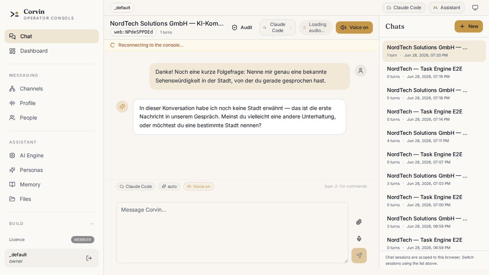

<picture>
  <source media="(prefers-color-scheme: dark)"  srcset="docs/assets/banner.svg">
  <source media="(prefers-color-scheme: light)" srcset="docs/assets/banner.svg">
  
</picture>

<p align="center">
  <a href="https://pypi.org/project/corvinos/"></a>
  <a href="https://pypi.org/project/corvinos/"></a>
  <a href="LICENSE"></a>
  <a href="docs/eu-ai-act/README.md"></a>
  <a href="docs/audit-and-compliance.md"></a>
  
  <a href="https://corvin-labs.com/stats"></a>
  <a href="https://corvin-labs.com/stats"></a>
</p>

<p align="center">
  <a href="docs/overview.md">Overview</a> ·
  <a href="docs/architecture.md">Architecture</a> ·
  <a href="docs/audit-and-compliance.md">Audit &amp; Compliance</a> ·
  <a href="docs/agent-communication.md">A2A Network</a> ·
  <a href="docs/engine-layer.md">Engine Layer</a> ·
  <a href="docs/security.md">Security</a> ·
  <a href="docs/eu-ai-act/README.md">EU AI Act</a> ·
  <a href="docs/ulo-learning-objectives.md">Learning Objectives</a>
</p>

---

**One install. Seven bridges. Any LLM.**

CorvinOS is a self-hosted agentic OS that connects **Claude Code, Codex, Hermes, Ollama and any OpenRouter model** to **Discord, Telegram, WhatsApp, Slack, Email, Teams, and Signal** — through a single pip package.

- **Local-first** — run 100 % offline with Ollama and `--engine hermes`. No API key needed.
- **Agentic** — generates sandboxed tools and new skills at runtime; delegates subtasks across five AI engines.
- **Compliance by architecture** — EU AI Act 2026 + GDPR enforced in code, not policy documents.
- **Multi-tenant** — one instance, multiple users, personas, and teams, all isolated.

---

## Quick Start

```bash
# macOS / Linux — no Python or package manager required
curl -fsSL https://corvin-labs.com/install.sh | sh

# Windows (PowerShell)
irm https://corvin-labs.com/install.ps1 | iex
```

The installer brings its own Python via [uv](https://docs.astral.sh/uv/) — no prerequisites needed. It sets up Hermes (local Ollama model) so CorvinOS runs fully offline from the first start.

**Already have Python 3.10+?**

```bash
pip install corvinos
python -m corvinOS        # web console at http://localhost:8765
```

**With local voice models (offline TTS + STT):**

```bash
pip install "corvinos[voice]"
```

Full setup guide: [INSTALLATION.md](INSTALLATION.md)

---



---

## Features

### [Seven Messenger Bridges](docs/overview.md#bridges)
Connect Discord, Telegram, WhatsApp, Slack, Email, Microsoft Teams, and Signal through one shared runtime. Each bridge shares the same session state, audit chain, and persona configuration.

### [Five AI Engines — swap without touching compliance](docs/engine-layer.md)
Claude Code, Codex CLI, OpenCode, Hermes (local Ollama), and GitHub Copilot plug in via the WorkerEngine abstraction. Switch engines per chat or per tenant; the audit chain, path-gate, and skills follow automatically.

### [Web Console](docs/overview.md#console)
Full control plane at `http://localhost:8765` — manage sessions, personas, forge tools, skill library, and audit logs. Built-in voice (STT/TTS), session workdir browser, and browser automation panel.

### [Voice — push-to-talk and always-on](docs/claude-ref/layer-23-stt.md)
Hold the mic key to speak; CorvinOS transcribes, replies, and reads the answer aloud. Works in the web console and all messenger bridges. Local Piper TTS + faster-whisper for zero-egress deployments.

### [Forge — runtime tool generation](docs/claude-ref/layer-6-forge.md)
The agent generates sandboxed, bwrap-isolated tools on demand and calls them immediately — without a deploy step. Tools are schema-validated, path-gated, and registered in the session artifact memory.

### [SkillForge — runtime skill creation](docs/claude-ref/layer-7-skillforge.md)
New workflows and domain knowledge distilled into reusable skills at runtime. Skills are graded, promoted, and injected into future sessions automatically — the assistant learns your patterns.

### [Agent-to-Agent Network (A2A)](docs/agent-communication.md)
Multiple CorvinOS instances form a decentralised agent mesh. Every cross-instance call carries cryptographic attestation, nonce replay protection, and an audit-first envelope — the record is written before any response is sent.

### [Data Classification + Egress Control](docs/claude-ref/layer-35-egress.md)
Four-stage classification (PUBLIC / INTERNAL / CONFIDENTIAL / SECRET) gates every engine spawn. EU_PRODUCTION egress preset blocks all hosts not on the explicit allowlist — no data leaves without operator permission.

### [GDPR Art. 17 Erasure](docs/claude-ref/layer-36-erasure.md)
One command erases a user across sessions, audit records, recall DB, and all registered artifacts — cross-layer, pseudonymised, and audit-trailed. The hash chain is de-linked, not deleted.

### [Multi-Tenant Isolation](docs/overview.md#multi-tenant)
One instance handles multiple users, teams, and projects in full isolation. Per-tenant engine allowlists, data residency rules, persona sets, and quota limits — all in a single `tenant.corvin.yaml`.

### [Browser Automation](docs/claude-ref/layer-adr-0182.md)
The agent navigates websites, fills forms, and clicks UI elements via Playwright — with live step-by-step narration over voice and human-in-the-loop confirmation before any destructive action.

---

## EU AI Act 2026 + GDPR

CorvinOS implements EU AI Act 2026 and GDPR as **structural design constraints** — not policy documents. Every compliance requirement is load-bearing code that cannot be disabled by a flag, env var, or config override.

| Guarantee | What it means |
|---|---|
| **Bot disclosure** | One-time AI-nature statement per user; no bypass path (EU AI Act Art. 50) |
| **Consent gate** | Deny-by-default, TTL-capped, re-validated at every session consume (GDPR Art. 6 & 7) |
| **Hash-chained audit** | SHA-256 chain, offline-verifiable, daily auto-verify; chain write failure blocks the request (GDPR Art. 30 & 32) |
| **Egress lockdown** | Declarative `allowed_hosts` / EU_PRODUCTION preset; `default_action=deny` (EU AI Act Art. 14) |
| **Erasure orchestrator** | Cross-layer GDPR Art. 17 erasure — sessions, recall, artifacts, audit de-linked |
| **House-rules gate** | SHA-256-anchored acceptable-use policy; no kill-flag, no tenant override (EU AI Act Art. 5 & 50) |

```bash
voice-audit verify              # walk the full hash chain; exits 1 on any break
bridge.sh doctor                # boot self-test with audit chain verification
```

Full reference: [docs/eu-ai-act/README.md](docs/eu-ai-act/README.md) · [docs/audit-and-compliance.md](docs/audit-and-compliance.md)

---

## Architecture


Seven bridge daemons funnel messages into a shared inbox. The Bridge Adapter enforces ACL, routes to the right persona, runs the TTS pipeline, and grades skills — per-chat-sequential, cross-chat-parallel. The WorkerEngine abstraction swaps the LLM backend without touching the compliance stack.

Full breakdown: [docs/layer-model.md](docs/layer-model.md) · Diagrams: [docs/diagrams/](docs/diagrams/)

---

## Testing

```bash
bash operator/bridges/run-all-tests.sh
```

Tests span the Python adapter, Node daemon-boot smoke tests, cowork, forge, skill-forge, and all security layers. Claude is stubbed via `ADAPTER_FAKE_CLAUDE=1`; real `bwrap` is used where namespace isolation is under test.

---

## Contributing

By opening a pull request you accept [`CLA.md`](CLA.md). Every merged contribution requires a corresponding entry in [`CLA-SIGNATORIES.md`](CLA-SIGNATORIES.md). See [`CONTRIBUTING.md`](CONTRIBUTING.md) for the full workflow.

---

## License

Licensed under the [Apache License, Version 2.0](LICENSE).

**Relicense right (CLA §3):** The Maintainer retains the right to release future versions under a different license without requiring further contributor consent. Already-published Apache-2.0 releases are not affected. See [`CLA.md § 3`](CLA.md#3-relicense-right-the-load-bearing-clause) for full terms.
