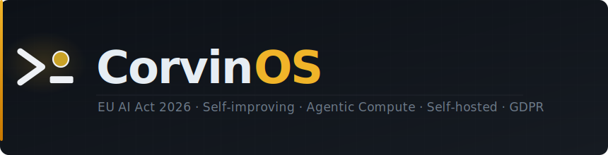
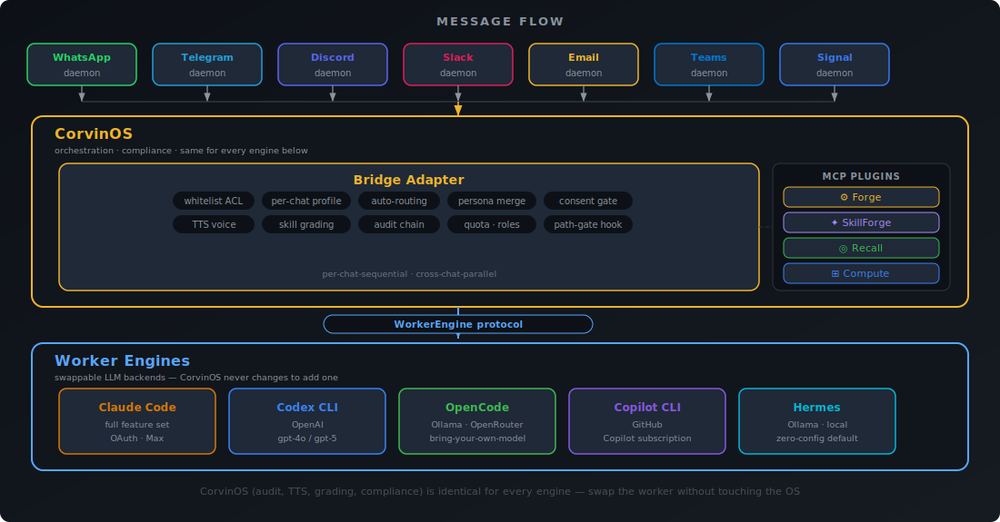

<picture>
  <source media="(prefers-color-scheme: dark)"  srcset="docs/assets/banner.svg">
  <source media="(prefers-color-scheme: light)" srcset="docs/assets/banner.svg">
  
</picture>

<p align="center">
  <a href="LICENSE"></a>
  <a href="docs/eu-ai-act/README.md"></a>
  <a href="docs/audit-and-compliance.md"></a>
  
</p>

<p align="center">
  <a href="docs/overview.md">Overview</a> ·
  <a href="docs/architecture.md">Architecture</a> ·
  <a href="docs/audit-and-compliance.md">Audit &amp; Compliance</a> ·
  <a href="docs/agent-communication.md">A2A Network</a> ·
  <a href="docs/engine-layer.md">Engine Layer</a> ·
  <a href="docs/security.md">Security</a> ·
  <a href="docs/eu-ai-act/README.md">EU AI Act</a> ·
  <a href="docs/ulo-learning-objectives.md">Learning Objectives</a>
</p>

---

**CorvinOS enforces the EU AI Act in code, not in documentation.**

Every compliance requirement — disclosure, consent, audit integrity, data residency, egress control, GDPR erasure — is a structural constraint that cannot be disabled by a flag, env var, or config override. Regulated deployments get verifiable guarantees, not policy promises.

---

## Quick Start

See [INSTALLATION.md](INSTALLATION.md) for the complete setup guide.

**Recommended — works identically on Linux, macOS, and Windows:**

```bash
pip install corvinos
python -m corvinOS        # web console at http://localhost:8765
```

`python -m corvinOS` is **PATH-independent**: it starts the console on the first
try on every OS — including Microsoft Store / system Python, where `pip install`
falls back to a per-user scripts directory that is not on `PATH` (the usual reason
`corvin-serve` is "not found" on Windows). On Windows you can also use `py -m corvinOS`.

**Want the short `corvin-serve` command on your PATH?** Install with
[pipx](https://pipx.pypa.io) — it isolates the app and wires up `PATH`
automatically, on every platform:

```bash
pipx install corvinos
corvin-serve              # web console at http://localhost:8765
```

> `corvin-serve` from a plain `pip install` only works once its scripts directory
> is on `PATH`. Running `python -m corvinOS` once adds that directory to your PATH,
> so `corvin-serve` then works in a new terminal — but `pipx` (or `python -m
> corvinOS`) is the reliable cross-platform path.

The base install is pure-Python and cross-platform — it brings the web console
all the way up to setup on Linux, macOS, and Windows, with cloud/edge voice
(OpenAI + Microsoft Edge TTS) working out of the box. For **local, offline**
speech models add the optional extra:

```bash
pip install "corvinos[voice]"   # local Piper TTS + faster-whisper STT
```

> The `voice` extra is opt-in because its local-model dependencies (`piper-tts`,
> `faster-whisper`) lack Windows wheels for some Python versions; keeping them
> out of the base install means `pip install corvinos` reaches setup reliably on
> every supported platform.

**Requirements:** Python 3.10+ · Linux, macOS 12+, or Windows 10/11 · Node.js 20+ required only for bridges

Default engine: Claude Code (Claude Pro or Max subscription required).
For fully local, zero-egress deployment: `--engine hermes` (Ollama, no API key).

**Alternative package managers:**

```bash
# macOS / Linux — Homebrew
brew tap CorvinLabs/corvinos && brew install corvinos

# Windows — Scoop
scoop bucket add corvinos https://github.com/CorvinLabs/scoop-corvinos && scoop install corvinos

# conda / mamba (pending review)
conda install -c conda-forge corvinos
```

```bash
# Developer install from source
git clone https://github.com/CorvinLabs/CorvinOS.git && cd CorvinOS
pip install -e ".[all]" && corvin-install
```

Full documentation: [docs/overview.md](docs/overview.md)

### Uninstall

One command removes everything — services, config, data directories, and the package:

```bash
corvin-uninstall --purge   # removes all files without prompting
pip uninstall corvinos -y  # removes the Python package
```

Without `--purge` the uninstaller asks before deleting data directories (audit logs, API keys, session history). Use `--purge` for a fully non-interactive wipe.

**What gets removed:**

| What | Where |
|---|---|
| systemd services (`corvin-webui`, voice bridge, watchdog) | `~/.config/systemd/user/` |
| Claude Code plugins + cache | `~/.claude/plugins/` |
| Voice config, API keys, service.env | `~/.config/corvin-voice/` |
| Audit logs, sessions, forge tools | `~/.corvin/` |
| Bridge virtual environments | `~/.corvin/bridges/*/venv/` |
| Web console build artifacts (source install only) | `<repo>/core/console/.../web-next/dist/` |

After `pip uninstall corvinos -y` the only thing left is the cloned repo directory (source installs) — delete it with `rm -rf <repo>` if you no longer need it.

---

## EU AI Act 2026 + GDPR: Structural Enforcement

CorvinOS implements EU AI Act 2026 and GDPR as **structural design constraints**. Every feature must answer: *does this weaken a compliance guarantee?*

| Mechanism | Layer | Regulation | Enforcement property |
|---|---|---|---|
| **Bot Disclosure** | L19 | EU AI Act Art. 50 | One-time per uid · structurally fail-closed · no bypass path |
| **Consent Gate** | L16 | GDPR Art. 6 & 7 | Deny-by-default · TTL-capped · re-validated at every consume |
| **Hash-Chained Audit** | L16 | GDPR Art. 30 & 32 | SHA-256 chain · offline-verifiable · daily auto-verify · chain write failure blocks request |
| **Audit-at-Rest Encryption** | L37 | GDPR Art. 32 | Segment rotation · `age`/`gpg` sealing · RFC 3161 TSA timestamping (opt-in) · 7-year retention |
| **Data Classification + Flow Guard** | L34 | EU AI Act Art. 14 | 4-stage matrix (PUBLIC/INTERNAL/CONFIDENTIAL/SECRET) · fail-closed at every engine-spawn callsite |
| **Egress Lockdown** | L35 | EU AI Act Art. 14 | Declarative `allowed_hosts` / `forbidden_hosts` · `default_action=deny` EU production preset |
| **GDPR Art. 17 Erasure** | L36 | GDPR Art. 17 | Cross-layer erasure orchestrator · pseudonymous subject IDs · audit trail de-linked, not deleted |
| **Acceptable-Use Gate** | L44 | EU AI Act Art. 5 & 50 | SHA-256-anchored house-rules policy · no disable switch · no tenant override |
| **Compliance-Zone Routing** | ADR-0007 | EU AI Act Art. 14 | `allowed_engines` / `forbid_engines` per tenant · `data_residency` in `tenant.corvin.yaml` |

**Absolute constraints — no env var, flag, or config can disable these:**
disclosure is structurally locked · consent gate has no bypass · every audit event traverses the hash chain before any response · L34 blocks non-compliant engine spawns · L38 audit write failure blocks the A2A request · L44 house-rules gate has no kill-flag.

```bash
voice-audit verify              # walk the full hash chain; exits 1 on any break
bridge.sh doctor                # boot self-test with audit chain verification
python -m corvin_compliance_reports.cli generate processing-records   # GDPR Art. 30
```

Full compliance reference: [docs/eu-ai-act/README.md](docs/eu-ai-act/README.md) · [docs/audit-and-compliance.md](docs/audit-and-compliance.md)

---

## Core Features

### Five WorkerEngines — One Compliance Stack

The `WorkerEngine` protocol (L22) decouples the LLM backend from the compliance runtime. Every engine shares the path-gate (L10), audit chain (L16), and artifact registration (L33) via the Tool Execution Broker.

| Engine | Provider | Key property |
|---|---|---|
| **Claude Code** | Anthropic Claude (Pro/Max) | Full feature set — hooks, skills, MCP, mid-stream inject |
| **Codex CLI** | OpenAI | MCP + stream JSON |
| **OpenCode** | Ollama, OpenRouter, Google | Provider-agnostic |
| **Hermes** | NousResearch via local Ollama | Zero network egress · L34 CONFIDENTIAL-capable · no API key |
| **Copilot CLI** | GitHub Copilot Business/Enterprise | Zero incremental cost · worker/delegation only |

### A2A Agent Mesh with Network Attestation (L38 + ADR-0103)

CorvinOS instances form a decentralized agent mesh. Every cross-instance call carries HMAC-SHA256 signature, bidirectional instance attestation (Protocol v7), nonce replay protection, and binary attachment verification (≤16 attachments, ≤1 MiB). Audit-first invariant: `A2A.envelope_received` is written to the hash chain **before** any response is sent. Unknown origins receive unsigned rejections (no oracle for probing attacks).

### Security Depth: 39+ Layers

Path-gate hook (L10) · secret vault with bwrap env-injection (L16) · layer integrity protocol with RS256-signed manifest (ADR-0141) · Forge runtime tools in bwrap sandbox (L6) · SkillForge with fail-closed linter (L7) · session lifecycle with audit-first reset (L8) · per-turn task event log with streamed tokens · multi-tenant isolation (ADR-0007) · conversation recall with PII-redaction (L28) · session artifact memory (L33) · DSI v1 external data sources (ADR-0106).

### Data Classification + Egress Control

Three-layer defence: `ADR-0007 allowed_engines` → `L34 data_classification.matrix` → `L35 egress allowed_hosts`. EU_PRODUCTION presets ship under `operator/bundle/config-templates/`. The LLM sees only schema + aggregate stats + k-anonymised sample — raw rows never enter the context window (L24/L32).

### Web Console + Multi-Tenant

Browser control plane at `http://localhost:8765`. Five-scope tenant model: `(task, session, project, user, tenant_id)`. All routes use session-bound `tenant_id` — no env-var fallback. Full REST API at `/v1/console/`.

```bash
bridge.sh console     # start web console
bridge.sh doctor      # health check + audit verify
```

---

## Architecture



Seven bridge daemons (WhatsApp, Telegram, Discord, Slack, Email, Teams, Signal) funnel messages into a shared inbox. The Bridge Adapter enforces ACL, routes to the right persona, runs the TTS pipeline, and grades skills — per-chat-sequential, cross-chat-parallel. The WorkerEngine abstraction swaps the LLM backend without touching the compliance stack.

Full layer breakdown: [docs/layer-model.md](docs/layer-model.md) · Architecture diagrams: [docs/diagrams/](docs/diagrams/) · Full documentation: [docs/overview.md](docs/overview.md)

---

## Testing

```bash
bash operator/bridges/run-all-tests.sh
```

Tests span the Python adapter, Node daemon-boot smoke tests, cowork, forge, skill-forge, and all security layers. Tests run hermetically — Claude stubbed via `ADAPTER_FAKE_CLAUDE=1`, real `bwrap` where namespace isolation is the subject under test.

---

## Contributing

By opening a pull request you accept [`CLA.md`](CLA.md). Every merged contribution requires a corresponding entry in [`CLA-SIGNATORIES.md`](CLA-SIGNATORIES.md). See [`CONTRIBUTING.md`](CONTRIBUTING.md) for the full workflow.

---

## License

Licensed under the [Apache License, Version 2.0](LICENSE).

**Relicense right (CLA §3):** The Maintainer retains the right to release future versions of CorvinOS under a different license — including source-available licenses (Business Source License, Functional Source License, Elastic License v2) or a commercial license — without requiring further consent from contributors. This right is granted by every contributor as a condition of the [`CLA.md`](CLA.md). Already-published Apache-2.0 releases are not affected; they remain Apache-2.0 forever. See [`CLA.md § 3`](CLA.md#3-relicense-right-the-load-bearing-clause) for the full terms.

"CorvinOS" and "Corvin" are project identifiers per Apache § 6 — the license does not grant trademark rights.
