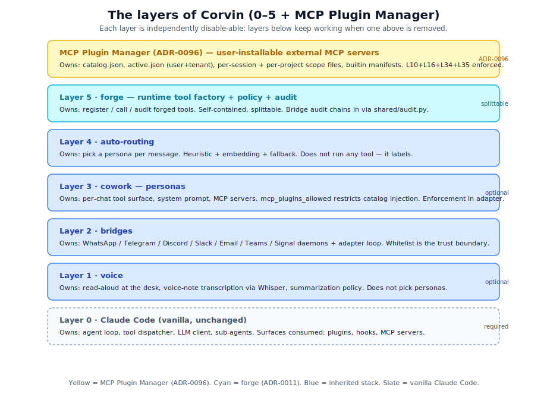
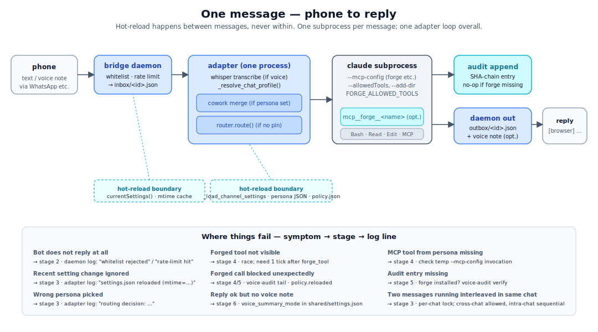

# CorvinOS — Documentation Hub

CorvinOS doesn't just comply with the EU AI Act — it enforces it structurally in code. Disclosure cannot be disabled. Consent is deny-by-default. The audit chain is tamper-evident. These are not configuration options; they are code gates that run on every message, before any AI response is generated.

This directory is the entry point for every aspect of the system: how it works, what you can do with it, how it enforces compliance, and how to extend it.

---

## Mental model in 30 seconds

CorvinOS is a **runtime platform** that wraps a Claude Code agent and gives it five independently composable capabilities: voice I/O, multi-channel messaging, per-chat personas, automatic role-based routing, and a runtime tool factory with sandboxing, policy enforcement, and audit. The AI agent itself is unmodified. Everything in this repository sits on top of the vanilla agent as plugins and configuration — every layer is independently removable, and the platform keeps functioning with what remains.

  

**Five layers, bottom to top:**

| Layer | What it owns |
|---|---|
| **Voice** | Speech-to-text, text-to-speech, listener profiles, voice-specific summarization |
| **Bridges** | Per-channel protocol adapters (Discord, WhatsApp, Telegram, web console) |
| **Personas + Routing** | Per-chat persona selection, heuristic and AI-powered auto-routing, role ACLs |
| **Forge** | Runtime tool generation: sandboxed Python execution, policy gate, schema validation |
| **Skills** | Runtime behavior extension via Markdown prompt-injection, with linting and promotion gates |

Everything above this stack — data classification, egress lockdown, erasure, audit-at-rest encryption, agent-to-agent communication — is built as additional capability layers on the same substrate.

---

## What you can do

### Voice and messaging
- Talk to the agent by voice across any configured channel. Speech is transcribed locally by default (pywhispercpp/whisper.cpp — cross-platform, incl. Windows), with fallback to OpenAI Whisper. Only metadata enters the audit log — transcript text never does.
- Deploy the same agent across Discord, WhatsApp, Telegram, and the web console simultaneously. Each channel has independent configuration, rate limits, and whitelists that hot-reload without a restart.
- Use `/btw <note>` to inject a side-channel remark into an active streaming response — the agent incorporates it mid-turn.

### Team collaboration
- Assign roles to participants: **owner**, **admin**, **member**, **observer**. Capabilities are bundled per role; admins cannot self-promote.
- Collect proposals with `/propose` and trigger the AI over a curated stack with `/go`. The owner controls what reaches the model.
- Set per-user message quotas and view scoped audit trails with `/audit me` or `/audit chat`.
- New participants receive a one-time bot-disclosure card explaining they are interacting with an AI system, as required by EU AI Act Art. 50. `/join`, `/pass`, and `/leave` are structurally locked — they cannot be removed.

### Consent and data rights
- Every user starts in a deny-by-default state. They opt in explicitly with `/consent on` (optionally with a TTL: `/consent on 7d`). Consent can be revoked at any time with `/consent off`.
- Run `corvin-erasure <subject_id>` to execute a GDPR Art. 17 right-to-deletion across all layers: conversation recall, user model, artifacts, and identity mapping. The audit chain retains pseudonymous identifiers only — no traceable content survives.

### AI-written tools and skills
- Ask the agent to create a new tool. It writes a Python script, validates it against a JSON schema, and registers it through the Forge MCP server. The tool runs in a sandboxed subprocess — never in-process.
- Ask the agent to capture a useful behavior as a skill. It writes a Markdown file, runs it through a prompt-injection linter, and injects it into future turns. Skills promote automatically based on usage grades.
- Tools and skills created for a session stay in that session. Promote them to project or user scope explicitly.

### Multi-engine deployment
- Switch the underlying AI engine per chat or tenant: Claude Code (default), OpenCode, Hermes (fully local Ollama, zero egress), GitHub Copilot CLI, or Codex. Engine selection is gated by data classification — a CONFIDENTIAL task cannot be sent to a cloud engine without an explicit compliance exception.
- Use `/engine hermes` to pin the current chat to local-only execution. No data leaves the host.

### Agent-to-agent communication
- Configure remote endpoints and allow other CorvinOS instances (or external agents) to delegate tasks via a signed, replay-proof envelope protocol. Every inbound instruction is sanitized, wrapped in a structural framing block, and executed in a hermetic temporary workspace. Results are filtered through a declared schema before being returned.

---

## Architecture overview

The full message pipeline, from inbound channel event to outgoing reply, is documented in [data-flow.md](data-flow.md). The compliance enforcement flow — what runs before any AI turn — is documented in [eu-ai-act/architecture.md](eu-ai-act/architecture.md).

  

Key architectural properties:

- **Stateless per message.** Each AI turn spawns a fresh subprocess. There is no shared mutable agent state between turns.
- **Hot-reload without restart.** Bridge settings, persona definitions, and forge policy all reload on mtime change. Only token configuration and structural daemon code require a bridge restart.
- **Audit-first everywhere.** Every security-relevant event — consent changes, tool calls, engine spawns, session resets, erasure requests — is written to the hash-chained audit log *before* the action executes. A write failure blocks the action.
- **Five scope axes.** Resources (tools, skills, memory, artifacts) exist at task, session, project, user, or tenant scope. Promotion between scopes is explicit and gated.

---

## Compliance enforcement

  

CorvinOS is built against **EU AI Act 2026 + GDPR** as a structural design constraint, not a compliance checklist. The mechanisms below are code gates — they run on every request and cannot be disabled via configuration.

| Mechanism | What it enforces | Locked invariant |
|---|---|---|
| **Bot-disclosure card** | EU AI Act Art. 50 §1 — users know they are interacting with an AI | One-time per user per channel; `/join`, `/pass`, `/leave` are structurally locked |
| **Consent gate** | GDPR Art. 6+7 — processing requires explicit user consent | Deny-by-default; no auto-admit shortcut exists in code |
| **Hash-chained audit log** | GDPR Art. 30+32 — tamper-evident processing record | Every event carries the SHA-256 of the previous event; `voice-audit verify` exits 1 on any gap |
| **Data classification + flow guard** | EU AI Act Art. 14 — human oversight of data flows | Four tiers (PUBLIC / INTERNAL / CONFIDENTIAL / SECRET) × per-engine locality/egress matrix; fail-closed at every engine spawn |
| **Egress lockdown** | EU AI Act Art. 14 — network-level data residency control | Declarative allow/deny host lists per tenant; `default_action: deny` in EU production presets |
| **Compliance zone routing** | EU AI Act Art. 14 — engine reach limited to declared zones | `allowed_engines` and `data_residency` in tenant config; no runtime override path |
| **GDPR Art. 17 erasure** | Right to deletion across all storage layers | Cross-layer orchestrator; pseudonymisation in audit chain is the Art. 17 mechanism |
| **Audit-at-rest encryption** | GDPR Art. 32 — encryption of stored processing records | Segment rotation with `age`/`gpg` sealing; chain continuity verified across rotation boundaries |
| **Voice transcription metadata-only** | GDPR Art. 5 — data minimization | Audit event records only duration and provider; transcript text is never written anywhere |
| **Path-gate filesystem hook** | GDPR Art. 32 — prevents unauthorized writes to audit, policy, and system trees | Pre-tool-use hook; fail-closed; boot self-test emits CRITICAL on any miss |
| **Secret vault isolation** | GDPR Art. 32 — secrets never reach LLM context | Secrets injected as bwrap environment variables; values never appear in any audit field or prompt |
| **Content marking** | EU AI Act Art. 50 §4 — AI-generated content is labeled | `[AI]` prefix + `X-AI-Generated` header on every outbound envelope |

**For regulators and auditors:** start with [eu-ai-act/README.md](eu-ai-act/README.md) and run `voice-audit verify` to confirm chain integrity. The complete compliance evidence is derivable from the live system without any running CorvinOS instance. A Declaration of Conformity is at [eu-ai-act/DECLARATION-OF-CONFORMITY.md](eu-ai-act/DECLARATION-OF-CONFORMITY.md).

See [diagrams/23-consent-disclosure-flow.svg](diagrams/23-consent-disclosure-flow.svg) for the disclosure + consent lifecycle, and [diagrams/25-data-flow-guard.svg](diagrams/25-data-flow-guard.svg) for the data classification matrix.

---

## Extensibility

CorvinOS is designed to be extended without forking the core. The extension surface has three layers:

### Personas are JSON files
A persona is a JSON file that declares a name, a system prompt, MCP servers, allowed tools, and optional role ACLs. Drop a file into `operator/cowork/personas/` (bundled) or `~/.corvin/cowork/personas/` (user override) and the persona is available immediately — no code change, no restart.

Personas can include `append_system` content, `mcp_servers` for additional tool access, `add_dirs` for context roots, and a `persona` field to select a base character. Lists union; scalars use the persona value; `mcp_servers` is shallow-merged.

See [extending.md](extending.md) and [personas-and-routing.md](personas-and-routing.md).

### Forge tools are Python scripts
A forge tool is a Python script with a JSON schema for inputs and outputs, a `meta` block declaring its name and capability requirements, and optionally a `secrets` list (environment variable names, never values). The agent writes the script, registers it through the Forge MCP server, and it is available in the current session immediately.

All forge tools run in a sandboxed subprocess under bwrap. Network access is denied by default; the persona must explicitly declare `network: allow`. Policy (`operator/forge/policy.json`) hot-reloads per call — an operator can restrict or expand tool permissions without restarting the bridge.

See [forge.md](forge.md) and [diagrams/03-forge-lifecycle.svg](diagrams/03-forge-lifecycle.svg).

### Skills are Markdown files
A skill is a Markdown file that is prompt-injected into future AI turns. The agent writes the skill, the linter checks it for prompt-injection patterns, oversized content, and persona-boundary violations, and — if it passes — it is registered in the current session scope.

Skills promote up a scope ladder (task → session → project → user) based on auto-grading after each turn and explicit outcome signals (approval, rejection, rephrase). Promotion requires a minimum number of positive grades; demotion is never automatic.

See [skills.md](skills.md) and [diagrams/10-skill-lifecycle.svg](diagrams/10-skill-lifecycle.svg).

### Bridge adapters
New messaging channels can be added as bridge adapters under `operator/bridges/<channel>/`. Each bridge is an independent daemon (Node.js or Python) that speaks the internal adapter protocol. Settings in `operator/bridges/<channel>/settings.json` hot-reload immediately.

See [layer-model.md](layer-model.md) §Layer 2 and [extending.md](extending.md) §Custom bridges.

### External tool packages
Reusable sets of forge tools and skills can be packaged as `.awpkg` archives and installed into any CorvinOS tenant. See [awpkg.md](awpkg.md).

---

## Document map

### Core concepts

| # | Document | Answers |
|---|---|---|
| 1 | [overview.md](overview.md) | What is CorvinOS, why does it exist, what are its design principles? |
| 2 | [os-analogy.md](os-analogy.md) | How is CorvinOS an operating system for an agent? Where does the analogy hold, where does it break? |
| 3 | [layer-model.md](layer-model.md) | What does each layer do, and where does it stop? |
| 4 | [data-flow.md](data-flow.md) | What happens between "phone sends voice note" and "reply arrives back"? |
| 5 | [personas-and-routing.md](personas-and-routing.md) | Who decides which persona handles a message? How does it switch? |
| 6 | [forge.md](forge.md) | How does the agent register a new tool at runtime? What is "deterministic by construction"? |
| 7 | [skills.md](skills.md) | How does the agent register a new skill at runtime? Linter, grading, promotion gates. |
| 8 | [security.md](security.md) | Whitelist, persona ACL, forge policy, sandbox, path-gate, operator elevation — six surfaces, what each catches. |
| 9 | [rights-and-teamwork.md](rights-and-teamwork.md) | Multi-user collaboration: owner/admin/member/observer roles, disclosure, consent gate, proposal stack, quotas. |
| 10 | [agent-behavior.md](agent-behavior.md) | How does the agent work inside this system? What does hot-reload look like from the agent's perspective? |
| 11 | [extending.md](extending.md) | Custom personas, forge tools, skills, bridges, workflow packages. |
| 12 | [setup.md](setup.md) | How to install and configure CorvinOS from scratch. |
| 13 | [troubleshooting.md](troubleshooting.md) | Symptom → cause → fix for the most common issues. |
| 14 | [console.md](console.md) | How to access the web console in local, remote, and Docker deployments. |
| 15 | [memory.md](memory.md) | `/profile`, `/memory`, `/vault`, `/forget` commands. |
| 16 | [runtime-generation.md](runtime-generation.md) | Forge tools and skills as two parallel pipelines on one safety substrate. |
| 17 | [engine-layer.md](engine-layer.md) | Backend-agnostic LLM execution: WorkerEngine protocol, engine selection, pre-spawn gates. |
| 18 | [agent-communication.md](agent-communication.md) | Agent-to-agent communication: signed envelopes, binary attachments, replay protection, instance attestation. |

### EU AI Act and compliance

| Document | Covers |
|---|---|
| [eu-ai-act/README.md](eu-ai-act/README.md) | Hub — risk classification, article map, operator quick-start |
| [eu-ai-act/architecture.md](eu-ai-act/architecture.md) | Full message-pipeline compliance flow, layer-by-layer technical reference |
| [eu-ai-act/article-50.md](eu-ai-act/article-50.md) | Art. 50 §1 bot-disclosure + Art. 50 §4 content marking |
| [eu-ai-act/article-14.md](eu-ai-act/article-14.md) | Art. 14 human oversight — zone routing, data classification, egress lockdown |
| [eu-ai-act/article-73.md](eu-ai-act/article-73.md) | Art. 73 serious incident reporting — 15-day timeline, auto-detection, notify draft |
| [eu-ai-act/article-28-30.md](eu-ai-act/article-28-30.md) | Art. 28-30 operator obligations — Declaration Gate, DPIA, pre-deployment checklist |
| [eu-ai-act/article-5.md](eu-ai-act/article-5.md) | Art. 5 prohibited AI practices |
| [eu-ai-act/article-9.md](eu-ai-act/article-9.md) | Art. 9 risk management system |
| [eu-ai-act/gdpr.md](eu-ai-act/gdpr.md) | GDPR Art. 5-7, 17, 30, 32 — consent gate, erasure, audit-at-rest |
| [eu-ai-act/audit-chain.md](eu-ai-act/audit-chain.md) | Audit chain deep-dive — hash computation, storage, forensic audit procedure |
| [eu-ai-act/agentic-safeguards.md](eu-ai-act/agentic-safeguards.md) | Agentic AI safeguards — prompt injection, tool confinement, A2A trust |
| [eu-ai-act/gpai-deployer-obligations.md](eu-ai-act/gpai-deployer-obligations.md) | GPAI model deployer obligations |
| [eu-ai-act/DECLARATION-OF-CONFORMITY.md](eu-ai-act/DECLARATION-OF-CONFORMITY.md) | Declaration of Conformity |
| [audit-and-compliance.md](audit-and-compliance.md) | Audit commands, compliance reports, daily verify timer |

### Deployment and operations

| Document | Covers |
|---|---|
| [INSTALL-UNIVERSAL.md](INSTALL-UNIVERSAL.md) | Universal installation guide |
| [DOCKER.md](DOCKER.md) | Docker deployment overview |
| [docker-setup-guide.md](docker-setup-guide.md) | Docker setup guide |
| [docker-headless-setup.md](docker-headless-setup.md) | Headless Docker setup |
| [docker-troubleshooting.md](docker-troubleshooting.md) | Docker-specific troubleshooting |
| [compute.md](compute.md) | Out-of-LLM-loop compute workers |
| [data-and-compute.md](data-and-compute.md) | Large-data snapshots and the DSI v1 adapter interface |
| [observability/](observability/) | Prometheus metrics, alerting, dashboards |
| [OLLAMA-RELEASE.md](OLLAMA-RELEASE.md) | Local Ollama engine setup and release notes |

### Organization and enterprise

| Document | Covers |
|---|---|
| [for-companies.md](for-companies.md) | CorvinOS as a team and enterprise platform |
| [for-organizations.md](for-organizations.md) | Organizational deployment patterns |
| [plugin-system.md](plugin-system.md) | Plugin architecture reference |
| [awpkg.md](awpkg.md) | Workflow package format (.awpkg) |
| [a2a-social-fabric.md](a2a-social-fabric.md) | Agent-to-agent network topology and use cases |

---

## Concept map — where does X live?

### Structural concepts

| Concept | Lives in | Authoritative doc |
|---|---|---|
| **Layer model** | The stack itself | [layer-model.md](layer-model.md) |
| **Bridge** | `operator/bridges/<channel>/` | [data-flow.md](data-flow.md), [layer-model.md](layer-model.md) §Layer 2 |
| **Persona** | `operator/cowork/personas/<name>.json` (bundle) + `~/.corvin/cowork/personas/<name>.json` (user) | [personas-and-routing.md](personas-and-routing.md) |
| **Forge tool** | Registered through Forge MCP server; stored per-scope under `<corvin_home>/` | [forge.md](forge.md) |
| **Skill** | Markdown file injected per turn; slot mirror at `operator/skill-forge/skills/dyn/` | [skills.md](skills.md) |
| **Audit log** | Single chained file: `<tenant>/global/audit.jsonl` | [eu-ai-act/audit-chain.md](eu-ai-act/audit-chain.md) |
| **Forge policy** | `operator/forge/policy.json` (hot-reloaded per call) | [security.md](security.md) §Policy |
| **Five scope axes** | task / session / project / user / tenant | [layer-model.md](layer-model.md), [diagrams/16-corvin-axes.svg](diagrams/16-corvin-axes.svg) |

### Runtime concepts

| Concept | Enforced by | Authoritative doc |
|---|---|---|
| **Hot-reload of bridge settings** | `currentSettings()` (JS) + `_load_channel_settings()` (Python), mtime cache | [data-flow.md](data-flow.md) §Hot-reload |
| **Persona resolution per message** | `_resolve_chat_profile()` → cowork resolver → auto-router | [personas-and-routing.md](personas-and-routing.md) |
| **Auto-routing decision** | `bridges/shared/router.py` (heuristic → embedding → fallback) | [personas-and-routing.md](personas-and-routing.md) §Auto-routing |
| **Forge call lifecycle** | `forge.registry` + `forge.runner` + `forge.sandbox` + `forge.security_events` | [forge.md](forge.md), [security.md](security.md) |
| **Skill promotion ladder** | Auto-grade after each turn; outcome signals at grade boundaries | [skills.md](skills.md) §Promotion |
| **Engine selection + data gate** | `_run_pre_dispatch_gates()` before every non-default engine spawn | [engine-layer.md](engine-layer.md) |
| **Session lifecycle** | `/new`, `/clear`, `/reset` purge session scope in order; audit-first | [security.md](security.md) §Session lifecycle |

### Compliance and security concepts

| Concept | Enforced by | Authoritative doc |
|---|---|---|
| **Bot-disclosure card** | `operator/bridges/shared/disclosure.py` | [eu-ai-act/article-50.md](eu-ai-act/article-50.md) |
| **Content marking** | `adapter.py _envelope()` — `[AI]` prefix, `X-AI-Generated` header | [eu-ai-act/article-50.md](eu-ai-act/article-50.md) §Content marking |
| **Consent gate** | `operator/bridges/shared/consent.py` | [eu-ai-act/gdpr.md](eu-ai-act/gdpr.md) §Art. 6+7 |
| **Data classification + flow guard** | `operator/bridges/shared/data_classification.py` | [eu-ai-act/article-14.md](eu-ai-act/article-14.md) |
| **Egress lockdown** | `operator/bridges/shared/egress_gate.py` | [eu-ai-act/article-14.md](eu-ai-act/article-14.md) §Egress |
| **Hash-chained audit log** | `forge/security_events.py` + `bridges/shared/audit.py` | [eu-ai-act/audit-chain.md](eu-ai-act/audit-chain.md) |
| **Audit-at-rest encryption** | `operator/bridges/shared/audit_sealer.py` | [eu-ai-act/audit-chain.md](eu-ai-act/audit-chain.md) §Segments |
| **Path-gate filesystem hook** | `operator/voice/hooks/path_gate.py` (PreToolUse) | [security.md](security.md) §Path-gate |
| **GDPR Art. 17 erasure** | `operator/bridges/shared/erasure_orchestrator.py` | [eu-ai-act/gdpr.md](eu-ai-act/gdpr.md) §Art. 17 |
| **Incident reporting** | `operator/voice/scripts/corvin_incident.py` | [eu-ai-act/article-73.md](eu-ai-act/article-73.md) |
| **Operator Declaration Gate** | `operator/bridges/shared/operator_declaration.py` | [eu-ai-act/article-28-30.md](eu-ai-act/article-28-30.md) |
| **Zone routing + engine allowlist** | `tenant.corvin.yaml::data_residency` / `allowed_engines` | [eu-ai-act/article-14.md](eu-ai-act/article-14.md) §Zone routing |
| **Compliance manifest** | `operator/bridges/shared/compliance_manifest.py` | [eu-ai-act/article-28-30.md](eu-ai-act/article-28-30.md) §Compliance manifest |

---

## Diagrams

| File | What it shows |
|---|---|
| [01-layer-stack.svg](diagrams/01-layer-stack.svg) | The platform layers as a stack, with what each owns and what it does not |
| [02-data-flow.svg](diagrams/02-data-flow.svg) | A message from channel to reply, with hot-reload boundaries marked |
| [03-forge-lifecycle.svg](diagrams/03-forge-lifecycle.svg) | Forge tool: register → policy check → sandbox run → audit append |
| [04-security-envelope.svg](diagrams/04-security-envelope.svg) | Defense-in-depth: ACL → policy → sandbox → audit, what each catches |
| [05-persona-resolution.svg](diagrams/05-persona-resolution.svg) | How a message picks its persona (pinned → routed → fallback) |
| [06-scope-boundary.svg](diagrams/06-scope-boundary.svg) | What CorvinOS is, and what it is deliberately not |
| [07-agent-view.svg](diagrams/07-agent-view.svg) | What the agent sees per message, what is hidden, what changes between turns |
| [08-os-analogy.svg](diagrams/08-os-analogy.svg) | Side-by-side: classic OS subsystems vs CorvinOS counterparts |
| [09-process-lifecycle.svg](diagrams/09-process-lifecycle.svg) | Bash fork/exec timeline vs adapter spawning a fresh subprocess per message |
| [10-skill-lifecycle.svg](diagrams/10-skill-lifecycle.svg) | Skill: create (linter + slot mirror) → inject → grade → promote |
| [11-rights-hierarchy.svg](diagrams/11-rights-hierarchy.svg) | Capability bundles (owner / admin / member / observer) with delegation reach |
| [12-user-onboarding.svg](diagrams/12-user-onboarding.svg) | Lifecycle of a new participant: first contact → disclosure → consent |
| [13-proposal-flow.svg](diagrams/13-proposal-flow.svg) | Curated proposal stack: contributors propose → owner curates → `/go` triggers AI |
| [14-audit-trail.svg](diagrams/14-audit-trail.svg) | Hash-chained audit log with scoped views and daily verify |
| [15-business-integration.svg](diagrams/15-business-integration.svg) | Organisational integration map |
| [16-corvin-axes.svg](diagrams/16-corvin-axes.svg) | The five orthogonal scope axes (task / session / project / user / tenant) |
| [17-runtime-generation.svg](diagrams/17-runtime-generation.svg) | Forge tools and skills as two parallel pipelines on one safety substrate |
| [18-memory-loadout.svg](diagrams/18-memory-loadout.svg) | Three memory layers (recall, user model, artifacts) and auto-inject path |
| [19-data-compute.svg](diagrams/19-data-compute.svg) | Large-data snapshots and out-of-LLM-loop compute workers |
| [20-audit-spine.svg](diagrams/20-audit-spine.svg) | Audit spine as the convergence point of every compliance gate |
| [21-engine-layer.svg](diagrams/21-engine-layer.svg) | Backend-agnostic LLM execution via the WorkerEngine protocol |
| [22-eu-ai-act-compliance-overview.svg](diagrams/22-eu-ai-act-compliance-overview.svg) | EU AI Act compliance map — all articles mapped to layers |
| [23-consent-disclosure-flow.svg](diagrams/23-consent-disclosure-flow.svg) | Disclosure + consent lifecycle — first contact through consent gate |
| [24-incident-response-timeline.svg](diagrams/24-incident-response-timeline.svg) | Art. 73 incident timeline — 15-day reporting window |
| [25-data-flow-guard.svg](diagrams/25-data-flow-guard.svg) | Data classification matrix — classification tiers × engine locality/egress |
| [26-eaos-architecture.svg](diagrams/26-eaos-architecture.svg) | Engine-agnostic OS shell — tool broker, skill compiler, engine command interface |
| [27-a2a-decentralized-mesh.svg](diagrams/27-a2a-decentralized-mesh.svg) | Decentralized agent-to-agent mesh topology |
| [28-a2a-user-company.svg](diagrams/28-a2a-user-company.svg) | A2A user-to-company delegation pattern |
| [29-a2a-company-internal.svg](diagrams/29-a2a-company-internal.svg) | A2A company-internal multi-agent workflow |

---

## House rules for these docs

- **Mental model first, details after.** Every page leads with one or two sentences that fit in a head, then drills down.
- **Code is the source of truth.** When prose disagrees with running code, the code wins and the doc is the bug.
- **No verbatim source listings.** Diagrams and prose, not pasted Python. Link to modules by path when needed.
- **Cross-references are mandatory.** A concept that names another concept must link to its authoritative doc.
- **English.** Matches the rest of the repository, the commit history, and in-code comments.
- **Diagrams stay in sync.** Every feature change that affects a diagram must update that diagram in the same commit. A stale diagram is a bug, not a cosmetic issue.
