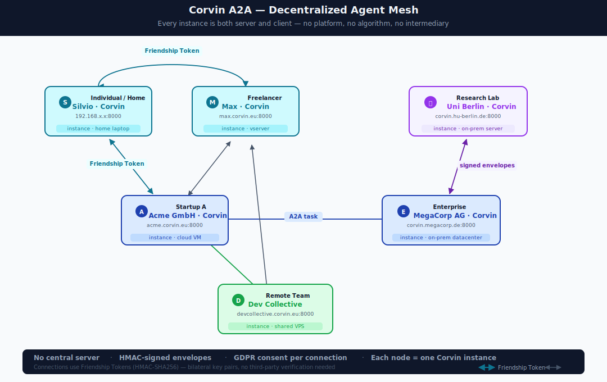
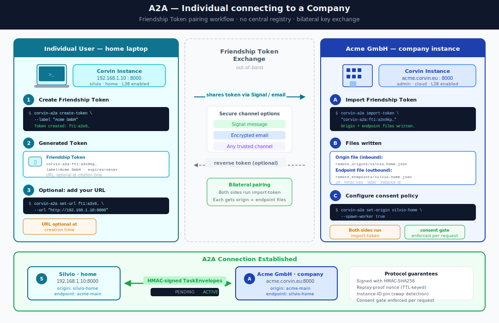
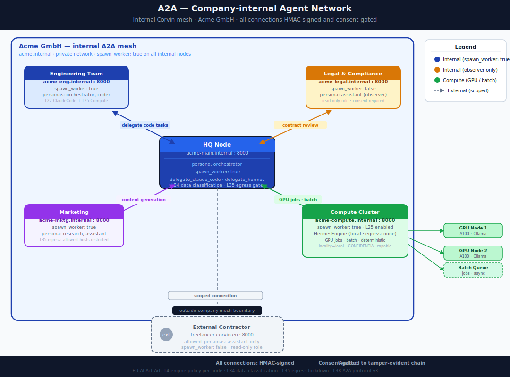

# A2A Social Fabric — Decentralized Agent Networking

Corvin instances connect to each other peer-to-peer via the **A2A protocol** (Layer 38).
There is no central platform, no algorithm, no intermediary — each instance is both server
and client, and every connection requires an explicit, cryptographically-secured pairing.

The result is a **decentralized social fabric for AI agents**: individuals, teams, and
companies can form trusted meshes that are structurally impossible to surveil from the outside,
compliant with GDPR by design, and audited end-to-end on each participant's own infrastructure.

---

## The mesh — no central server



Any Corvin instance can connect to any other. The graph is self-organizing: a freelancer
can pair directly with a startup, a research lab with an enterprise, an individual with their
employer — without routing through any platform or third-party API.

**Key properties of every connection:**

| Property | Mechanism |
|---|---|
| Mutual authentication | HMAC-SHA256 with per-connection keys |
| Replay prevention | SQLite-backed persistent nonce store, ±300 s time window (crash-resilient) |
| Consent-gated | `allowed_personas`, `max_ttl_s`, `spawn_worker` per origin; optional `personal_data` + `required_consent_purposes` for user data |
| Purpose-limited | `allowed_purposes` per origin; `purpose_id` in every envelope (Protocol v4) |
| Rate-limited | per-origin token bucket (`rate_limit_rpm`) |
| Attachment-classified | per-attachment `classification` field; receiver enforces `max_data_classification` cap |
| EU AI Act compliant | engine policy + data classification checked before every spawn |
| Fully audited | every envelope logged to the tamper-evident hash chain; 8 event types |
| Verifiable rejections | rejection responses are HMAC-signed when recv_key is known (Protocol v4) |
| TLS-enforced | `CORVIN_A2A_PUBLIC_URL` must be HTTPS or a startup WARNING is emitted |
| GDPR erasure | `corvin-erasure <subject_id>` purges A2A session pins via L36 handler |

---

## Scenario 1 — Individual connecting to a company



### How it works

**Side A (Individual — e.g. a freelancer or customer):**

```bash
# 1. Generate a token — URL is optional, all fields optional
corvin-a2a create-token --label "For Acme GmbH" --ttl 30d

# Output:
# corvin-a2a:ft1:eyJleHAiOjE3O…   ← share this via Signal / email
```

**Side B (Company — Acme GmbH):**

```bash
# 2. Import the token — installs both origin + endpoint files
corvin-a2a import-token corvin-a2a:ft1:eyJleHAiOjE3O…

# If the individual's URL was not in the token, add it:
corvin-a2a set-url <kid> https://silvio.corvin.example.com
```

Both sides can now send tasks to each other:

```bash
# Individual sends a task to the company agent
corvin-a2a send acme-gmbh "Summarise the Q2 report and flag risk items"

# Company agent sends a task back
corvin-a2a send silvio "Review the contract draft in /shared/draft-v3.pdf"
```

### What the company controls

The company's origin file defines exactly what the individual is allowed to do:

```json
{
  "allowed_personas":      ["assistant"],
  "allowed_purposes":      ["summarise", "search"],
  "max_ttl_s":             300,
  "rate_limit_rpm":        30,
  "max_data_classification": "INTERNAL",
  "spawn_worker":          false
}
```

- **`spawn_worker: false`** — the individual can send instructions but cannot trigger
  full task execution (read-only observer mode by default).
- **`spawn_worker: true`** — the individual's agent can spawn workers on the company's
  infrastructure (full executor mode, opt-in).
- **`allowed_purposes`** — (Protocol v4) every inbound envelope must declare a
  `purpose_id` from this list, or it is rejected. Supports GDPR Art. 5 purpose
  limitation at the protocol level.
- **`rate_limit_rpm`** — per-minute token bucket. Authenticated but rate-limited
  origins receive a signed `status: "rejected"` response instead of consuming
  worker capacity.
- **`max_data_classification`** — cap on the strictest attachment classification
  this origin may send. `INTERNAL` means the peer cannot push CONFIDENTIAL or
  SECRET data regardless of what its envelope claims.

---

## Scenario 2 — Company-internal agent network



A company can deploy multiple Corvin instances — one per team, one per datacenter
region, one for the compute cluster — and connect them all via A2A.

### Example topology: Acme GmbH

```
acme-main.internal:8000  (HQ orchestrator)
    ├── acme-eng:8000       Engineering team   — spawn_worker: true
    ├── acme-legal:8000     Legal & Compliance — spawn_worker: false (observer)
    ├── acme-mktg:8000      Marketing          — spawn_worker: true
    └── acme-compute:8000   GPU cluster        — spawn_worker: true, Hermes engine
            ├── gpu-node-1 (A100)
            ├── gpu-node-2 (A100)
            └── batch-queue
```

The HQ orchestrator delegates tasks to the right sub-node via `corvin-a2a send`:

```bash
# Route a legal question to the legal node
corvin-a2a send acme-legal "Does clause 12.3 of contract-v2.pdf create liability?"

# Kick off a compute job on the GPU cluster
corvin-a2a send acme-compute "Fine-tune model on dataset /data/q2-corpus.jsonl"
```

### Compute cluster integration (L25)

The `acme-compute` node uses the **L25 Compute Worker** with `spawn_worker: true`.
This means task envelopes are executed as real compute jobs — not LLM turns — with
full resource isolation:

```yaml
# tenant.corvin.yaml on acme-compute
spec:
  compute:
    enabled: true
  default_engine: "hermes-balanced"  # local Ollama, zero cloud egress
  data_classification:
    default: CONFIDENTIAL            # never leaves the datacenter
```

The GPU nodes connect back to `acme-compute` as sub-origins. A task arriving at
`acme-compute` can fan out across the cluster via further A2A calls — all audited,
all consent-gated, all HMAC-signed.

### External contractors (scoped access)

External freelancers or contractors get a **scoped connection** — the company limits
which personas they can invoke and caps the task TTL:

```json
{
  "origin_id":               "contractor-max",
  "allowed_personas":        ["assistant"],
  "allowed_purposes":        ["review"],
  "max_ttl_s":               60,
  "rate_limit_rpm":          10,
  "max_data_classification": "INTERNAL",
  "spawn_worker":            false
}
```

The contractor sees the company's agent but cannot reach internal compute,
trigger spawns, send CONFIDENTIAL attachments, or exceed 10 requests per minute.
The connection is logged to the company's audit chain and revocable instantly
via `corvin-a2a revoke-token <kid>`.

---

## Pairing mechanics — Friendship Token

The **Friendship Token** is the pairing primitive. Unlike the older
`corvin-a2a pair` command, it requires no prior URL knowledge and no
server-to-server handshake:

```
corvin-a2a:ft1:<base64url(payload)>.<base64url(hmac_sig)>
```

The HMAC covers every field including the embedded key, so any tampering is
detected by the receiver before any file is written.

| Field | Required | Description |
|---|---|---|
| `kid` | always | UUID4 — stable connection identifier |
| `key` | always | 256-bit shared HMAC key |
| `url` | optional | Peer's base URL — can be set after import |
| `label` | optional | Human-readable name |
| `expires` | optional | Token validity window |
| `constraints.personas` | optional | Allowed personas (default: `assistant`) |
| `constraints.max_ttl_s` | optional | Per-task TTL cap |

**Connection lifecycle:**

```
create-token  →  share out-of-band  →  import-token  →  [PENDING]
                                                               │
                                                     set-url <kid> <url>
                                                               │
                                                           [ACTIVE]  →  send tasks
```

A `PENDING` connection is stored locally but cannot receive inbound task envelopes
until the peer's URL is known. This is intentional — it separates key exchange from
network discovery.

---

## Why this is structurally different from platform-based AI

| Platform AI (e.g. ChatGPT Teams, Copilot) | Corvin A2A mesh |
|---|---|
| All data routes through provider's servers | Data stays on each participant's infrastructure |
| Provider can inspect, train on, or retain conversations | No third party has access — HMAC keys never leave the endpoints |
| Connections defined by the platform | Connections defined by the participants |
| Revocation requires contacting the platform | Revocation is instant: `revoke-token <kid>` deletes the local origin file |
| Compliance is the platform's responsibility | Compliance is structurally enforced per node (EU AI Act Art. 14, GDPR Art. 6/7/30/32) |
| One audit trail (if any), owned by provider | Independent tamper-evident audit chain at every node |

---

## Quick-start

```bash
# 1. Set your public URL (HTTPS recommended — required for GDPR Art. 32)
export CORVIN_A2A_PUBLIC_URL=https://my-domain.com

# 2. Find out your A2A URL
corvin-a2a my-url
# → https://my-domain.com

# 3. Generate a token (all fields optional)
corvin-a2a create-token --label "For a colleague" --ttl 7d

# 4. Share the token out-of-band (Signal, email, QR code)

# 5. Colleague imports it (both sides run this)
corvin-a2a import-token corvin-a2a:ft1:<token>

# 6. Send a task (Protocol v4 — include purpose_id when required by peer)
corvin-a2a send <kid> "What is the status of project Corvin?" \
  --purpose summarise

# 7. List all connections
corvin-a2a list-origins
corvin-a2a list-endpoints
```

The Web Console (`/console/app/agent-hub`) provides a graphical interface for
all of the above, including token generation, import, and connection management.

> **TLS note:** If `CORVIN_A2A_PUBLIC_URL` is absent or non-HTTPS, a `WARNING`
> is emitted at server startup. HMAC protects integrity; TLS is required for
> confidentiality. For production deployments, place a TLS-terminating reverse
> proxy (nginx, Caddy, Traefik) in front of the A2A HTTP server.

---

## Further reading

- [`docs/agent-communication.md`](agent-communication.md) — full A2A Protocol v4 specification
  (L38), including security hardening and compliance details
- [`docs/audit-and-compliance.md`](audit-and-compliance.md) — audit chain and EU AI Act compliance
- [`docs/data-and-compute.md`](data-and-compute.md) — L25 Compute Worker and datacenter integration
- [`docs/engine-layer.md`](engine-layer.md) — local Hermes engine (zero-egress compute)
