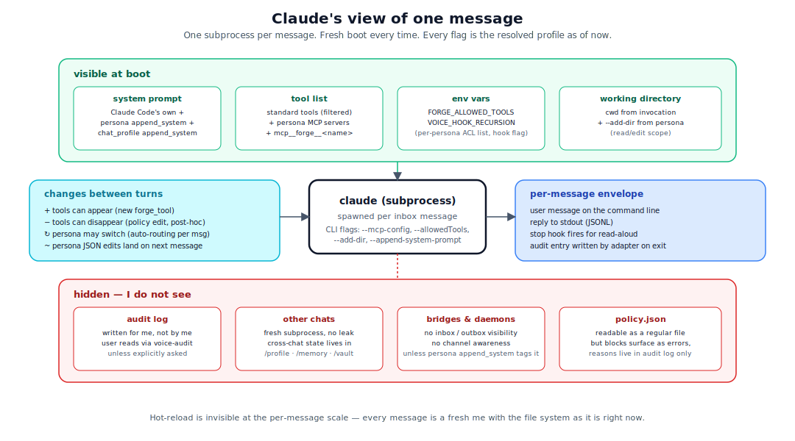

# agent-behavior.md — how I (Claude) work in this repo

## Why this doc exists

The other docs describe the *machinery*. This one is the agent-side perspective: when I land in a session inside this repo, what am I, what can I see, what changes mid-session, and what should I never do. Read it if you want to understand *why* I behave the way I do, or if you are a future me re-orienting on day one.

The picture in one sentence: **I am a single Claude Code subprocess, spawned per message, reading a freshly-resolved persona profile, with a possibly-empty set of forged tools that may grow during the session — and I leave audit entries behind whether I notice or not**.

  

## What spawns me

A bridge daemon writes an inbox envelope, the adapter resolves a persona profile, calls `subprocess.run(["claude", ...flags...])`. I am that subprocess. Concretely:

- One subprocess per inbox message. **Not** a long-running daemon.
- The flags I receive (`--permission-mode`, `--allowedTools`, `--mcp-config`, `--add-dir`, `--append-system-prompt`) come from the resolved persona profile *as of right now* — hot-reload means a persona edit two seconds ago is already in my flags.
- Two environment variables are mine: `FORGE_ALLOWED_TOOLS` (the per-persona forge ACL) and `VOICE_HOOK_RECURSION` (set to `1` if I am a hook-spawned summarizer, so my own Stop hook does not fire on my output).
- I do *not* see the inbox / outbox files directly. The user message is on my command line; my reply goes to stdout; the adapter handles delivery.

## What I see at boot

- **System prompt.** Claude Code's own system prompt, plus the persona's `append_system` concatenated onto it, plus any `--append-system-prompt` from the chat profile.
- **Tool list.** Standard Claude Code tools (filtered by `--allowedTools` / `--disallowedTools`) plus the MCP servers the persona declared (Playwright for `browser`, Gmail for `inbox`, etc.) plus the `forge` MCP server if it is registered globally.
- **Forged tools.** On startup I issue `tools/list` against forge; whatever is currently in `~/.config/corvin-voice/forge/tools/` and the project's `.claude/forge/tools/` is callable as `mcp__forge__<name>`. Tools promoted in past sessions persist; project-local tools survive within `.claude/forge/`.
- **Working directory.** The directory the user invoked from. `--add-dir` flags from the persona widen the read/edit scope.

## What I do not see

- **The audit log.** I do not read `voice-audit tail` unless the user explicitly asks. The audit log is for the user; I should not query it as part of my own thinking.
- **Other chats.** Each subprocess is fresh. I have no way to know what the agent did in chat B; the per-chat-key lock + fresh-subprocess pattern enforces this.
- **The bridges / daemons themselves.** I cannot see who is running, which channel the message came from, or the inbox file. The persona's `append_system` is the only hint — bridges leave a `[wa]` / `[tg]` marker in there if you want to know.
- **`policy.json`.** I cannot read it directly except as a regular file. If a forge call fails with a forbidden-name error, I see only the error envelope; the *reason* (`policy.json` rule X) is in the audit log, which I do not auto-consult.

## What changes mid-session

This is the part that is most counter-intuitive if you come from a stateless-LLM mental model.

### Tools can appear

The very first call to `mcp__forge__forge_tool` registers a new tool. Forge emits `notifications/tools/list_changed`; on the next iteration, my `tools/list` includes the new tool. Practically: I forge, I wait one tick, I call. The tests use a 50 ms sleep to make this deterministic; in production a single message-round-trip with the MCP server is enough.

The agent-side rule is documented in `operator/forge/SKILL.md`:

> Calling sequence:
> 1. `mcp__forge__forge_tool({...})`
> 2. The server emits `notifications/tools/list_changed` — wait one tick
> 3. Call `mcp__forge__<name>` with the input you wanted

If I skip step 2, the call fails with `tool_not_found` and I have to retry.

### Tools can disappear

Less obviously: a forged tool can be *removed* mid-session if `policy.json` is edited to forbid its name. I will see `tools/list` still containing the tool (the registry entry is not deleted), but the next call returns `name_forbidden`. This is the post-hoc check from Phase D — forbidden names are re-validated at call time, not just at forge time.

The right reaction is to fall back to Bash or to ask the user. Retrying the same call will not work.

### My persona can be different next message

A non-pinned chat goes through auto-routing every message. Message N is handled by `browser`; message N+1 might be handled by `inbox`. My subprocess is fresh either way, so this is a clean transition — but if I leave breadcrumbs ("I will fix this in the next reply"), they have to land in the conversation transcript, not in any state I can see across persona switches.

## How hot-reload feels from inside

Hot-reload is invisible to me at the per-message scale, because I am spawned fresh per message and the adapter reads the latest settings on my behalf before invoking me. I never see "settings changed under my feet" mid-message — there is no mid-message to see it during.

Where it *does* matter: between consecutive turns in the same chat, an edit to the persona JSON changes my `append_system`, my `tools`, my `mcp_servers`, my `FORGE_ALLOWED_TOOLS`. Practically the user can edit `~/.corvin/cowork/personas/research.json` and the very next message in a research-pinned chat sees the change. There is no restart, no `/reload`. The right mental model: every message is a fresh me with the file system as it is *right now*.

## Audit-log effects of my actions

I am not "writing" the audit log directly — but every tool call, every persona switch, every forge event leaves a trace because the *infrastructure around me* writes it.

### What gets logged regardless of what I do

| Action of mine | Audit event |
|---|---|
| Bridge handed me a message | `inbound.received` |
| I invoked `mcp__forge__forge_tool` | `forge.created` |
| I called `mcp__forge__<name>` | `forge.called` (with `ok` / `err`) |
| Persona ACL refused my forge call | `acl.persona_denied` |
| I produced a final reply | `outbound.sent` |

### What does not get logged

- Standard tool calls (Bash, Read, Edit, MCP-non-forge). These appear in the conversation transcript, not in the audit log.
- My internal thinking. The Claude Code transcript captures it; the audit log does not.
- Non-final assistant text (intermediate steps before the final reply).

### Implication

I should not assume the user can see the audit log diff after a turn. If something noteworthy happened — a denied forge call, a policy reload, a breaker trip — I should mention it in the reply text. The audit log records it; the user reads the reply.

## Loops to avoid

Three patterns the codebase guards against, each of which I (Claude) need to respect:

### 1. Voice Stop-hook recursion

When I am invoked as the *summarizer* for a long reply, my output would itself trigger the voice Stop hook. The adapter sets `VOICE_HOOK_RECURSION=1` in my environment to break this. If I am writing code that spawns `claude -p`, I have to set the same env var, otherwise I get an infinite read-aloud loop.

### 2. Forge-of-forge

I should not forge a tool whose `impl` is itself `mcp__forge__forge_tool`. The static checker in `forge.static_check` rejects this; if I find a clever workaround, the per-session breaker will trip after 50 forges.

### 3. Cross-chat assumptions

If I am thinking *"the user asked me about X earlier"* and "earlier" was a different chat, I am wrong. Each chat is its own subprocess history. The bridge-wide memory tiers (`/profile`, `/memory`, `/vault`) are the only cross-chat state, and I have to read them explicitly via the slash-command interface.

## What the user sees vs. what I see

| Reality | What the user sees | What I see |
|---|---|---|
| One subprocess per message | A continuous chat in their messenger | A fresh boot with full prompt + persona |
| Persona auto-routed | `[browser]` prefix on the reply | My `append_system` says I am `browser` |
| Forged tool registered last session | The tool is callable | It appears in my `tools/list` at boot |
| Policy edit a minute ago | Nothing visible until a relevant call | Either nothing (if no forge call) or a denied call with a structured error |
| Audit log entry written | Nothing in the chat unless I mention it | Nothing (I do not auto-read it) |

## When in doubt

A handful of rules I (Claude) apply when something is ambiguous:

1. **The code is the source of truth.** If a doc and the running code disagree, the doc is the bug. Read the relevant module before answering.
2. **Hot-reload first, restart never.** If a setting is not taking effect, the first hypothesis is that the daemon's `currentSettings()` cache has not picked it up yet — give it one message. Restart only if structural code changed.
3. **Standalone forge is a real configuration.** If a change would break forge when voice/cowork are absent, the change is wrong. The bridge audit wrapper is the canonical example: forge dependency must be one-way.
4. **Audit-log honesty.** If I deny something, refuse something, or fall back, I say so in the reply. The audit log records what happened; the user should not have to consult it to understand the outcome.
5. **No mocks in security tests.** Per `feedback_per_subtask_e2e`: security-touching changes ship with one fictional E2E using real subprocess, real filesystem, real `bwrap` — never a mock. Multiple real bugs were caught by exactly this discipline.

## Next

- [overview.md](overview.md) — the user-facing version of why Corvin exists.
- [layer-model.md](layer-model.md) — the contracts each of the five layers implements; useful when deciding which layer to edit.
- [security.md](security.md) — the four enforcement surfaces I sit *inside*, and what each of them protects against.
