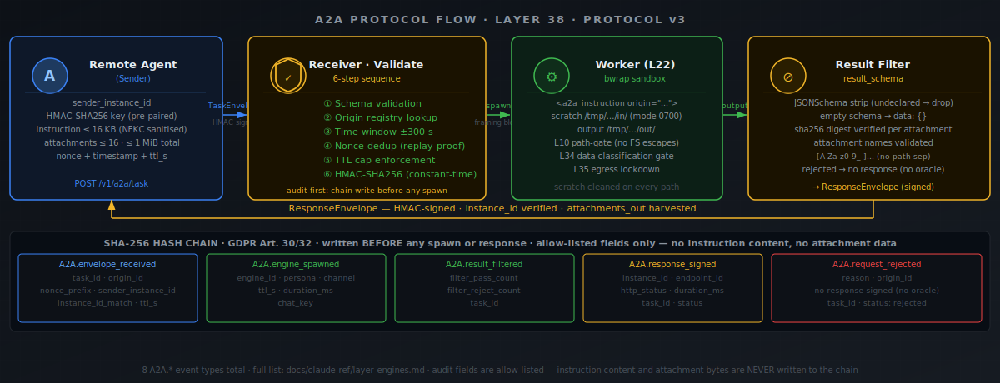
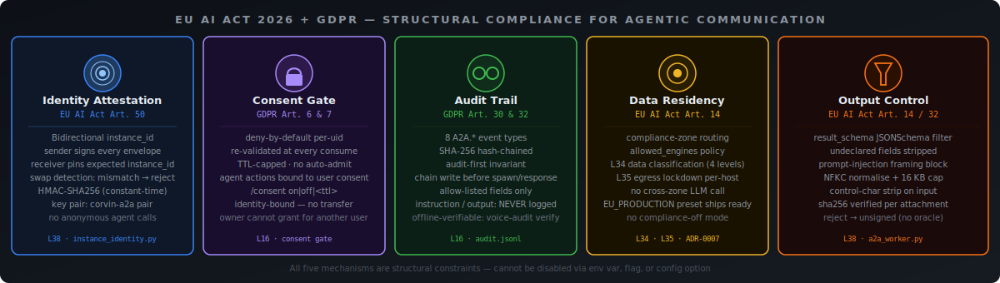

# Agentic Communication — Architecture & EU AI Act Compliance

> **One-liner:** Every agent-to-agent call in Corvin is structurally compliant —
> signed, audited, consent-gated, data-classified, and egress-locked before the
> first byte reaches a worker.

When AI agents call other AI agents without a human in the loop, the EU AI Act
and GDPR raise hard questions: *Who authorised this? Whose data is being
processed? Is the receiving agent who it claims to be? Where does the output
go?* Layer 38 (Remote Trigger Receiver + A2A TaskEnvelope Protocol) answers all
five questions with cryptographic guarantees, not policy documents.

---

## What is Agentic Communication?

**Agentic Communication** is the ability of one Corvin instance — or any
compliant external agent — to instruct another instance to perform a task and
receive a structured, filtered result. The key properties that make it
*compliant* communication rather than just an HTTP call:

| Property | Guarantee | Layer |
|---|---|---|
| Identity | Every envelope carries a signed `sender_instance_id`; the receiver pins the expected ID | L38 |
| Authorisation | Consent gate re-validated before any worker spawns | L16 |
| Integrity | HMAC-SHA256 covers the entire payload including attachment digests | L38 |
| Data safety | Data classification + egress gate applied inside every spawned worker | L34 / L35 |
| Auditability | 8 hash-chained audit events, allow-list only — no instruction content in the chain | L16 |
| Output control | `result_schema` JSONSchema strips undeclared fields before signing the response | L38 |

---

## Protocol Architecture (Layer 38 — Protocol v4)



### TaskEnvelope

Every outbound request is a `TaskEnvelope`. The HMAC-SHA256 signature covers the
entire JSON body — including every attachment sha256 digest — so a single-bit
modification of any field or attachment fails the constant-time verification on
the receiver side.

```json
{
  "task_id":           "task_2026...",
  "sender_instance_id": "a1b2c3d4-...",
  "purpose_id":        "compute",
  "instruction":       "…",
  "attachments": [
    { "name": "data.csv", "mime": "text/csv",
      "sha256": "e3b0c44298fc…", "content_b64": "…",
      "classification": "INTERNAL" }
  ],
  "nonce":    "random-uuid-v4",
  "issued_at": 1748390400,
  "ttl_s":    300
}
```

**Protocol v4 additions:** optional `purpose_id` field (signed into HMAC, required
when the origin declares `allowed_purposes`) · optional `classification` field on
each attachment (`PUBLIC` / `INTERNAL` / `CONFIDENTIAL` / `SECRET`, default
`INTERNAL`).

**Caps:** instruction ≤ 16 KB (NFKC-normalised, format-chars stripped,
`</a2a_instruction>` literal rejected) · attachments ≤ 16 items · total
attachment bytes ≤ 1 MiB raw.

### ResponseEnvelope

The receiver signs its response with its own HMAC key and includes its
`instance_id`. The sender verifies this matches the configured endpoint pin —
a receiver that was swapped behind the same URL fails the pin check.

```json
{
  "task_id":     "task_2026...",
  "instance_id": "f5e6d7c8-...",
  "status":      "ok",
  "data":        { /* filtered by result_schema */ },
  "attachments": [ /* harvested from scratch/out/ */ ]
}
```

**Signed rejections (Protocol v4):** once the receiver has loaded the origin
config and confirmed the HMAC key, all rejection responses are signed with the
`recv_key`. This lets callers distinguish a genuine receiver rejection from a
MITM-injected one. For rejections that occur *before* the origin is loaded
(unknown origin, malformed envelope), the response is unsigned — no `recv_key`
is available on that code path.

The *no-oracle* property is preserved: all rejections — signed or unsigned —
carry `status: "rejected"` and empty `data: {}`. No hint about which step
failed is visible from outside.

### Bidirectional Instance Attestation

Every Corvin instance has a locally-persistent UUID4 stored at
`<corvin_home>/global/instance_id.json` (mode 0600). This ID is:

- Included as `sender_instance_id` in every outgoing `TaskEnvelope`
- Included as `instance_id` in every outgoing `ResponseEnvelope`
- Pinned in the endpoint configuration on the calling side

A deployment behind a load balancer must share the same `instance_id.json` —
round-robin between instances with different IDs will fail the pin check for
half of all requests.

```bash
# Show this instance's ID
corvin-instance-id show

# Pair two instances and generate key files
corvin-a2a pair <peer-label> <peer-url>
```

### Binary Attachments

Protocol v3 adds binary attachment support. Attachments are base64-encoded in
the envelope, sha256-digest verified on receipt, and dropped into a private
scratch workspace (`/tmp/<uuid>/in/`, mode 0700). The worker writes outputs to
`/tmp/<uuid>/out/`; the receiver harvests files matching the
`result_schema.attachments_out_allowed` whitelist after the spawn and includes
them in the `ResponseEnvelope`. The scratch directory is cleaned on every code
path — success, failure, and timeout.

Attachment names are validated against `[A-Za-z0-9_-][A-Za-z0-9._-]{0,127}` —
no leading dot, no path separators, no `..` — as a path-traversal defence.

---

## EU AI Act + GDPR Compliance



### Art. 50 — AI Identity Disclosure

EU AI Act Art. 50 requires that AI systems interacting with humans disclose their
AI nature. For agent-to-agent calls, the equivalent requirement is that the
calling agent can prove its identity and cannot be impersonated. Protocol v3
satisfies this with:

1. **Pre-paired HMAC keys** — generated by `corvin-a2a pair`, exchanged
   out-of-band, stored at mode 0600. No key material ever appears in LLM context
   or audit events.
2. **Bidirectional instance_id pinning** — the caller knows the expected
   receiver UUID; the receiver knows the expected sender HMAC key.
3. **Constant-time comparison** — the HMAC check uses `hmac.compare_digest` to
   prevent timing-based key recovery.

No anonymous agent calls are possible: an envelope without a registered origin
fails at step ② of the validation sequence.

### Art. 14 — Human Oversight & Data Residency

Art. 14 requires high-risk AI systems to be designed so that human oversight is
possible and that data stays within the specified jurisdiction. For agentic
communication:

- **Engine policy allowlist** (`allowed_engines` / `forbid_engines` in
  `tenant.corvin.yaml`) — the tenant operator declares which worker engines
  may be spawned for A2A tasks. A task that would require a forbidden engine is
  rejected before spawn.
- **Compliance-zone routing** — the `data_residency` field in the tenant config
  restricts which cloud zones an engine may use. An EU-only tenant cannot
  accidentally spawn a worker that calls a US-region API.
- **L34 Data Classification** — four levels (PUBLIC < INTERNAL < CONFIDENTIAL <
  SECRET) × per-engine `(locality, network_egress)` matrix, evaluated inside
  every spawned worker.
- **L35 Egress Lockdown** — declarative `allowed_hosts` / `forbidden_hosts` ×
  `default_action` evaluated at the network layer. The `EU_PRODUCTION` preset
  ships ready-to-use.

### GDPR Art. 6 & 7 — Consent Gate

An agent acting on behalf of a user must have that user's consent. The consent
gate (L16) is re-validated before any A2A worker spawns:

- **Deny-by-default** — consent is not assumed from a previous interaction.
- **TTL-capped** — a consent granted yesterday may have expired.
- **Identity-bound** — the owner of an Corvin instance cannot grant consent
  on behalf of another user's data.
- **Re-validated at every consume** — not cached by the A2A layer.

If consent is not in place, the task is rejected at the receiver with
`A2A.request_rejected` → `reason: consent_denied`.

### GDPR Art. 30 & 32 — Audit Trail

Every A2A call produces an immutable, hash-chained audit record. The
**audit-first invariant** guarantees that the `A2A.envelope_received` event is
written to the hash chain *before* any spawn or response — there is no code path
where a task executes without an audit entry.

**What is recorded (allow-list):**

| Field | Example |
|---|---|
| `task_id` | `task_2026abc123` |
| `origin_id` | `peer-label` |
| `endpoint_id` | `corvin-b` |
| `sender_instance_id` | `a1b2c3d4-…` |
| `instance_id_match` | `true` |
| `nonce_prefix` | `e3b0c442` (first 8 hex chars) |
| `engine_id` | `claude_code` |
| `persona` | `forge` |
| `ttl_s` | `300` |
| `duration_ms` | `4218` |
| `filter_pass_count` | `3` |
| `filter_reject_count` | `1` |
| `http_status` | `200` |
| `reason` | `hmac_mismatch` (on reject) |

**What is never recorded:** instruction text, attachment content, worker output,
URL paths, response body, HMAC key material.

---

## Security Architecture

### Seven-Step Validation Sequence

Validation is **fail-closed**: any step failure rejects the request immediately,
writes `A2A.request_rejected` to the audit chain, and returns a rejection
response (signed when the `recv_key` is already known).

```
① Schema validate   — envelope matches the v4 JSON schema
② Origin lookup     — origin_id exists in remote_origins/ registry; key file mode 0600
②.⁵ Purpose gate    — if origin declares allowed_purposes, purpose_id must be present
                       and in the allowlist (Protocol v4)
③ Time window       — |issued_at − now| ≤ 300 s (prevents replay of old envelopes)
④ Nonce dedup       — SQLite-backed persistent nonce store; TTL-keyed, LRU-evicted
                       at 10 000 entries. Survives process restarts
⑤ TTL cap           — ttl_s ≤ operator-configured maximum
⑥ HMAC-SHA256       — constant-time comparison (hmac.compare_digest)
⑦ Attachment check  — classification ≤ origin max_data_classification
```

A failed HMAC check always looks identical to a failed origin lookup: the caller
sees `status: "rejected"` with no hint about which step failed.

### Prompt-Injection Defence

Every inbound instruction passes through a sanitisation pipeline before it
reaches a worker. The sanitiser runs *before* the engine spawn, so an injection
attempt that trips any guard is logged as `reason: injection_attempt` and results
in the same opaque `status: "rejected"` response — indistinguishable from a bad
HMAC.

1. **Type check** — must be a string; non-string types rejected.
2. **NFKC normalisation** — homoglyph attacks (lookalike Unicode, fullwidth
   Latin, etc.) are collapsed to canonical form.
3. **16 KB hard cap** — instructions exceeding 16 384 bytes (UTF-8 encoded) are
   rejected outright.
4. **Control-character strip** — NUL bytes, BEL, BS, and all `U+0000–U+001F` /
   `U+007F` characters are removed, except tab and newline which are preserved.
5. **Unicode format-character strip** — nine categories of
   invisible Unicode characters that NFKC does not collapse are also stripped:
   Zero-Width Space (U+200B), ZWNJ (U+200C), ZWJ (U+200D), Line Separator
   (U+2028), Paragraph Separator (U+2029), BOM (U+FEFF), and interlinear
   annotation anchors (U+FFF9–FFFB). These have no legitimate use in A2A
   instructions and can be used to disguise tag-injection attacks.
6. **Literal guard** — the string `</a2a_instruction>` is rejected (case-
   insensitive, whitespace-tolerant) to prevent tag-injection that would break
   the framing block. This check runs *after* format-char stripping so that
   invisible-character padding cannot bypass it.
7. **Empty guard** — whitespace-only instructions (after all stripping) are
   rejected.

After sanitisation, the instruction is wrapped in a framing block:

```xml
<a2a_instruction origin="peer-label" task_id="task_2026…">
  …sanitised instruction…
</a2a_instruction>
```

The worker's system prompt declares this block as the **only** authoritative
source of instructions. The `origin` and `task_id` attributes are
HTML-attribute-escaped before insertion to prevent quote-break attacks.

### Result Filtering

The `result_schema` field in the `TaskEnvelope` is a JSONSchema object that
describes the exact fields the sender expects in the response. The result filter:

- Strips any field not declared in the schema before the response is signed.
- Returns `data: {}` if the schema is empty (no pass-all).
- Validates attachment names and digests before including them in the response.
- Records `filter_pass_count` and `filter_reject_count` in the audit event.

This ensures that a compromised worker cannot exfiltrate data by smuggling it
into undeclared response fields.

---

## Security Hardening

The following ten hardening measures are all active in Protocol v4.

### Sanitiser hardening (S-1, S-4)

**S-1** extends the control-character filter to nine Unicode format characters
(see Prompt-Injection Defence above). These characters are invisible to humans
and model-behaviour-dependent in LLMs — a structural defence cannot assume
how a specific model processes them, so they are stripped before any other check.

**S-4** makes `parse_worker_output` robust against models that append
commentary text after valid JSON. Previously, output of the form
`{"key": "val"} Note: see log` was not recognised as JSON and wrapped as a plain
text field, silently breaking caller-side result schemas. The fix: full-string
JSON parse first; on failure, trim everything after the last `}` and retry.

### Crash-resilient nonce store (S-2)

The in-memory nonce store (`NonceStore`) was replaced with a **SQLite-backed
persistent store** (`PersistentNonceStore`) at
`<tenant_home>/global/nonces/a2a_nonces.db` (mode 0600, WAL mode).

After a process restart, previously-seen nonces are still known. Without
persistence, a captured valid envelope could be replayed within the 5-minute
time window immediately after a crash or deployment restart — a real-world
attack vector against HMAC-authenticated APIs.

The store falls back to in-memory transparently when the DB path is not writable
(e.g. read-only container filesystems), logging a WARNING to stderr.

### Per-origin rate limiting (S-3)

Each origin config may now declare `rate_limit_rpm: N`. The receiver uses a
**token-bucket** algorithm to enforce a per-origin rate cap after HMAC
validation. Rate-limited requests are logged with `reason: rate_limited` and
return a signed rejection response.

```json
{
  "origin_id": "peer-label",
  "rate_limit_rpm": 60
}
```

A compromised-but-authenticated origin cannot flood the worker pool: the token
bucket drains at `N / 60` tokens per second and refills at the same rate.

### Purpose declaration (C-2)

Origins that process data for specific declared purposes can now declare an
`allowed_purposes` list:

```json
{
  "origin_id": "analytics-agent",
  "allowed_purposes": ["analytics", "reporting"]
}
```

When this list is non-empty, every TaskEnvelope **must** carry a `purpose_id`
field that is in the list. Envelopes without a `purpose_id`, or with an
unlisted purpose, are rejected at step ②.⁵ of the validation sequence. The
`purpose_id` is included in the HMAC payload, so it cannot be added or altered
by a MITM.

This satisfies the GDPR Art. 5(1)(b) purpose-limitation principle at the
protocol level rather than as an operator policy document.

### Per-origin consent gate (C-1)

Origins that process personal data can now be explicitly flagged:

```json
{
  "origin_id": "user-data-processor",
  "personal_data": true,
  "required_consent_purposes": ["analytics"],
  "data_subject_id": "user_42"
}
```

When `personal_data: true` and `required_consent_purposes` is non-empty, the
receiver calls the L16 `is_granted()` check for each listed purpose before
spawning a worker. If consent is not in place, the request is rejected with
`reason: consent_not_granted`.

Origins without personal data (the majority of compute, search, and document
tasks) carry no additional overhead — the gate is opt-in via operator
configuration.

### Signed rejection responses (C-5)

In Protocol v3, all rejection responses were unsigned — the receiver returned
`signature: ""` on every rejection. A MITM could silently convert a signed `ok`
response to an unsigned `rejected` one, causing the caller to believe the task
failed.

In Protocol v4, rejection responses are **signed with the `recv_key`** whenever
the origin has been successfully loaded (i.e. the recv_key is known). The caller
verifies the signature on all responses, including rejections. Unsigned
rejections are still tolerated from v3 receivers for backward compatibility, but
they are flagged distinctly in the audit log.

The only code path that still produces an unsigned rejection is the
**unknown-origin** path: when the envelope's `origin_id` is not registered, no
`recv_key` is available and the response is unsigned — by necessity, not by
choice.

### Attachment data classification (C-6)

Each attachment may now carry an optional `classification` field
(`PUBLIC` / `INTERNAL` / `CONFIDENTIAL` / `SECRET`). Absent or unknown values
are treated as `INTERNAL` (conservative default).

The receiver computes the **effective classification** (the maximum across all
inbound attachments) and compares it against the origin config's
`max_data_classification` field (default: `INTERNAL`). Attachments exceeding
the cap are rejected at step ⑦ of the validation sequence:

```json
{
  "origin_id": "public-api-consumer",
  "max_data_classification": "PUBLIC"
}
```

This prevents a sender from bypassing the L34 data-classification matrix by
wrapping CONFIDENTIAL data in an attachment rather than passing it as task text.

### TLS enforcement (C-4)

The `a2a_http_server.py` startup now checks `CORVIN_A2A_PUBLIC_URL`:

- **Absent** → `WARNING` to stderr: server started without confirmed TLS
  termination.
- **Non-HTTPS** → `WARNING`: instruction content is transmitted in the clear.
- **HTTPS URL** → no warning; `voice-audit doctor` passes the TLS check.

HMAC authentication protects integrity in all cases. TLS is required for
confidentiality — without it, instruction content, attachment payloads, and
worker outputs are visible to anyone on the network path.

### GDPR Art. 17 Erasure Handler (C-3)

A new `A2AErasureHandler` (module `erasure_a2a.py`) is registered in the L36
erasure orchestrator chain. When `corvin-erasure <subject_id>` runs, the A2A
handler:

1. Walks `<tenant_home>/global/sessions/*/worker_sessions/`
2. Deletes records whose `scope_label` starts with `<subject_id>` or
   `<subject_id>:` (colon-prefixed identifiers, e.g. `user_42:discord:1234`)
3. Reports `APPLIED` + count, or `SKIPPED` if no records matched

Nonce records and origin/endpoint configs are not personal data and are not
purged.

---

## Data Classification (L34) + Egress Lockdown (L35)

Both layers apply **inside** the spawned worker, not just at the A2A envelope
boundary. This means:

- A worker that tries to call an API in a forbidden zone fails at runtime, not
  at configuration time.
- A dataset classified as CONFIDENTIAL cannot be processed by a cloud engine
  even if the A2A envelope itself was validly signed.
- Egress attempts to hosts not on the `allowed_hosts` list fail with
  `ConnectionRefusedError` from the loopback-deny shim.

The three layers form a nested defence:

```
Tenant allowed_engines   — which engines may be used
L34 data_classification  — which engines may touch which data
L35 egress               — which hosts an engine may contact
```

Each layer can independently reject a request. All three must pass for a worker
to run and produce a result.

---

## Audit Events Reference

| Event | When | Key fields |
|---|---|---|
| `A2A.envelope_received` | On valid HTTP receipt | task_id, origin_id, nonce_prefix, sender_instance_id, ttl_s, purpose_id (v4) |
| `A2A.envelope_sent` | After signing an outbound TaskEnvelope | task_id, endpoint_id, ttl_s |
| `A2A.engine_spawned` | Before worker spawn | task_id, engine_id, persona, channel, chat_key |
| `A2A.result_filtered` | After result_schema filter | task_id, filter_pass_count, filter_reject_count |
| `A2A.response_signed` | Before sending ResponseEnvelope | task_id, instance_id, endpoint_id, http_status, duration_ms |
| `A2A.response_received` | On valid ResponseEnvelope receipt | task_id, endpoint_id, instance_id_match, http_status |
| `A2A.request_rejected` | On any validation failure | task_id, origin_id, reason (e.g. rate_limited, purpose_not_allowed, attachment_classification_exceeded, consent_not_granted) |
| `A2A.response_rejected` | On invalid ResponseEnvelope | task_id, endpoint_id, reason |

**Never in details:** instruction text, attachment content, worker output, URL paths,
HMAC key material, full nonce values (only 8-char prefix), attachment sha256 beyond
16-char prefix.

Verify the audit chain at any time:

```bash
voice-audit verify
```

---

## CLI Reference

### Standalone HTTP server

Start the A2A receiver on a node that does not run the full gateway:

```bash
# Bind to all interfaces so remote peers can reach it.
# Default (127.0.0.1) only accepts loopback connections.
cd /opt/corvin/operator/bridges/shared
CORVIN_HOME=/path/to/.corvin \
CORVIN_A2A_PUBLIC_URL=https://your-node.example.com \
python3 a2a_http_server.py \
  --host 0.0.0.0 \
  --port 7433 \
  --origins-dir /path/to/.corvin/tenants/_default/cowork/remote_origins
```

Origin files must include `"enabled": true`; the default is `false` (fail-closed).
`corvin-a2a pair` generates this field automatically — it only needs to be added
manually when origin files are created by hand.

---

```bash
# Show this instance's UUID
corvin-instance-id show

# Generate a key pair for two instances and write registry files
corvin-a2a pair <peer-label> <peer-url>

# Send a task to a remote endpoint (Protocol v4)
corvin-a2a send <endpoint-id> "Compute the monthly summary for region=EU" \
  --ttl 300 \
  --purpose analytics \
  --schema ./schemas/monthly-summary.json \
  --attach data.csv

# List registered origins (inbound) and endpoints (outbound)
corvin-a2a list-origins
corvin-a2a list-endpoints

# Inspect a specific registry entry
corvin-a2a show-origin  <origin-id>
corvin-a2a show-endpoint <endpoint-id>

# View recent A2A events in the web console
# GET /v1/console/remote-trigger/log?limit=50&severity=INFO
```

---

## Related Documentation

| Document | What it covers |
|---|---|
| [`docs/claude-ref/layer-engines.md`](claude-ref/layer-engines.md) | Full L38 implementation details, all module descriptions |
| [`docs/claude-ref/layer-34-data-classification.md`](claude-ref/layer-34-data-classification.md) | Data classification matrix and engine compliance |
| [`docs/claude-ref/layer-35-egress-lockdown.md`](claude-ref/layer-35-egress-lockdown.md) | Egress lockdown, EU_PRODUCTION preset |
| [`docs/audit-and-compliance.md`](audit-and-compliance.md) | General Corvin compliance overview |
| [`docs/eu-ai-act/README.md`](eu-ai-act/README.md) | EU AI Act compliance hub for regulators |

