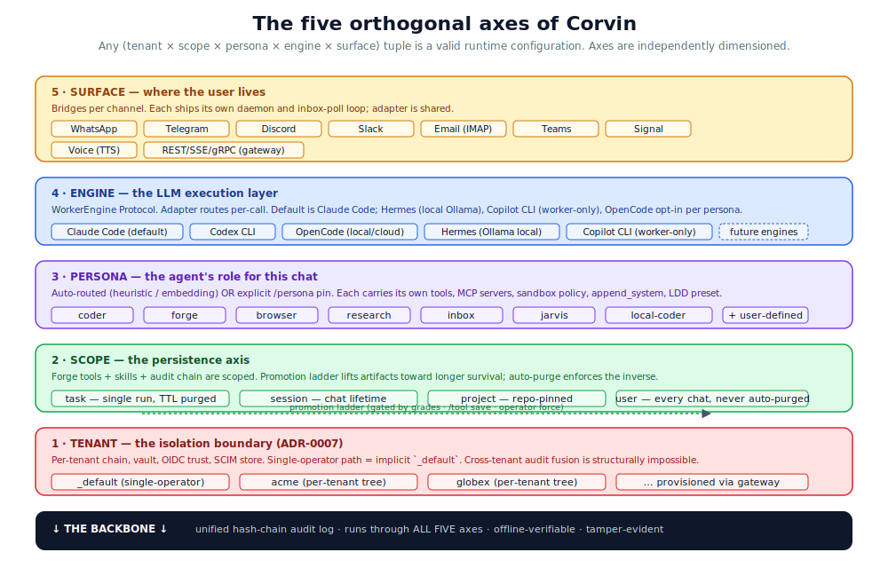
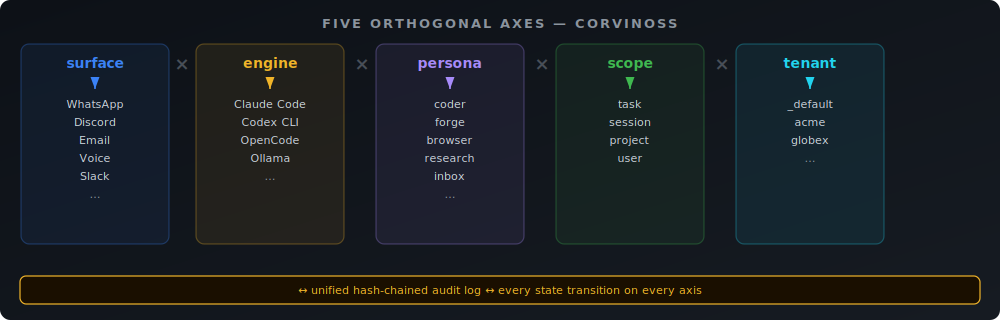
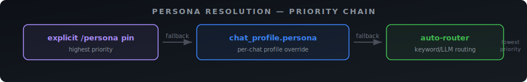

# Architecture

> The mental model that makes the rest of Corvin make sense.



## The mental model

Corvin is **not** a chatbot. It's not a single-purpose agent either.
It's a **runtime layer** that turns an LLM-CLI engine into something
closer to a per-user mini-OS — with persistent state, runtime-extensible
capabilities, isolation boundaries, and a tamper-evident audit log
running through everything.

The core architectural decision is this: instead of forcing every
feature onto a single dimension (e.g. "what does the agent do?"),
Corvin factors the runtime into **five orthogonal axes**. Any
combination of values across the five is a valid configuration. You
never have to ask "but what about agent X with feature Y in
deployment Z?" — every cell of the cross-product is reachable.

<p align="center">
  
</p>

Underneath all five runs **one** thing: the unified hash-chained audit
log. That's the backbone — every state transition on any axis lands
there as a verifiable record.

The runtime is implemented across **44+ layers** (L1–L44), each
independently enable-able and auditable. L44 is the house-rules gate
(EU AI Act Art. 5 + Art. 50 enforcement): acceptable-use policy with a
SHA-256-pinned rule file, fail-closed on any bypass attempt.

## Why five axes (and not fewer)

A naïve "agent framework" merges these axes silently. That works until
the first time you need to:

- run two engines concurrently for different chats (e.g. Claude Code for
  most chats, OpenCode + Ollama for a privacy-first chat) →
  **engine** must be separable from **persona**
- give a Discord chat a stricter sandbox than a Slack chat with the
  same persona → **surface** must be separable from **persona**
- pin a forged tool to "always available, every chat, every persona"
  while keeping a different forged tool task-local → **scope** must
  be separable from **persona**
- offer the same software to two companies on shared infrastructure
  without their audit chains touching → **tenant** must be separable
  from everything

Corvin treats each axis as a first-class dimension. The cost is one
extra word in every API call (`tenant_id`, `chat_key`, `persona`, …);
the win is that no axis can silently override another.

## The axes in detail

### 1. Tenant — the isolation boundary

Single-operator deployments live under the implicit `_default` tenant
and notice nothing. Multi-tenant deployments provision
additional tenants under `<corvin_home>/tenants/<tid>/`, each with:

- its own hash-chained audit log (cross-tenant fusion is structurally
  impossible)
- its own secret vault, OIDC trust store, SCIM users
- its own forge / skill-forge / personal-tools workspace
- its own `tenant.corvin.yaml` declaring engine allowlist, data
  residency zone, and budget caps

Any code path that accepts a tenant ID validates it against
`validate_tenant_id` (DNS-label-shape, path-traversal-safe). The
boundary is enforced at every state-store entry point, not at a
single chokepoint — defense-in-depth.

### 2. Scope — the persistence axis

Every artifact the agent generates at runtime (forged tool, created
skill, audit event, conversation state) is tagged with a scope:

| Scope | Lifetime | Purge rule |
|---|---|---|
| `task` | one run | TTL-purged daily |
| `session` | chat lifetime | wiped by `/reset` or 7-day timeout |
| `project` | repo-pinned (`<repo>/.corvin/`) | survives session reset |
| `user` | every chat, every project | **never** auto-purged |

The promotion ladder lifts artifacts toward longer survival when they
prove useful (skill-forge: grade-gated; personal-tools: explicit
`/tool save`; forge tools: operator force). The auto-purge enforces
the inverse: an artifact that never earns relevance falls out.

This is the answer to "where does my agent's runtime work go?" — a
generated tool isn't ephemeral *or* permanent by default; it has a
**measured lifetime** that you can argue about.

### 3. Persona — the agent's role

A persona is a JSON declaration of what the agent is supposed to *be*
for a given chat. It owns:

- which tools / MCP servers are wired in
- the `append_system` voice + scope of work
- the sandbox policy (e.g. `network: allow` for research)
- per-persona LDD discipline preset
- routing anchors (used by the router to auto-pick the persona)

Bundle personas (`coder`, `forge`, `research`, `inbox`,
`orchestrator`, `assistant`, `os`, `homeassistant`) ship with the system. User personas live
under `<corvin_home>/cowork/personas/` and override per name. The
adapter resolves a persona per call from one of three sources:

<p align="center">
  
</p>

### 4. Engine — the LLM execution layer

Layer 22 introduced the `WorkerEngine` Protocol:

```python
class WorkerEngine(Protocol):
    def spawn(self, prompt: str, *, env: dict) -> Iterator[StreamEvent]: ...
    def cancel(self) -> None: ...
    capabilities: dict[str, bool]   # mid_stream_inject, hooks, skills_tool, ...
```

Five implementations ship today: `ClaudeCodeEngine` (default),
`CodexCliEngine`, `OpenCodeEngine`, `HermesEngine` (local Ollama,
zero egress, L34 CONFIDENTIAL-capable), and `CopilotCliEngine`
(GitHub Copilot CLI, worker-only). The adapter dispatches per
call based on `profile.default_engine`.

**EAOS — engine-agnostic guarantees:** Every engine now
receives L10 path-gate, L16 audit, and L33 artifact registration via
the Tool Execution Broker (TEB) in the Forge MCP server. Engine Command
Interface (ECI) adds `EngineCommandManifest` — `/btw` routes to live
inject (CC), buffered (Hermes), or explicit error (Codex/OpenCode).
MCP tool-calling reaches Hermes via the Function-Call Bridge (FCB).

Crucially, this means **you can run the same chat against different
backends per persona** — a `coder` chat hits Claude Code while an engine-pinned chat
hits OpenCode + Ollama, side by side, in the same bridge process.

### 5. Surface — where the user lives

Each channel ships its own daemon (`whatsapp/`, `telegram/`,
`discord/`, `slack/`, `email/`) plus a Voice TTS pipeline and the
multi-tenant REST/SSE/gRPC gateway. The surface layer is purely about
*reaching* the user — the daemon writes a unified-shape envelope
into the inbox, and the adapter reads from that single inbox.

Adding a sixth channel is a one-file change: write a daemon that
reads the channel's API, writes inbox-shaped JSON envelopes, and
reads outbox-shaped JSON envelopes back. The adapter doesn't need
to know.

## The backbone: unified audit hash chain

Every state transition on any axis lands in the same hash-chained log
at `<corvin_home>/global/forge/audit.jsonl`. Per-tenant deployments
get one chain per tenant.

```
event[N-1] {hash: 9a3c…}   ←   event[N] {prev_hash: 9a3c…, hash: 7b1f…}   ←   event[N+1] …
```

Tampering with any field of any record breaks the chain at that point;
`voice-audit verify` reports the offset. The chain is **offline-
verifiable** — you don't need Corvin running to audit it.

This is the substrate that makes the four structural compliance
mechanisms work: bot-disclosure, per-user consent, compliance-zone
routing, and engine-policy enforcement all emit into this chain.
The chain is **the** integration surface for compliance — see
[`docs/audit-and-compliance.md`](audit-and-compliance.md).

## The on-disk shape

A single-operator deployment looks like this:

```
~/.corvin/                                  # CORVIN_HOME
├── tenants/
│   └── _default/                            # implicit tenant
│       ├── global/                          # user-scope
│       │   ├── forge/
│       │   │   ├── audit.jsonl              # ← THE backbone
│       │   │   ├── registry.json            # tools manifest
│       │   │   └── tools/me.*.py            # personal tools (Layer 27)
│       │   ├── skill-forge/skills/
│       │   ├── user_style/                  # auto-learned bullets (Layer 26)
│       │   ├── consent/ disclosure/ roles/ quota/
│       │   ├── tenant.corvin.yaml          # per-tenant policy
│       │   └── auth/ (gateway tokens, OIDC trust, SCIM users)
│       └── sessions/<bridge>:<chat>/        # per-chat state
├── global → tenants/_default/global         # symlinks (back-compat)
├── sessions → tenants/_default/sessions
└── …
```

The legacy paths (`global/`, `sessions/`, …) at the top are symlinks
into the `_default` tenant tree. They exist so single-operator code
paths keep working byte-identically. Phase 7 of the rebrand removes them.

## How a single message flows through all five axes

```
1. User types in Discord                 →  SURFACE: discord daemon
2. Daemon writes inbox envelope          →  SURFACE → ADAPTER boundary
3. Adapter resolves persona for chat     →  PERSONA axis
4. Adapter picks engine via profile      →  ENGINE axis
5. Adapter resolves tenant from env      →  TENANT axis
6. Adapter loads scoped artifacts        →  SCOPE axis
   (skill_inject, user_style, me.*)
7. Adapter spawns engine.spawn()         →  ENGINE executes
8. Every step writes to audit.jsonl      →  BACKBONE
9. Engine emits StreamEvents             →  ENGINE → ADAPTER
10. Adapter writes outbox envelope       →  ADAPTER → SURFACE
11. Daemon delivers to Discord           →  SURFACE
```

Each step is a single function call with explicit axis parameters.
There is no global state that secretly couples two axes — the
explicit-parameter discipline is what keeps the cross-product
reasoning honest.

## Where to look in the code

| Axis | Resolver | State store(s) |
|---|---|---|
| Tenant | `forge/tenants.py::current_tenant()` | `<corvin_home>/tenants/<tid>/` |
| Scope | `forge/scope.py::detect_scope()` | per-scope `forge/`, `skill-forge/` dirs |
| Persona | `cowork/lib/resolver.py::resolve()` | `cowork/personas/*.json` (bundle) + user overrides |
| Engine | `bridges/shared/agents/__init__.py` (Protocol) | `bridges/shared/agents/{claude_code,codex_cli,opencode_cli}.py` |
| Surface | `bridges/<channel>/daemon.js` | `bridges/<channel>/settings.json` |

For the dispatch glue see `operator/bridges/shared/adapter.py`
(`process_one`, `_resolve_spawn_inputs`, `call_claude_streaming`).

## Adjacent docs

- [Runtime generation](runtime-generation.md) — how the agent extends
  itself with new tools and skills mid-conversation
- [Memory model](memory-model.md) — the user's persistent shell
  loadout: knowledge + auto-learned style + personal tools
- [Data and compute](data-and-compute.md) — handling large data and
  long-running optimization without burning the LLM context
- [Audit and compliance](audit-and-compliance.md) — the hash-chain
  substrate and the EU AI Act / GDPR design constraints
- [Engine layer](engine-layer.md) — backend-agnostic LLM execution,
  local-first via Ollama
