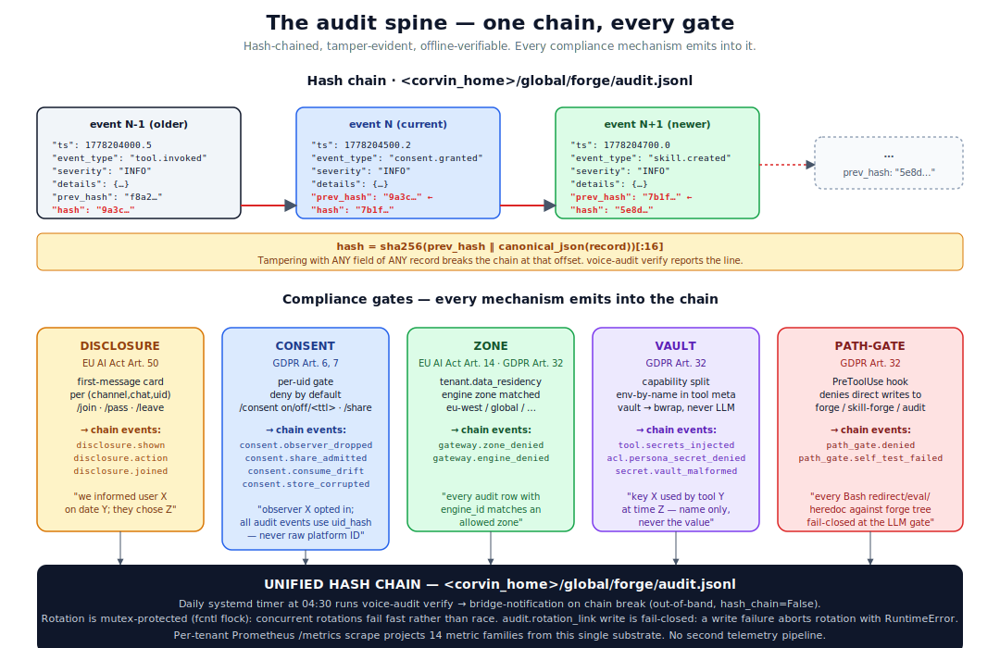

# Audit and compliance

> One hash-chained log carries every state change in the system —
> and every regulatory mechanism (EU AI Act, GDPR) is a structural
> emitter into that chain, not an after-the-fact overlay.



## The mental model

Most agent systems treat compliance as a *layer on top*: the agent
does its thing, and afterwards a "compliance system" inspects logs,
runs checks, generates reports. The two are separate, the compliance
view is always slightly stale, and a regulator visit means
reconstructing what happened from disparate logs.

Corvin inverts this. The hash-chained audit log is the
**substrate** — every regulatory mechanism (disclosure, consent,
zone, vault, path-gate) **emits into it as part of doing its job**.
There is no parallel compliance pipeline because there's nothing to
parallelize: the chain *is* the compliance record.

This isn't a stylistic choice. It's the structural answer to a
specific class of failure: **silent compliance bypass**. If
disclosure / consent / zone enforcement live in code that *doesn't*
emit audit, an operator can disable them with no trace. If they
emit into a *separate* log, that log can be tampered with
independently. If they emit into the **same** hash-chained log as
every other state change, tampering is detectable end-to-end with a
single `voice-audit verify` call.

## The audit chain — how it works

### Storage

`<corvin_home>/global/forge/audit.jsonl` (single-operator) or
`<corvin_home>/tenants/<tid>/global/forge/audit.jsonl` (per-tenant).
Append-only JSONL. Every record is a single line.

### Per-record shape

```jsonc
{
  "ts":           1778204500.2,        // unix epoch
  "event_type":   "consent.granted",   // from EVENT_SEVERITY catalog
  "severity":     "INFO",              // INFO | WARNING | ERROR | CRITICAL
  "run_id":       "",                  // empty when not tied to a run
  "tool":         "consent",           // emitter
  "details":      {…},                 // event-specific fields
  "prev_hash":    "9a3c…",             // hash of previous record
  "hash":         "7b1f…",             // sha256(prev_hash || canonical_json)[:16]
}
```

### The hash discipline

`hash = sha256(prev_hash ‖ canonical_json(record))[:16]`

Where `canonical_json` is `json.dumps(record, sort_keys=True,
separators=(",", ":"))`.

The implication: tampering with **any field** of **any record** —
even just whitespace — breaks the chain at that record's offset.
`verify_chain(path)` walks the file and reports the line. The
operator (or a regulator) can run this offline against an exported
chain, no Corvin instance required.

### Concurrent writes

`write_event` takes:
- in-process `threading.Lock` (cheap, fast)
- filesystem `fcntl.flock(LOCK_EX)` (cross-process — voice-adapter
  and forge-MCP-server are different processes writing to the same
  chain)
- `prev_hash` is re-read **after** taking the flock (so a concurrent
  writer between our read and our write doesn't break the chain)

This is the unglamorous detail that makes the chain actually work
under load.

### The one exception — `hash_chain=False`

Out-of-band events (the daily `audit.chain_gap_detected` notification
when `verify_chain` finds a break) are written with `hash_chain=False`
explicitly. The rationale is recursive: a broken chain would
otherwise prevent the very mechanism we use to record the corruption.

## Event-type catalog

Every event type registers in `forge/security_events.py::EVENT_SEVERITY`.
That dict is the **single source of truth** for what events exist
and at what severity. Today's catalog contains ~50 entries spanning
all subsystems. A non-exhaustive sample:

| Subsystem | Sample events |
|---|---|
| Forge | `tool.created`, `tool.deleted`, `tool.invoked`, `tool.network_share`, `tool.secrets_injected` |
| Skill-Forge | `skill.created`, `skill.namespace_denied`, `skill.outcome_graded` |
| Policy | `policy.import_denied`, `policy.namespace_denied`, `acl.persona_denied`, `acl.persona_secret_denied` |
| Path-gate | `path_gate.denied`, `path_gate.self_test_failed` |
| Session | `session.reset`, `session.timeout` |
| Consent (Layer 16 P4) | `consent.observer_dropped`, `consent.share_admitted`, `consent.consume_drift`, `consent.store_corrupted` (CRITICAL), `consent.gate_unavailable_drop` (WARNING), `consent.granted`, `consent.revoked`, `consent.expired`, `consent.toctou_drop` (WARNING) |
| Disclosure (Layer 19) | `disclosure.shown`, `disclosure.action`, `disclosure.joined` |
| Roles (Layer 18) | `grant.issued`, `grant.revoked`, `grant.expired` |
| Quota (Layer 20) | `quota.recorded`, `quota.over_limit`, `quota.set_limit` |
| Auth elevation | `auth.elevation_grant`, `auth.elevation_required`, `auth.elevation_lockout_started` (WARNING), `auth.elevation_lockout` (WARNING) |
| Voice (L23) | `voice.transcribed`, `voice.transcribe_failed` |
| OS-turn traceability (EU AI Act Art. 12/13) | `os_turn.started`, `os_turn.tool_called`, `os_turn.completed`, `os_turn.error` — one event family per user interaction, emitted by the bridge adapter AND the web console runtime into the same chain. Metadata only: `turn_id`, `chat_key`, `persona`, `tool_name` (name only), `duration_ms`, `tools_called`, `exit_code`, `timed_out` — never prompt text, tool inputs, or outputs (GDPR Art. 5). Rendered live by the console's per-session `/os-turns` route (Audit panel → OS-Turn Audit tab, graph view by default: one engine pill per turn with tool-call chips, list view toggle). |
| Data (L24) | `data.registered`, `data.snapshot_generated`, `data.pii_detected`, `data.snapshot_oversized` |
| Erasure (L36/L28.2) | `erasure.requested`, `erasure.applied`, `erasure.skipped`, `erasure.failed` (CRITICAL), `erasure.completed`, `erasure.user_model_deleted` |
| Compute (L25) | `compute.run_started`, `compute.iteration_completed`, `compute.run_terminal` |
| User-style (L26) | `user_style.candidate_proposed`, `user_style.bullet_promoted`, `user_style.bullet_rolled_back` |
| Personal-tools (L27) | `tool.user_saved`, `tool.user_removed` |
| Gateway | `gateway.token_issued`, `gateway.cross_tenant_denied`, `gateway.engine_denied`, `gateway.zone_denied` |
| Audit | `audit.integrity_violation` (CRITICAL), `audit.chain_gap_detected` |

## The compliance baseline

Corvin is developed against the **EU AI Act 2026** and **GDPR** as
a structural design constraint, not as an after-the-fact compliance
overlay. The CLAUDE.md "Compliance baseline" section is normative —
it lists 12 structural mechanisms, what they enforce, and what
regulation each serves.

Five of those mechanisms feed the audit spine and are summarised
below; for the full table see [docs/security.md](security.md) and
the CLAUDE.md compliance section.

### Gate 1 — Bot-disclosure (Layer 19)

**Regulation:** EU AI Act 2026 Art. 50 (active disclosure when a
person interacts with an AI system).

**What it does:** First-message-per-(channel, chat, uid) shows a
disclosure card stating that an AI bot is present, who runs it,
what it does, what `/join` / `/pass` / `/consent on` / `/leave`
mean. Once shown to a uid, never re-shown.

**What lands in the chain:** `disclosure.shown` (first contact),
`disclosure.action` (transitions: pending → joined / passed / left),
`disclosure.joined` (self-grant via `/join`).

**The structural lock:** the `branding.yaml` `extra_paragraph` field
can ADD operator context. The AI-nature statement, opt-in/opt-out
commands, and audit-shown timestamp are **structurally locked**.
Code paths that suppress disclosure — even temporarily, even for a
"preview mode" — are a hard regression caught by the
`disclosure.shown`-emission test.

### Gate 2 — Per-user consent (Layer 16 Phase 4)

**Regulation:** GDPR Art. 6 (lawful basis), Art. 7 (valid consent).

**What it does:** Read-only-side messages reach the LLM **only** when
the sender's uid has explicit consent. Three modes: durable
(`/consent on`), time-bounded (`/consent 1h`), per-message
(`/share <text>` one-shot).

**What lands in the chain:** `consent.observer_dropped` (denied),
`consent.share_admitted` (one-shot), `consent.consume_drift`
(consent revoked between buffer-write and owner-turn-consume).

**Identity binding:** the slash-command's uid is set by the daemon
from the bridge protocol (Telegram `from.id`, Discord
`message.author.id`, …). The owner cannot grant on someone else's
behalf — owner-side commands are restricted to `list`, `status
<uid>`, `revoke <uid>`. This is the load-bearing invariant: the
gate can only be trusted if identity binding can't be spoofed.

### Gate 3 — Compliance-zone routing

**Regulation:** EU AI Act 2026 Art. 14 (human oversight, accuracy /
robustness incl. data residency), GDPR Art. 32 (security of
processing).

**What it does:** A tenant's `tenant.corvin.yaml::data_residency.zone`
(e.g. `eu-west`) is matched against the engine's `zone` attribute
before dispatch. Mismatch → run fails with `zone-mismatch` and
`gateway.zone_denied` audit. Engines without a zone default to
`global` (back-compat).

**What lands in the chain:** `gateway.zone_denied`, `gateway.engine_denied`.

**The regulatory promise:** every audit event with `engine_id` has a
matching zone tag in the active policy. A regulator review can run
a single SQL-style projection over the chain: *"are there any
`gateway.run_*` events where the engine's zone wasn't allowed for
the tenant?"* — answer must be empty.

### Gate 4 — Secret vault (Layer 16 v3)

**Regulation:** GDPR Art. 32 (security of processing).

**What it does:** Operator-owned vault at
`~/.config/corvin-voice/secrets.json` (mode `0600`). Tools declare
needed env-vars by *name* in `meta.secrets`. At runtime: per-persona
ACL check → vault lookup → env injection inside the bwrap *only*.
The result envelope is recursively scanned for literal values and
leaks are replaced with `<redacted>`.

**What lands in the chain:** `tool.secrets_injected` (names only,
never values), `acl.persona_secret_denied`, `secret.vault_missing`,
`secret.vault_malformed`.

**The privacy invariant:** the LLM context **never** receives the
secret value. The audit chain **never** receives it either.
Mirroring the same metadata-only rule that L23 (voice transcripts),
L24 (data snapshots), and L25 (compute params) honor — see below.

### Gate 5 — Path-gate (Layer 10)

**Regulation:** GDPR Art. 32 (security of processing).

**What it does:** A Claude PreToolUse hook intercepts every `Write` /
`Edit` / `MultiEdit` / `Bash` / `WebFetch` and denies them when the
target path matches forge / skill-forge / audit / policy locations.
Bash detection covers redirects, `tee`, `sed -i`, heredocs, `eval`,
command substitution, unbalanced quotes, named pipes (`mkfifo`),
exec file-descriptor redirects (`exec N>`), process-substitution write
side (`>(...)`), and command substitution in pipe position (`$(...) | tee`)
— fail-closed when unparseable AND a hint string is present.

**What lands in the chain:** `path_gate.denied` per intercept,
`path_gate.self_test_failed` if the boot self-test fails.

**Why it matters:** without path-gate, an LLM in `bypassPermissions`
mode could `Write` directly to `<scope>/forge/registry.json` and
plant a malicious tool, bypassing the linter, sandbox, and audit
emission. The hook structurally forces the LLM through the MCP
server — which routes everything through the safety substrate.

## The metadata-only audit invariant

A pattern that recurs across L23 / L24 / L25 / L26 / L27: **content
never enters the audit chain. Only metadata and shape**.

| Layer | Content NOT in chain | Metadata IN chain |
|---|---|---|
| Voice (L23) | transcript text | provider, lang, audio_s, char_count |
| Data (L24) | row values | format, size_b, distinct counts per PII class |
| Compute (L25) | sensitive parameter values | iter, loss, fingerprint (sha256:12) |
| User-style (L26) | bullet body text | bullet_id, cluster_id, signal counts |
| Personal-tools (L27) | tool source code | tool name, scope, sha256 |

Each layer ships a regression test that walks every emitted event
and fails the suite if a raw value leaks. The test is the
structural defense against an "innocent" debug-log addition that
would silently widen the privacy surface.

### Structural floor at the chain writer

Per-layer discipline is now backstopped by a **structural floor** enforced
inside the single chain writer (`forge.security_events.write_event`; the
bridge `audit.py::audit_event` delegates to it). Before any event is
written, `filter_audit_details()`:

* drops fields whose key names content/PII/secrets (exact match for content
  keys like `prompt`/`output`/`text`/`transcript`; substring match for
  unambiguous secrets like `*password`/`*secret`/`*_token`), and oversize
  values (> 2048 chars — content is long, metadata is short);
* records the dropped key **names** inline under `_dropped_fields` (never the
  values);
* for event types with a registered **positive allowlist** (M2),
  additionally drops any key not on that list.

It never raises (audit stays best-effort) and offers a per-call
`unfiltered=True` opt-out (itself flagged inline with `_unfiltered`) for the
rare legitimately-long allowlisted field. This means no emitter — guarded by
its own pre-write allowlist or not — can leak content/PII/secrets into the
permanent chain. The per-layer allowlists (console, compute) remain as
defence-in-depth.

**Count-map fields (ADR-0152).** A few forensic-spine events carry a
`{label: count}` map whose KEYS are a controlled vocabulary of *category
labels* (not PII values) — e.g. `data.pii_detected.classes`
(`{"email": 4, "phone": 2}`), which powers the `corvin_data_pii_detected_total`
metric and the GDPR Art. 30 ROPA report. A label like `email` collides with the
content/PII key denylist, so the recursive scrub would silently drop it and the
metric/report would under-count email-class detections. Such a field is
preserved **verbatim** only when (a) its `(event_type, field)` is registered in
`_EVENT_COUNTMAP_FIELDS` **and** (b) it passes `_is_safe_count_map()` — a strict
shape check: every key is a short lowercase identifier (optionally angle-bracket
sentinel like `<no_pii>`), every value a non-negative `int`. Anything else
(an `@`-bearing key, a string/credential value, a negative or bool count, an
over-large map) falls through to the normal recursive scrub, so no PII value,
token, or free-text can ride the exemption. The same fix gives
`gateway.webhook_secret_missing` a positive allowlist so its `secret_ref`
(a vault key **name**, never the value) survives the `*secret*` substring
denylist — the established `vault.*` / `tool.secrets_injected` pattern.

## Verification — operational paths

### Daily integrity check

A systemd-user timer at 04:30 runs `voice-audit verify`. On chain
break:
1. exit-code 1 propagates
2. `audit.chain_gap_detected` (CRITICAL) is written **out-of-band**
   (`hash_chain=False`) so the corruption itself is recorded
3. the bridge-notification relay forwards a 5-line summary to the
   operator's primary channel (Discord / WhatsApp / Email — per
   `relay.json`)

### On-demand verification

```bash
voice-audit verify                    # default chain
voice-audit verify --tenant acme      # specific tenant
```

Returns `(ok, problems)` where `problems` is a list of `{line, issue,
expected_*, actual_*}` records.

### Per-tenant Prometheus metrics

Phase 6 exposes `/v1/tenants/{tid}/metrics` (bearer-token gated).
14 metric families projected from the audit chain — same substrate,
no second telemetry pipeline. Curated label allow-list prevents
unbounded cardinality (run-IDs, emails, snippets stay out of labels).

The chain-intact gauge `corvin_audit_chain_intact` gives every
Prometheus scrape visibility into chain health (so the operator
doesn't depend solely on the once-daily systemd verify timer).

## Chain-failure transparency (user-facing reason)

When the CLAG spawn-gate (ADR-0133) blocks an action because the audit chain
failed its integrity check, the block message shown to the user (e.g. on
Discord) names the **specific reason** so they understand *which* check broke
and *why* — not just "blocked". It includes the structural reason code, the
failed check layer, and a plain-language explanation, e.g.:

```
🔒 [security] Action blocked — the audit chain failed its integrity check …
Reason: hash_link_broken (check layer: L22.engine_spawn.<id>)
What this means: A hash link between two consecutive audit entries does not
verify — an entry was altered, inserted, or removed.
```

The reason code and layer are **structural metadata** (never task content), so
surfacing them respects the metadata-only audit floor. The plain-language map is
the single source of truth `forge.clag.explain_reason_code()` / the
`CHAIN_FAILURE_EXPLANATIONS` dict — covering both the CLAG gate reason codes
(`hash_link_broken`, `shadow_mismatch`, `cit_tampered`, …) and the
`verify_chain` issue codes (`broken_chain`, `tampered`, `mac_tampered`,
`mac_missing`, `mac_stripped_chain`, …). The same explainer enriches the
proactive `voice-audit verify` chain-break notification and the verify CLI
output, so the operator/user always gets the *why*.

## What you, as operator, must NOT do

Reproduced from CLAUDE.md "Compliance baseline" — these are the
hard rules:

- **Don't weaken disclosure.** The disclosure card's AI-nature
  statement, opt-in/opt-out commands, and audit-shown timestamp are
  structurally locked. Suppressing them — even temporarily — is a
  hard regression.
- **Don't bypass consent.** Read-only observer text reaches the LLM
  only through the consent gate. No "auto-admit", no "trusted
  observer" allowlist, no "owner-grants-on-behalf" override.
- **Don't lower audit-chain integrity.** No event may skip the
  hash-chain link. The `audit.chain_gap_detected` exception uses
  `hash_chain=False` with documented justification.
- **Don't leak PII into Prometheus labels, audit-event details, or
  log lines.** The curated allow-list is structural; new labels
  need an ADR amendment.
- **Don't widen engine reach past the tenant's `allowed_engines` /
  zone.** The fail-closed gate exists so a regulator review can
  prove "every audit event with `engine_id` matches an allowed zone".
- **Don't add a "compliance-off mode".** No env var, no CLI flag,
  no `chat_profile` field. Customers who need exceptions land them
  as new structured fields with their own ADR and audit-event
  type — not as an undocumented bypass.
- **Don't accept "we'll add the audit-event later" in a PR.** The
  audit event is part of the feature, not a follow-up.
- **Don't silence `voice-audit verify` exit-1.** The systemd timer
  reads the exit code; a chain break must propagate to the bridge
  notification relay.
- **Don't add raw UIDs to consent.* audit events.** All consent events use uid_hash (SHA-256[:8]) — never the raw platform identifier. The regression test in `test_audit_unified.py` fails the suite if any `consent.*` event carries a raw `uid` field.

## Where to look in the code

| Mechanism | Module |
|---|---|
| Hash chain core | `operator/forge/forge/security_events.py` (`write_event`, `verify_chain`, `EVENT_SEVERITY`) |
| Disclosure (L19) | `operator/bridges/shared/disclosure.py` |
| Consent (L16 P4) | `operator/bridges/shared/consent.py` |
| Zone routing | `core/gateway/corvin_gateway/dispatcher.py` (Phase 3.3 gate) |
| Secret vault | `operator/forge/forge/secret_vault.py` + `runner.py` (env injection + redact) |
| Path-gate hook | `operator/voice/hooks/path_gate.py` |
| Daily verify | `operator/voice/scripts/voice_audit.py` + systemd unit `corvin-audit-verify.timer` |
| Prometheus projection | `core/gateway/corvin_gateway/audit_metrics.py` |
| Bridge-notification | `operator/voice/scripts/voice_audit.py --notify-bridge` + `relay.json` |

## Adjacent docs

- [Architecture](architecture.md) — the audit chain as the
  backbone of the five-axis design
- [Runtime generation](runtime-generation.md) — the safety substrate
  that emits into the chain
- [Memory model](memory-model.md) — auto-memory + user-style +
  personal-tools all emit into the same chain
- [Data and compute](data-and-compute.md) — the metadata-only
  invariant in practice
- [docs/security.md](security.md) — the six enforcement surfaces
  in detail
- [docs/for-companies.md](for-companies.md) — the integrator-facing
  brief
