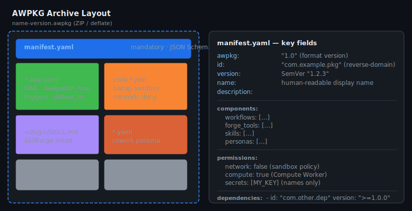
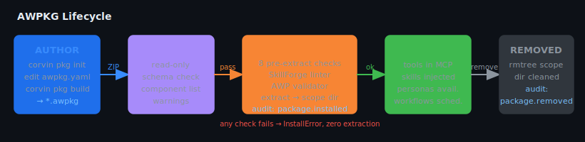
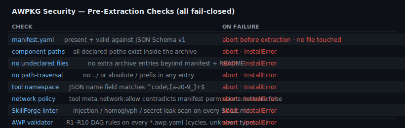

# AWPKG — Portable Workflow Package Format

> **Plugin:** `core/awpkg/` ·
> **Status:** Phase 1 implemented (local install/remove/build, no registry)

AWPKG is the distribution format for Corvin workflow bundles. A `.awpkg` file
is a ZIP archive that bundles AWP workflow DAGs, Forge tools, SkillForge skills and
Cowork personas into one installable, removable, shareable unit — like an app package
for the Corvin runtime.

---

## Archive layout



```
name-version.awpkg          ← ZIP (deflate)
├── manifest.yaml           mandatory — JSON Schema v1
├── workflows/              AWP workflow YAML files (DAG / delegation / mixed)
│   └── *.awp.yaml
├── tools/                  Forge tool schema definitions
│   └── code_*.json         name field must match  code.<slug>
├── skills/                 SkillForge skill bodies
│   └── <slug>/SKILL.md     SkillForge-linted before extraction
├── personas/               Cowork persona definitions
│   └── *.yaml
├── data/                   Optional non-PII defaults / seed config
│   └── defaults.yaml
└── README.md               Shown by  corvin pkg inspect
```

No executable scripts, compiled binaries, or hook directories are permitted.
The package *declares* — the Corvin runtime *installs*.

---

## Workflow topologies supported

A single package can contain multiple workflows mixing any of the AWP node types:

| Topology | Node type | Example |
|---|---|---|
| Linear DAG | `agent` | `daily_news_briefing` — fetch → summarize → format |
| Parallel fan-out/fan-in | `agent` (parallel level-0) | `market_research_suite` — news + reddit + filings in parallel → merge |
| Delegation graph | `delegation_loop` | `code_review_bot` — orchestrator spawns security/perf/style workers |
| Mixed DAG + delegation | `agent` + `delegation_loop` | `trading_strategy_pack` — parallel fetchers → signal delegation loop → risk filter |
| Chatflow / human-in-the-loop | `route` + `code` + `ask_human` + `answer` | `it_support_ticket_agent` — triage → KB lookup → confirm before acting → ticket |

---

## AWP node types (ADR-0188)

The `dag` engine (`core/workflows/corvin_workflows/node_types.py`) dispatches on each
node's `type:` field. Nine types are registered:

| Node type | Role | LLM call? |
|---|---|---|
| `agent` | Single `engine.spawn()` call (default when `type:` is omitted) | Yes |
| `fan_out` | Same agent replayed once per item of a state list — sequential, not parallel | Yes (× N) |
| `delegation_loop` | Manager/worker adaptive loop, bounded by `config.budget` | Yes |
| `deliver` | Fire-and-forget push of upstream output to a bridge outbox — never waits for a reply | No |
| `code` | Deterministic, sandboxed Python (`def main(...) -> dict`) — same bwrap isolation Forge tools use, no MCP registration | **Never** |
| `merge` | Deterministic fan-in: `concat_list` / `first_non_empty` / `dict_union` — no LLM re-summarizes branch outputs | No |
| `route` | Engine-native branching — `mode: condition` (structured `{selector, op, value}`, no `eval()`) or `mode: classify` (LLM-routed into N labeled branches) | `classify` mode only |
| `answer` | Chatflow terminal — sends a turn's output, never pauses | No |
| `ask_human` | Pauses the run for a human reply (see below), resumes with the answer injected into state | No |

Every node also accepts an optional `retry: {max_retries, retry_interval_s, error_strategy}`
block. `error_strategy: fail_branch` contains a failure to that node's downstream subgraph
(marked `skipped`, not executed) instead of aborting the whole run; the default `abort`
preserves the original all-or-nothing behavior.

### Chatflow (`orchestration.engine: chat`) and human-in-the-loop

Setting `orchestration.engine: chat` (instead of `dag`) marks a workflow as turn-based. It
runs on the exact same `DAGRunner` — no separate engine — but the validator (rule R11)
requires at least one `answer` or `ask_human` node, since a chat-engine workflow with
neither could never actually pause.

An `ask_human` node sends its `prompt` (or `prompt_from: <selector>`) to the same bridge
outbox `deliver` uses, then the run stops with `RunResult.state == "paused"` and a
`run_id`. The paused state is checkpointed to
`<corvin_home>/tenants/<tid>/workflow_runs/<run_id>.json` (mirrors the audit chain's
append-only, run-id-keyed pattern — no new storage subsystem). Continue it with:

```bash
python -m corvin_workflows resume <run_id> "<the human's reply>" --engine claude
```

or programmatically via `corvin_workflows.resume_workflow(run_id, reply, engine=...)`.
`expect: {field, type}` on the node coerces the free-text reply (`type: boolean` does
fail-closed whole-word matching against affirmative/negative word lists — an unrecognised
reply is never treated as consent). A `route(mode: condition)` decision made *before* the
pause is honored again after resume — the skip state survives the checkpoint round-trip.

**Console UI:** `WorkflowChatPanel` (`core/console/corvin_console/web-next/src/pages/
workflows.tsx`) renders a real chat window — conversation bubbles + a free-text reply
box — for `ask_human` pauses, distinct from the older binary `HitlApprovalBar` (approve/
reject, for the separate "approval" node type used by the console's own hand-rolled
executor). `POST /workflows/{wid}/runs/{rid}/resume` bridges to
`corvin_workflows.resume_workflow()`. **Known gap:** the console's `start_run` endpoint
still uses its own separate node executor (not `corvin_workflows.DAGRunner`), so today a
run only has a resumable checkpoint once that executor is extended to delegate
`engine: chat` workflows to `DAGRunner` — tracked as ADR-0188 follow-up work, not
silently glossed over.

**Real LLM engine:** `corvin_workflows.engines_claude.ClaudeCliEngine` shells out to
headless `claude -p` (tool use disabled, JSON-only responses). Selected via
`corvin_workflows run <name> --engine claude` (default remains `--engine stub`, the
deterministic canned-response engine used by tests and CI).

Two bundled examples exercise every node type end-to-end, verified against both the stub
and the real `claude` engine:
`core/workflows/corvin_workflows/examples/it_support_ticket_agent.awp.yaml` (chatflow) and
`core/workflows/corvin_workflows/examples/expense_approval_pipeline.awp.yaml` (plain `dag`,
proves `code`/`merge`/`retry` work standalone, not only inside a chatflow).

→ Full design rationale: ADR-0188 (`Corvin-ADR/decisions/0188-awp-deterministic-nodes-branching-human-in-the-loop.md`).

---

## Lifecycle



1. **Author** — `corvin pkg init` scaffolds `awpkg.yaml`; `corvin pkg build` produces the ZIP.
2. **Inspect** — `corvin pkg inspect <file>` is read-only: validates the manifest, lists components, reports warnings. Zero extraction.
3. **Install** — eight pre-extraction checks must all pass before a single byte is extracted. On success the package lands in the scope directory and a `package.installed` audit event is written.
4. **Active** — Forge tools appear in the MCP namespace, skills are injected into future bridge turns, personas are available to the cowork resolver, workflows register with the scheduler and slash-command dispatcher.
5. **Remove** — `corvin pkg remove <id>` deletes the scope directory and writes a `package.removed` audit event.

---

## Security model



All eight checks run **before** any file is extracted. A single failure aborts with
`InstallError` and leaves the filesystem untouched.

The path-gate hook (`operator/voice/hooks/path_gate.py`) extends its protected subtree to
include `<corvin_home>/**/packages/**` — no agent subprocess can write into an installed
package directory directly. Only the installer CLI (or its future MCP surface) may write there.

---

## Scopes

| Scope | Install location | Visibility |
|---|---|---|
| `user` (default) | `~/.corvin/packages/<id>/` | All projects and tenants of this user |
| `project` | `.corvin/packages/<id>/` | This repository only |
| `session` | `<corvin_home>/sessions/…/packages/<id>/` | This chat session only (testing) |

Session-scope packages are never promoted automatically.

---

## CLI reference

```bash
# Install from a local .awpkg file (default scope: user)
corvin pkg install my-workflow-1.2.0.awpkg
corvin pkg install my-workflow-1.2.0.awpkg --scope project

# Install from registry (Phase 2)
corvin pkg install com.example.my-workflow

# List installed packages
corvin pkg list
corvin pkg list --scope project

# Inspect without installing (read-only)
corvin pkg inspect my-workflow-1.2.0.awpkg

# Remove
corvin pkg remove com.example.my-workflow
corvin pkg remove com.example.my-workflow --scope project

# Build a package from awpkg.yaml in the current directory
corvin pkg init                 # scaffold awpkg.yaml + sample workflow
corvin pkg build                # produces <id>-<version>.awpkg
corvin pkg build --out ./dist/

# Re-export an installed package back to a file
corvin pkg export com.example.my-workflow ./dist/
```

---

## `manifest.yaml` reference

```yaml
awpkg: "1.0"                          # format version (required)

id: "com.example.my-workflow"         # reverse-domain, globally unique (required)
name: "My Workflow"                   # display name (required)
version: "1.2.3"                      # SemVer (required)
description: "One-paragraph summary." # (required)
author: "Alice <alice@example.com>"   # optional
license: "Apache-2.0"                 # optional
homepage: "https://github.com/…"      # optional

min_corvin_version: "0.9.0"          # optional
max_corvin_version: null             # optional, null = unbounded

components:                           # at least one non-empty list required
  workflows:    [workflows/my.awp.yaml]
  forge_tools:  [tools/code_my_tool.json]
  skills:       [skills/my_skill/SKILL.md]
  personas:     [personas/my_persona.yaml]
  data:         [data/defaults.yaml]

permissions:
  network: false      # sandbox policy forwarded to Forge tool runner
  compute: true       # may schedule Compute Worker runs
  secrets:            # required secret NAMES (values live in vault)
    - MY_API_KEY

dependencies:
  - id: "com.corvin.base-tools"
    version: ">=1.0.0"
```

---

## `awpkg.yaml` build config

```yaml
# Lives in the source directory; not shipped inside the .awpkg
awpkg: "1.0"
id: "com.example.my-workflow"
name: "My Workflow"
version: "1.2.3"
description: "..."

include:
  workflows:
    - src/my.awp.yaml
  forge_tools:
    - forge/code_my_tool.json
  skills:
    - skills/my_skill/SKILL.md

permissions:
  network: false
  compute: false
  secrets: []

dependencies: []
```

---

## Audit chain events

Every install and remove writes into the unified hash-chained audit log
(`<corvin_home>/global/forge/audit.jsonl`):

```jsonc
// install
{ "event_type": "package.installed", "severity": "INFO",
  "details": { "id": "com.example.my-workflow", "version": "1.2.3",
               "scope": "user", "tenant_id": "_default" },
  "prev_hash": "…", "hash": "…" }

// remove
{ "event_type": "package.removed", "severity": "INFO",
  "details": { "id": "com.example.my-workflow", "scope": "user" },
  "prev_hash": "…", "hash": "…" }
```

---

## Relation to other subsystems

| Subsystem | Relation |
|---|---|
| **Workflow plugins** | AWPKG *is* the `.corvin-pkg` placeholder. Single-file workflow YAMLs can be shipped standalone OR inside an `.awpkg`. |
| **Plugin system** | `CorvinPlugin` protocol is the lifecycle contract. AWPKG is the *transport* for plugins that are not Python packages. |
| **Forge (L6)** | Tool JSON files ship inside `tools/`; Forge schema validator runs during install. |
| **SkillForge (L7)** | `SKILL.md` files ship inside `skills/`; SkillForge linter runs during install. Slot-mirror scope-gate applies. |
| **Cowork (L4)** | Persona YAMLs ship inside `personas/`; available to persona resolver after install. |
| **Path-gate (L10)** | `packages/**` added to protected subtree — no direct agent writes. |
| **Audit chain (L16)** | `package.installed` / `package.removed` added to the hash chain. |

---

## Tests

```bash
cd core/awpkg
python3 -m pytest tests/test_e2e.py -v
```

**52 tests** across six classes:

| Class | What it covers |
|---|---|
| `TestManifestParsing` | Schema validation, bad IDs, bad semver, empty components |
| `TestInspector` | Read-only introspection, undeclared-file warnings |
| `TestSecurity` | Path-traversal, absolute paths, undeclared files, bad tool names, missing manifest, not-a-zip, network mismatch, schema violation, declared-missing |
| `TestLifecycle` | Install/remove roundtrip, meta-file, component extraction, list, project-scope |
| `TestDAGSimple / TestDAGComplex / TestDelegation / TestMixed` | Fixture E2E: build → inspect → install → verify structure → remove |
| `TestAuditChain` | install/remove events, SHA-256 hash-chain integrity across multiple installs |
| `TestPathGateIntegration` | `is_protected_path` returns True for `packages/**` |

### Fixture workflows

| Fixture | Topology | Components |
|---|---|---|
| `dag_simple` | Linear DAG (3 nodes) | 1 workflow · 1 skill |
| `dag_complex` | Parallel fan-out/fan-in (5 nodes) | 1 workflow · 2 Forge tools · 1 skill · 1 persona |
| `delegation` | Delegation loop + synthesiser | 1 workflow · 1 Forge tool · 1 skill |
| `mixed` | DAG + delegation loop + linear DAG | 2 workflows · 3 Forge tools · 2 skills · 1 persona |
