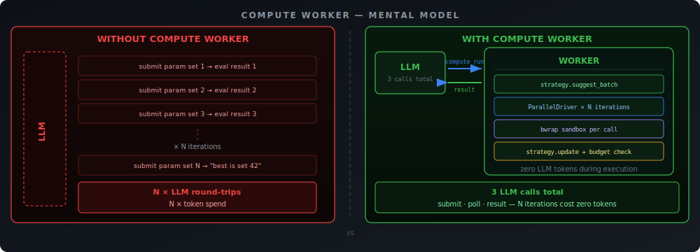
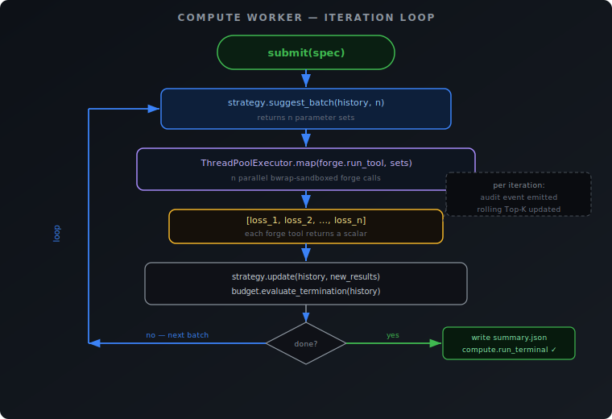
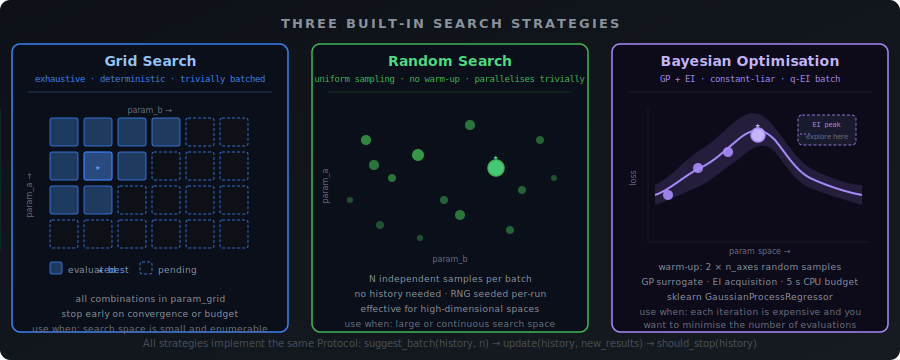
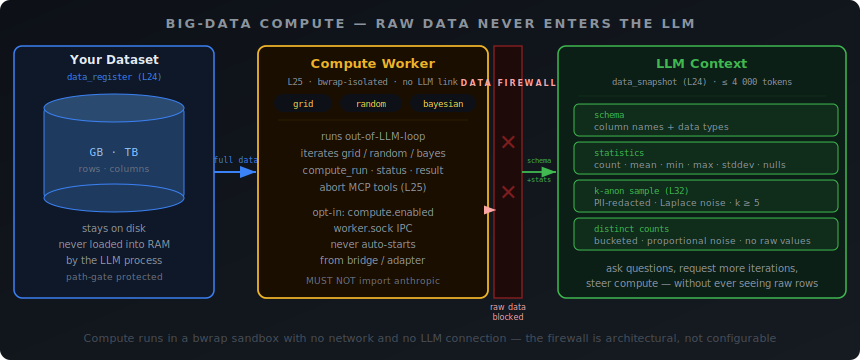
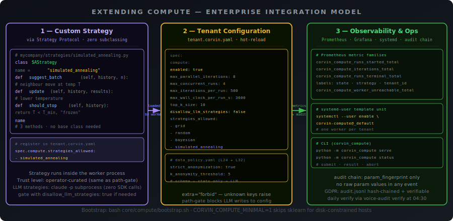
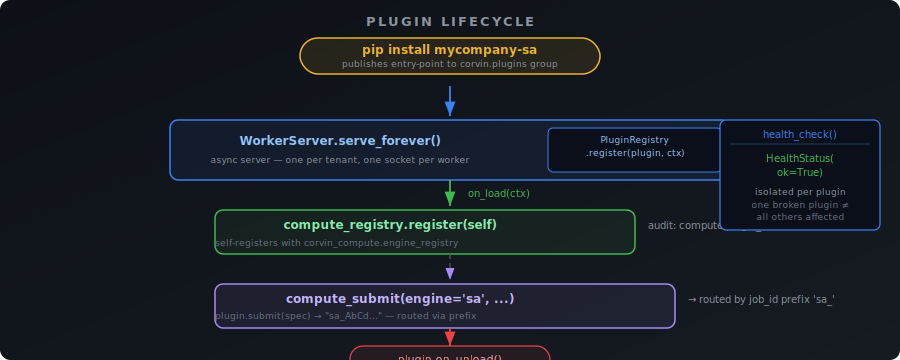

# Corvin Agentic Compute (L25)

> **Agentic Compute** is the design principle that an AI agent should own the *framing* of a computation — what to optimise, what the parameter space looks like, what the stopping criterion is — while a sandboxed worker owns the *execution loop*. The LLM submits one job and retrieves one result; no token is spent on loop bookkeeping.
>
> **From first principles to production extension.**
> This document covers the mental model, the concrete architecture, every MCP tool, the three built-in strategies, crash recovery, compliance guarantees, and a step-by-step guide for companies that want to add their own optimisation strategies or integrate with enterprise infrastructure.

---

## The problem Agentic Compute solves

A naïve LLM agent loop has two failure modes that are invisible at small scale and painful at real scale:

**Failure mode 1 — Iteration burns LLM tokens.**
A "sweep over 100 parameter combinations" turns into 100 LLM round-trips. Each round-trip is the model saying "now try parameters {…}" and the engine running a tool. The model is doing *iteration accounting* — work an ordinary `for`-loop should do for free and without cost.

**Failure mode 2 — Large data leaks into context.**
A 1 GB CSV is referenced once. The LLM reads it to "understand the shape" — the file blows the context window, PII goes through the chain, token cost explodes, the agent never finishes.

Layer 25 (Compute Worker) solves failure mode 1. Layer 24 (Large-Data Snapshot) solves failure mode 2. Both are additive — no existing forge tools change, no existing LLM behaviour changes.

---

## Mental model — Agentic Compute in two sentences

<p align="center">
  
</p>

**The Worker owns the loop. The LLM owns the framing.** Neither crosses into the other's domain. This is the Agentic Compute contract: the agent delegates iteration to infrastructure and stays focused on reasoning — what to optimise, what the parameter space looks like, what the stopping criterion should be.

---

## Architecture


### Components

| Component | Role |
|---|---|
| **MCP bridge** (`mcp_bridge.py`) | Tool definitions exposed by the Forge MCP server |
| **Unix socket daemon** (`worker.py`) | asyncio server — one per tenant, one socket per worker |
| **Transport** (`transport.py`) | Length-prefixed JSON framing; sync client + async server halves |
| **ParallelDriver** (`parallel.py`) | ThreadPoolExecutor — batches suggest→evaluate→update |
| **Strategy** (`strategies/`) | Pluggable protocol: `suggest_batch · update · should_stop` |
| **Budget** (`budget.py`) | Convergence / stall / wall-clock termination |
| **RunStore** (`state.py`) | On-disk state under `compute/runs/<id>/` — crash-safe |
| **AuditEmitter** (`audit.py`) | Metadata-only events into the unified hash chain |

---

## MCP API surface

Tools appear on the Forge MCP server **only when the worker socket is reachable**. Discovery is cached for 5 seconds. When the worker is stopped the tools silently disappear — the LLM sees a clean `tools/list` without them.

### `compute_run`

Submit a parameter sweep. Returns **immediately** with a `run_id`; the worker picks up the job asynchronously.

```json
{
  "tool_name": "my_forge_tool",
  "strategy": "bayesian",
  "param_grid": {
    "learning_rate": [0.001, 0.01, 0.1],
    "n_estimators":  [50, 100, 200, 500]
  },
  "budget": {
    "max_iterations": 100,
    "max_wall_clock_s": 600,
    "stall_window": 10,
    "stall_threshold": 0.001
  },
  "data_handle": "data_AbCd1234efGh5678ijKl",
  "sensitive_fields": ["api_key"]
}
```

- `tool_name` — any forge tool visible in `mcp__forge__<name>`
- `strategy` — `grid` / `random` / `bayesian` / any custom strategy the tenant allows
- `param_grid` — axis name → list of values (grid) or `{"type": "uniform", "low": 0, "high": 1}` ranges (random / bayesian)
- `data_handle` — optional L24 handle; binds the dataset as `ro-mount` into the forge sandbox
- `sensitive_fields` — field names whose values are `<hash:12-char-sha256>` in the artifact directory (never in audit chain)

### `compute_status`

Poll progress. Returns Top-K results (by loss) with fingerprints, iteration count, elapsed wall time, current state.

```json
{
  "run_id": "run_2026...",
  "top_k": true,
  "wait_s": 2
}
```

### `compute_result`

Fetch the terminal outcome. Blocks server-side up to `wait_s` (max 30 s) for the run to finish, then returns best params, best loss, total iterations, convergence reason.

```json
{ "run_id": "run_2026...", "wait_s": 30 }
```

### `compute_abort`

Request graceful termination. The driver finishes the current iteration batch, writes a terminal `summary.json`, emits `compute.run_terminal` with `convergence_reason: "user-abort"`, and exits.

---

## The iteration loop

<p align="center">
  
</p>

The forge tool receives parameters as its normal MCP input plus the dataset ro-bind mount if a `data_handle` was supplied. The tool's job is to return a **scalar loss** (lower is better). Everything else — batching, parallelism, bookkeeping, audit — is the worker's responsibility.

---

## Three built-in strategies



### Grid

Exhaustively evaluates every combination in `param_grid`. Trivially batched — the full cross-product is pre-generated at submit time, and `suggest_batch(history, n)` just pops the next `n` entries from the queue. Deterministic and reproducible.

**Use when:** the parameter space is small and completely enumerable; you need guaranteed coverage.

### Random

Samples `n` independent parameter sets per batch. Each sample is drawn uniformly from the per-axis ranges. No history needed; the RNG is seeded once per run (stored in `manifest.json` for reproducibility).

**Use when:** the search space is large, continuous, or high-dimensional; coverage beats exhaustiveness.

### Bayesian (GP + EI)

Maintains a Gaussian Process surrogate over the observed history. Each `suggest_batch` call fits the GP, computes the Expected Improvement acquisition function, and returns the `n` parameter sets with the highest EI (constant-liar q-EI for the batch case).

- **Warm-up:** `2 × n_axes` random samples before the GP is trained
- **CPU budget:** 5 seconds per `suggest_batch`; exceed → `StrategyTimeout` → run terminates gracefully
- **Backend:** `sklearn.gaussian_process.GaussianProcessRegressor`; `CORVIN_COMPUTE_MINIMAL=1` disables this strategy to skip the sklearn dependency

**Use when:** each evaluation is expensive (minutes of compute); you want to minimise the number of forge calls needed to find a good region.

---

## Crash recovery

If the worker process dies mid-run, it recovers automatically on next start:

1. On boot, `recovery.py` scans `compute/runs/` for runs in state `running`
2. For each: re-instantiate the strategy, call `strategy.update([], history_from_disk)`
3. Resume from `iter = max_completed_iter + 1`
4. Emit `compute.run_recovering` into the audit chain

Non-recoverable cases (strategy package uninstalled, corrupt iteration files) land in `state=failed` with `convergence_reason=recovery-failed:<reason>`.

**The recovery scan runs on a worker thread** (`asyncio.to_thread`) — it never blocks the socket accept loop.

### Orphan reaper (operator maintenance)

Crash recovery only fires when a worker daemon *starts*. A run left non-terminal
by a worker that is gone — and which no `serve` daemon will resume — would
otherwise sit at `running`/`queued` forever, still counting against the compute
quota. The bridge must **not** auto-start the worker (L25 invariant), so the
cleanup is an explicit operator CLI rather than a bridge-side boot hook:

```bash
python -m corvin_compute reap --tenant <tid> [--older-than-hours 24] [--dry-run]
```

`reap_orphaned()` (`recovery.py`) selects non-terminal runs whose `summary.json`
has been untouched longer than `--older-than-hours` (the staleness threshold is
the structural guard against reaping a run a live worker is still iterating) and
finalizes them `state=failed`, `convergence_reason=reaped:orphaned-no-worker`,
emitting `compute.run_failed` (`error_class=OrphanReaped`). Unlike crash
recovery it does **not** execute the run, so it is safe with no worker / no
Forge runner present. `--dry-run` lists candidates without writing. Only
canonical `compute_<22>` run-ids are considered — non-canonical demo/test dirs
are ignored by `RunStore.list_runs()`.

---

## Audit and compliance



### Audit chain (Tier 1)

Six event types, all metadata-only, each linked into the SHA-256 hash chain:

| Event | Severity | What it carries |
|---|---|---|
| `compute.run_started` | INFO | tool_name, strategy, budget |
| `compute.iteration_completed` | INFO | iter, loss, wall_ms, **param_fingerprint**, cache_hit, strategy |
| `compute.run_terminal` | INFO | state, total_iterations, total_wall_s, best_loss, convergence_reason |
| `compute.run_failed` | WARNING | iter, error_class, error_message (200-char cap) |
| `compute.worker_unreachable` | WARNING | tenant_id, attempted_socket (one-shot per process) |
| `compute.run_recovering` | INFO | resume_from_iter, history_size |

`param_fingerprint = sha256(canonical_json(params))[:16]` — the only per-iteration representation of the parameter set in the chain. Operationally correlatable across runs; zero PII leak. Raw parameter values **never** appear in any audit event — this is structurally enforced by `_ALLOWED_FIELDS` allow-lists and the `test_iteration_event_rejects_params_in_clear` regression gate.

### Artifact directory (Tier 2)

```
<corvin_home>/tenants/<tid>/compute/runs/<run_id>/
├── manifest.json          # tool_name, strategy, budget, sensitive_fields (mode 0600)
├── summary.json           # rolling: best_iter, best_loss, state, top_k
└── iterations/
    ├── 0001.json          # per-iteration: params (or hash for sensitive), loss, wall_ms
    ├── 0002.json
    └── …
```

Mode `0600` throughout. Protected by path-gate (Layer 10): `<corvin_home>/**/compute/**` and the socket file are in the deny-list.

### Per-field sensitive values (Tier 3)

Mark a field `sensitive_fields: ["api_key"]` at submit time. Before the iteration file hits disk, those values are replaced with `<hash:12-char-sha256>` by `redact_sensitive_fields()`. Non-sensitive fields pass through verbatim (useful for operator diagnostics via the artifact directory).

### GDPR and EU AI Act alignment

| Concern | Mechanism |
|---|---|
| No PII in audit chain | `_ALLOWED_FIELDS` allow-list + regression gate |
| Sensitive param values off audit | Tier-3 hash-redaction before any write |
| Operator-only artifact access | `0600` permissions + path-gate deny |
| Tamper-evident audit | SHA-256 hash chain; `voice-audit verify` |
| Daily chain verification | systemd timer at 04:30 |

---

## Tenant configuration

```yaml
# tenant.corvin.yaml
spec:
  compute:
    enabled: true                       # default ON — set to false to opt-out
    max_parallel_iterations: 4          # clamp [1, 16]
    max_concurrent_runs:     2          # clamp [1, 8]
    max_iterations_per_run:  200        # clamp [1, 10000]
    max_wall_clock_per_run_s: 600       # clamp [1, 86400]
    top_k_size:              5          # clamp [1, 10]
    disallow_llm_strategies: false      # block claude -p strategy backends
    strategies_allowed:
      - grid
      - random
      - bayesian
```

`extra="forbid"` (Pydantic) — unknown keys raise at load time. The schema is defined in `core/gateway/corvin_gateway/tenant_config.py::ComputeConfig`.

**A fresh Corvin install ships with `enabled: true` — the compute worker is active by default.** To opt out for a specific tenant, set `spec.compute.enabled: false` in `tenant.corvin.yaml`.

---

## How companies can extend Compute



### Custom optimisation strategies

Any class that satisfies the `Strategy` protocol can be plugged in:

```python
# mycompany/strategies/simulated_annealing.py
class SAStrategy:
    name = "simulated_annealing"

    def suggest_batch(self, history: list[IterRecord], n: int) -> list[ParamSet]:
        # Generate n neighbour moves from the current best at temperature T
        ...

    def update(self, history: list[IterRecord], new_results: list[IterRecord]) -> None:
        # Lower temperature
        ...

    def should_stop(self, history: list[IterRecord]) -> tuple[bool, str]:
        return self.T < self.T_min, "frozen"
```

**Trust level:** Strategy bodies run inside the worker process, not inside bwrap. They are treated as operator-curated code — equivalent in trust to the audit chain or path-gate hook. Ship them as part of your deployment, not as user-submitted scripts.

**Registration:**
1. Install the module alongside `corvin_compute` in the worker's venv.
2. Add the strategy name to `spec.compute.strategies_allowed` in `tenant.corvin.yaml`.
3. Restart the worker (`systemctl --user restart corvin-compute@<tenant>`).

**LLM-assisted strategies:** if your strategy needs LLM help (e.g. a meta-learning controller), authenticate via `subprocess(["claude", "-p", "--max-turns", "1", "--no-tools", ...])`. This uses the subscription-native CLI, costs zero SDK tokens, and is gated by `disallow_llm_strategies: true` at the tenant level.

### Company-specific forge tools as compute objectives

The compute worker calls forge tools verbatim — any `mcp__forge__<name>` tool can be the objective function. To use a company-specific tool:

1. Forge the tool in the normal way (`forge_tool` MCP call).
2. Pass its name as `tool_name` to `compute_run`.
3. Make sure the tool returns a scalar loss in its stdout JSON.
4. Annotate sensitive input fields with `x-sensitive: true` in the tool schema — the worker will hash them before writing iteration files.

**Using large datasets:** register the dataset first with `data_register`, then pass the returned `data_handle` to `compute_run`. The worker binds the dataset read-only into each bwrap call. The LLM never sees raw rows.

### Multi-tenant deployment

Each tenant gets its own worker process and socket:

```bash
# Enable and start the worker for a specific tenant
systemctl --user enable corvin-compute@mycompany
systemctl --user start  corvin-compute@mycompany

# The socket lives at:
# ~/.corvin/tenants/mycompany/compute/worker.sock
```

Per-tenant config in `~/.corvin/tenants/mycompany/tenant.corvin.yaml` controls allowed strategies, concurrency limits, wall-clock budget, and whether LLM strategies are permitted.

### Parametric cache integration

Tools that are deterministic for a given parameter set can declare `x-cache-key: true` on the parameter fields that uniquely identify a result. The worker's forge cache (`cache.py`) then deduplicates across iterations:

```python
# In your forge tool schema:
"parameters": {
    "n_estimators": {"type": "integer", "x-cache-key": true},
    "max_depth":    {"type": "integer", "x-cache-key": true},
    "_artifacts_dir": {"type": "string"}   # not a cache key
}
```

Iteration files record `cache_hit: true` for cache hits. `compute.iteration_completed` carries `cache_hit` in the audit chain.

### Custom compute engine plugins

The three built-in engines (FlatEngine, PipelineEngine, HACEngine) all implement the
`ComputeEngine` protocol. Any Python class that satisfies the same protocol
can be registered as an additional engine — without touching the Corvin core.

The **unified plugin system** wraps this into a two-protocol pattern: your
class implements both `CorvinPlugin` (lifecycle: `on_load`, `on_unload`, `health_check`)
and `ComputeEngine` (capability: `submit`, `status`, `result`, `gate_action`, `abort`).
`on_load()` self-registers with `corvin_compute.engine_registry`; everything else is
already wired.

#### Quickstart: three files, one PyPI package

**1. Copy the template** (thread-safe state machine, gate support, and audit hooks
already included):

```bash
cp core/compute/corvin_compute/engines/contrib_template.py \
   mycompany_sa/sa_engine.py
```

Fill in the three `# ── IMPLEMENT ME ──` sections:

```python
class SimulatedAnnealingPlugin:
    # ① Identity
    plugin_id     = "simulated-annealing"
    plugin_type   = "compute_engine"
    version       = "1.0.0"
    display_name  = "Simulated Annealing Engine"
    engine_id     = "sa"
    job_id_prefix = "sa_"
    supports_gates = False

    # ② Engine-specific config (from spec.extra / tenant config)
    class SASpec(TypedDict, total=False):
        temperature:  float   # default: 1.0
        cooling_rate: float   # per-iteration multiplier, default: 0.95

    # ③ The compute loop
    def _run_job(self, job_id: str) -> None:
        T     = float(extra.get("temperature",  1.0))
        alpha = float(extra.get("cooling_rate", 0.95))
        for i in range(max_iter):
            # ... your SA moves here ...
            T *= alpha
```

**2. Declare the entry-point** in your `pyproject.toml`:

```toml
[project.entry-points."corvin.plugins"]
simulated-annealing = "mycompany_sa.sa_engine:SimulatedAnnealingPlugin"
```

**3. Enable in `tenant.corvin.yaml`:**

```yaml
spec:
  compute:
    engines_allowed: [flat, pipeline, hac, sa]
  plugins:
    installed:
      - id: simulated-annealing
        config:
          temperature: 1.0
          cooling_rate: 0.95
```

After `pip install mycompany-sa` and a worker restart the engine is available via
`compute_submit(engine="sa", ...)`.

#### All six plugin extension points

The same `CorvinPlugin` lifecycle contract covers every layer, not just compute:

| `plugin_type` | Layer | Capability protocol | Registers with |
|---|---|---|---|
| `compute_engine` | L25 | `ComputeEngine` | `corvin_compute.engine_registry` |
| `worker_engine` | L22 | `WorkerEngine` | Adapter `engine_factory` |
| `bridge_channel` | Bridge | `BridgeChannel` | `channel_registry` |
| `stt_provider` | L23 | `STTProvider` | `corvin_stt.provider_registry` |
| `data_connector` | L24 | `DataConnector` | `corvin_data.connector_registry` |
| `audit_backend` | L16 | `AuditBackend` | `audit.backend_registry` |

Templates for `worker_engine` and `bridge_channel` live in
`core/plugins/templates/`.

#### Plugin lifecycle

<p align="center">
  
</p>

`PluginRegistry.health_check_all()` polls every loaded plugin independently —
one broken plugin does not affect others.

#### Must-NOTs for plugin authors

- Don't `import anthropic` — applies to all plugin code.
- Don't pick a `job_id_prefix` that collides with `compute_`, `pipeline_`, `hac_`.
- Don't write to `audit.jsonl` directly — use `ctx.audit_emit(event, metadata)`.
- Don't block `on_load()` — start background threads and return immediately.

Full spec: `docs/claude-ref/layer-plugins.md`.

---

### Observability integration

**Prometheus** — metrics are emitted by `corvin_gateway/audit_metrics.py` from audit events:

| Metric | Labels |
|---|---|
| `corvin_compute_runs_started_total` | `strategy`, `tenant_id` |
| `corvin_compute_iterations_total` | `strategy`, `tenant_id` |
| `corvin_compute_runs_terminal_total` | `state`, `strategy`, `tenant_id` |
| `corvin_compute_worker_unreachable_total` | `tenant_id` |

Plug these into your existing Grafana dashboards. The corvin security dashboard (`docs/observability/grafana/corvin-security.json`) ships with starter panels.

**Alerting suggestions:**
- `corvin_compute_worker_unreachable_total > 0` → worker stopped unexpectedly
- `corvin_compute_runs_terminal_total{state="failed"}` rate > threshold → forge tool errors during iteration

---

## Deployment

### First-time bootstrap

```bash
# Install plugin + dependencies (including sklearn for Bayesian)
bash core/compute/bootstrap.sh

# Disk-constrained hosts: skip sklearn (disables bayesian strategy)
CORVIN_COMPUTE_MINIMAL=1 bash core/compute/bootstrap.sh

# Enable the worker for the default tenant
systemctl --user enable --now corvin-compute@_default
```

### Enable per tenant

```yaml
# ~/.corvin/tenants/_default/tenant.corvin.yaml
spec:
  compute:
    enabled: true
    max_parallel_iterations: 4
    strategies_allowed: [grid, random, bayesian]
```

The worker hot-reloads `tenant.corvin.yaml` on each run submission.

### CLI (for debugging and scripts)

```bash
# Start the worker manually (foreground)
python -m corvin_compute serve --tenant _default

# Submit a job
python -m corvin_compute submit \
  --tool my_forge_tool \
  --strategy bayesian \
  --params '{"lr": [0.001, 0.01], "epochs": [10, 50, 100]}' \
  --max-iterations 50

# Check status
python -m corvin_compute status <run_id>

# Fetch result
python -m corvin_compute result <run_id>
```

---

## Absolute constraints (must-NOTs)

These are load-bearing — violating them breaks either GDPR compliance or the security model:

- **Never put parameter values in audit events.** The `_ALLOWED_FIELDS` allow-list enforces this; the regression gate `test_iteration_event_rejects_params_in_clear` fails the suite if violated.
- **Never auto-start the worker from bridge or adapter code.** Operator action is the gate. The bridge may emit a one-shot `compute.worker_unreachable` warning; it must never spawn the daemon.
- **Never import `anthropic`, `openai`, or any LLM SDK in `corvin_compute/`.** CI AST lint walks every file and fails on a forbidden import.
- **Never share strategy state across runs.** Each `compute_run` is self-contained; the GP, grid index, and RNG seed all live for exactly one run.
- **Never bypass the forge `run_tool()` path.** There is no second-class path that skips bwrap or the policy clamp.

---

## Reference

| Resource | Where |
|---|---|
| Engine contrib template | `core/compute/corvin_compute/engines/contrib_template.py` |
| Plugin infrastructure | `core/plugins/corvin_plugins/` |
| Plugin templates | `core/plugins/templates/` |
| Layer 24 (data snapshot) | `docs/claude-ref/layer-data.md` § L24 |
| Layer 10 (path-gate) | `docs/claude-ref/layer-security.md` |
| Layer 6 (forge) | `docs/runtime-generation.md` |
| Test suite | `core/compute/tests/test_*.py` (98 cases) |
| Plugin system tests | `core/plugins/tests/test_plugin_system.py` (36 cases) |
| Grafana panels | `docs/observability/grafana/corvin-security.json` |
| Tenant config schema | `core/gateway/corvin_gateway/tenant_config.py::ComputeConfig` |
| Strategy base protocol | `corvin_compute/strategies/base.py::Strategy` |
