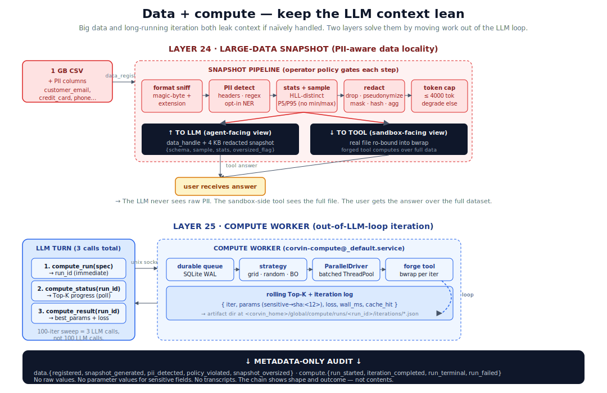
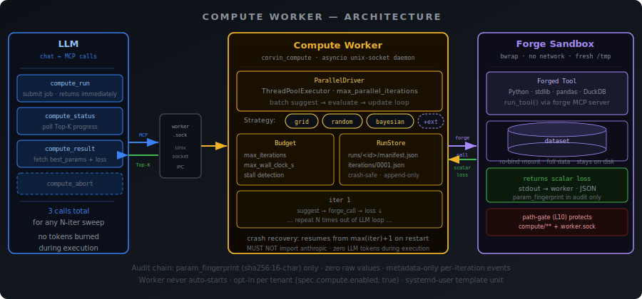

# Data and compute

> Two layers that solve the "big data eats my context window" and
> "100-iteration sweep eats my LLM budget" problems by **moving work
> out of the LLM loop**.



## The mental model

A naïve LLM agent loop has two failure modes that are invisible at
small scale and painful at real scale:

1. **Data leaks into context.** A 1 GB CSV is referenced once. The
   LLM does `Read` to "understand the shape" — and the file blows
   the context window. PII goes through the chain. Token cost
   explodes. The agent never finishes.
2. **Iteration burns LLM tokens.** A "sweep over 100 parameter
   combinations" turns into 100 LLM round-trips. Each one is the
   LLM saying "now try parameters {…}" and the engine running a
   tool. The LLM is doing **iteration accounting** — work an
   ordinary `for`-loop should do for free.

Corvin factors both out:

- **Layer 24 (large-data snapshot)** — when a tool needs to operate
  over a big file, the LLM sees a tiny **handle + redacted snapshot**;
  the sandboxed tool sees the **real file ro-bound**. PII never
  reaches the LLM. The handle is what gets passed around in chat.
- **Layer 25 (compute worker)** — when iteration is needed, the LLM
  submits **one** call describing the sweep; a separate worker
  process runs the loop, parallelizes batches, and pings back
  Top-K progress. The whole sweep costs **3 LLM calls total** —
  submit, poll, read.

Both layers route through the existing forge sandbox + audit chain.
Both emit metadata-only audit events. Both are opt-in per tenant.

## Layer 24 — Large-data snapshot

### The problem

Even a modest CSV (100 MB, 50 columns, 2 M rows) is wrong to put in an
LLM context. You need:
- the **schema** ("what columns exist, what types")
- a representative **sample** ("what does a row look like")
- aggregate **statistics** ("how many distinct values, what's the
  distribution")
- to **redact PII** before any of the above lands in chat or audit

Doing this naïvely with `head -20` + manual prompt engineering leaks
PII through every step (the `head` output goes through chat, the
chat goes through audit, the audit goes wherever logs go).

### The pipeline

`data_register(path, snapshot_options?)` is the MCP tool. What runs:

1. **Format sniff** — magic-byte + extension → one of `csv` / `tsv` /
   `json` / `jsonl` / `parquet`. Unknown formats fail-closed under
   strict-mode policy.
2. **PII detection** — three-layer cascade:
   - **Header heuristics** — `customer_email` → likely email column;
     `iban`, `phone`, `ssn` → likely sensitive
   - **Value regex** — for unlabeled columns, scan a sample for
     known shapes (email, IBAN, credit-card, SSN, AHV, …)
   - **Optional Presidio NER** — for free-text columns (gated by
     operator policy, ~150 MB models)
3. **Stats + sample** — schema, row count (jittered for low counts),
   distinct count via HyperLogLog, P5/P95 quantiles (never raw
   min/max — extremes leak identity), sample of N redacted rows.
4. **Redaction** — six per-class strategies operator-configurable
   in `data_policy.yaml`: `drop` / `redact` / `pseudonymize` /
   `mask_partial` / `aggregate_only` / `hash`. Per-tenant
   deterministic seed for `pseudonymize` lives in the secret vault
   (so the same input maps to the same pseudonym across runs).
5. **Token cap** — entire payload capped at `snapshot_token_cap`
   (default 4000 tokens). Oversize → degrade to schema-only with
   `oversized: true` flag and `data.snapshot_oversized` audit
   event.

The output: `{data_handle, snapshot, oversized}` — handle is a 22-char
opaque ID, snapshot is the redacted projection, oversized is a flag
the agent can react to.

### The two-faced read pattern

The genius of Layer 24 is that the **same path** is presented two
ways:

| To the LLM | To the forged tool |
|---|---|
| `data_handle` (22 chars) | real file path, ro-bound into bwrap |
| Schema + redacted sample (~4 KB) | full file readable byte-by-byte |
| `oversized` flag if degraded | `pandas.read_csv(path)` works |

The forged tool that actually computes the answer (mean, group-by,
time-series, whatever) operates over the **real data** in the bwrap.
The LLM sees only what it needs to *plan* the computation.

### Operator policy

`<corvin_home>/global/data_policy.yaml` controls everything:

```yaml
apiVersion: corvin/v1
kind: DataPolicy
spec:
  pii_backend: regex+headers     # or "presidio"
  default_strategy: redact
  class_strategies:              # per-PII-class override
    email: pseudonymize
    iban:  drop
  column_overrides:              # per-column wins on conflict
    customer_email: pseudonymize
    notes: aggregate_only
  noise:
    rowcount_jitter: 5           # ±N when rowcount < threshold
    extremes: p05_p95
  strict_mode: false             # fail-loud on unknown column types
  snapshot_token_cap: 4000
```

The file is operator-only (path-gate-protected). The LLM cannot
modify it.

### What lands in the audit chain

Six event types, all metadata-only:

| Event | When | Carries |
|---|---|---|
| `data.registered` | new handle | format, size_b, jittered rowcount |
| `data.snapshot_generated` | snapshot built | handle, columns, rows, redacted? |
| `data.pii_detected` | PII found | handle, **count per class** (never values) |
| `data.policy_violated` | strict-mode reject | reason, basename hint |
| `data.snapshot_oversized` | cap tripped | handle, cap, estimated_tokens |
| `data.unregistered` | handle dropped | handle, found |

The regression gate
(`test_data_register_audit_carries_no_values`) walks every emitted
event and fails the suite if a raw value leaks. This is the load-
bearing privacy invariant.

## Layer 25 — Compute worker

### The problem

"Tune the moving-average windows over BTC backtest" is the kind of
question where:
- **the LLM** should pick the strategy (grid? Bayesian? bounds?
  early-stop criterion?) and read the result
- **the tool** should evaluate one parameter combination
  reproducibly
- **a driver** should run the loop, parallelize batches, track
  Top-K, and stop when convergence/budget says so

A pure-LLM loop conflates roles 1 and 3: the LLM both decides
strategy *and* turns the crank, paying tokens per iteration. For 100
iterations at a few cents per call, that's $5 of LLM tokens for
work that should cost the CPU time of running the tool 100 times.

### The architecture

<p align="center">
  
</p>

`compute_run` returns the run_id **immediately**. Iterations happen
in a separate `corvin-compute@<tenant>.service` systemd unit
listening on a per-tenant Unix socket. The worker:

- pulls the run from a SQLite WAL queue (durable across worker
  crashes)
- calls `strategy.suggest_batch(history, n)` to get the next N
  parameter combinations
- runs them in parallel via `ParallelDriver` (`ThreadPoolExecutor`)
- each iteration calls `forge.runner.run_tool(payload)` —
  reusing the existing bwrap sandbox, no second sandbox
- updates `summary.json` with rolling Top-K
- emits `compute.iteration_completed` audit per iter

Three strategies bundled today: `grid`, `random`, `bayesian`
(scikit-learn `GaussianProcessRegressor` + EI acquisition, q-EI for
batching).

### The cost contract

The plugin **MUST NOT** `import anthropic`. The CI lint walks the
AST. The whole driver costs **zero Anthropic tokens** during
execution — only the wrapping LLM turns (submit, poll, read) cost
tokens, and there are exactly three of them per run.

Strategies that genuinely *need* an LLM (e.g. "use an LLM to suggest
the next batch") authenticate via `claude -p --max-turns 1
--no-tools` subprocess (operator's Max-Abo, not API tokens). The
`disallow_llm_strategies: true` tenant flag blocks that family
globally.

### Tenant-level guardrails

`tenant.corvin.yaml::spec.compute`:

```yaml
spec:
  compute:
    enabled:                  true   # default ON — opt-out per tenant if needed
    max_parallel_iterations:  4
    max_concurrent_runs:      2
    max_iterations_per_run:   200
    max_wall_clock_per_run_s: 600
    top_k_size:               5
    disallow_llm_strategies:  false
    strategies_allowed:       ["grid", "random", "bayesian"]
```

`extra="forbid"` schema strictness means typos surface at load time.
A tenant without the `compute` block can't reach the worker
(advertised tools depend on socket availability).

### Recovery

A worker that crashed mid-run rebuilds history from
`iterations/*.json` on next boot and continues from `iter = max + 1`.
Non-resumable runs (e.g. strategy uninstalled) land in `state=failed`
with `convergence_reason=recovery-failed:strategy-not-installed:X`.
`compute.run_recovering` audit event marks the resume.

### Sensitive-field redaction

Tools declare `x-sensitive: true` on input-schema fields whose values
shouldn't land in the audit chain. Layer 25's redactor replaces
those values with `<hash:<12-char-sha256>>` **before** the iter file
is written. The hash is correlatable across iterations (same input →
same hash), so the operator can group "iterations that used credential
X" without ever seeing X.

Combined with the `compute.iteration_completed` event's metadata-only
allow-list (`iter`, `loss`, `wall_ms`, `param_fingerprint`,
`cache_hit`, `strategy`), this gives a fully-auditable optimization
log without leaking secrets.

## How they interact

The two layers compose: a long optimization sweep over a big dataset
is the canonical case.

```
1. data_register("trades_2024.parquet")          → data_handle h_X
   LLM sees: schema + redacted sample + h_X
   sandbox sees: full 8 GB file ro-bound

2. compute_run({                                 → run_id r_Y
     tool: "backtest_btc",
     param_grid: {window: [10, 20, 50], …},
     fixed: {data_handle: "h_X"},
     budget: {max_iter: 100, wall_clock_s: 300}
   })

3. compute_status(r_Y)                           → polled until done
   { iter: 47, top_k: [{params: …, loss: 0.23}, …] }

4. compute_result(r_Y)                           → best params + history
```

The LLM never reads the trades. The compute worker never spawns
tokens. The user gets the answer.

## Concrete commands + files

| Action | Where |
|---|---|
| Register data | `mcp__forge__data_register(path, snapshot_options?)` |
| List handles | `mcp__forge__data_snapshot(handle)` (re-snapshot) |
| Drop a handle | `mcp__forge__data_unregister(handle)` |
| Submit a sweep | `mcp__forge__compute_run(spec)` |
| Poll progress | `mcp__forge__compute_status(run_id)` |
| Read result | `mcp__forge__compute_result(run_id)` |
| Abort | `mcp__forge__compute_abort(run_id)` |
| Operator policy | `<corvin_home>/global/data_policy.yaml` |
| Tenant config | `<corvin_home>/global/tenant.corvin.yaml::spec.compute` |
| Audit | `voice-audit verify` |
| Metrics | `corvin_data_*` and `corvin_compute_*` Prometheus families |

## Where to look in the code

- `operator/forge/forge/corvin_data/` — Layer 24 package
  (10 modules: format_sniffer, snapshot, pii_detector, redactor,
  pseudonymize, data_policy, schema_extension, data_registry,
  mcp_handlers, presidio backend)
- `core/compute/corvin_compute/` — Layer 25 package
  (driver, parallel, state, budget, iteration, audit, strategies/,
  worker, transport, client, cli, mcp_bridge, recovery)
- `operator/forge/tests/test_corvin_data_*.py` — 7 suites, 333 cases
- `core/compute/tests/test_phase*.py` — Layer 25 E2E
- `operator/voice/hooks/path_gate.py` — adds `data_policy.{yaml,yml,json}`
  + `compute/` + `worker.sock` to protected hints

## Adjacent docs

- [Architecture](architecture.md) — the five orthogonal axes
- [Runtime generation](runtime-generation.md) — Forge sandbox
  primitives that Layer 24 + 25 build on
- [Audit and compliance](audit-and-compliance.md) — the
  metadata-only audit invariant that both layers honor
