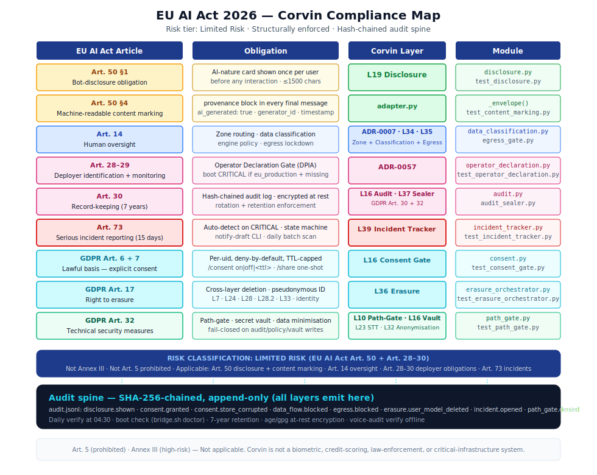

# Corvin — EU AI Act 2026 Compliance

> **Core thesis:** EU AI Act compliance isn't documented in CorvinOS — it's enforced.
> Every regulatory obligation is a code gate that physically cannot be bypassed.
> You cannot accidentally skip disclosure or bypass consent — the system physically
> won't process a message without them.

<p align="center">
  
</p>

---

## How enforcement differs from compliance

Most AI compliance frameworks are document-based: an organisation writes a policy,
trains its staff, and gets audited periodically to check whether the policy was followed.
The gap between what is written and what actually runs at runtime is where violations happen.

**Structural enforcement is different.** In CorvinOS, every regulatory obligation is a
runtime code gate. The gate is not optional, not configurable away, and not bypassable by
any operator instruction, environment variable, or configuration flag. When the gate fires,
it also writes an immutable, cryptographically hash-chained audit record. When it is absent,
the boot self-test reports CRITICAL and the system refuses to start.

The practical consequence: a regulator does not need to trust that an operator followed the
policy. They can verify from the audit chain alone that every single message was processed
through every required gate — or that it was dropped because a gate denied it. The evidence
is in the code and in the chain, not in a document.

This is the architectural commitment CorvinOS makes: **compliance is a property of the
running system, not of a written plan.**

---

## Why "physically cannot be bypassed"

The phrase is precise. Consider what would have to fail simultaneously for a user to receive
a response without prior disclosure:

1. `disclosure.py` would have to return `True` for an unseen uid — this requires corrupting
   the on-disk store and suppressing the `disclosure.shown` audit event
2. The audit chain would have to silently drop the missing event — which breaks the hash
   chain and is detected by `voice-audit verify`
3. `bridge.sh doctor` would have to pass despite the broken chain — it runs `voice-audit verify`
   as a CRITICAL check at every boot

All three would have to fail at the same time, and the failure would be visible in the chain.
This is what structural enforcement means. There is no "compliance-off mode". There is no
trusted-user shortcut. There is no flag that skips the gates for performance.

---

## The enforcement chain

Every inbound message traverses these gates in order. Each gate either passes the message to
the next stage or drops it, and each decision — pass or drop — emits an event to the audit chain.

```
Inbound message
      │
      ▼
┌─────────────────────────────────────────────────────────────────┐
│  DISCLOSURE GATE (L19)                                          │
│  Has this uid received the AI-nature disclosure card?           │
│  → No: emit card, record disclosure.shown; hold message         │
│  → Yes: continue                                                │
└────────────────────────┬────────────────────────────────────────┘
                         │
                         ▼
┌─────────────────────────────────────────────────────────────────┐
│  CONSENT GATE (L16)                                             │
│  Does this uid hold a valid, non-expired consent?               │
│  → No: drop message; emit consent.observer_dropped              │
│  → Yes: continue                                                │
└────────────────────────┬────────────────────────────────────────┘
                         │
                         ▼
┌─────────────────────────────────────────────────────────────────┐
│  DATA CLASSIFICATION GATE (L34)                                 │
│  Is this data classification allowed for the target engine?     │
│  → No: emit data_flow.blocked (CRITICAL); incident opened       │
│  → Yes: continue                                                │
└────────────────────────┬────────────────────────────────────────┘
                         │
                         ▼
┌─────────────────────────────────────────────────────────────────┐
│  EGRESS GATE (L35)                                              │
│  Is the target engine's host in the permitted host list?        │
│  → No: emit egress.blocked (CRITICAL); incident opened          │
│  → Yes: continue                                                │
└────────────────────────┬────────────────────────────────────────┘
                         │
                         ▼
              Engine execution (L22)
                         │
                         ▼
┌─────────────────────────────────────────────────────────────────┐
│  PATH-GATE HOOK (L10, PreToolUse)                               │
│  Does any tool call touch audit/policy/vault paths?             │
│  → Yes: deny; emit path_gate.denied                             │
│  → No: allow                                                    │
└────────────────────────┬────────────────────────────────────────┘
                         │
                         ▼
┌─────────────────────────────────────────────────────────────────┐
│  OUTBOUND CONTENT MARKING (Art. 50 §4)                         │
│  Inject provenance block into final message envelope            │
└────────────────────────┬────────────────────────────────────────┘
                         │
                         ▼
              Message delivered to user
```

Every "emit X" writes to the same hash-chained audit file. Every event links to its
predecessor via SHA-256. Breaking the chain at any point is detectable by `voice-audit verify`.

---

## Risk classification

| Criterion | Corvin answer |
|---|---|
| Annex III high-risk? | No — not a biometric, critical-infrastructure, credit-scoring, or law-enforcement system |
| Art. 5 prohibited practice? | No — no subliminal manipulation, no social scoring, no real-time remote biometrics |
| Art. 50 disclosure obligation? | **Yes** — chatbot / conversational AI interacting with natural persons |
| Regulatory tier | **Limited Risk** (Art. 50 + Art. 28–30 deployer obligations) |

→ Full analysis and reclassification conditions: [RISK-CLASSIFICATION.md](../compliance/RISK-CLASSIFICATION.md)

---

## Article-to-layer mapping

| Article | Obligation | Enforcement mechanism | Layer |
|---|---|---|---|
| Art. 50 §1 | Disclose AI nature to users | Bot-disclosure card, one-time per uid, structurally locked | **L19** |
| Art. 50 §4 | Machine-readable content marking | `provenance` block injected into every final message envelope | **L19 / adapter** |
| Art. 14 | Human oversight — engine and data control | Compliance-zone routing + engine-policy allowlist + data classification matrix | **L34 / L35** |
| Art. 28 | Deployer identification + use-case documentation | Operator Declaration Gate (DPIA + permitted_use, verified at boot) | **L39 / self-test** |
| Art. 29 | Deployer monitoring + instructions for use | `bridge.sh doctor`, daily verify timer, incident dashboard | **L39 / self-test** |
| Art. 30 | Deployer record-keeping | Hash-chained audit log, 7-year retention, encryption at rest | **L16 / L37** |
| Art. 73 | Serious incident reporting within 15 days | IncidentAutoDetector fires on every CRITICAL audit event | **L39** |
| Art. 13 | Transparency + instructions for use | Annex IV technical documentation (auto-generated) | **CLI** |
| GDPR Art. 6, 7 | Lawful basis — explicit consent | Deny-by-default consent gate, TTL-capped, per-uid, re-validated at consume | **L16** |
| GDPR Art. 17 | Right to erasure | `corvin-erasure <subject_id>` — cross-layer orchestrated deletion | **L36** |
| GDPR Art. 30 | Records of processing | Audit chain, append-only, hash-linked | **L16 / L37** |
| GDPR Art. 32 | Security of processing | Path-gate, vault mode 0600, audit encryption, hash-chain tamper evidence | **L10 / L16 / L37** |

---

## What this means for you

### As an operator

Deploy with `corvin-serve` and set `spec.deployment_profile: eu_production` in
`tenant.corvin.yaml`. Fill in the operator declaration (`spec.operator_declaration`:
version, dpia_completed, dpia_date). Before going live, run:

```bash
bridge.sh doctor
```

This verifies that all gates are active, the audit chain is intact, the vault and
memory store are at the correct permissions, the operator declaration is valid, and
the engine CLI is reachable. Any CRITICAL failure blocks the start. You cannot
accidentally put a non-compliant system into production — the health check enforces it.

Full pre-deployment checklist: [OPERATOR-OBLIGATIONS.md](../compliance/OPERATOR-OBLIGATIONS.md)

### As a compliance officer

The audit chain is the single source of truth. Every gate decision — every disclosure
shown, every consent grant or drop, every data classification block, every incident opened —
is in the chain, in order, cryptographically linked. To get proof of chain integrity:

```bash
voice-audit verify
```

This walks the entire chain and reports the first broken link, if any. Exit code 0 means
the chain is intact from first event to last. This runs automatically every day at 04:30 UTC
via `corvin-audit-verify.timer`, and the result is itself a chain event.

To generate Annex IV technical documentation:

```bash
corvin-annex-iv generate --output annex-iv.md
corvin-annex-iv export-package          # full audit package
```

### As a regulator or auditor

The entire audit trail is offline-verifiable from the hash chain alone. You do not need
access to the running system. The chain is a JSONL file; each entry carries its predecessor's
SHA-256 hash. Verification requires only `voice-audit verify` or an independent implementation
of the same SHA-256 chain-walk.

The fastest path to evidence:

```bash
# Boot health — every gate, every CRITICAL check
bridge.sh doctor --json | jq '.checks[] | select(.severity == "CRITICAL")'

# Audit chain integrity proof
voice-audit verify

# All incidents for a reporting period
corvin-incident export --output incidents.json

# Operator declaration status
bridge.sh doctor | grep operator.declaration

# Full Annex IV package
corvin-annex-iv export-package
```

### As a DPO

GDPR Art. 17 erasure is one command:

```bash
corvin-erasure <subject_id>
```

The orchestrator walks every registered layer — conversation recall, user model,
session artifacts, identity mapping, forge workspaces — and deletes or pseudonymises
all content linked to that subject. The audit chain retains pseudonymous event entries
(chain integrity is preserved), but the identity mapping that would make them traceable
is erased. The result is recorded in an erasure trail file at `<tenant>/global/erasure/`
(mode 0600, atomic write).

The `subject_id` must be pseudonymous — the system rejects raw email addresses or names
to prevent identity leakage through the erasure trail itself.

---

## Structural invariants

These are code-enforced properties of the running system, not configuration options.
Removing them requires modifying source code and will be detected by `bridge.sh doctor`.

1. **Disclosure** — the AI-nature card fires once per (channel, chat, uid). No environment
   variable, config flag, or operator instruction disables it. The card is issued before
   any other interaction; there is no bypass path.

2. **Consent** — no message is processed without a valid, non-expired per-user consent.
   Consent is scoped per uid per chat. Owner consent does not extend to other users.
   The gate is deny-by-default: absence of a record means denied, not allowed.

3. **Audit chain** — every gate event lands in the hash chain in the order it occurred.
   No event type skips the chain link. The chain is append-only; no event can be removed
   without breaking verification.

4. **PII in audit** — the chain never contains email addresses, phone numbers, names,
   transcript text, or prompt content. Audit events carry only metadata:
   uid hashes, event types, timestamps, and reason codes.

5. **Engine scope** — engines are limited by the `allowed_engines` list in `tenant.corvin.yaml`,
   the data classification matrix, and the egress gate. No engine outside this scope
   can be reached at runtime.

6. **Incident detection** — CRITICAL audit events automatically open incident records.
   Nothing is silently swallowed. The incident tracker is the bridge to Art. 73 reporting.

7. **Boot gate** — `bridge.sh doctor` runs `voice-audit verify` as a CRITICAL check.
   A broken chain blocks the system from starting. This prevents a tampered system
   from returning to operation undetected.

---

## Document map

| Document | Answers |
|---|---|
| [DECLARATION-OF-CONFORMITY.md](DECLARATION-OF-CONFORMITY.md) | Voluntary Declaration of Conformity — obligations, status, signatory |
| [architecture.md](architecture.md) | How all compliance layers interlock — enforcement chain in detail |
| [article-5.md](article-5.md) | Art. 5 prohibited practices — formal assessment for all CorvinOS features |
| [article-50.md](article-50.md) | Art. 50 §1 (bot-disclosure, re-issuance) and §4 (content marking) in detail |
| [article-14.md](article-14.md) | Art. 14 human oversight — zones, data classification, egress lockdown |
| [article-73.md](article-73.md) | Art. 73 serious incident detection, 15-day response flow |
| [article-28-30.md](article-28-30.md) | Art. 28–30 operator obligations, declaration gate, DPIA |
| [gpai-deployer-obligations.md](gpai-deployer-obligations.md) | Art. 26/53 GPAI cascade — deployer and provider obligations |
| [agentic-safeguards.md](agentic-safeguards.md) | Agentic AI safeguards — orchestrator/worker, A2A, skill-promotion (Recital 80/97) |
| [gdpr.md](gdpr.md) | GDPR Art. 5–7, 17, 30, 32 — full coverage map |
| [audit-chain.md](audit-chain.md) | Hash-chain mechanics, tamper evidence, retention, encryption |
| [../compliance/RISK-CLASSIFICATION.md](../compliance/RISK-CLASSIFICATION.md) | Authoritative Limited Risk classification |
| [../compliance/OPERATOR-OBLIGATIONS.md](../compliance/OPERATOR-OBLIGATIONS.md) | Pre-deployment checklist for operators |
| [../compliance/INCIDENT-RESPONSE-PLAN.md](../compliance/INCIDENT-RESPONSE-PLAN.md) | Art. 73 response plan with CLI commands |
| [../compliance/](../compliance/) | DPO templates: DPIA, privacy notice, pentest scope, DSB checklist |
