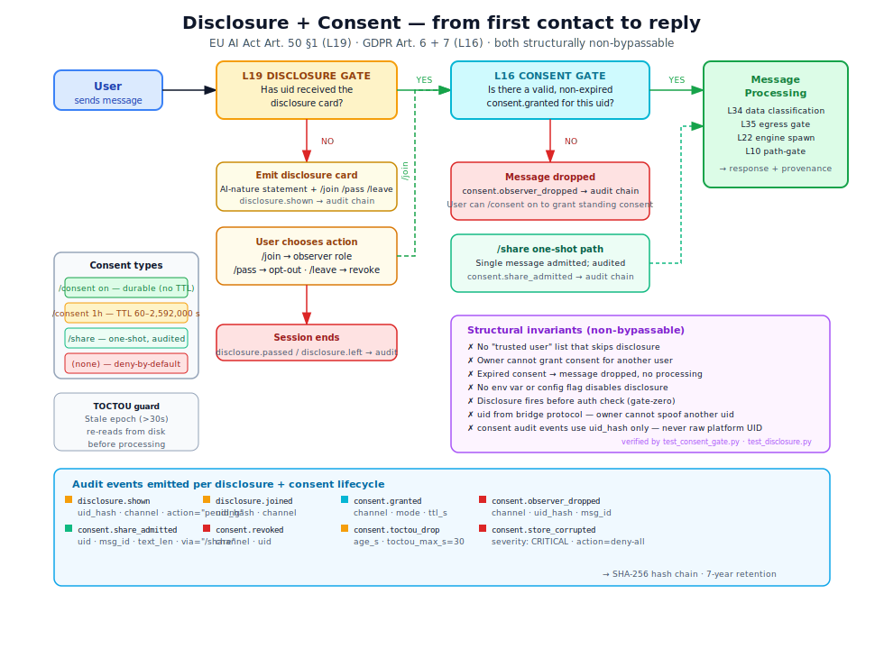

# Compliance architecture — how the layers interlock

> This document describes the **complete compliance architecture** of Corvin.
> It answers the question a security architect or regulator asks first:
> *"Where exactly is this enforced, and how do I verify it can't be bypassed?"*

<p align="center">
  
</p>

---

## The architectural principle

Corvin treats compliance the same way a kernel treats memory protection:
**the enforcement mechanism is the feature**, not a guard around it.

When a user sends a message, the compliance stack fires in this order:

```
Inbound message
      │
      ▼
┌─────────────────────────────────────────────────────────────────┐
│  L19 DISCLOSURE GATE                                            │
│  Has this uid received the disclosure card? (disclosure.py)     │
│  → No: emit card, record disclosure.shown; hold message         │
│  → Yes: continue                                                │
└────────────────────────────┬────────────────────────────────────┘
                             │
                             ▼
┌─────────────────────────────────────────────────────────────────┐
│  L16 CONSENT GATE (Phase 4)                                     │
│  Does this uid have a valid, non-expired consent? (consent.py)  │
│  → No: drop message; emit consent.observer_dropped              │
│  → Yes: continue                                                │
└────────────────────────────┬────────────────────────────────────┘
                             │
                             ▼
┌─────────────────────────────────────────────────────────────────┐
│  L34 DATA CLASSIFICATION GATE                                   │
│  Is this data classification allowed for the target engine?     │
│  (data_classification.py DataFlowGuard)                         │
│  → No: emit data_flow.blocked (CRITICAL); L39 opens incident    │
│  → Yes: continue                                                │
└────────────────────────────┬────────────────────────────────────┘
                             │
                             ▼
┌─────────────────────────────────────────────────────────────────┐
│  L35 EGRESS GATE                                                │
│  Is the target engine's host in the allowed_hosts list?         │
│  (egress_gate.py EgressGate)                                    │
│  → No: emit egress.blocked (CRITICAL); L39 opens incident       │
│  → Yes: continue                                                │
└────────────────────────────┬────────────────────────────────────┘
                             │
                             ▼
              Engine spawn (L22 WorkerEngine)
                             │
                             ▼
┌─────────────────────────────────────────────────────────────────┐
│  L10 PATH-GATE HOOK (PreToolUse)                                │
│  Does any tool call touch audit/policy/vault paths?             │
│  (path_gate.py)                                                 │
│  → Yes: deny; emit path_gate.denied                             │
│  → No: allow                                                    │
└────────────────────────────┬────────────────────────────────────┘
                             │
                             ▼
              Response returned to user
                             │
                             ▼
┌─────────────────────────────────────────────────────────────────┐
│  OUTBOUND CONTENT MARKING (Art. 50 §4)                         │
│  Inject provenance block into final message envelope            │
│  (adapter.py _envelope())                                       │
└─────────────────────────────────────────────────────────────────┘
                             │
                             ▼
              Message delivered to user
```

Every arrow that says "emit X" writes to the **same hash-chained audit file**.
Every event links to its predecessor. Breaking the chain at any point is detectable
by `voice-audit verify`.

---

## Layer reference

### L10 — Path-Gate Hook

**What:** `operator/voice/hooks/path_gate.py` (PreToolUse Claude Code hook)

**Enforces:** GDPR Art. 32 — prevents writes to protected filesystem locations

**Protected paths:** forge/skill-forge workspaces, `audit.jsonl`, `policy.json`,
vault, license/memory trees, slot-mirror

**Detects:** direct `Write`/`Edit`/`MultiEdit`/`NotebookEdit`, shell redirects (`>`, `tee`),
`mv`/`cp`/`install`/`rsync`, `sed -i`, Python `open()` write calls in Bash,
`eval`/`exec`/`$()`/backticks with any hint-string,
named pipes (`mkfifo` with protected hint), exec file-descriptor redirects (`exec N>` with protected path),
process-substitution write side (`>(cmd)` with protected hint),
command substitution in pipe position (`$(...)` | `tee` with protected hint)

**Fail-closed:** blocks on error; boot self-test (`path_gate.self_test_failed` CRITICAL if any check misses)

**Regulation:** GDPR Art. 32 (technical measures to ensure security of processing)

---

### L16 — Audit Chain + Consent Gate

**What:** `operator/bridges/shared/audit.py` + `consent.py`

**Enforces:**
- GDPR Art. 30 — records of processing activities (every event in chain)
- GDPR Art. 32 — hash-chain tamper evidence
- GDPR Art. 6, 7 — lawful basis (explicit consent required per message)

**Consent gate invariants (from code):**
- Deny-by-default: any uid without `granted` status → message dropped
- Per-uid, per-chat: consent is scoped; owner consent doesn't extend to other users
- TTL-capped: maximum 30 days, minimum 60 seconds, re-validated at consume time
- One-shot `/share`: audited admission for users who haven't granted standing consent
- TOCTOU guard: stale epoch (>30s) re-validates from disk before consume
- Store corruption: if consent store JSON is corrupt, the gate backs up the file and falls back to deny-all, emitting `consent.store_corrupted` CRITICAL
- Module unavailability: if consent module is unavailable and channel has `read_only` members, messages are dropped with `consent.gate_unavailable_drop` WARNING (rather than silently passing)
- All `consent.*` audit events use `uid_hash` (SHA-256[:8]), never the raw platform UID (V-003)

**Regulation:** GDPR Art. 6(1)(a) (consent as lawful basis), Art. 7 (conditions for consent)

---

### L19 — Disclosure

**What:** `operator/bridges/shared/disclosure.py`

**Enforces:** EU AI Act Art. 50 §1 — natural persons must know they are interacting with an AI

**How it works:**
- First contact: disclosure card (≤1500 chars) sent before any other interaction
- Card contains: AI-nature statement, operator name, available commands (`/join`, `/pass`, `/leave`)
- Stored: `<tenant>/global/disclosure/<channel>__<chat>.json` (once per uid, never repeated)
- Emits: `disclosure.shown` → `disclosure.joined` / `disclosure.passed` / `disclosure.left`

**Cannot be bypassed by:**
- Config flag
- Environment variable
- `trusted` label on user
- Operator instruction to Claude

**Persistence resilience:** The store write (`disclosure.mark_seen()`) retries up to 3 times with exponential backoff (0.1s / 0.3s / 1s) on `OSError`. On all-fail, `disclosure.persist_failed` CRITICAL is emitted and the daemon queues the state for retry at the next message boundary. This prevents transient filesystem errors from breaking the "shown once" guarantee.

**Regulation:** EU AI Act Art. 50 §1 (interacting with natural persons)

---

### L34 — Data Classification + Flow Guard

**What:** `operator/bridges/shared/data_classification.py`

**Enforces:** EU AI Act Art. 14 (human oversight — data sovereignty)

**Four levels:**

| Level | Allowed engines | Config |
|---|---|---|
| `PUBLIC` | Any | Default |
| `INTERNAL` | `local` or `eu_cloud` locality only | `spec.data_classification.matrix` |
| `CONFIDENTIAL` | `local` locality only | tenant YAML |
| `SECRET` | `local` + `network_egress: none` | tenant YAML |

**Fail-closed:** unrecognized classification → INTERNAL; unknown engine → deny

**Regulation:** EU AI Act Art. 14 (operator oversight over AI system operation)

---

### L35 — Egress Lockdown

**What:** `operator/bridges/shared/egress_gate.py`

**Enforces:** EU AI Act Art. 14 (human oversight — network boundary), GDPR Art. 32

**How it works:**
- Opt-in: `spec.egress.enabled: true`
- Priority: `forbidden_hosts` wins → `allowed_hosts` → `default_action`
- EU production presets: `api.anthropic.com` and `api.openai.com` in `forbidden_hosts`

**Regulation:** EU AI Act Art. 14, GDPR Art. 32

---

### L36 — GDPR Art. 17 Erasure

**What:** `operator/bridges/shared/erasure_orchestrator.py`

**Enforces:** GDPR Art. 17 (right to be forgotten)

**Mechanism:**
- `subject_id` must be pseudonymous (no raw email/name)
- Deletes identity mapping across all registered layers (L7, L24, L28, L28.2, L33)
- L28.2 (user model): distilled JSON files at `<tenant>/global/memory/user_model/` — erased by `L28UserModelHandler`
- Audit chain pseudonyms preserved (chain integrity > erasure of chain events)
- Trail file mode 0600, atomic write

**Regulation:** GDPR Art. 17

---

### L37 — Audit-at-rest Encryption + Retention

**What:** `operator/bridges/shared/audit_sealer.py`

**Enforces:** GDPR Art. 30 (records of processing), Art. 32 (encryption)

**Lifecycle:**
1. Live: `audit.jsonl` (append-only)
2. Rotation: triggered at 100 MB or 30 days (configurable)
3. Chain-link event: `audit.rotation_link` with `prev_hash` of rotated tail
   (fail-closed: if this write fails, `rotate_and_seal()` raises `RuntimeError` — rotation is aborted rather than leaving a chainless gap)
4. Sealing: `age` or `gpg` encryption; plaintext securely overwritten
5. Retention: 7 years (configurable); expired segments auto-deleted

**Rotation mutex:** A `fcntl.flock(LOCK_EX|LOCK_NB)` on a `.rotation.lock` sidecar prevents concurrent rotations from racing on `os.replace()`. A second concurrent caller gets `BlockingIOError` and raises `RuntimeError` rather than corrupting the segment boundary.

**Regulation:** GDPR Art. 30 (record-keeping), Art. 32 (security of at-rest data)

---

### L39 — Incident Tracker (Art. 73)

**What:** `operator/bridges/shared/incident_tracker.py`

**Enforces:** EU AI Act Art. 73 (serious incident reporting)

**Auto-detection:** `IncidentAutoDetector` fires on every CRITICAL audit event matching
`audit.chain_gap_detected`, `data_flow.blocked`, `egress.blocked`, `path_gate.denied`

**Six incident categories:**

| Category | Detection mechanism |
|---|---|
| `chain_integrity` | Auto (CRITICAL audit event) |
| `engine_policy_violation` | Auto (CRITICAL audit event) |
| `secret_exposure` | Auto (CRITICAL audit event) |
| `consent_bypass` | Daily `corvin-incident scan` |
| `disclosure_failure` | Daily `corvin-incident scan` |
| `pii_in_audit_chain` | Daily `corvin-incident scan` |

**Regulation:** EU AI Act Art. 73

---

## The audit spine — everything converges here

All layer events flow into one hash-chained JSONL file.
No parallel compliance log. No separate audit system.

```
L10 path_gate.denied            ─┐
L16 consent.observer_dropped    ─┤
L16 consent.granted             ─┤
L19 disclosure.shown            ─┤→ audit.jsonl  ← SHA-256 chain
L34 data_flow.blocked           ─┤   (append-only, single file per tenant)
L35 egress.blocked              ─┤
L36 erasure.applied             ─┤
L37 audit.segment_sealed        ─┤
L39 incident.opened             ─┘
```

**Why one file?** Because a tampered compliance log looks identical to an intact one
if the two systems can diverge. A single chain is verifiable with one command.

**Verification:**

```bash
voice-audit verify                  # walk chain, report any break
voice-audit verify --tenant acme    # specific tenant
bridge.sh doctor                    # full boot self-test (includes chain verify)
```

Daily verification runs automatically via `corvin-audit-verify.timer` at 04:30 UTC.

---

## Boot self-test — what runs at every start

`bridge.sh doctor` calls `self_test.py::run_self_test()` which checks (in order):

| Check | Failure severity | What it verifies |
|---|---|---|
| Tenant tree writable | CRITICAL | Home directory accessible |
| Memory store mode 0600 | CRITICAL | `recall.db` not world-readable |
| Audit chain verify | CRITICAL | `voice-audit verify` exit code 0 |
| Vault mode 0600 | CRITICAL | Secrets not world-readable |
| Engine CLI available | CRITICAL | `claude --version` works |
| MCP servers importable | CRITICAL | Forge + skill-forge modules load |
| Artifacts accessible | WARNING | Session artifact store intact |
| License plugin | INFO | Apache-only installs: skip |
| Egress preset | WARNING | EU production presets match tenant config |
| Audit sealer config | CRITICAL | If `encryption_at_rest.enabled`, recipient + binary present |
| **Operator declaration** | **CRITICAL** | eu_production profile must have valid DPIA |
| **Compliance manifest** | **CRITICAL** | Manifest version + rules validated |
| Manifest version pin | WARNING | eu_production without `min_version` in tenant config |

Any CRITICAL failure blocks the boot (container unhealthy, `bridge.sh doctor` exits 1).
