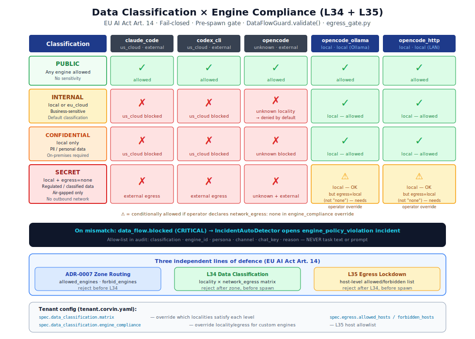

# Art. 14 — Human oversight

> **Short summary:** Art. 14 requires that high-risk AI systems (and by deployer obligation,
> Limited Risk systems) can be overseen and corrected by humans. In Corvin, oversight
> is implemented as three interoperable technical controls: compliance-zone routing,
> data classification gating, and network egress lockdown.

<p align="center">
  
</p>

---

## What "human oversight" means technically

EU AI Act Art. 14 requires that deployers be able to:
- Monitor the AI system's operation
- Interrupt, correct, or override outputs
- Understand what data the AI is processing and where

Corvin implements this through three complementary technical gates that **restrict what the
AI engine can do before it does it** — not by inspecting outputs after the fact.

---

## Control 1 — Compliance-zone routing

**What it does:** Routes messages to engines that are geographically and jurisdictionally
authorized for the tenant's declared `data_residency`.

**Configuration (tenant.corvin.yaml):**

```yaml
spec:
  data_residency: eu          # "eu" | "us" | "local"
  allowed_engines:
    - opencode_ollama          # local Ollama instance
    - claude_code              # only if data_residency permits
  forbid_engines:
    - codex_cli                # explicitly forbidden
```

**How it enforces oversight:**
- The operator declares which engines are permitted
- The system validates every spawn against the `allowed_engines` list
- A forbidden engine never receives message content — the block happens before the call
- All denials emit `gateway.engine_denied` (CRITICAL) into the audit chain

**Regulation:** EU AI Act Art. 14 §4 (human oversight measures "appropriate to the risks")

---

## Control 2 — Data Classification Flow Guard (Layer 34)

**What it does:** Assigns a sensitivity level to every conversation context and blocks engines
whose jurisdiction or network properties don't match.

**Module:** `operator/bridges/shared/data_classification.py`

### Classification levels

Data-residency restriction is **opt-in**. The shipped default matrix is
permissive (PUBLIC/INTERNAL/CONFIDENTIAL allow any locality incl. `us_cloud`)
so the system runs frictionless on its configured cloud engine; `SECRET` is the
only tier locked down by default. Operators who must keep personal or
business-sensitive data in the EU **tighten the matrix** (per-tier override, or
the `tenant.corvin.eu-production-ollama.yaml` preset). The columns below show
the **recommended residency configuration** under that opt-in.

| Level | Meaning | Default (shipped) | Recommended residency config (opt-in) |
|---|---|---|---|
| `PUBLIC` (0) | No sensitivity | Any engine | Any engine |
| `INTERNAL` (1) | Business-sensitive; should stay in EU | Any locality | `local` or `eu_cloud` locality |
| `CONFIDENTIAL` (2) | Personally identifiable; should stay on-premises | Any locality | `local` locality only |
| `SECRET` (3) | Regulated data; air-gapped processing | `local` + `network_egress: none` | `local` + `network_egress: none` |

### Engine locality + egress classification

Corvin ships with pre-classified compliance metadata for each engine:

| Engine ID | Locality | Network Egress | Notes |
|---|---|---|---|
| `claude_code` | `us_cloud` | `external` | api.anthropic.com — US jurisdiction |
| `codex_cli` | `us_cloud` | `external` | api.openai.com — US jurisdiction |
| `opencode_ollama` | `local` | `local` | Ollama on localhost — fully local |
| `opencode_http` | `local` | `local` | Self-hosted HTTP on LAN |
| `opencode` | `unknown` | `external` | Provider-dependent; operator must override |

### Tenant override

Operators can override the default compliance matrix per engine:

```yaml
spec:
  data_classification:
    engine_compliance:
      my_private_model:
        locality: local
        network_egress: none
        notes: "Air-gapped model on dedicated hardware"
    matrix:
      CONFIDENTIAL:
        - locality: local
        - locality: eu_cloud    # custom override: eu_cloud also allowed for CONFIDENTIAL
```

### What happens on a mismatch

If the engine's locality doesn't satisfy the classification requirement:

1. `DataFlowGuard.validate()` returns `FlowDecision(allowed=False, reason="locality mismatch: …")`
2. `data_flow.blocked` (CRITICAL) is emitted into the audit chain
3. `IncidentAutoDetector` opens a `engine_policy_violation` incident automatically
4. The engine is **never spawned** — the block is pre-spawn, not post-output

**Audit allow-list (never includes task text):**

```json
{
  "classification": "CONFIDENTIAL",
  "engine_id": "claude_code",
  "persona": "research",
  "channel": "discord",
  "chat_key": "1234:5678",
  "reason": "locality mismatch: engine=us_cloud, required=local"
}
```

**Test coverage:** `operator/bridges/shared/test_data_classification.py`

---

## Control 3 — Network Egress Lockdown (Layer 35)

**What it does:** Restricts which hosts the engine is allowed to contact, at the DNS/hostname
level, enforced before the engine is spawned.

**Module:** `operator/bridges/shared/egress_gate.py`

### Configuration

```yaml
spec:
  egress:
    enabled: true
    default_action: deny           # deny unless explicitly allowed
    allowed_hosts:
      - localhost
      - 127.0.0.1
      - ollama.internal
    forbidden_hosts:
      - api.anthropic.com          # EU production: US cloud blocked
      - api.openai.com
```

### Decision precedence

1. **`forbidden_hosts`** — explicit deny, always wins
2. **`allowed_hosts`** — explicit allow
3. **`default_action`** — `allow` or `deny` for everything unmatched

### EU production presets

Corvin ships two ready-made configurations in `operator/bundle/config-templates/`:

| Preset | Default action | Description |
|---|---|---|
| `eu_production_ollama` | `deny` | Only local Ollama; all US cloud blocked |
| `eu_production_http` | `deny` | Self-hosted HTTP + local; all US cloud blocked |

### What happens on an egress block

If the target host is not permitted:

1. `EgressGate.validate()` returns `EgressDecision(allowed=False, matched_rule="default_deny")`
2. `egress.blocked` (CRITICAL) emitted to audit chain
3. `IncidentAutoDetector` opens `engine_policy_violation` incident automatically
4. Engine is never spawned

**Audit allow-list (never includes URL path or request body):**

```json
{
  "host": "api.anthropic.com",
  "engine_id": "claude_code",
  "persona": "research",
  "reason": "default_deny",
  "matched_rule": "default_deny"
}
```

**Test coverage:** `operator/bridges/shared/test_egress_gate.py`

---

## How the three controls interlock

These are three independent, complementary lines of defence:

| Threat | L34 Data Classification | L35 Egress Gate | Compliance-zone routing |
|---|---|---|---|
| Wrong jurisdiction engine selected | Blocks at locality check | Blocks at host check | Blocks at zone routing |
| Operator misconfigures zone | Blocked by classification | Blocked by egress | N/A (zone is the root) |
| Engine tries to exfiltrate to US cloud | Not directly detectable | Blocks outbound connection | Blocked at zone |
| Unknown engine added | Default → INTERNAL (partial) | default_action:deny | Must be in allowed_engines |

A deployment with all three controls active is robust against:
- Accidental engine misconfiguration
- Operator error (wrong zone)
- Prompt injection attempting to use a non-permitted engine

---

## Compliance manifest rules

```yaml
# eu-ai-act.yaml
- id: eua.art14.compliance_zone
  article: "Art. 14"
  severity: critical
  invariants:
    - "zone routing blocks engines not in allowed_engines"
    - "data_flow.blocked is CRITICAL, not advisory"
  implemented_by:
    - layer: compliance_zone_routing
      file: operator/bridges/shared/compliance_zone_classifier.py

- id: eua.art14.engine_policy
  article: "Art. 14"
  severity: critical
  implemented_by:
    - layer: compliance_zone_routing
      file: operator/bridges/shared/engine_policy.py
```

Both rules are verified by `bridge.sh doctor` at every boot and blocked at PR time by
the GitHub Actions Haiku review (`compliance-check.yml`).
