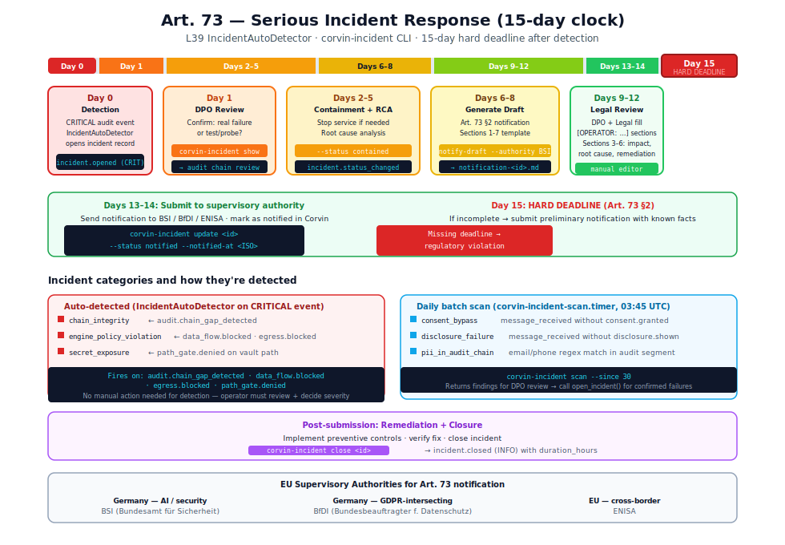

# Art. 73 — Serious incident reporting

> **Short summary:** Art. 73 requires providers and deployers of high-risk AI systems to
> report serious incidents to supervisory authorities within 15 days of becoming aware.
> Corvin implements this obligation through Layer 39 — an automatic incident detector,
> structured state machine, and notification draft generator.

<p align="center">
  
</p>

---

## What counts as a "serious incident"

Under the EU AI Act, a serious incident is one that results in (or could result in) harm to
health, safety, fundamental rights, or property. Corvin interprets this in its own context:
**structural control failures** — situations where a compliance gate that should have prevented
a problem failed to do so, or a tamper-evidence mechanism was broken.

### Corvin incident categories

| Category | Definition | Detection |
|---|---|---|
| `chain_integrity` | Audit hash chain broken (tamper detected) | **Auto** — `audit.chain_gap_detected` CRITICAL |
| `engine_policy_violation` | Engine blocked but data_flow.blocked / egress.blocked fired | **Auto** — CRITICAL audit event |
| `secret_exposure` | `path_gate.denied` on vault path where write may have succeeded | **Auto** — CRITICAL audit event |
| `consent_bypass` | Message processed without prior `consent.granted` for that uid | **Daily scan** — `corvin-incident scan` |
| `disclosure_failure` | Session reached `bridge.message_received` without `disclosure.shown` | **Daily scan** — `corvin-incident scan` |
| `pii_in_audit_chain` | Regex scan finds unredacted email/phone in audit segment | **Daily scan** — `corvin-incident scan` |

Only incidents with `severity: serious` (structural control failure) trigger the 15-day
notification obligation. `severity: warning` and `severity: informational` incidents are
tracked but don't require authority notification.

---

## The incident state machine

```
              open_incident()
                    │
               ┌────▼────┐
               │  open   │  ← auto-opened by IncidentAutoDetector
               └────┬────┘     or manually via corvin-incident open
                    │
                    │ DPO reviews: is this a real failure?
                    │
              ┌─────▼──────┐
              │ contained  │  ← corvin-incident update <id> --status contained
              └─────┬──────┘
                    │
                    │ severity == "serious" AND 15-day clock active?
                    │
              ┌─────▼──────┐
              │  notified  │  ← after submitting Art. 73 §2 notification
              └─────┬──────┘
                    │
              ┌─────▼──────┐
              │   closed   │  ← remediation complete
              └────────────┘
```

Every status transition emits an audit event into the L16 hash chain.

---

## Auto-detection: `IncidentAutoDetector`

**Module:** `operator/bridges/shared/incident_tracker.py`

The `IncidentAutoDetector` is a PostAudit hook that fires on every CRITICAL audit event:

```python
class IncidentAutoDetector:
    def on_audit_event(self, event: dict, *, tenant_id="_default") -> IncidentRecord | None:
        event_type = str(event.get("event", ""))
        category = TRIGGER_EVENTS.get(event_type)
        if category is None:
            return None
        if str(event.get("severity", "")).upper() != "CRITICAL":
            return None
        # sanitize chain hash before creating record
        raw_hash = str(event.get("hash") or event.get("prev_hash") or "")
        chain_hash = re.sub(r"[^0-9a-f]", "0", raw_hash.lower())[:16].ljust(16, "0")
        return open_incident(
            category=category,
            trigger_event=event_type,
            trigger_chain_hash=chain_hash,
            description=f"Auto-detected from {event_type} CRITICAL event. Operator review required.",
            severity="serious",
            tenant_id=tenant_id,
        )
```

**Trigger events:**

| Audit event | Opens category |
|---|---|
| `audit.chain_gap_detected` | `chain_integrity` |
| `data_flow.blocked` | `engine_policy_violation` |
| `egress.blocked` | `engine_policy_violation` |
| `path_gate.denied` | `secret_exposure` |

The `IncidentAutoDetector` ensures that no CRITICAL structural event can silently pass
without creating a record that the DPO must explicitly close.

---

## Incident storage

Each incident is stored as a JSON file (mode 0600, atomic write):

```
<tenant>/global/incidents/<incident_id>.json
```

```json
{
  "incident_id": "f3a8b2c1-...",
  "detected_at": "2026-05-26T10:00:00+00:00",
  "category": "chain_integrity",
  "severity": "serious",
  "trigger_event": "audit.chain_gap_detected",
  "trigger_chain_hash": "a1b2c3d4e5f60001",
  "description": "Auto-detected from audit.chain_gap_detected CRITICAL event.",
  "status": "open",
  "notified_at": null,
  "closed_at": null,
  "tenant_id": "_default"
}
```

**Important:** The `description` field is stored only in this file — it **never** enters
the audit chain. This prevents free-text descriptions (which might contain PII or sensitive
details) from becoming part of the tamper-evident record.

**Audit events in chain (allow-list, no description):**

```json
{ "incident_id": "f3a8b2c1",
  "category": "chain_integrity",
  "severity": "serious",
  "trigger_event": "audit.chain_gap_detected",
  "trigger_chain_hash": "a1b2c3d4" }
```

---

## Daily batch scan

Three categories (`consent_bypass`, `disclosure_failure`, `pii_in_audit_chain`) cannot be
detected from individual CRITICAL events — they require scanning the audit chain for patterns.

The `corvin-incident-scan.timer` runs daily at 03:45 UTC:

```bash
corvin-incident scan --since 30
```

This calls `scan_audit_chain(since_days=30)` which walks the audit chain looking for:
- Sessions where `bridge.message_received` fires without prior `disclosure.shown` for that uid
- Sessions where `bridge.message_received` fires without prior `consent.granted` for that uid
- Audit segments containing patterns matching `r"\b[A-Za-z0-9._%+\-]+@…\b"` (email) or phone regex

The scan returns potential findings — the operator reviews them and calls `open_incident()`
for any confirmed failures.

---

## The 15-day response timeline

| Day | Action | Command |
|---|---|---|
| **0** | Incident detected; `incident.opened` in audit chain | `corvin-incident list --status open` |
| **1** | DPO confirms "serious" classification (not a test/probe) | `corvin-incident show <id>` |
| **2–5** | Contain: stop affected service if needed; root cause analysis | `corvin-incident update <id> --status contained` |
| **6–8** | Generate notification draft | `corvin-incident notify-draft <id> --authority BSI` |
| **9–12** | DPO + legal review; complete `[OPERATOR: FILL IN]` sections | _(editor)_ |
| **13–14** | Submit to supervisory authority (manually) | _(external process)_ |
| **15** | **Hard deadline** (Art. 73 §2) | `corvin-incident update <id> --status notified --notified-at <ISO>` |
| _(after)_ | Remediate + implement preventive controls; close | `corvin-incident close <id>` |

If investigation is not complete by day 15, submit a preliminary notification with known facts
and note that investigation is ongoing. Do not wait for certainty to miss the deadline.

---

## Generating the Art. 73 §2 notification draft

```bash
corvin-incident notify-draft <incident_id> \
  --authority BSI \
  --operator-name "Acme GmbH" \
  --output notification-<incident_id>.md
```

This generates a structured Markdown document with:
- Section 1: Description of the incident (populated from `description` field)
- Section 2: Affected system (auto-filled: Corvin + deployment context placeholder)
- Section 3: Impact assessment (`[OPERATOR: fill in]`)
- Section 4: Root cause (`[OPERATOR: fill in]`)
- Section 5: Containment steps (`[OPERATOR: fill in]`)
- Section 6: Remediation plan (`[OPERATOR: fill in]`)
- Section 7: Supporting evidence (audit chain hash + incident trail path)

The DPO fills in Sections 3–6 and submits to the authority.

---

## Supervisory authorities

| Jurisdiction | Authority | Relevant for |
|---|---|---|
| Germany | BSI (Bundesamt für Sicherheit in der Informationstechnik) | AI systems, data security |
| Germany | BfDI (Bundesbeauftragter für den Datenschutz) | GDPR-intersecting incidents |
| EU | ENISA | Cross-border or critical incidents |

---

## CLI quick reference

```bash
# List all open incidents
corvin-incident list --status open

# Show full incident (including description)
corvin-incident show <incident_id>

# Update status
corvin-incident update <id> --status contained

# Generate Art. 73 notification draft
corvin-incident notify-draft <id> --authority BSI --operator-name "Acme GmbH"

# Mark as notified (after submitting to authority)
corvin-incident update <id> --status notified --notified-at "2026-08-15T14:00:00Z"

# Close incident
corvin-incident close <id>

# Daily batch scan (run by systemd timer)
corvin-incident scan --since 30

# Export all incidents (for audit package)
corvin-incident export --output incidents.json
```

---

## Test coverage

```
operator/bridges/shared/test_incident_tracker.py  — 17 tests
  TestIncidentRecord        — validation (category, severity, roundtrip)
  TestOpenIncident          — file creation, mode 0600, description not in audit
  TestUpdateClose           — status transitions, duration recording
  TestListLoad              — list by status, load by id
  TestNotifyDraft           — notification template generation
  TestAutoDetector          — auto-trigger on CRITICAL, skip non-CRITICAL
```

All 17 tests pass. The critical invariant `test_description_not_in_audit` verifies that
the `description` field never appears in the audit chain.
