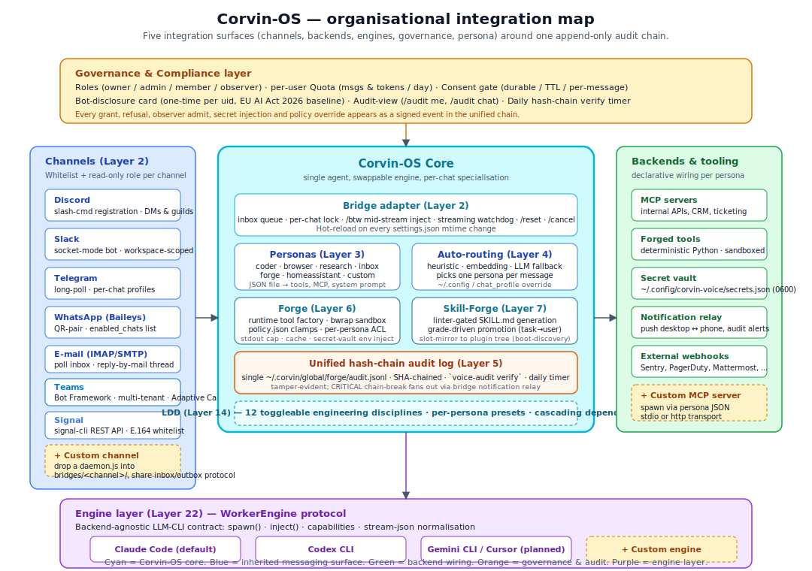

# for-organizations.md — Corvin for companies

> **Audience.** This document is for technology leads, security officers,
> compliance owners and product managers evaluating Corvin as the
> operational layer around an organisation's coding / knowledge / support
> agents. It explains the integration surfaces, the extension points, the
> deployment models, and the commercial framing — including a concrete
> business plan and an architecture diagram tailored to organisational
> rollout.
>
> Companion documents: [overview.md](overview.md) for the conceptual
> introduction, [layer-model.md](layer-model.md) for the layer-by-layer
> reference, [security.md](security.md) for the threat model,
> [forge.md](forge.md) for runtime tool generation, and
> Corvin-ADR repo for the architectural decision records.

---

## 1. Executive summary

Corvin is a **runtime layer around a single LLM-CLI agent** (Claude
Code by default, Codex CLI and others via the `WorkerEngine` protocol)
that turns a desk-bound coding assistant into a **multi-channel,
multi-persona, audit-evident service** an organisation can deploy in
days rather than quarters.

What organisations get out of the box:

- **Reach.** One agent, six channels (Discord, Slack, Telegram, WhatsApp,
  e-mail, plus pluggable custom adapters). Staff talk to the same agent
  from the tool they already have open.
- **Specialisation.** Per-chat *personas* expose different tool surfaces,
  system prompts and MCP servers — the same agent acts as coder in one
  channel, as inbox triage in another, as a research assistant in a third.
- **Runtime extensibility.** Forge (sandboxed deterministic tools) and
  Skill-Forge (linter-gated knowledge artefacts) let the agent *grow its
  own toolset and knowledge base* during operation, with operator-level
  governance on every promotion to project / user scope.
- **Tamper-evident audit.** Every grant, refusal, secret injection, tool
  run and observer admit lands in a single SHA-chained JSONL file; a
  daily systemd timer verifies the chain and pages out on break.
- **Compliance baseline.** Roles, per-user quotas, consent gate and
  one-time disclosure card cover the EU AI Act 2026 active-disclosure
  baseline structurally — not as a policy memo, but as a code path that
  cannot be bypassed without an audit event.

What it is *not* (the same boundary as in [overview.md](overview.md)):
not a fork of Claude Code, not a multi-agent orchestrator, not a memory
store, not a sandbox of the agent itself, not a billing tracker. The
underlying LLM cost, throughput and SLA come from whatever provider the
chosen engine speaks to.

<p align="center">
  
</p>

---

## 2. Why an organisation would adopt this

### 2.1 The three load-bearing properties

Every organisation considering an LLM agent at scale runs into the same
three structural questions:

| Question | Vanilla LLM-CLI answer | Corvin answer |
|---|---|---|
| **Where do staff reach the agent?** | A terminal at one desk. | Any messaging channel they already use, with per-chat memory. |
| **How does it learn the organisation?** | Copy-paste system prompts; rebuild on every chat. | Personas, project-scope skills, internal MCP servers, secret vault — all hot-reloaded. |
| **How do we prove what it did?** | Provider dashboards + screenshots. | A signed append-only chain of every event, verifiable offline. |

Corvin does not invent any of these answers — it composes them from
existing seams (the official Claude Code plugin / hook / MCP system, the
WorkerEngine protocol, bwrap sandboxing, JSONL append logs) into a
coherent operational layer.

### 2.2 Concrete adoption profiles

| Profile | Primary channel | Primary persona(s) | Forged tools | Compliance pressure |
|---|---|---|---|---|
| **Engineering team (10–50 devs)** | Slack / Discord | `coder`, `research` | low–medium (tests, linters, git helpers) | internal audit / SOC 2 |
| **Customer support (B2C)** | WhatsApp / e-mail | `inbox`, `assistant` | medium (CRM lookups, refund triage) | GDPR + EU AI Act |
| **Knowledge org (consultancy, law)** | Slack / Teams | `research`, custom personas | high (search, doc-extract, citation) | confidentiality, retention |
| **Operations / on-call** | Telegram / PagerDuty webhook | `homeassistant`, `coder` | medium (status, deploy, postmortem) | SOX / ISO 27001 |
| **Solo professional / freelancer** | WhatsApp / e-mail | `assistant`, `inbox` | low | GDPR baseline |

### 2.3 Where it is structurally a poor fit

To be precise about the boundary:

- **Agentic workloads needing parallel agents per task.** Corvin is
  one agent per chat. Map-reduce-style parallel research across 50
  documents at once is better served by a dedicated orchestrator
  (LangGraph, OpenAI Swarm, anthropic-cookbook patterns) — Corvin
  can call them as sub-tools, but it is not the orchestrator.
- **Hard real-time / sub-second latency.** Bridge round-trip is
  bounded by the LLM-CLI subprocess spawn (~1–3 s warm) plus the
  channel daemon's own latency. Sub-100 ms response paths need a
  different architecture.
- **Air-gapped environments without any LLM provider reach.** All
  current engines speak to a hosted LLM. A fully on-prem deployment
  needs an OSS-engine entry in the WorkerEngine table (see §5.3) —
  feasible but not shipped.

---

## 3. Integration interfaces

Corvin exposes **five integration surfaces**. Each surface is
declarative (config or a small JSON file), hot-reloaded on the next
event, and audited end-to-end.

### 3.1 Channel surface — bridges

A *bridge* is a Node daemon that owns one messaging channel. It speaks
the channel's native protocol (Discord gateway, Telegram long-poll,
Baileys for WhatsApp, IMAP/SMTP for e-mail) and writes a normalised
envelope into a per-chat inbox queue that the Python adapter consumes.

| File the operator edits | What it controls |
|---|---|
| `bridges/<channel>/settings.json` | whitelist, read-only list, rate limit, debug flags, per-chat profiles |
| `bridges/shared/settings.json` | global routing mode, voice summary policy, progress updates |
| `bridges/<channel>/.env` (or systemd `service.env`) | tokens, HTTP ports |

Hot-reload covers everything except tokens and HTTP ports. The
contract is documented in **CLAUDE.md → Hot-reload convention for
bridge settings**.

**Add a new channel** by dropping a `daemon.js` into
`operator/bridges/<channel>/` that conforms to the inbox/outbox
JSON envelope. The shared `js/` modules
(`auth.js`, `auth_elevation.js`, `in_chat_commands.js`,
`outbox.js`, `settings.js`) are reusable and ship the slash-command
dispatcher (`/help`, `/btw`, `/stop`, `/reset`, `/consent`,
`/grant`, `/proposal`, …) without per-channel work.

### 3.2 Backend surface — MCP servers

Personas declare which MCP servers they spawn:

```jsonc
// operator/cowork/personas/research.json
{
  "name": "research",
  "mcp_servers": {
    "internal-confluence": {
      "command": "node",
      "args": ["/opt/corvin/mcp-confluence/index.js"],
      "env": {"CONFLUENCE_BASE": "https://wiki.example.com"}
    },
    "crm": {
      "command": "/opt/corvin/mcp-crm",
      "args": ["--read-only"]
    }
  }
}
```

The adapter materialises the persona's `mcp_servers` block to a
temporary JSON file per turn and passes it via `--mcp-config` to the
engine. No global MCP registry, no daemon restart required — adding a
new MCP server is a `git pull` on the persona file plus the next
incoming message.

**Custom MCP servers** are written in any language Anthropic's MCP SDK
supports (TypeScript, Python, Go); they expose `tools/list` +
`tools/call` over stdio (preferred) or HTTP. Use them to wire CRMs,
ticketing systems, internal knowledge bases, vector stores, build
servers, observability dashboards.

### 3.3 Runtime tool surface — Forge

Forge is the runtime tool factory. A persona with `forge_enabled: true`
gains two MCP tools (`mcp__forge__forge_tool` to register a tool,
`mcp__forge__forge_promote` to lift it from session → project → user
scope). Tool source lands in `<scope>/forge/tools/<name>.py` and runs
inside `bwrap` with policy-clamped resources.

Use forge when the agent would otherwise re-write the same Python
snippet across turns — CSV transforms, log parsing, data extraction,
deterministic API wrappers.

**Governance.** `policy.json` clamps memory, CPU, output size, network
access, declared secrets and per-persona namespaces. The
**path-gate hook** (Layer 10) is the structural enforcement: direct
`Write` / `Edit` / `Bash` writes to `<scope>/forge/**` are blocked at
the tool-call level, regardless of permission mode. The MCP server is
the only writable path.

### 3.4 Knowledge surface — Skill-Forge

Skill-Forge is the runtime *knowledge* factory. The same persona that
forges tools can also persist knowledge as a markdown SKILL.md that the
linter accepts (no prompt injection, no embedded secrets, no
persona-boundary phrases, ≤ size cap). Skills are graded — promotion
requires positive grades — and once promoted to project / user scope
they are auto-injected into every relevant chat's system prompt on the
next bridge turn.

Use Skill-Forge for organisation-specific knowledge that survives
across sessions: "how we name PRs", "the approval flow for refunds",
"how the deploy script behaves on the staging VPC".

### 3.5 Engine surface — WorkerEngine protocol (Layer 22)

The `bridges/shared/agents/` module defines a backend-agnostic
contract:

```python
class WorkerEngine(Protocol):
    capabilities: dict[str, bool]  # mid_stream_inject, hooks, skills_tool, mcp, ...
    def spawn(self, *, prompt, ...) -> SpawnResult: ...
    def inject(self, text: str) -> None: ...
```

Four engines ship today:

- `claude_code.py` — full feature set (mid-stream inject, hooks,
  skills_tool, MCP, all 4 permission modes).
- `codex_cli.py` — MCP + stream-json, no skills_tool, no hooks, no
  mid-stream inject.
- `opencode_cli.py` — provider-agnostic (Claude/OpenAI/Google/Ollama);
  mcp + stream-json only.
- `hermes_engine.py` — **fully local via Ollama HTTP** (L22 / L34);
  zero network egress, no cloud API key, L34 CONFIDENTIAL-capable. The
  only engine that qualifies for CONFIDENTIAL tasks under the EU_PRODUCTION
  preset without a compliance-zone exception. Capabilities: stream-json
  only — no mid-stream inject, no hooks, no MCP (M3 roadmap).

Capabilities are declared per engine and the adapter degrades gracefully
when a feature is missing (never crashes).

A **custom engine** (open-source LLM via vLLM, an internal proxy, a
dialog-only fine-tune) implements the protocol and registers itself.
The adapter switches engine via `CORVIN_USE_ENGINE_LAYER=1` (the
default since v0.13) and the engine-selection table.

---

## 4. Extension points

| Extension | Where it lives | When you reach for it |
|---|---|---|
| **Custom persona** | `operator/cowork/personas/<name>.json` (bundle) or `<repo>/.corvin/cowork/personas/<name>.json` (user) | A team needs a different system prompt + tool surface for one channel. |
| **Custom MCP server** | Any directory; referenced from a persona's `mcp_servers` block. | Wiring an internal API or knowledge base. |
| **Custom forge tool template** | Add to the namespace allow-list in `operator/forge/forge/policy.json` and let the persona forge. | A class of deterministic tools the agent should be encouraged to generate (`csv.*`, `pdf.*`, `crm.*`). |
| **Custom skill** | Skill-Forge generates them at runtime, OR write a `SKILL.md` under `operator/bundle/skills/<name>/` (or a custom operator plugin) for static skills. | Codifying organisational knowledge. |
| **Custom bridge / channel** | `operator/bridges/<channel>/daemon.js` + reuse `shared/js/` modules. | A messaging surface not yet shipped (MS Teams, Mattermost, Matrix, custom in-house). |
| **Custom engine** | `operator/bridges/shared/agents/<engine>.py` implementing the `WorkerEngine` protocol. | Switching to an OSS LLM, a self-hosted Claude proxy, or a fine-tune. |
| **Custom audit sink** | `operator/voice/scripts/voice_audit.py --notify-bridge` already pushes chain breaks; add another sink in the relay or wrap `forge.security_events.write_event`. | Forwarding events to SIEM (Splunk, Elastic, Datadog). |
| **Custom hook** | `operator/voice/hooks/<name>.py` and registered in `hooks/hooks.json`. | Adding a new PreToolUse / PostToolUse / Notification gate. |
| **Custom slash-command** | `bridges/shared/js/in_chat_commands.js` dispatcher + handler module. | Domain-specific command (`/release`, `/oncall`, `/ticket`). |

The core invariant: **every extension is a plain file an operator can
read, edit, version-control and revert** — no compiled DSL, no opaque
bytecode, no out-of-tree daemon. `git diff` answers the question
"what changed?" for every layer.

---

## 5. Deployment models

### 5.1 Self-hosted single-tenant (recommended baseline)

The default. One Linux box (or a small VM cluster), one systemd unit
per bridge channel + the adapter, secrets in
`~/.config/corvin-voice/`, audit log on local disk, optional rsync to
cold storage.

| Component | Where |
|---|---|
| Bridges + adapter | systemd user units (`bridge.sh up`) |
| Engine binaries | `claude` / `codex` on `$PATH` |
| Secrets | `~/.config/corvin-voice/secrets.json` (mode 0600) |
| Audit chain | `~/.corvin/global/forge/audit.jsonl` |
| Skill / tool workspaces | `~/.corvin/{sessions,projects,global}/` |

Suits an engineering team or a single department. Operator has full
visibility, no third-party in the data path beyond the chosen LLM
provider.

### 5.2 Self-hosted multi-tenant

Multiple chat channels per Corvin instance, scoped by per-channel
whitelist + per-chat persona pinning. Secrets are still shared at the
host level, but per-persona ACL on the secret vault and per-chat
quotas (Layer 20) prevent cross-tenant leakage at the agent layer.

Suits an internal platform team running one Corvin for the whole
company, with personas dedicated to teams.

### 5.3 Hybrid — managed bridges, self-hosted core

A future commercial offering: bridges run as managed daemons in a
provider-controlled DMZ (so you do not own the WhatsApp / Slack
credentials), and the adapter + audit chain stays on the customer's
infrastructure via a thin pull-protocol. Out of scope for the OSS
release; covered in §7 (business plan).

### 5.4 Air-gapped / regulated

Possible today with two changes:
1. Engine swap — replace the Anthropic-bound `claude_code.py` with a
   `WorkerEngine` implementation calling a local vLLM / Ollama server.
2. Bridge channel restriction — keep e-mail (IMAP via internal mail
   server) and a custom in-house chat adapter; drop the public
   messengers.

The audit chain and the path-gate hook are unchanged; the security
envelope is identical to the standard deployment.

---

## 6. Compliance & governance

### 6.1 EU AI Act 2026 baseline

The Act requires *active* disclosure when a person interacts with an AI
system. Corvin implements this structurally:

- **Layer 19 — Bot-disclosure card.** First contact in any chat shows a
  one-time card naming the operator, the AI nature of the bot, and the
  opt-in/-out commands. Tracked per (channel, chat, uid). Recorded as
  `disclosure.shown` event in the audit chain.
- **Layer 16 Phase 4 — Consent gate.** Read-only observers (people in
  a group chat who are not whitelisted) cannot have their text fed to
  the LLM until they grant consent (`/consent on` / `/consent 30s` /
  `/share <text>`). Default is *deny*.
- **Roles & quota (Layers 18 + 20).** Owner-controlled delegation with
  TTLs; per-user message + token budgets; every grant / revoke /
  refusal goes into the chain.

### 6.2 Audit chain — what you actually get

A single append-only JSONL file at
`~/.corvin/global/forge/audit.jsonl`. Each line is a JSON object with
a `prev_hash` field linking to the prior line; `voice-audit verify`
walks the file and reports the first divergence. Verified by a daily
systemd timer (`corvin-audit-verify.timer`, 04:30 local) which calls
`--notify-bridge` on break — every configured channel gets a CRITICAL
push notification listing the first 5 problems.

Event types you will see:

| Class | Examples |
|---|---|
| Bridge | `bridge.whitelist_deny`, `bridge.read_only_drop`, `bridge.btw_inject`, `bridge.observer_appended` |
| Forge / tool | `tool.created`, `tool.run`, `tool.network_share`, `tool.secrets_injected` |
| Skill | `skill.created`, `skill.promoted`, `skill.outcome_graded`, `skill.namespace_denied` |
| Session | `session.reset`, `session.timeout`, `session.path_migrated` |
| Path-gate | `path_gate.denied`, `path_gate.self_test_failed` |
| Consent / disclosure | `consent.observer_dropped`, `disclosure.shown`, `disclosure.joined` |
| Roles / quota | `grant.issued`, `grant.revoked`, `quota.over_limit`, `quota.reset` |
| Audit | `audit.chain_gap_detected` (out-of-band on chain break) |

### 6.3 Data residency

The audit chain, secrets, skill workspaces and forged-tool artefacts
all live on the host filesystem under `~/.corvin/` and
`~/.config/corvin-voice/`. No outbound network is required for the
governance layer. The LLM provider is the only external dependency,
and that choice is yours via the engine selection.

### 6.4 Retention

The session-timeout sweep (`corvin-session-timeout.timer`, 03:30
local, default TTL 7 days) wipes idle session-scope skills, tools and
voice state. Project and user scope are NEVER pruned. Adjust the TTL
via `CORVIN_SESSION_TTL_DAYS`.

The audit log itself never auto-truncates. Operators rotate it on
their own cadence (logrotate-friendly: `cp + truncate` keeps the
chain valid because the `prev_hash` of the first line in the
truncated file is the snapshot's last hash — verify before rotation).

---

## 7. Business plan

### 7.1 Market sizing & opportunity

The addressable market is organisations already paying for at least
one LLM-CLI seat (Claude Code, Codex CLI, Cursor, Aider) and
struggling with one of three operational problems: *channel reach*
(staff want it on Slack/Teams, not just at the desk), *team
specialisation* (one persona per team without rebuilding the prompt
every time), and *audit / compliance* (proving what the agent did to
SOC 2 / ISO 27001 / EU AI Act auditors).

Market signals as of Q2 2026:

- LLM-CLI tooling has crossed the early-adopter chasm in software
  teams; ~30 % of mid-size engineering orgs use one daily.
- The EU AI Act enforcement window opens for general-purpose AI
  systems in 2026 and for high-risk in 2027 — disclosure and audit
  become legally mandatory, not optional.
- Self-hosted compliance tooling commands a 3–10× price premium over
  hosted equivalents in regulated industries (finance, health, legal).

### 7.2 Value proposition by segment

| Segment | Pain | Corvin value |
|---|---|---|
| **Engineering platform team** | "We want Claude Code reachable from Slack, with per-team specialisation and an audit trail." | Slack bridge + cowork personas + audit chain in a week. |
| **CISO / Compliance** | "We need to prove what the AI did, when, on whose authority, with what data." | SHA-chained audit, per-user roles, secret vault, policy hot-reload. |
| **Customer-support ops** | "WhatsApp / e-mail bot that handles tier-1 with a CRM in the loop." | WhatsApp bridge + `inbox` persona + custom MCP CRM server. |
| **Solo professional** | "Phone-first AI that remembers my projects and doesn't leak across them." | Whitelist + scope-bound skills + voice summary. |

### 7.3 Pricing tiers

A four-tier model that mirrors the layer separation:

| Tier | Price/month (indicative) | Includes |
|---|---|---|
| **OSS Core** | €0 | Full code under the source-available licence. Self-host, self-support. |
| **Team Support** | €299 / 25-seat band | Priority issues, monthly office-hours, persona library, MCP-server templates. |
| **Enterprise** | from €2,500 | SSO, central role provisioning, SIEM-integrated audit (Splunk / Elastic), SLA, on-prem engine support. |
| **Compliance Pack** | + €1,500 | EU AI Act dossier templates, SOC 2 control mapping, audit-chain attestation tooling, signed-build releases. |

Provider-side LLM costs are passed through. We do not resell tokens;
the customer keeps their Anthropic / OpenAI / OSS-LLM contract.

### 7.4 Go-to-market

**Phase A — Open-source distribution (months 0–6).** Ship the OSS
core under a permissive licence (Apache 2.0 with trademark clause).
Land in the Claude Code marketplace, the MCP server registry, and 2–3
DevTool newsletters. Goal: 1,000 self-hosted installations, 50 GitHub
contributors, 5 published case studies.

**Phase B — Paid support layer (months 6–18).** Stand up a small
support / consulting offering aimed at the Team Support tier. Build
two customer references in regulated industries (one finance, one
health). Publish the EU AI Act compliance pack as a paid add-on.

**Phase C — Managed-bridge SaaS (months 18–36).** Operate the bridges
as a managed service; customer keeps the audit chain and core. This
converts the OSS install base into recurring revenue without forking
the codebase. Target: 50 paying enterprises, €5M ARR.

### 7.5 Roadmap (12 months)

| Quarter | Theme | Milestones |
|---|---|---|
| Q1 | Engine plurality | Codex CLI to GA, Gemini CLI engine, OSS-LLM via vLLM. |
| Q2 | Channel breadth | MS Teams bridge, Mattermost, Matrix. SAML / OIDC role provisioning. |
| Q3 | Compliance pack | EU AI Act dossier generator, SOC 2 control mapping, signed builds. |
| Q4 | Managed-bridge SaaS beta | Pull-protocol for hybrid deployments, hosted Discord/Slack tenants. |

### 7.6 Risks & mitigations

| Risk | Mitigation |
|---|---|
| LLM provider deprecation breaks an engine | WorkerEngine protocol + capability degradation; ≥ 2 active engines at all times. |
| EU AI Act interpretation tightens on disclosure | Disclosure card and consent gate are structural; tightening = phrase change, not architecture change. |
| Bridge channels rate-limit / ban automation | Multi-channel design; whitelist-first means no spam vector; per-channel daemon isolates blast radius. |
| Audit chain corruption (FS bug, ransomware) | Daily verify timer + bridge alert; chain break is detectable in < 24 h; rsync to cold storage covers recovery. |
| Forge sandbox escape | Defense in depth: bwrap + path-gate + per-persona ACL + secret vault. Test matrix on every release. Bug-bounty optional. |
| Customer concentration on one vertical | Horizontal product (channels + audit + personas) appeals across verticals; vertical packages are content, not code. |

---

## 8. Onboarding journey — PoC → pilot → production

A typical organisational rollout:

### Week 0–2: Proof of concept

1. **Install** on a single Linux box: `bash setup.sh`.
2. **Wire one channel** (Discord recommended — fastest to provision)
   and one persona (`coder` for engineering, `inbox` for support).
3. **Whitelist** the five intended pilot users.
4. **Validate** the slash-command surface: `/help`, `/btw`, `/stop`,
   `/reset`, `/voice-user-set`.

Exit criteria: the team uses it daily for two weeks, the audit chain
verifies clean.

### Week 2–6: Pilot

5. **Add a second channel** (Slack for engineering, WhatsApp for
   customer support).
6. **Wire one internal MCP server** to a real backend (CRM, ticketing,
   wiki).
7. **Forge or write 2–3 organisation-specific skills** under
   `operator/bundle/skills/` (static) or via Skill-Forge (runtime).
8. **Enable consent gate + disclosure card** on group chats with
   non-whitelisted observers.
9. **Set up audit alerting** (configure `relay.json` to push chain
   breaks to your on-call channel).

Exit criteria: 20+ daily users, two backend MCP servers in production
use, audit chain alerting tested via a deliberate break-and-restore.

### Week 6–12: Production rollout

10. **Provision roles** — owners per channel, admins for team leads,
    members for individual contributors.
11. **Set per-user quotas** matching your LLM budget envelope.
12. **Stand up the daily verify timer** + offsite audit-chain backup.
13. **Train support staff** on `/audit me`, `/role`, `/quota`,
    `/proposal`, `/go`.
14. **Document** your persona JSON files and MCP server inventory in
    your internal wiki.

Exit criteria: organisation-wide rollout, a full audit week without
unexpected events, EU AI Act dossier (if applicable) signed off.

### Ongoing operations

- Daily: audit verify alert (passive — fires only on break).
- Weekly: review `quota.over_limit` events, adjust budgets.
- Monthly: review skill grades, promote / demote, prune unused
  personas.
- Quarterly: drift-detection sweep
  (LDD `drift-detection` skill), engine version review.

---

## 9. Where to go next

| Question | Document |
|---|---|
| What is Corvin conceptually? | [overview.md](overview.md) |
| How are the layers structured? | [layer-model.md](layer-model.md) |
| How does the security envelope work? | [security.md](security.md) |
| How does Forge (runtime tools) work in depth? | [forge.md](forge.md) |
| How do personas + auto-routing decide who answers? | [personas-and-routing.md](personas-and-routing.md) |
| How does the audit chain work? | [data-flow.md](data-flow.md) |
| What architectural decisions have been made and why? | Corvin-ADR repo |
| Where is the code for ...? | the directory list at the top of this repo's `CLAUDE.md` |

Commercial inquiries, pilot proposals and partnership questions:
follow the maintainer contact in [README.md](../README.md).
