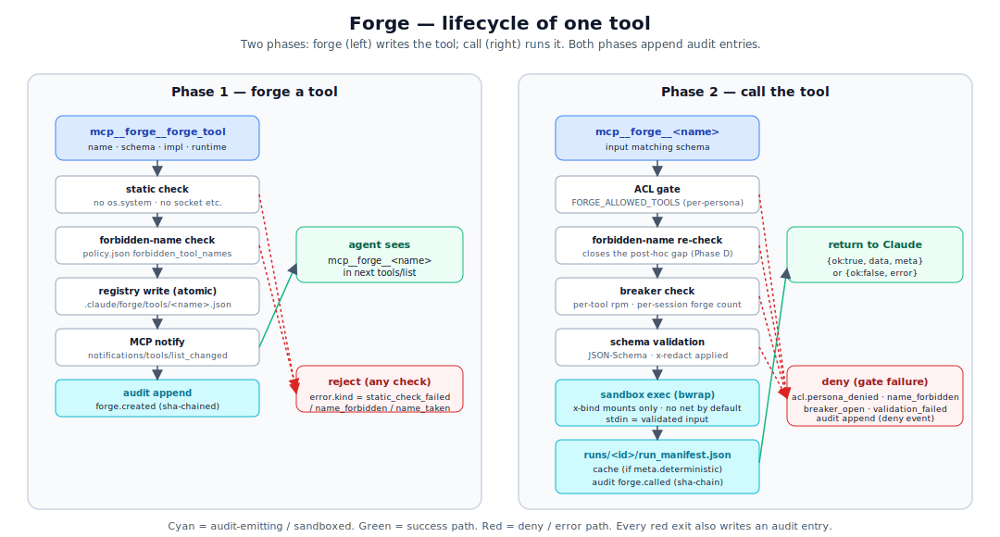

# forge.md — runtime tool factory

## Mental model

`forge` is the layer that lets the agent **register a new tool at runtime**, run it inside a sandbox, and have every call appear in a tamper-evident audit log. The forged tool becomes callable via the standard MCP surface (`mcp__forge__<name>`) on the very next `tools/list`, in the same session that forged it.

Three properties hold by construction:

- **Schema-bound.** Every forged tool has a JSON Schema for its inputs. The runner validates inputs against the schema before exec.
- **Sandboxed.** Every forged tool runs inside `bwrap` with a minimal mount set derived from the schema's `x-bind` annotations. No paths the schema did not name; the network namespace is unshared unless the **operator** opens it for that persona via `policy.persona_sandbox_overrides` (see below).
- **Auditable.** Every call writes a `runs/<id>/run_manifest.json` and appends one entry to the SHA-chained audit log. Inputs marked `x-redact: true` are replaced with `<redacted>` in the manifest; the tool itself sees the real value.

The plugin lives entirely in `operator/forge/`. It imports nothing from voice or cowork. It is splittable into its own repo without touching the rest of the OS.

```
operator/forge/
├── SKILL.md              # the agent-facing reference (when to use forge)
├── forge.py              # thin entry point
├── forge/                # the actual modules
│   ├── policy.json          # bundle defaults — namespaces + sandbox overrides
│   ├── mcp_server.py        # MCP wire layer (forge_tool / forge_promote / forge_list)
│   ├── registry.py          # on-disk tool table (single root)
│   ├── multi_registry.py    # workspace-scope shadowing (task/session/project/user)
│   ├── runner.py            # exec + result envelope (incl. truncation → artifact spill)
│   ├── sandbox.py           # bwrap wrapper (network: unshared by default, share-net opt-in)
│   ├── permissions.py       # per-persona ACL enforcement
│   ├── policy.py            # forbidden names + breakers + persona_namespaces + persona_sandbox_overrides
│   ├── breakers.py          # rate / count limiters
│   ├── paths.py             # CORVIN_HOME resolver
│   ├── scope.py             # detect_scope / scope_root for the four workspace levels
│   ├── runs.py              # run_manifest writer + artifact dir
│   ├── security_events.py   # SHA-chained audit log
│   ├── static_check.py      # impl-string lint before forge_tool succeeds
│   ├── cache.py             # deterministic-result cache (meta.deterministic)
│   └── sync.py              # cross-session promote → user dir
├── examples/             # canonical demo tools
└── tests/                # unit + e2e — see run-all-tests.sh for the live count
```

<p align="center">
  
</p>

## When to forge a tool

The agent (Claude) reaches for `forge_tool` when one of these holds — it is documented this way in `operator/forge/SKILL.md` so the agent applies the same rule consistently:

- The same Bash/Python snippet is being written ≥ 3× with different parameters (paths, columns, thresholds)
- Precise numerical results over a dataset are required (statistics, regression, aggregation, filtering, splitting)
- The user wants the answer **written to a file** (CSV, JSON, PNG)
- The user uses words like *"deterministic"*, *"reproducible"*, *"save as"*, *"compute exactly"*, *"audit trail"*
- A computed result will be reused later — caching it as a tool gets reuse for free

When *not* to forge:

- One-off shell commands (`wc -l`, `git status`) — Bash is the right tool
- LLM-shaped work (code review, translation, design discussion) — Claude itself is the right "tool"
- An existing forged tool already does this — call it instead
- The data lives only in the conversation context — Bash + a heredoc is cheaper than codifying a tool

These are guidelines, not gates; the agent decides per-call. A forged tool that turns out to be one-shot just sits in the registry.

## Lifecycle of one tool

### 1. Forge

```python
mcp__forge__forge_tool({
    "name": "fib",
    "description": "Compute the nth Fibonacci number, deterministically.",
    "input_schema": {
        "type": "object",
        "properties": {
            "n": {"type": "integer", "minimum": 0, "maximum": 1000}
        },
        "required": ["n"]
    },
    "impl": (
        "import sys, json\n"
        "n = json.loads(sys.stdin.read())['n']\n"
        "a, b = 0, 1\n"
        "for _ in range(n): a, b = b, a + b\n"
        "print(json.dumps({'ok': True, 'data': {'value': a}, 'meta': {'deterministic': True}}))\n"
    ),
    "runtime": "python3.11",
    "meta": {"deterministic": True}
})
```

What happens:

1. **Static check** (`static_check.py`) — the `impl` string is scanned for obviously dangerous patterns (no `os.system`, no `socket` outside opt-in network mode, etc.). Failures are returned as `error.kind = "static_check_failed"`.
2. **Forbidden-name check** (`policy.py`) — `policy.json`'s `forbidden_tool_names` is mtime-loaded; if `name` matches, `error.kind = "name_forbidden"`. This check runs again at *call* time, so a name added to the policy *after* the tool was forged still blocks it.
3. **Registry write** (`registry.py`) — atomic write of `<workspace>/forge/tools/<name>.json` with the schema, impl, runtime, meta.
4. **MCP notification** — the server emits `notifications/tools/list_changed`. Claude Code re-issues `tools/list` on its next iteration; `mcp__forge__fib` shows up.
5. **Audit append** — `forge.created` event with name, schema fingerprint, runtime, persona, sha-chain.

### 2. Call

```python
mcp__forge__fib({"n": 100})
```

What happens, in order:

1. **ACL gate** (`permissions.py`) — if `FORGE_ALLOWED_TOOLS` is set on the persona, `fib` must be on the list. Otherwise `acl.persona_denied`.
2. **Forbidden-name re-check** — same `policy.py` table, *now* including any rule added since forge time. This is the post-hoc check that closes the "tool forged before policy edit" gap.
3. **Breaker check** (`breakers.py`) — per-tool rate limit, per-session forge count. Trip → `breaker_open` with the breaker name and reset-time.
4. **Schema validation** — input must match the JSON Schema. Reject with `error.kind = "validation_failed"`.
5. **Sandbox spawn** (`sandbox.py`, `runner.py`) — `bwrap` with the mount set derived from `x-bind` annotations. Stdin = the validated input as JSON.
6. **Capture stdout** — must parse as a JSON object. Either form is accepted:
   - `{"ok": true, "data": {...}, "meta": {...}}`
   - `{"ok": false, "error": {"kind": "...", "message": "..."}}`
7. **Run manifest write** (`runs.py`) — `runs/<ts>_<id>/run_manifest.json` with redacted inputs, exit code, captured stdout, sandbox config.
8. **Cache** (`cache.py`) — if `meta.deterministic == True`, the result is keyed by `(name, schema_fingerprint, input_hash)` and stored. Subsequent identical calls skip the sandbox.
9. **Audit append** — `forge.called` event with name, persona, ok/err, run_id, sha-chain.
10. **Return** — the JSON envelope back to Claude.

### 3. Promote (optional)

```python
mcp__forge__forge_promote({"name": "fib"})
```

Copies `<workspace>/forge/tools/fib.json` into `~/.config/corvin-voice/forge/tools/fib.json`. The user-dir tools are loaded *first* by every new session, so a promoted tool is available everywhere — not just in the project that created it.

`sync.py` handles the cross-session details (atomic write, version-stamping, conflict detection if the same name was promoted from two projects with different impls).

## Schema annotations

The `input_schema` is plain JSON-Schema with three forge-specific extensions:

| Annotation | Effect |
|---|---|
| `"x-bind": "ro"` | The path-typed field becomes a read-only bind mount inside the sandbox |
| `"x-bind": "rw"` | The path (or its parent dir) becomes a read-write bind mount |
| `"x-redact": true` | The field is replaced with `"<redacted>"` in `run_manifest.json` — the tool itself still sees the real value |

The runner derives the sandbox mount set from `x-bind` and only those paths. A forged tool that wants to read `/tmp/x.csv` *must* declare a path field with `x-bind: ro`; without that, the sandbox simply does not see `/tmp/x.csv`.

`x-redact: true` masks a field in the manifest copy while still passing the real value to the tool — useful when the *user* of the tool supplies the secret in the call payload (legacy shape).

## Secret injection (`meta.secrets`) — capability-style

For secrets the **operator** owns (API keys, service tokens) — as opposed to secrets supplied per call by the user — `meta.secrets` is the right tool. The value never enters the LLM context, the payload, the manifest, or the cache key:

```python
mcp__forge__forge_tool(
    name="research.fetch",
    description="...",
    input_schema={...},
    impl="""#!/usr/bin/env python3
import os, json, sys
key = os.environ["OPENAI_API_KEY"]   # ← provided by the runner
# ... use the key ...
""",
    meta={"secrets": ["OPENAI_API_KEY"]},
)
```

Three cooperating gates make this safe:

1. **Vault** at `~/.config/corvin-voice/secrets.json` (mode `0600`, override via `CORVIN_SECRET_VAULT`). The runner reads it on every call (no caching), maps `meta.secrets` names to values, and merges them into the bwrap subprocess env under the same name. Wrong file mode, malformed JSON, or non-string values are rejected with `VaultError` and audited as `secret.vault_malformed`.

2. **Persona allow-list** in workspace `policy.json` — fail-closed. A persona with no `persona_secret_allow` entry cannot use *any* secret, even if the vault has the key. Operator authorises explicitly per persona:

   ```jsonc
   {
     "persona_secret_allow": {
       "research": ["OPENAI_API_KEY"],
       "browser":  []
     }
   }
   ```

3. **Recursive output redaction**. After the tool's stdout JSON is parsed, the runner walks the structure (depth cap 32) and replaces any string-leaf containing a literal secret value with `<redacted>`. Same for stderr (literal substitution). This catches accidental `print(json.dumps(dict(os.environ)))` patterns from buggy tools without breaking the tool's intentional structured output.

**Failure modes (all fail-closed):**

| Case | Exception | Audit event |
|---|---|---|
| Persona lacks allow-entry | `SecretACLDenied` | `acl.persona_secret_denied` |
| Vault missing the key | `SecretMissing` | `secret.vault_missing` |
| Vault file unreadable / wrong mode | `SecretMissing` (raised from `VaultError`) | `secret.vault_malformed` |
| Tool prints secret accidentally | (transparent — value redacted) | `tool.secrets_injected` (names only) |

**Cache safety.** Secret values never enter the cache key (it's derived from the payload, secrets are in the vault). A cache replay returns the previously-redacted envelope without re-injecting the value: the tool was not executed, the value did not leave the runner.

**`x-redact` vs `meta.secrets`.** Use `x-redact: true` when the *user* supplies the secret in the call (e.g. a one-off API key for a research session). Use `meta.secrets` when the *operator* owns the secret and every call should reach the tool with it set. Both can coexist in the same tool.

## Output convention

Every forged tool prints **one** JSON object to stdout. Two shapes are accepted; the runner sniffs the `ok` field:

**Success:**
```json
{
  "ok": true,
  "data": { /* whatever the tool produced */ },
  "meta": {
    "deterministic": true,
    "files": ["/some/path.csv"]
  }
}
```

**Failure:**
```json
{
  "ok": false,
  "error": {
    "kind": "domain_specific_kind",
    "message": "Human-readable explanation"
  }
}
```

`meta.deterministic` is the cache hint — set it to `true` only if the tool is a pure function of its input. `meta.files` is the optional list of files the tool wrote, surfaced in the run manifest so a later session can find them.

## Sandbox

`bwrap` (Linux) is the isolation primitive. The runner builds a minimal mount set:

- `/usr`, `/lib`, `/lib64`, `/etc/{ld.so.cache,resolv.conf,ssl,ca-certificates}` (read-only when present) — enough for Python / Node runtimes to start, plus DNS + TLS roots when the operator opens the network namespace.
- `/tmp` is *its own tmpfs* per run, not shared with the host
- Each `x-bind: ro|rw` path becomes a bind mount with the declared mode
- The network namespace is **unshared by default** (no loopback, no outbound). The operator opts a persona in via `policy.persona_sandbox_overrides`; the runner reads `FORGE_PERSONA` env, calls `Policy.network_for_persona(persona)`, and adds `--share-net` to the bwrap command for permitted personas. Bundle default permits `browser` and `research` — every other persona keeps the strict deny.
- **Loopback-deny (Layer 16).** Even with `--share-net`, a sitecustomize shim patches `socket.connect` / `connect_ex` to refuse `127.0.0.0/8`, `::1`, `localhost` aliases, and IMDS `169.254.169.254`. Default for `network: allow` is **deny loopback**; opt-in via `loopback: allow` per persona override. The audit event labels the run `bwrap+net-noloop` (default) or `bwrap+net` (opt-in). Caveat: only Python sockets are patched — a Bash tool running `curl http://127.0.0.1` bypasses the shim.

The sandbox does *not* protect against:

- Bugs in the runtime (a bad Python interpreter is still a bad Python interpreter)
- Side-channel attacks at the host level
- Excessive resource use *within* the declared mounts (no cgroup limits in v1; the breakers are the resource gate)

It does protect against:

- A forged tool reading paths it never declared
- A forged tool writing into directories it only declared `ro`
- A forged tool reaching the network from a persona that has no `network: allow` entry
- A forged tool calling another forged tool *outside* the registry (no MCP socket inside the sandbox)

## Per-persona allowlist

When a persona declares `FORGE_ALLOWED_TOOLS=fib,csv_filter,plot_xy`:

- The cowork resolver expands `{{ALLOWED_FORGED_TOOLS}}` in `append_system` so the agent's system prompt lists exactly those tools.
- `permissions.py` rejects calls to anything else with `acl.persona_denied`.
- The persona's *registry view* still includes every forged tool (`tools/list` is unfiltered) so the agent can *see* what is on the box; calling something off-list fails fast.

When `FORGE_ALLOWED_TOOLS` is unset, every forged tool is callable. This is the right default for personas like `coder` that want full agency.

## `policy.json`

```jsonc
{
  "forbidden_tool_names": [
    "rm_*",
    "*_secret_*",
    "deploy_prod"
  ],
  "breakers": {
    "per_tool_rpm": 30,
    "per_session_forge_count": 50
  },
  "persona_namespaces": {
    "assistant": "assistant",
    "coder":     "code",
    "browser":   "web",
    "research":  "research",
    "inbox":     "inbox",
    "homeassistant": "ha"
  },
  "persona_sandbox_overrides": {
    "browser":  {"network": "allow"},
    "research": {"network": "allow"}
  }
}
```

- **`forbidden_tool_names`** — glob patterns. Names that match are rejected at forge time *and* re-checked at call time. The post-hoc check is the new bit in Phase D.
- **`breakers`** — open after the threshold; closed after a configurable cooldown. Trip events are audited.
- **`persona_namespaces`** — registration prefix per persona. `coder` may only register tool names starting with `code.`; cross-persona collisions emit `tool.namespace_denied`.
- **`persona_sandbox_overrides`** — relax single sandbox axes per persona. Only the `network: allow` axis is configurable today. The bundle default opens the namespace for `browser` and `research`; workspace `policy.json` can append entries or flip a persona back to deny (`{"browser": {"network": "deny"}}`).

The file is loaded with an mtime cache: edits take effect on the next call. Reload events appear in the audit stream as `policy.reloaded` (or `policy.reload_failed` if the file is malformed). A misformatted edit does *not* break running tools — the previous valid policy stays in force, and the failure is visible in the audit log.

## Audit

Every forge event appends to a single SHA-chained file. The chain is:

```
entry_n.sha = sha256(entry_n.payload || entry_{n-1}.sha)
```

`voice-audit verify` walks the chain end-to-end and points at the first broken link. `voice-audit tail` streams new entries.

Forge audit events:

| Event | When |
|---|---|
| `forge.created` | A new tool was registered |
| `forge.called` | A tool was invoked (regardless of ok / err) |
| `forge.promoted` | A tool was copied into the user dir |
| `policy.reloaded` | `policy.json` changed and was re-loaded successfully |
| `policy.reload_failed` | `policy.json` changed but failed to parse |
| `acl.persona_denied` | A call was rejected by `FORGE_ALLOWED_TOOLS` |
| `tool.namespace_denied` | A persona tried to register a name outside its prefix |
| `path_gate.denied` | The layer-10 hook blocked a direct write into the forge / skill-forge workspaces |
| `session.reset` / `session.timeout` | Layer-8 lifecycle event — chat session was wiped |
| `breaker_open` / `breaker_closed` | A breaker tripped or recovered |

Bridge events (chat lifecycle, `/persona`, `/all`, `/stop`) chain into the *same* file via `bridges/shared/audit.py`. One `voice-audit verify` covers tools and chats together.

## Race conditions and how forge handles them

| Race | What happens | How forge handles it |
|---|---|---|
| `forge_tool` returns before `tools/list_changed` is observed | A direct call to `mcp__forge__<name>` might 404 | Wait one tick (one MCP message round-trip) between forge and call. The agent prompt makes this explicit; tests use a 50ms sleep. |
| Two threads forge the same name | Atomic write to `<name>.json.tmp` then rename; second writer hits `EEXIST` | `error.kind = "name_taken"` returned to the loser |
| `policy.json` edited mid-call | `policy.py` re-loads at next call boundary | The in-flight call uses the policy snapshot it loaded; the *next* call sees the new policy |
| Cache hit while sandbox is starting | First call's manifest writes happen even if a concurrent identical call serves from cache | The non-cached call writes a `cache_seed` manifest; cached calls write a `cache_hit` manifest pointing at the seed. Both are audited. |
| `~/.config/corvin-voice/forge/` corrupted by external editing | Registry refuses to load malformed entries | Audit log records `registry.load_failed` with the file path; tool is hidden until corrected |

## Standalone vs. integrated

Three configurations work today:

### Standalone (no voice, no cowork)

Install the forge MCP server in a project's `.claude/mcp_servers.json`:

```jsonc
{
  "mcpServers": {
    "forge": {
      "command": "python3",
      "args": ["/abs/path/to/operator/forge/forge.py"]
    }
  }
}
```

That is it. `mcp__forge__forge_tool` is available; no bridge, no audit-log link to chat events. This is the most likely shape for a future split into its own repo.

### With cowork (no bridges)

Same as standalone, plus a persona that declares `FORGE_ALLOWED_TOOLS`. The resolver expansion of `{{ALLOWED_FORGED_TOOLS}}` makes the agent's discoverable surface match its callable surface.

### Full Corvin

Everything above, plus `bridges/shared/audit.py` chains bridge events into the same audit file. `voice-audit verify` then covers tools *and* chats in one call.

## Output streaming on truncation

When a forged tool's stdout exceeds `output_cap` (4 MiB default, policy-clamped), the runner spills the **full** bytes to `runs/<id>/artifacts/full_stdout.bin` *before* truncation, and surfaces four meta fields on the envelope:

```jsonc
{
  "ok": true, "data": { "..." },
  "meta": {
    "stdout_truncated":           true,
    "stdout_truncated_at_bytes":  4194304,
    "stdout_total_bytes":         9437184,
    "stdout_full_artifact":       "/.../runs/<id>/artifacts/full_stdout.bin"
  }
}
```

The caller can read the artifact via the standard `Read` tool (the artifact dir is rw-bound for the tool itself, so absolute paths are stable). A small-output tool stays unchanged — these meta fields only land when truncation actually fired. Silent data loss is out of the path.

## forge_list — discovery before forging duplicates

The MCP server exposes `forge_list` alongside `forge_tool` and `forge_promote`:

```jsonc
mcp__forge__forge_list({})            // all visible tools, all scopes
mcp__forge__forge_list({"scope": "session"})   // narrow to one scope
```

The result is `{tools: [{name, description, scope, call_count}, …]}` (in `structuredContent`). Meta-tools (`forge_tool`, `forge_promote`, `forge_list` itself) are filtered out — the caller only sees forged artifacts. The capability brief in every persona's `append_system` tells the agent to call `forge_list` *before* `forge_tool` to avoid creating duplicates of tools that already exist in scope.

## Testing

Forge tests are part of `bash operator/bridges/run-all-tests.sh`. Highlights:

- `test_voice_persona.py` — persona resolves correctly, ACL applies, `{{ALLOWED_FORGED_TOOLS}}` expands
- `test_voice_persona_acl.py` — denied calls audit, allowed calls run, fallback persona behaves
- `test_voice_policy_hotreload.py` — mtime change triggers reload, post-hoc forbidden-name blocks, malformed policy preserves previous
- `test_audit.py` — chain integrity, `voice-audit verify` finds the first break, `voice-audit tail` streams

The test discipline is one fictional E2E per implementation sub-task: real subprocess for MCP, real filesystem for run-workspaces, real `bwrap` for sandbox. No mocks except where a network resource is the only external dependency. Several real bugs were caught only by E2Es — the most recent example is the post-hoc-deny gap (a tool registered before a policy edit could outlive its ban), found by the hot-reload E2E and fixed in Phase D.

## Next

- [security.md](security.md) — the four enforcement surfaces (ACL, policy, sandbox, audit) viewed through the lens of "what does each one catch".
- [agent-behavior.md](agent-behavior.md) — what forging a tool feels like *from inside Claude*.
