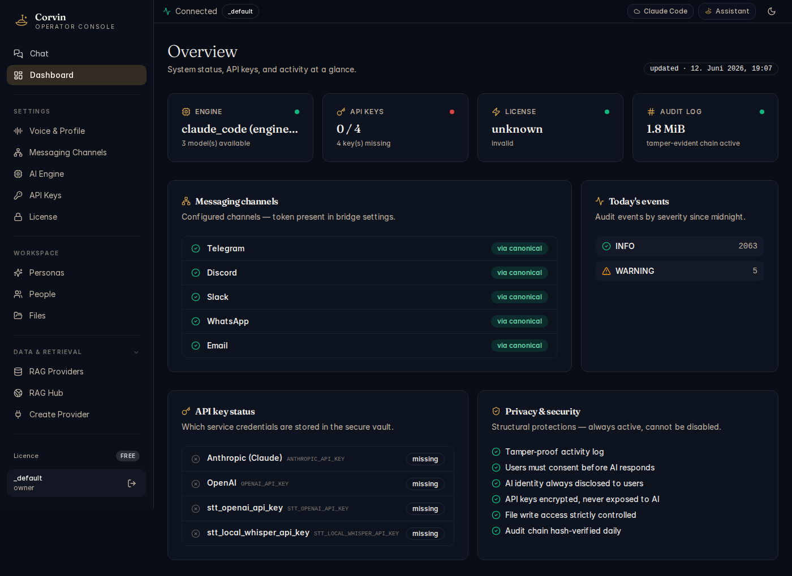

# 01 — Dashboard

[← Handbook Index](README.md) | [Next: Chat →](02-chat.md)

---

## What is this page?

The Dashboard is your **system health at a glance**. It answers four questions at once: Is my AI engine running? Are my API keys configured? Are my messaging bridges online? Has anything gone wrong today?

Open it any time you want to verify that CorvinOS is healthy or to quickly navigate to the setting that needs attention.

---

## Screenshot



*The Dashboard showing 5 connected bridges, Claude Code engine active, 2063 INFO + 5 WARNING audit events today, and 4 API keys missing.*

---

## UI Elements

### Top status bar

| Element | Meaning |
|---|---|
| **Connected** badge (green) | The console has an active WebSocket connection to the CorvinOS daemon |
| **`_default`** pill | The active tenant namespace |
| **Claude Code** / **Assistant** buttons | Quick-switch between the primary engine and the assistant persona |
| Moon icon | Toggle dark / light theme |

### Status cards (top row)

| Card | What it shows |
|---|---|
| **ENGINE** | Active engine name (`claude_code`) + number of available models. Green dot = engine responding. |
| **API KEYS** | `N / total` — how many keys are stored. Red dot = at least one key is missing that a provider needs. |
| **LICENSE** | Active tier (FREE, MEMBER, ENTERPRISE). Shows "unknown / invalid" when no licence key is installed. |
| **AUDIT LOG** | Size of the tamper-evident hash chain on disk. Green dot = chain integrity verified. |

### Messaging channels panel

Lists every configured bridge with its connection status.

| Icon | Meaning |
|---|---|
| Green circle | Bridge is connected and authenticated |
| **via canonical** badge | Bridge is routed through the CorvinOS canonical bridge path |

Click any bridge name to jump directly to its configuration in [Messaging Channels](04-messaging-channels.md).

### Today's events panel

Counts audit events emitted since midnight, grouped by severity:

| Severity | Typical cause |
|---|---|
| **INFO** | Normal operations — AI turns, bridge connects, API calls |
| **WARNING** | Non-fatal issues — rate limits hit, retries, missing optional config |
| **ERROR / CRITICAL** | Always investigate immediately |

### API key status panel

Shows which service credentials are stored in the encrypted vault:

| Key | Used by |
|---|---|
| **Anthropic (Claude)** | `ANTHROPIC_API_KEY` — required for Claude Code and Claude API engines |
| **OpenAI** | `OPENAI_API_KEY` — required for OpenAI engines, DALL-E image generation |
| **stt_openai_api_key** | OpenAI Whisper for speech-to-text transcription |
| **stt_local_whisper_api_key** | Local Whisper fallback (pywhispercpp) |

A **missing** badge means the key is not in the vault. The engine will fail when it tries to call that provider.

### Privacy & security panel

These six protections are **always active** and cannot be disabled — they are structural compliance guarantees:

- Tamper-proof activity log (hash-chained audit)
- Users must consent before AI responds (GDPR consent gate)
- AI identity always disclosed to users (EU AI Act Art. 50)
- API keys encrypted, never exposed to AI
- File write access strictly controlled (path-gate hook)
- Audit chain hash-verified daily

---

## Typical actions

### Check if everything is healthy

Look at all four status cards. All should show green dots. If the API KEYS card shows a red dot, go to [API Keys](07-api-keys.md) and add the missing keys.

### Navigate to a failing bridge

Click a bridge name in the Messaging channels panel. You land directly on its configuration page in [Messaging Channels](04-messaging-channels.md).

### Investigate warnings

If Today's events shows WARNING or ERROR counts, click the count or navigate to the audit log via the CLI:

```bash
voice-audit tail --tenant _default
```

---

[← Handbook Index](README.md) | [Next: Chat →](02-chat.md)
