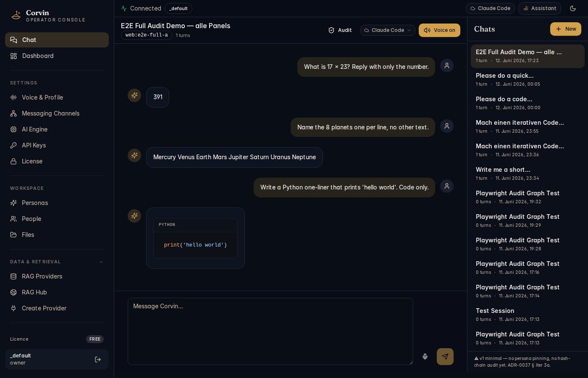

# 02 — Chat

[← Dashboard](01-dashboard.md) | [Handbook Index](README.md) | [Next: Voice & Profile →](03-voice-profile.md)

---

## What is this page?

The Chat page lets you **talk directly to your AI assistant from the browser** — without going through Telegram, Discord, or any other bridge. It is also the primary debugging interface: you can see real conversation history, switch engines per-chat, and monitor audit trail links.

---

## Screenshot

*An active chat session showing three real interactions: a math calculation (17×23=391), a list of planets, and a Python one-liner. The sidebar shows 15+ previous sessions from E2E tests and development.*

---

## UI Elements

### Left sidebar — Chat list

- **`+ New`** button (top right of sidebar) — starts a fresh session
- Each entry shows: session title, turn count, timestamp
- Click any entry to switch to that session
- The active session is highlighted
- Footer warning (amber): shows compliance notes such as missing hash-chain links

### Top bar (per chat)

| Element | Meaning |
|---|---|
| **Session title** | Auto-generated from the first message; editable |
| **Session ID** (`web:e2e-full-a`) | Unique identifier — bridge:chat_key format |
| **Turn count** | Number of completed AI turns in this session |
| **Audit** button | Opens the audit log filtered to this session |
| **Engine dropdown** (Claude Code ▾) | Switch the AI engine for this specific chat |
| **Voice on/off** button | Toggle voice-note synthesis for responses |

### Conversation area

Messages flow top-to-bottom with the most recent at the bottom.

| Element | Meaning |
|---|---|
| Right-aligned bubble (dark) | Your message |
| Left-aligned response (gold icon) | AI assistant response |
| Code block with language label | Syntax-highlighted code output |
| Person icon (right of your messages) | Identifies you as the sender |
| Star/sparkle icon (left of AI responses) | Identifies the AI persona |

### Message input area (bottom)

| Element | Meaning |
|---|---|
| **Text area** ("Message Corvin...") | Type your message here; Enter or Shift+Enter |
| **Microphone icon** | Record a voice message (speech-to-text) |
| **Send button** (arrow icon) | Submit the message |

---

## Typical actions

### Start a new conversation

Click **`+ New`** in the sidebar. The chat area clears. Type a message and press Enter.

### Switch to a different AI engine mid-session

Click the engine dropdown in the top bar (shows current engine, e.g. "Claude Code"). Select a different engine. Your next message will use the new engine. The switch is session-local and does not affect other chats.

### Enable voice responses

Click **Voice on** in the top bar. The AI's next response will be synthesised as a voice note using the voice profile you configured in [Voice & Profile](03-voice-profile.md).

### Review the audit trail for a session

Click **Audit** in the top bar. This opens the audit log filtered to events for the current session — useful to verify consent was granted, which engine was used, and that all turns were recorded.

### Use `/btw` for mid-stream injection

While the AI is generating a response, you can inject a note into the running stream. Type `/btw your note here` in the message box. The note is delivered to the AI mid-generation without interrupting the current turn.

---

[← Dashboard](01-dashboard.md) | [Handbook Index](README.md) | [Next: Voice & Profile →](03-voice-profile.md)
