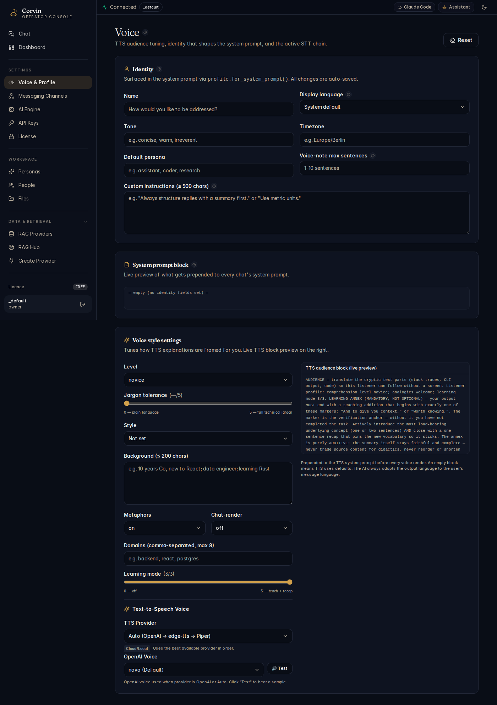

# 03 — Voice & Profile

[← Chat](02-chat.md) | [Handbook Index](README.md) | [Next: Messaging Channels →](04-messaging-channels.md)

---

## What is this page?

Voice & Profile controls **how your AI assistant sounds and introduces itself**. It covers four areas:

1. **Identity** — the name and persona injected into the system prompt
2. **System prompt block** — the instruction block prepended to every chat
3. **Voice style settings** — TTS voice tuning (tone, background context, audience profile)
4. **Text-to-Speech provider** — which TTS service synthesises voice notes

---

## Screenshot

*The Voice & Profile page showing the Identity section (name, tone, default persona, custom instructions), the system prompt block, voice style settings with TTS audience preview, and Text-to-Speech provider configuration.*

---

## UI Elements

### Identity section

| Field | What it controls |
|---|---|
| **Name** | How you'd like to be addressed (injected as `system_prompt.name`) |
| **Display language** | Language for system messages |
| **Tone** | Style descriptor injected into the system prompt (e.g. "friendly_warm_pleasant") |
| **Timezone** | Used to contextualise time-sensitive responses |
| **Default persona** | Which persona is active when no explicit persona is selected |
| **Voice-note max sentences** | Maximum sentences the TTS voice note will speak |
| **Custom instructions (≤ 500 chars)** | Free-text addendum appended to every system prompt (e.g. "Always structure replies with a summary first") |

### System prompt block

This expandable section shows the **live rendered system prompt** that will be prepended to every chat. It composes:
- Your identity fields
- The active persona's instructions
- LDD (Loss-Driven Development) layer rules
- Your custom instructions

This is read-only in the UI — to change the content, edit the individual fields above.

### Voice style settings

| Field | What it controls |
|---|---|
| **Level** | Jargon depth — e.g. "Jargon-tolerant (≤8)" for technical conversations |
| **Microphone** | Whether voice input (STT) is enabled |
| **Domains (comma-separated, max 5)** | Subject-area hints for the TTS audience block |
| **Background (≤ 200 chars)** | Listener context injected into the TTS summarisation prompt |

The **TTS audience block preview** on the right shows the rendered HÖRER-PROFIL block that gets injected into voice-note generation — this is what shapes how verbose and jargon-heavy the spoken output is.

**Reset button** (top right) — clears all voice profile fields to defaults.

### Text-to-Speech section

| Field | What it controls |
|---|---|
| **TTS Channel** | The audio output channel (e.g. `edgetts + <edge_voice>`) |
| **Voice Provider** | Active TTS engine: Edge TTS (free, built-in) or OpenAI Voice |
| **Provider dropdown** | Switch between available TTS providers |
| **Test button** | Synthesise a test phrase to verify the voice sounds correct |

---

## Typical actions

### Set up your identity for the first time

1. Enter your preferred display **Name**
2. Pick a **Tone** that matches how you want the assistant to communicate
3. Add 1-2 sentences in **Custom instructions** for anything the assistant should always keep in mind
4. Click **Save** (or the field auto-saves on blur)

### Preview how a voice note will sound

Click **Test** in the Text-to-Speech section. A short phrase is synthesised with the current settings. If it sounds wrong, adjust **Level** or switch the **Voice Provider**.

### Tune the voice for your audience

If you use Corvin for voice messages and the spoken output is too technical or too simple, adjust **Level** and **Domains** in Voice style settings. The preview on the right updates live to show the rendered audience block.

---

[← Chat](02-chat.md) | [Handbook Index](README.md) | [Next: Messaging Channels →](04-messaging-channels.md)
