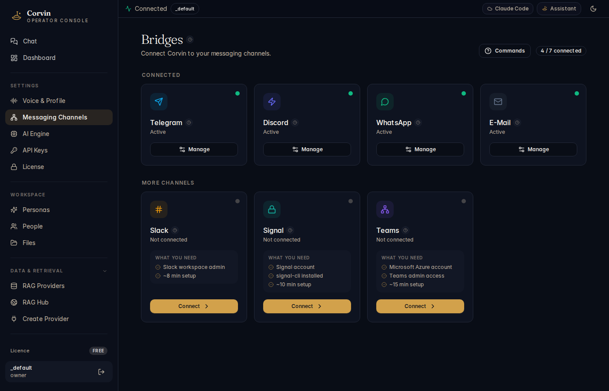

# 04 — Messaging Channels

[← Voice & Profile](03-voice-profile.md) | [Handbook Index](README.md) | [Next: AI Engine →](05-ai-engine.md)

---

## What is this page?

Messaging Channels is where you **connect CorvinOS to external chat platforms**. Each platform is a "bridge" — a separate process that authenticates to the service, receives messages, and forwards them to the AI engine.

Supported bridges: **Telegram**, **Discord**, **WhatsApp**, **Slack**, **Email** (IMAP/SMTP), **Signal**, **Microsoft Teams**.

---

## Screenshot



*Messaging Channels showing multiple bridges — Telegram, Discord, Slack, WhatsApp, and Email connected (green), Signal and Teams showing setup requirements.*

---

## UI Elements

### Bridge list

Each bridge card shows:

| Element | Meaning |
|---|---|
| **Green circle** | Bridge is online and authenticated |
| **Orange / grey circle** | Bridge is offline, misconfigured, or not yet set up |
| **Bridge name** | Platform name (Telegram, Discord, etc.) |
| **Status line** | Active connection details or what is missing |
| **Settings icon** | Open per-bridge configuration |
| **Connect / Disconnect button** | Start or stop the bridge process |

### Per-bridge configuration (click Settings)

Each bridge has platform-specific fields:

**Telegram** — Bot token (from @BotFather), optional webhook URL.

**Discord** — Bot token, Application ID, optional Guild ID to restrict to one server.

**WhatsApp** — QR-code pairing via Baileys library; phone number displayed after pairing.

**Slack** — OAuth App credentials (Bot Token, Signing Secret, App Token for Socket Mode).

**Email** — IMAP host/port/user/password + SMTP host/port/user/password.

All tokens are stored in the **encrypted vault** (`~/.config/corvin-voice/secrets.json`, mode 0600) — they are never written to plain text files or exposed to the AI.

### Whitelist

Each bridge has a user whitelist. Only users on the list can interact with the AI. This is the primary access-control gate.

---

## Typical actions

### Add a Telegram bot

1. Go to Telegram, open a chat with @BotFather, send `/newbot`, follow the prompts.
2. Copy the **Bot Token** (format: `123456789:AABBCCDDEEFFaabbccddeeff`).
3. In Messaging Channels, click the **Telegram** settings icon.
4. Paste the token into the **Bot Token** field and click **Save**.
5. Click **Connect**. The status turns green when the bot is online.
6. Add your Telegram user ID to the whitelist.

### Add a Discord bot

1. Create an application at discord.com/developers. Add a Bot user. Copy the **Bot Token**.
2. Enable the **Message Content Intent** and **Server Members Intent** in the bot settings.
3. In Messaging Channels, paste the token and your **Application ID**.
4. Invite the bot to your server using the OAuth2 URL generator (scopes: `bot`, permissions: `Send Messages`, `Read Messages`).
5. Click **Connect**.

### Add a user to the whitelist

In the bridge's settings panel, find the **Whitelist** section. Add the user's platform ID (Telegram user ID, Discord user ID, etc.). The format is platform-specific — Discord uses numeric IDs, Telegram uses numeric user IDs.

### Restart a bridge after config changes

Click **Disconnect**, wait for the status to turn grey, then click **Connect**. This is also available from the CLI:

```bash
bridge.sh restart telegram
```

---

[← Voice & Profile](03-voice-profile.md) | [Handbook Index](README.md) | [Next: AI Engine →](05-ai-engine.md)
