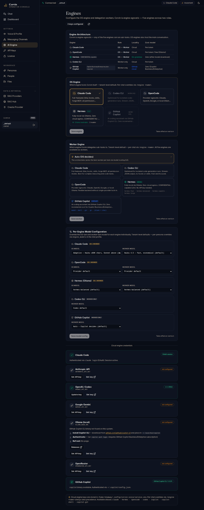

# 05 — AI Engine

[← Messaging Channels](04-messaging-channels.md) | [Handbook Index](README.md) | [Next: Engine Control Center →](06-engine-control-center.md)

---

## What is this page?

AI Engine is where you **select and configure which AI engine powers your assistant** at the tenant level. CorvinOS supports five engines with different capabilities, cost profiles, and data-residency guarantees.

For live per-session switching and the full capability matrix, see [Engine Control Center](06-engine-control-center.md).

---

## Screenshot



*The AI Engine settings page showing the architecture overview table, OS engine selector (Claude Code active), per-engine model configuration dropdowns, and worker engine cards with capability indicators.*

---

## UI Elements

### Architecture overview table

This table shows all five engines and their key properties:

| Engine | Type | Key characteristic |
|---|---|---|
| **Claude Code** | OS + Worker | Full capabilities: hooks, /btw live inject, plan mode, MCP tools, skills |
| **Codex CLI** | Worker only | OpenAI Codex via CLI — MCP + stream_json, no /btw |
| **OpenCode** | Worker only | Provider-agnostic: Claude, OpenAI, or local Ollama |
| **Hermes (Ollama)** | Worker only | Fully local, zero cloud egress — qualifies for CONFIDENTIAL data |
| **GitHub Copilot** | Worker only | GitHub Copilot CLI (`copilot -p`) — zero cost for Business/Enterprise licences |

**OS engine** = handles the main conversation turn (the orchestrator).
**Worker engine** = used for sub-tasks delegated by the orchestrator (via `delegate_*` MCP tools).

### OS engine selector

A radio-button list. The selected engine handles all primary conversation turns. **Claude Code is the recommended default** — it is the only engine with the full EAOS (Engine-Agnostic OS Shell) feature set.

### Per-engine model configuration

Each engine has a model dropdown. For Claude Code this controls which Claude model is used:
- **Haiku 4.5** — fast, low cost, used automatically for ≤ 60K character contexts
- **Sonnet 4.6** — balanced, used for larger contexts and complex tasks
- **Opus 4.8** — most capable, for the heaviest reasoning tasks

The system applies **adaptive model selection** by default: Haiku for short contexts, Sonnet above that threshold.

### Worker engine cards

When delegation is enabled (orchestrator persona), these cards show each worker engine's connection status and capability tags.

---

## Typical actions

### Switch to fully local AI (no cloud)

Select **Hermes (Ollama)** as the OS engine. This routes all AI turns through a locally-running Ollama instance. No data leaves your machine. Prerequisites: Ollama running at `http://localhost:11434` with at least one model pulled.

```bash
ollama pull llama3
```

Then click **Save** in the engine settings.

### Configure the default Claude model

In the Claude Code section, open the model dropdown and select your preferred tier. For everyday use, Sonnet 4.6 is the best balance. For long code-generation sessions where every token matters, use Haiku 4.5 for the first pass.

### Enable worker engine delegation

Navigate to [Personas](09-personas.md), select the **Orchestrator** persona, and ensure `delegate_enabled: true` is set. The OS turn (Claude Code) then spawns worker tasks via `delegate_codex`, `delegate_hermes`, etc.

---

[← Messaging Channels](04-messaging-channels.md) | [Handbook Index](README.md) | [Next: Engine Control Center →](06-engine-control-center.md)
