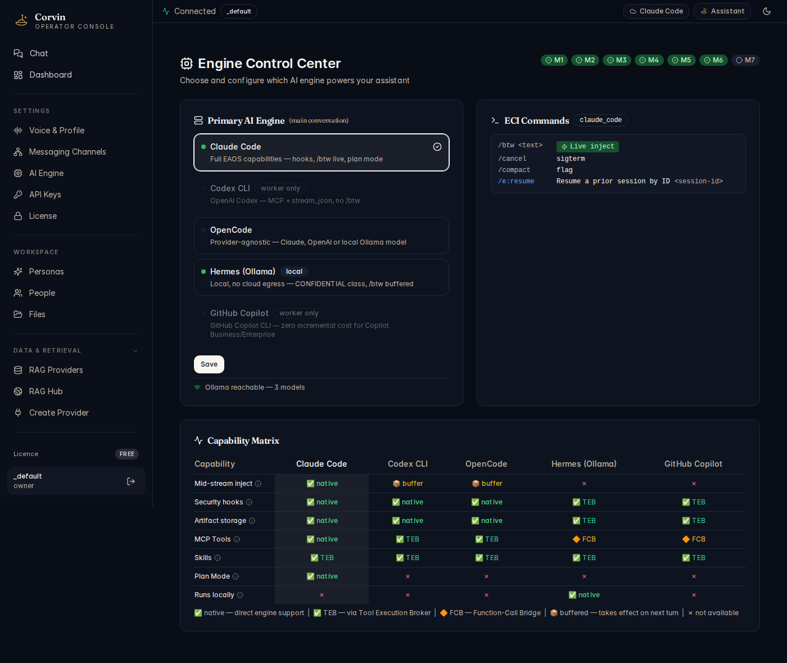

# 06 — Engine Control Center

[← AI Engine](05-ai-engine.md) | [Handbook Index](README.md) | [Next: API Keys →](07-api-keys.md)

---

## What is this page?

The Engine Control Center gives you **fine-grained, live control over the active AI engine**. It shows the full capability matrix across all five engines, lets you switch the primary engine for the current conversation, and displays the Engine Command Interface (ECI) commands available for the active engine.

---

## Screenshot

*The Engine Control Center showing the Primary AI Engine selector (Claude Code active), ECI commands panel, Capability Matrix across all five engines, and Ollama status (3 models reachable).*

---

## UI Elements

### Milestone badges (M1–M7)

At the top right, green milestone badges indicate which phases of the Engine-Agnostic OS Shell (EAOS) are implemented. All green = all engine features active.

### Primary AI Engine panel

A radio list with all five engines. The selected engine handles the next conversation turn.

| Engine card element | Meaning |
|---|---|
| **Green dot** | Engine is available and responding |
| **Grey dot** | Engine is not available (binary not found, API key missing, Ollama offline) |
| **`worker only`** tag | This engine cannot be the OS engine; only usable for delegated sub-tasks |
| **`local`** tag | Engine runs entirely on your machine — no cloud egress |
| Capability description | One-line summary of what makes this engine unique |

Click **Save** after changing the selection.

### ECI Commands panel

Shows the **Engine Command Interface** commands supported by the active engine. These are typed directly in chat as `/e:<cmd>` or as standard commands:

| ECI command | Effect |
|---|---|
| `/btw <text>` | Inject a note into the currently streaming response (live inject) |
| `/cancel` | Send SIGTERM to the current AI turn |
| `/compact` | Set context compaction flag |
| `/e:resume` | Resume a prior session by ID (`<session-id>`) |

The **`Live inject`** badge on `/btw` confirms that mid-stream injection works natively for the active engine (Claude Code). For engines that show **`buffer`**, the injection takes effect on the next turn.

### Capability Matrix

A cross-engine feature comparison table. Columns = engines, rows = capabilities.

| Badge | Meaning |
|---|---|
| **native** (green) | The engine supports this feature natively |
| **TEB** (green) | Feature provided via Tool Execution Broker — works, slightly different path |
| **FCB** (orange diamond) | Feature provided via Function-Call Bridge (for Hermes/Copilot) |
| **buffer** (orange) | Feature works but with one-turn delay |
| **×** (red) | Feature not available on this engine |

Key capabilities:

| Capability | What it means |
|---|---|
| **Mid-stream inject** | `/btw` works while AI is generating (native = real-time, buffer = next turn) |
| **Security hooks** | Pre/post tool hooks for path-gate and audit enforcement |
| **Artifact storage** | Generated files auto-registered in the session artifact store |
| **MCP Tools** | Can call Forge tools, SkillForge, Data tools via Model Context Protocol |
| **Skills** | Reusable skill blocks injected into the system prompt |
| **Plan Mode** | Supports the Claude Code plan/implement cycle |
| **Runs locally** | Zero cloud egress — Hermes (Ollama) is the only engine that qualifies |

### Ollama status (bottom of Primary engine panel)

Shows `Ollama reachable — N models` when a local Ollama instance is running. If Ollama is offline, it shows a warning but does not block other engines.

---

## Typical actions

### Switch to Hermes for a confidential task

If you're working with data classified as CONFIDENTIAL (stays on your machine), select **Hermes (Ollama)** and click **Save**. All subsequent turns use your local model.

### Check why a capability is unavailable

Read the Capability Matrix row for the feature you need. If it shows **×** for your active engine, switch to an engine with **native** or **TEB** support for that capability.

### Confirm /btw live inject works

Look at the ECI Commands panel. If `/btw <text>` shows the **Live inject** badge (green), mid-stream injection is active. If it shows **buffer**, your injection takes effect on the next turn — note this in your workflow.

---

[← AI Engine](05-ai-engine.md) | [Handbook Index](README.md) | [Next: API Keys →](07-api-keys.md)
