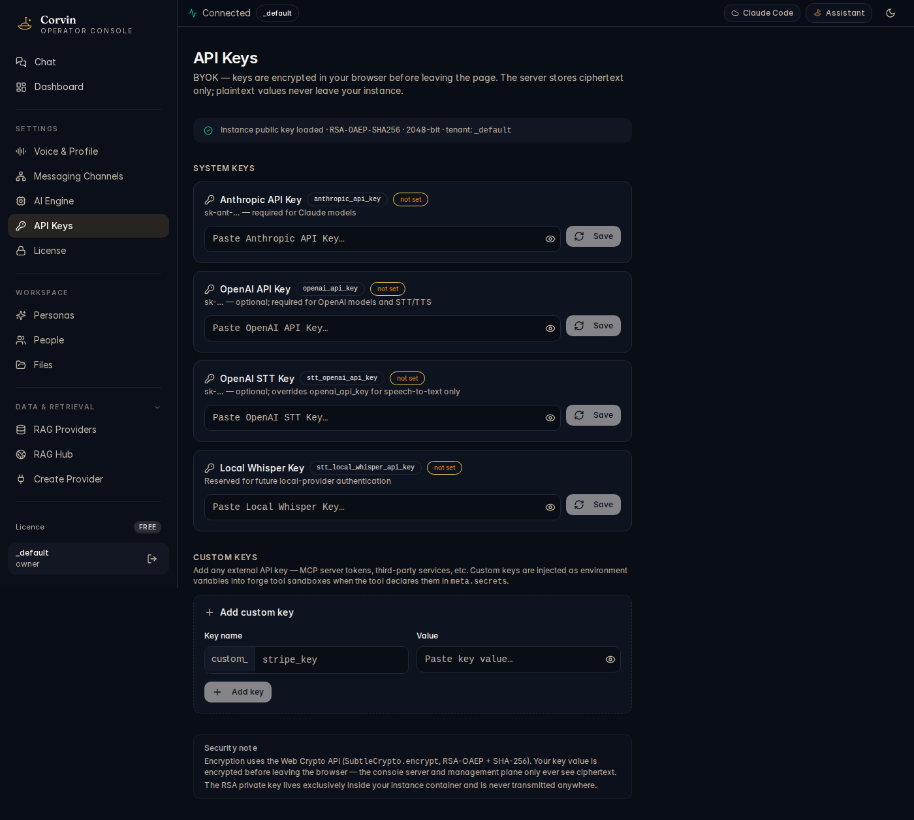

# 07 — API Keys

[← Engine Control Center](06-engine-control-center.md) | [Handbook Index](README.md) | [Next: Personas →](09-personas.md)

---

## What is this page?

API Keys is where you **store service credentials in the encrypted vault**. Keys entered here are encrypted at rest (`~/.config/corvin-voice/secrets.json`, mode 0600), injected into sandboxed processes via environment variables, and **never exposed to the AI language model itself**.

---

## Screenshot

*The API Keys page showing system keys (Anthropic, OpenAI, STT keys) and custom keys, with the security explanation at the bottom.*

---

## UI Elements

### System keys

These are pre-defined keys that CorvinOS knows about and uses automatically when present:

| Key name | Env variable | Used by |
|---|---|---|
| **Anthropic API Key** | `ANTHROPIC_API_KEY` | Claude Code engine, all Claude models |
| **OpenAI API Key** | `OPENAI_API_KEY` | OpenAI GPT engines, DALL-E image generation |
| **OpenAI STT Key** | `STT_OPENAI_API_KEY` | OpenAI Whisper for speech-to-text |
| **Local Whisper Key** | `STT_LOCAL_WHISPER_API_KEY` | pywhispercpp local STT provider |

Each system key shows:
- **Key name** and **env variable name**
- **Status badge**: `set` (key present in vault) or `missing`
- **Value field**: masked input — paste your key and click **Save**

### Custom keys

The **`+ Add custom key`** section lets you store arbitrary secrets:

| Field | Purpose |
|---|---|
| **Key name** | Identifier you choose (used as the env variable name in Forge tools) |
| **Value** | The secret value — stored encrypted, never logged |

Custom keys are available in Forge tools via `meta.secrets` (you reference them by name, never the value).

### Security note (bottom of page)

Explains the architecture: keys are encrypted using the Web Crypto API (built into the browser — AES-256-GCM). The CorvinOS server stores ciphertext only. Decryption happens client-side; the server management plane never sees plaintext values.

---

## Typical actions

### Add your Anthropic API key

1. Go to [console.anthropic.com](https://console.anthropic.com) → API Keys → Create Key.
2. Copy the key (starts with `sk-ant-`).
3. In API Keys, click the value field next to **Anthropic API Key**.
4. Paste the key and click **Save**.
5. The status badge changes from `missing` to `set`.
6. Go to the Dashboard — the API KEYS card should now show fewer missing keys.

### Add a custom key for a Forge tool

1. In API Keys, scroll to **Custom keys**.
2. Enter a name (e.g. `GITHUB_TOKEN`) and paste the value.
3. Click **Save**.
4. In your Forge tool definition, reference it in `meta.secrets: ["GITHUB_TOKEN"]`.

### Rotate a key

Click the value field of an existing key, paste the new value, and click **Save**. The old value is overwritten immediately. Active sessions pick up the new key on the next tool call.

---

[← Engine Control Center](06-engine-control-center.md) | [Handbook Index](README.md) | [Next: Personas →](09-personas.md)
