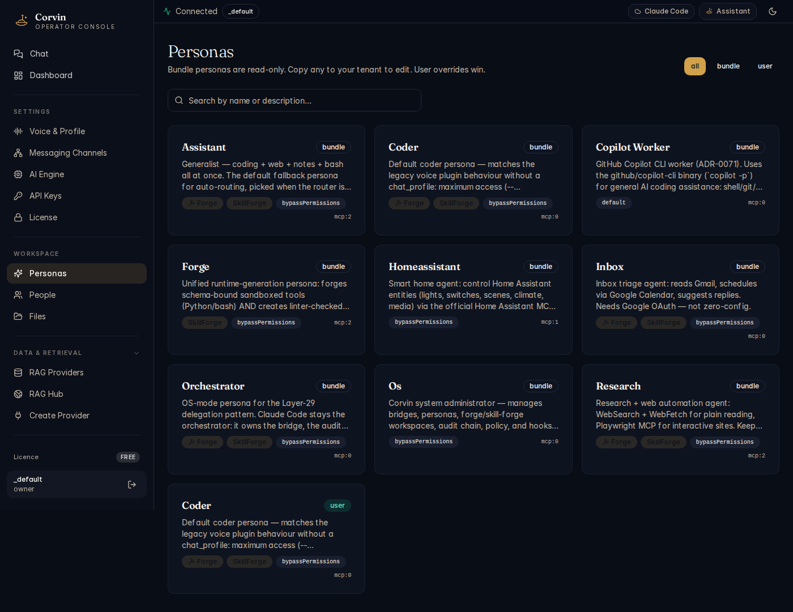

# 09 — Personas

[← API Keys](07-api-keys.md) | [Handbook Index](README.md) | [Next: People →](10-people.md)

---

## What is this page?

Personas are **named AI identities** — each with its own system prompt, engine preference, tool access, and communication style. When a user interacts with CorvinOS via a bridge, the active persona determines how the AI behaves, what it can do, and what tone it uses.

Bundle personas ship with CorvinOS. You can override them or create entirely new ones.

---

## Screenshot



*The Personas grid showing 9 bundle personas: Assistant, Coder, Copilot Worker, Forge, HomeAssistant, Inbox, Orchestrator, OS, and Research.*

---

## UI Elements

### Toolbar

| Element | Meaning |
|---|---|
| **Search by name** | Filter the persona grid |
| **Bundle / Your tenant** toggle | Switch between bundle personas (shipped with CorvinOS) and your custom overrides |
| **Edit** button | Open the JSON editor for a persona |

### Persona card

Each card shows:

| Element | Meaning |
|---|---|
| **Persona name** | Identifier used in routing and chat profiles |
| **Description** | One-line summary of this persona's purpose |
| **Scope badge** | `bundle` = shipped with CorvinOS, `user` = your custom override |
| **Active indicator** | Green dot when this persona is currently active in a chat |
| **Edit button** | Open the persona configuration JSON |

### Bundle personas

| Persona | Purpose |
|---|---|
| **Assistant** | General-purpose. Default for all bridges. Balanced capability set. |
| **Coder** | Software engineering focus. Larger code context, detailed explanations. |
| **Copilot Worker** | GitHub Copilot CLI delegation worker — task-type steering for shell/git/gh. |
| **Forge** | Tool-creation specialist. Has Forge MCP server access by default. |
| **HomeAssistant** | Smart-home automation focus. Home Assistant API integrations. |
| **Inbox** | Email and message triage. Summarisation and routing. |
| **Orchestrator** | Multi-engine delegation. Spawns workers via `delegate_*` MCP tools. |
| **OS** | Direct OS-layer access. Full Claude Code capabilities, no persona wrapping. |
| **Research** | Deep research tasks. Browser tools, web search, long-form synthesis. |

---

## Typical actions

### Override a bundle persona

1. Find the persona card (e.g. **Assistant**).
2. Click **Edit**.
3. The JSON editor opens showing the current bundle configuration.
4. Make your changes (e.g. add custom instructions to `append_system`).
5. Click **Save**. Your override is stored under `~/.corvin/cowork/personas/<name>.json` and takes precedence over the bundle version.

### Pin a persona to a specific chat / bridge

In the bridge settings (Messaging Channels), find the **Chat Profiles** section. Add an entry:

```json
{
  "chat_id": "your-discord-channel-id",
  "persona": "coder"
}
```

All messages in that channel will use the Coder persona.

### Create a new persona

1. Click **Edit** on an existing persona to see the JSON structure.
2. Create a new file at `~/.corvin/cowork/personas/my-persona.json` with your configuration.
3. The new persona appears in the **Your tenant** tab after the next bridge hot-reload.

### Enable skill injection for a persona

In the persona JSON, set `"skill_forge_enabled": true`. Skills promoted to project or user scope will be injected into this persona's system prompt automatically.

---

[← API Keys](07-api-keys.md) | [Handbook Index](README.md) | [Next: People →](10-people.md)
