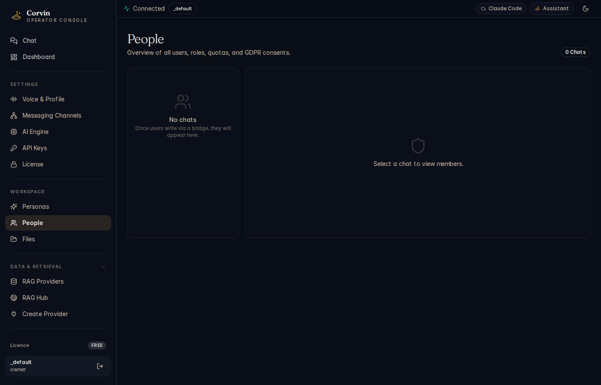

# 10 — People

[← Personas](09-personas.md) | [Handbook Index](README.md) | [Next: Files →](11-files.md)

---

## What is this page?

People shows **every user who has ever interacted with your CorvinOS instance** via any bridge. From here you manage roles (owner / admin / member / observer), check per-user quotas, and see GDPR consent status.

---

## Screenshot



*The People page with two panels: a chat list on the left (currently empty — no external users yet) and a member detail panel on the right.*

---

## UI Elements

### Chat list (left panel)

Lists every bridge chat that has had at least one user interaction. Each entry shows:

| Element | Meaning |
|---|---|
| Chat name | Bridge:chat_key identifier (e.g. `discord:server-id/channel-id`) |
| User count badge | Number of users who have spoken in this chat |
| Last activity | Timestamp of the most recent message |

Click a chat to expand the member list in the right panel.

**`0 Chats` / "No chats"** — no external users have messaged yet. This is normal on a fresh install.

### Member detail panel (right panel)

When a chat is selected, the right panel shows each user's profile:

| Column | Meaning |
|---|---|
| **User ID** | Platform-specific identifier (Telegram user ID, Discord snowflake, etc.) |
| **Role** | owner / admin / member / observer |
| **Quota** | Daily message budget used / limit (admin=500/day, member=100/day, owner=unlimited) |
| **Consent** | GDPR consent status: granted (with TTL) / not granted |
| **Joined** | When the user first interacted |
| **Actions** | Grant role, revoke role, trigger GDPR erasure |

### Role hierarchy

| Role | Can do |
|---|---|
| **owner** | Everything — unlimited quota, full admin |
| **admin** | Manage members, 500 messages/day |
| **member** | Normal conversations, 100 messages/day |
| **observer** | Read-only access to shared transcripts |

Roles are per-chat: a user can be admin in one Discord channel and member in another.

---

## Typical actions

### Grant admin to a user

1. Select the chat from the left panel.
2. Find the user in the member list.
3. Click the role dropdown next to their name.
4. Select **admin**.
5. The change takes effect on the next message from that user.

Alternatively, the user can type `/grant <user_id> admin` in the chat if you have owner role.

### Check if a user has given GDPR consent

Find the user in the member list. The **Consent** column shows:
- Green tick: consent granted (shows expiry TTL if time-limited)
- Red cross: consent not granted — the AI will not respond to this user until they type `/consent on`

### Trigger GDPR erasure for a user

1. Find the user, click **Actions**.
2. Select **Erase data**.
3. Confirm the erasure request. This runs the GDPR Art. 17 erasure orchestrator across all layers (L7/L24/L28/L33). The audit chain pseudonym remains but is no longer traceable.

From the CLI:
```bash
corvin-erasure bridge:chat_key__user_id
```

---

[← Personas](09-personas.md) | [Handbook Index](README.md) | [Next: Files →](11-files.md)
