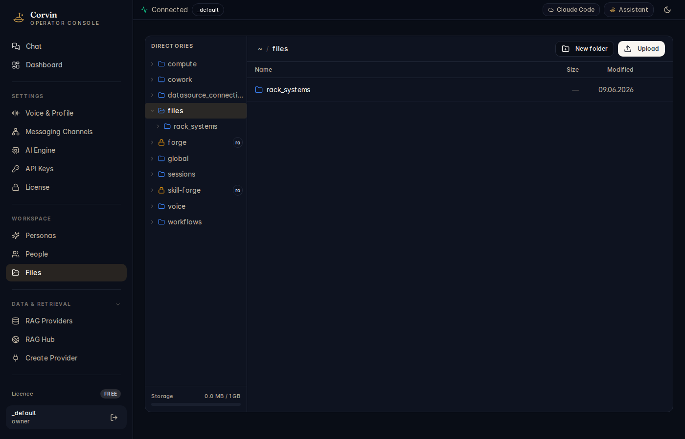

# 11 — Files

[← People](10-people.md) | [Handbook Index](README.md) | [Next: RAG Providers →](12-rag-providers.md)

---

## What is this page?

Files is a **browser-based file manager for the CorvinOS home directory** (`~/.corvin/`). Use it to inspect configuration files, upload reference documents, download generated artifacts, and browse what tools have written.

---

## Screenshot

*The Files browser showing the CorvinOS home directory tree on the left and a file listing on the right. The active folder is `files/rack_systems`. Read-only directories (forge, skill-forge) show a `ro` badge.*

---

## UI Elements

### Directory tree (left panel)

The left panel shows the top-level directories under `~/.corvin/tenants/_default/`:

| Directory | Contents |
|---|---|
| **compute** | Compute worker results and job state |
| **cowork** | Persona overrides and cowork plugin data |
| **datasource_connections** | DSI v1 external data source manifests |
| **files** | Your writable file area — upload here |
| **forge** | Forge tool workspaces (marked `ro` — managed by Forge MCP) |
| **global** | Global config: ldd.json, user_model, recall.db |
| **sessions** | Per-session conversation state and artifacts |
| **skill-forge** | SkillForge skill workspaces (marked `ro`) |
| **voice** | Voice config and TTS state |
| **workflows** | Workflow definitions and run state |

**`ro` badge** = read-only in the UI. These directories are managed by their respective MCP servers; writing to them directly would bypass integrity checks.

**Storage bar** (bottom left): shows used vs. total storage quota.

### File listing (right panel)

| Column | Meaning |
|---|---|
| **Name** | File or folder name |
| **Size** | File size (folders show `—`) |
| **Modified** | Last modification timestamp |

### Toolbar (right panel top)

| Button | Action |
|---|---|
| **New folder** | Create a subdirectory in the current location |
| **Upload** | Upload files from your local machine |

---

## Typical actions

### Upload a document for the AI to work with

1. Navigate to `files/` in the tree.
2. Click **Upload** and select your file(s).
3. The file lands in `~/.corvin/tenants/_default/files/`.
4. In chat, tell the AI: "Please analyse the file at `~/.corvin/tenants/_default/files/myfile.pdf`."

### Browse session artifacts

Navigate to `sessions/` in the tree. Each subdirectory is a bridge:chat_key. Inside, find the `artifacts/` folder containing files generated by the AI during that session (PDFs, CSVs, images).

### Find a Forge tool's output

Forge tools write to `~/.corvin/tenants/_default/forge/<scope>/`. Navigate to `forge/` in the tree to find tool execution results. The directory is read-only in the browser — use the Forge MCP tools (`artifact_get`, `artifact_extract`) to retrieve content programmatically.

---

[← People](10-people.md) | [Handbook Index](README.md) | [Next: RAG Providers →](12-rag-providers.md)
