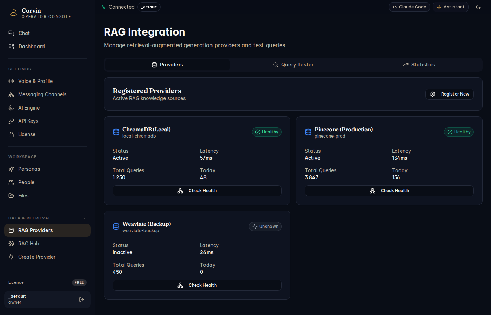

# 12 — RAG Providers

[← Files](11-files.md) | [Handbook Index](README.md) | [Next: RAG Hub →](13-rag-hub.md)

---

## What is this page?

RAG Providers manages your **vector database connections** for Retrieval-Augmented Generation. When the AI needs to answer questions about your own documents or knowledge base, it queries a RAG provider to find relevant context before generating a response.

---

## Screenshot

*RAG Integration showing three registered providers: ChromaDB (Local, Active, 57ms latency, 1250 total queries), Pinecone Production (Active, 134ms, 3847 total queries), and Weaviate Backup (Inactive, Unknown status).*

---

## UI Elements

### Tabs

| Tab | Purpose |
|---|---|
| **Providers** | List and manage registered vector database connections |
| **Query Tester** | Run a test query against any provider to verify retrieval works |
| **Statistics** | Query volume, latency trends, error rates per provider |

### Provider cards

Each registered provider shows:

| Element | Meaning |
|---|---|
| **Provider name** | Display name you chose when registering |
| **Provider ID** | Internal identifier (e.g. `local-chromadb`, `pinecone-prod`) |
| **Status badge** | Healthy (green) / Unknown (grey) / Error (red) |
| **Status** | Active / Inactive |
| **Latency** | Average response time in milliseconds |
| **Total Queries** | Lifetime query count |
| **Today** | Queries since midnight |
| **Check Health** button | Triggers a live connectivity ping |

### Register New button

Opens the [Create Provider](14-create-provider.md) wizard to register a new vector database.

---

## Typical actions

### Add a new RAG provider

Click **Register New** — this opens the Create Provider wizard (see [page 14](14-create-provider.md)).

### Verify a provider is working

Click **Check Health** on the provider card. This pings the vector database and updates the status badge. If it stays **Unknown**, the database URL or credentials are wrong.

### Test a retrieval query

Switch to the **Query Tester** tab. Select a provider from the dropdown, type a natural-language query, and click **Search**. The results show which documents were retrieved and their similarity scores. Use this to verify that your embeddings are working correctly before relying on RAG in production conversations.

### Deactivate a provider temporarily

Click the provider card → **Settings** → toggle **Active** to off. The provider remains registered but the AI will not query it. Useful when a database is under maintenance.

---

[← Files](11-files.md) | [Handbook Index](README.md) | [Next: RAG Hub →](13-rag-hub.md)
