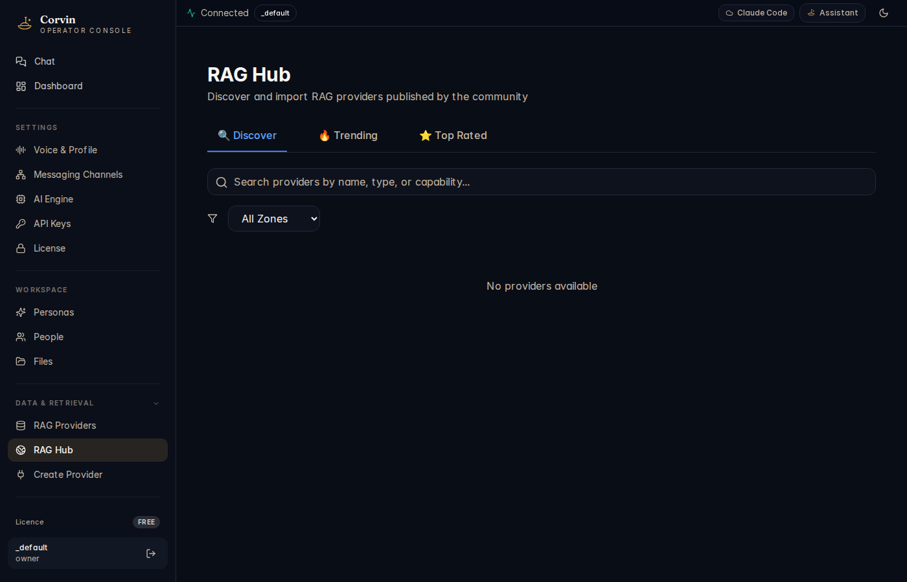

# 13 — RAG Hub

[← RAG Providers](12-rag-providers.md) | [Handbook Index](README.md) | [Next: Create Provider →](14-create-provider.md)

---

## What is this page?

RAG Hub is a **community discovery portal** for RAG provider configurations. It lets you find, evaluate, and import pre-built RAG integrations shared by the CorvinOS community — without having to configure the API endpoints and embedding settings from scratch.

---

## Screenshot

*The RAG Hub Discover tab showing a search bar, zone filter, and "No providers available" placeholder (community registry not populated in this instance).*

---

## UI Elements

### Tabs

| Tab | Icon | Content |
|---|---|---|
| **Discover** | magnifying glass | Browse all available community providers |
| **Trending** | flame | Providers with highest recent activity |
| **Top Rated** | star | Highest-rated providers by the community |

### Search bar

Type a provider name, type (ChromaDB, Pinecone, Weaviate, pgvector, etc.), or capability (e.g. "multilingual", "image embeddings") to filter results.

### Zone filter

The **All Zones** dropdown filters providers by data residency zone:
- **All Zones** — show everything
- **EU** — providers with data stored in EU regions
- **US** — US-hosted providers
- **Local** — providers that run entirely on your machine

For GDPR compliance, filter to **EU** or **Local** when working with personal data.

---

## Typical actions

### Find a ChromaDB configuration

1. Type `ChromaDB` in the search bar.
2. Browse the results — each card shows the provider name, type, zone, and community rating.
3. Click a result to see the full configuration template.
4. Click **Import** to pre-fill the Create Provider wizard with the community configuration.

### Import a community provider

1. Find a provider in the Hub.
2. Click **Import**.
3. You land on the [Create Provider](14-create-provider.md) wizard with fields pre-filled.
4. Adjust credentials and connection details.
5. Complete the wizard to register the provider.

---

[← RAG Providers](12-rag-providers.md) | [Handbook Index](README.md) | [Next: Create Provider →](14-create-provider.md)
