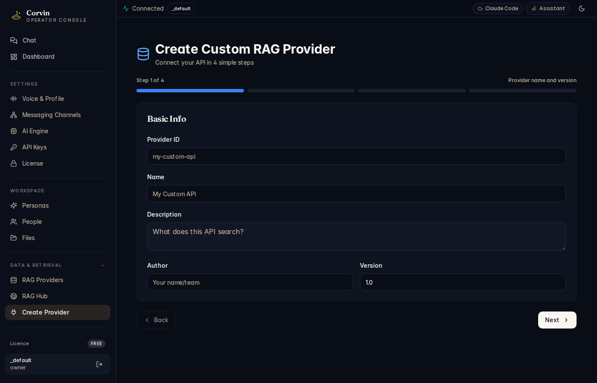

# 14 — Create Provider

[← RAG Hub](13-rag-hub.md) | [Handbook Index](README.md) | [Next: Workflows →](15-workflows.md)

---

## What is this page?

Create Provider is a **4-step wizard** that registers a new RAG (vector database) provider. After completing it, the provider appears in [RAG Providers](12-rag-providers.md) and becomes available to the AI for retrieval queries.

---

## Screenshot

*Step 1 of 4 — Basic Info: Provider ID (`my-custom-api`), Name (`My Custom API`), Description, Author, and Version fields.*

---

## Wizard steps

### Step 1 of 4 — Provider name and version

| Field | Description |
|---|---|
| **Provider ID** | Unique slug, lowercase alphanumeric + hyphens (e.g. `my-chroma-local`) |
| **Name** | Human-readable display name |
| **Description** | What does this provider search? Shown in provider cards and query tester |
| **Author** | Your name or team name |
| **Version** | Semver string (e.g. `1.0`) |

### Step 2 of 4 — Connection

| Field | Description |
|---|---|
| **Provider type** | ChromaDB / Pinecone / Weaviate / pgvector / custom HTTP |
| **Host / URL** | Connection endpoint (e.g. `http://localhost:8000` for local ChromaDB) |
| **API Key** | Secret key if the vector DB requires authentication |
| **Collection / Index** | Which collection or index to query |
| **Embedding model** | Model used to embed queries (must match how documents were indexed) |

### Step 3 of 4 — Query settings

| Field | Description |
|---|---|
| **Top-K results** | How many results to return per query (typically 3–10) |
| **Score threshold** | Minimum similarity score to include a result (0–1, typically 0.7) |
| **Metadata fields** | Which document metadata fields to return alongside text |

### Step 4 of 4 — Review and save

Shows a summary of all settings. Click **Register** to save. The provider is immediately available and the health check runs automatically.

---

## Typical actions

### Register a local ChromaDB instance

1. Start ChromaDB locally: `docker run -p 8000:8000 chromadb/chroma`
2. Open Create Provider.
3. **Step 1**: ID = `local-chroma`, Name = `ChromaDB (Local)`, Version = `1.0`
4. **Step 2**: Type = ChromaDB, Host = `http://localhost:8000`, Collection = your collection name
5. **Step 3**: Top-K = 5, Score threshold = 0.75
6. **Step 4**: Review → **Register**

### Register a Pinecone cloud index

1. Get your Pinecone API key and environment from [app.pinecone.io](https://app.pinecone.io).
2. Open Create Provider.
3. **Step 2**: Type = Pinecone, API Key = your key, Index = your index name
4. Complete remaining steps.

---

[← RAG Hub](13-rag-hub.md) | [Handbook Index](README.md) | [Next: Workflows →](15-workflows.md)
