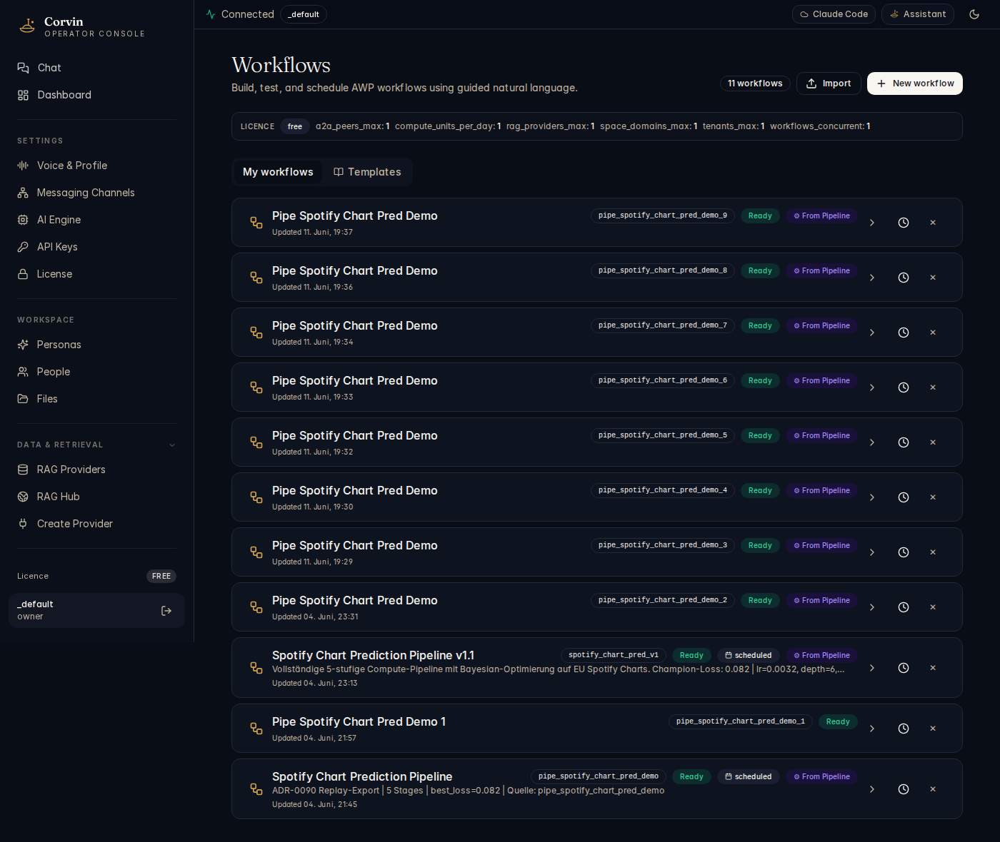

# 15 — Workflows

[← Create Provider](14-create-provider.md) | [Handbook Index](README.md) | [Next: Forge →](16-forge.md)

---

## What is this page?

Workflows are **multi-step automation sequences** where each step can call AI, run a Forge tool, query a RAG provider, or process data. They run outside of the main conversation loop and can be triggered on a schedule or on demand.

---

## Screenshot

*The Workflows page showing "My workflows" and "Templates" tabs, with multiple "Pipe Spotify Chart Pred Demo" workflow runs and a "Spotify Chart Prediction Pipeline v1" workflow with detailed run history.*

---

## UI Elements

### Tabs

| Tab | Content |
|---|---|
| **My workflows** | Workflows you have created in this tenant |
| **Templates** | Pre-built workflow blueprints to start from |

### Workflow list header

| Element | Meaning |
|---|---|
| **N workflows** badge | Total workflow count in the current tenant |
| **Import** button | Import a workflow from a JSON file |
| **+ New workflow** button | Open the workflow editor to create a new workflow |

### Workflow row

| Element | Meaning |
|---|---|
| **Workflow name** | Display name |
| **Trigger badge** | `manual`, `cron`, or event name |
| **Last run status** | `0 Free Replay` = last run is available for replay; coloured badge = last run state |
| **Parameters chip** | Shows input variables bound to this workflow |
| **Step count** | Number of steps in the workflow |
| **Settings icon** | Edit, clone, or delete the workflow |
| **Run button (▷)** | Trigger the workflow immediately |

### Workflow detail view

Click a workflow name to expand its run history:

| Element | Meaning |
|---|---|
| **Run ID** | Unique identifier for each execution |
| **Duration** | How long the run took |
| **Status** | Completed / Failed / Running |
| **Steps** | Expandable list showing each step's input and output |

---

## Typical actions

### Trigger a workflow manually

Click the **▷ Run** button on the workflow row. If the workflow has input parameters, a dialog prompts you to fill them in.

### View the output of the last run

Click the workflow name to expand the run history. Click the most recent run. Each step shows its input, output, and duration. Useful for debugging why a step failed.

### Create a new workflow from a template

1. Click **Templates** tab.
2. Browse available blueprints (data pipeline, AI analysis, notification flow, etc.).
3. Click **Use template**.
4. Rename the workflow and adjust parameters.
5. Click **Save**.

### Schedule a workflow

In the workflow editor, set the trigger to **cron** and enter a cron expression (e.g. `0 9 * * 1` for every Monday at 9am). Save the workflow — it will run automatically at the scheduled time.

---

[← Create Provider](14-create-provider.md) | [Handbook Index](README.md) | [Next: Forge →](16-forge.md)
