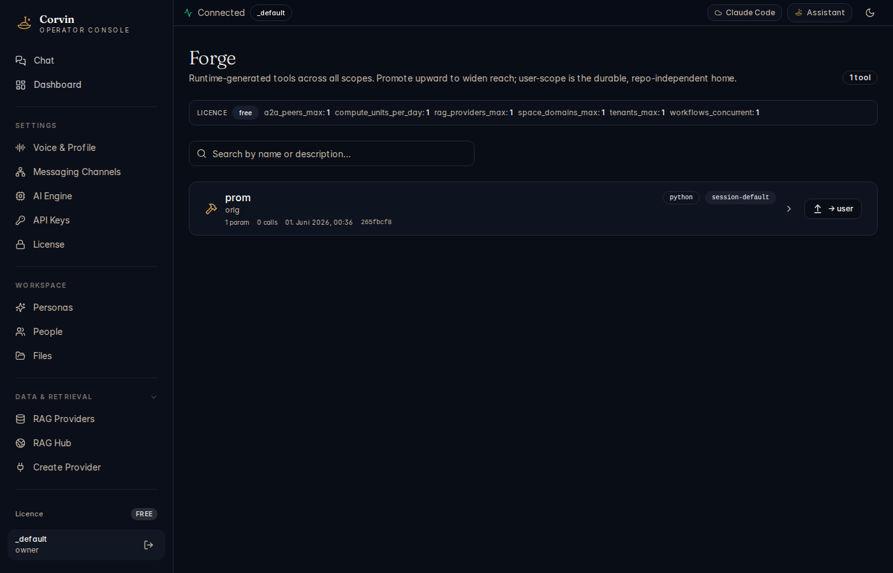

# 16 — Forge

[← Workflows](15-workflows.md) | [Handbook Index](README.md) | [Next: Skills →](17-skills.md)

---

## What is this page?

Forge is the **runtime tool factory**. The AI can create sandboxed, schema-bound executables (Forge tools) during a conversation. Once created, these tools are callable via the MCP protocol — isolated in a bwrap sandbox with no network access by default, given only the inputs you declare.

Think of it as "the AI writing its own API clients and calculators, with cryptographic isolation."

---

## Screenshot



*The Forge page showing 1 registered tool ("prom" — a Python tool, session scope, 0 calls, created 01 Jun 2026). The licence limits bar at the top shows free-tier limits across features.*

---

## UI Elements

### Licence limits bar

A one-line summary of your current licence limits relevant to Forge:

```
LICENCE  free   a2a_peers_max: 1   compute_units_per_day: 1   rag_providers_max: 1   ...
```

This reminds you which limits apply before you start creating tools.

### Search bar

Filter tools by name or description. Useful when you have many tools across sessions.

### Tool card

| Element | Meaning |
|---|---|
| **Tool name** | The callable identifier (e.g. `prom`) — used in MCP calls |
| **Type badge** | Implementation language: `python`, `bash`, `node` |
| **Scope badge** | `session-default`, `project`, `user` — where this tool lives |
| **param count** | Number of input parameters the tool accepts |
| **call count** | How many times this tool has been invoked |
| **Created** | Timestamp and commit hash of tool creation |
| **Expand (›)** | Show the full tool schema and implementation |
| **→ user** button | Promote this tool to user scope (persists beyond the session) |

### Scope ladder

Tools live at one of four scopes:

| Scope | Lifetime | Storage path |
|---|---|---|
| **session** | Until `/new` or `/reset` | `~/.corvin/sessions/<bridge>:<chat>/forge/` |
| **project** | Until manually deleted | `.corvin/tenants/_default/forge/` |
| **user** | Permanent, cross-session | `~/.corvin/global/forge/` |
| **task** | Current AI turn only | Temporary |

Promote upward with the **→ project** / **→ user** buttons, or via `/tool save <name>` in chat.

---

## Typical actions

### Ask the AI to create a Forge tool

In chat, describe what you need:

> "Create a Forge tool called `csv_stats` that takes a CSV file path and returns min/max/mean/stddev for each numeric column."

The AI calls `forge_tool(name="csv_stats", ...)` via MCP. The tool appears in the Forge page immediately. You can then ask the AI to call it: "Run `csv_stats` on `~/data/sales.csv`."

### Promote a tool to user scope (permanent)

1. Find the tool in the Forge page.
2. Click the **→ user** button.
3. The scope badge changes to `user`.
4. The tool is now available in all future sessions, not just the current one.

Or in chat: `/tool save csv_stats`

### Inspect a tool's implementation

Click the **›** expand button on a tool card. The full JSON schema, input/output definitions, and Python/bash implementation are shown.

### Delete a tool

In the tool's expanded view, click **Delete**. Session-scope tools are also automatically removed when you use `/new`, `/clear`, or `/reset`.

---

[← Workflows](15-workflows.md) | [Handbook Index](README.md) | [Next: Skills →](17-skills.md)
