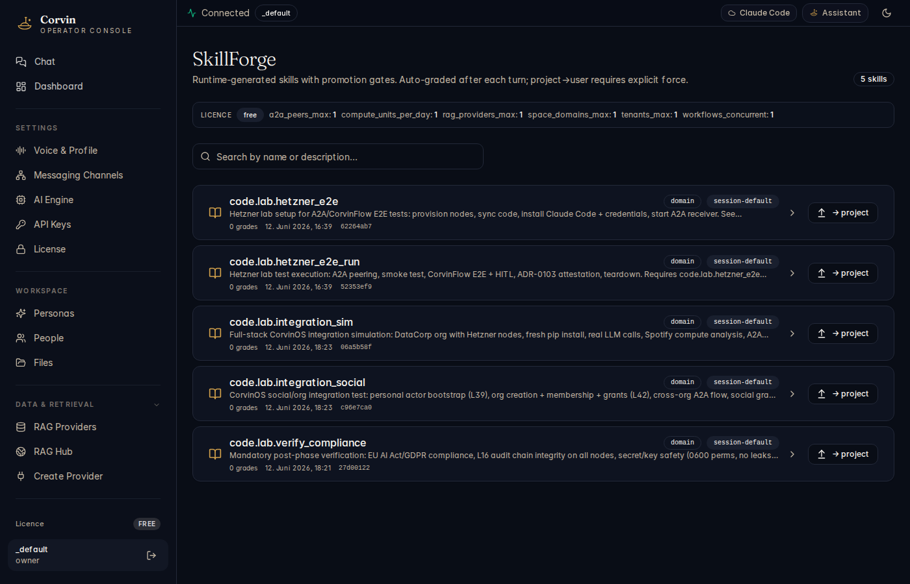

# 17 — Skills (SkillForge)

[← Forge](16-forge.md) | [Handbook Index](README.md) | [Next: Connectors →](18-connectors.md)

---

## What is this page?

SkillForge manages **reusable instruction blocks** (skills) that get automatically injected into the AI's system prompt in future sessions. Where Forge tools are *executables* the AI calls, skills are *knowledge and procedures* the AI carries.

A skill is a Markdown document written as instructions to a future AI agent — "how to do X in this project", "the commit conventions for this repo", "the steps for the deploy dance".

---

## Screenshot

*SkillForge showing 5 skills: code.lab.hetzner_e2e, code.lab.hetzner_e2e_run, code.lab.integration_sim, code.lab.integration_social, and code.lab.verify_compliance — all domain-scope, session-default, 0 grades each.*

---

## UI Elements

### Header

| Element | Meaning |
|---|---|
| **N skills** badge | Total skills in this tenant |
| **Licence limits bar** | Free-tier limits across features |

### Search bar

Filter skills by name or description.

### Skill row

| Element | Meaning |
|---|---|
| **Book icon** | Identifies this as a skill (vs. a Forge tool) |
| **Skill name** | Dotted namespace (e.g. `code.lab.hetzner_e2e`) |
| **Scope badges** | `domain`, `session-default`, `project`, `user` — where the skill lives |
| **Description** | One-line summary shown in the list and used for auto-grading |
| **Grade count** | How many times this skill has been graded (usage signal) |
| **Created** | Timestamp and commit hash |
| **Expand (›)** | Show the full skill Markdown body |
| **→ project** button | Promote to project scope |

### Promotion gates

Skills follow a strict promotion ladder. Each gate requires a minimum grade score:

| Promotion | Requirement |
|---|---|
| task → session | ≥ 1 positive grade (score ≥ 0.5) |
| session → project | ≥ 3 grades with mean ≥ 0.5 |
| project → user | Explicit `force=True` from operator |

**Auto-grading** happens after each conversation turn where the skill was used. If the AI's output mentions or paraphrases the skill's content, it gets a positive grade (0.7). If the user approves, 0.9. If the user rejects, 0.1.

---

## Typical actions

### Ask the AI to create a skill

In chat:

> "Create a skill that captures our project's commit message conventions: imperative mood, 72-char subject line, reference issue in footer."

The AI calls `skill_create(name="commit-conventions", body="...")` via MCP. The skill appears in SkillForge at session scope.

### Promote a skill to project scope

Once a skill has been used positively in ≥ 3 turns:

1. Find the skill in SkillForge.
2. Click **→ project**.
3. The skill is now injected into all future sessions in this project (for personas with `skill_forge_enabled: true`).

### View a skill's body

Click **›** to expand the skill row. The full Markdown instruction body is shown. This is exactly what gets injected into the system prompt.

### Delete a session skill (manual cleanup)

Session skills are cleared automatically when you use `/new`, `/clear`, or `/reset`. To delete a specific skill manually, click the trash icon in the expanded skill view.

---

[← Forge](16-forge.md) | [Handbook Index](README.md) | [Next: Connectors →](18-connectors.md)
