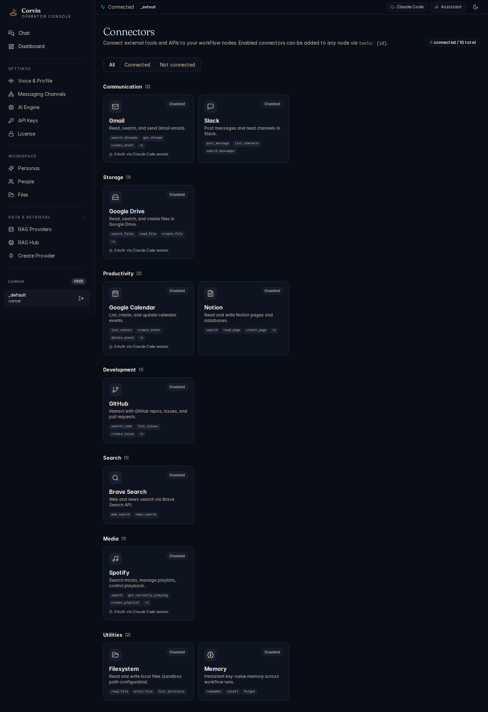

# 18 — Connectors

[← Skills](17-skills.md) | [Handbook Index](README.md) | [Next: Agent Hub →](19-agent-hub.md)

---

## What is this page?

Connectors are **pre-built integrations to external services** — Gmail, Google Drive, Slack, Notion, GitHub, Spotify, Brave Search, and more. Enabling a connector makes it available as an MCP tool the AI can call during conversations. Instead of the AI asking you to copy-paste data, it can retrieve it directly.

---

## Screenshot

*The Connectors page showing integrations grouped by category: Communication (Gmail, Slack), Storage (Google Drive), Productivity (Google Calendar, Notion), Development (GitHub), Search (Brave Search), Media (Spotify), and Utilities (Filesystem, Memory).*

---

## UI Elements

### Filter tabs

| Tab | Content |
|---|---|
| **All** | Every available connector |
| **Connected** | Connectors you have enabled and authenticated |
| **Not connected** | Available connectors not yet set up |

### Category sections

Connectors are grouped by purpose:

| Category | Connectors |
|---|---|
| **Communication** | Gmail, Slack |
| **Storage** | Google Drive |
| **Productivity** | Google Calendar, Notion |
| **Development** | GitHub |
| **Search** | Brave Search |
| **Media** | Spotify |
| **Utilities** | Filesystem, Memory |

### Connector card

| Element | Meaning |
|---|---|
| **Connector icon and name** | Service identity |
| **Description** | What this connector enables the AI to do |
| **Status badge** | `Enabled` (green) or `Disabled` (grey) |
| **Tags** | Capability tags (e.g. `email`, `calendar`, `read`, `write`) |
| **Enable / Disable button** | Toggle the connector on or off |
| **Auth status** | Whether OAuth or API key authentication is set up |

---

## Typical actions

### Enable Gmail

1. Click the **Gmail** card.
2. Click **Enable**.
3. Follow the OAuth flow — you are redirected to Google to authorise CorvinOS to access your Gmail account.
4. After authorising, the status badge changes to **Enabled**.
5. In chat, you can now ask: "Search my emails for invoices from last month."

### Enable GitHub

1. Click the **GitHub** card.
2. Click **Enable**.
3. Generate a Personal Access Token at github.com/settings/tokens with the scopes you need (e.g. `repo`, `read:org`).
4. Paste the token in the connector's auth field.
5. Click **Save**.

### Enable Brave Search (web search)

1. Get a Brave Search API key at api.search.brave.com.
2. Click the **Brave Search** card → **Enable**.
3. Paste your API key.
4. The AI can now search the web: "What is the current price of X?"

### Disable a connector temporarily

Click the connector card → **Disable**. The MCP tool is removed from the AI's toolset for the current session. Your credentials are not deleted.

---

[← Skills](17-skills.md) | [Handbook Index](README.md) | [Next: Agent Hub →](19-agent-hub.md)
