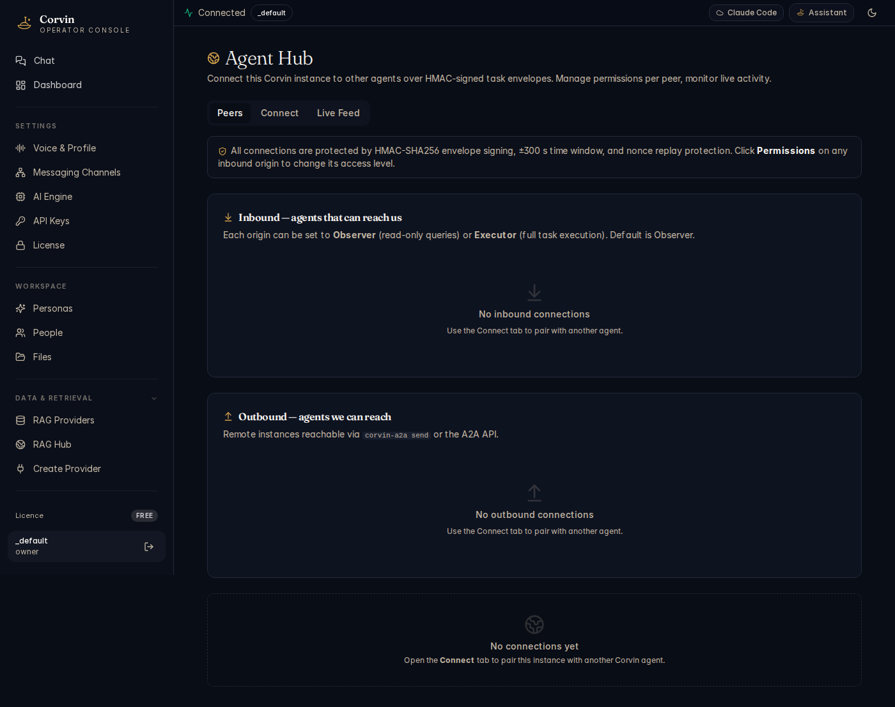

# 19 — Agent Hub

[← Connectors](18-connectors.md) | [Handbook Index](README.md) | [Next: CorvinSpace →](20-space.md)

---

## What is this page?

Agent Hub manages **A2A (Agent-to-Agent) connections** — peer relationships between this CorvinOS instance and other Corvin instances anywhere on the internet. A2A connections use HMAC-SHA256 signed task envelopes, so every instruction is cryptographically verified. No untrusted agent can impersonate a peer.

---

## Screenshot



*The Agent Hub Peers tab showing the security note (HMAC-SHA256 + ±300s time window + nonce replay protection), two sections: Inbound agents (no connections yet) and Outbound agents (no connections yet).*

---

## UI Elements

### Tabs

| Tab | Purpose |
|---|---|
| **Peers** | Overview of all inbound and outbound connections |
| **Connect** | Pair with a new remote Corvin instance |
| **Live Feed** | Real-time stream of A2A events (task sends/receives) |

### Security notice

The amber box at the top explains the protection stack:
> *All connections are protected by HMAC-SHA256 envelope signing, ±300s time window, and nonce replay protection.*

This means: even if someone intercepts a task envelope in transit, they cannot replay it (the ±300s window) and cannot forge a valid signature (HMAC-SHA256 with a shared secret).

### Inbound section — agents that can reach us

Lists remote Corvin instances that have been paired to send tasks *to* this instance.

| Element | Meaning |
|---|---|
| **Origin name** | Display name of the remote instance |
| **Last seen** | Timestamp of most recent inbound task |
| **Role** | Observer (read-only) or Executor (full task execution) |
| **Permissions button** | Change the role for this origin |

**Observer** role: the remote agent can only query — it cannot trigger AI turns.
**Executor** role: the remote agent can send full task instructions that spawn an AI worker.

### Outbound section — agents we can reach

Lists remote endpoints this instance can send tasks *to*.

| Element | Meaning |
|---|---|
| **Endpoint name** | Display name |
| **URL** | The remote instance's A2A HTTP endpoint |
| **Last used** | Timestamp of most recent outbound task |
| **Send** button | Send a task to this endpoint now |

---

## Typical actions

### Pair with another Corvin instance

The recommended CLI workflow (run on the *sending* side):

```bash
corvin-a2a pair <peer-name> <peer-url>
```

This generates a paired key set, writes the local origin file, and prints the peer-side endpoint configuration. Transfer the printed config to the other machine out-of-band (e.g. email, secure share).

On the receiving machine:
```bash
# Save the printed endpoint JSON to:
~/.corvin/global/cowork/remote_origins/<peer-name>.json
```

After pairing, both sides appear in each other's Agent Hub.

### Send a task to a paired agent

From the Outbound section, click **Send** next to the endpoint. A dialog lets you type an instruction and optional parameters. Click **Send**. The task is delivered with full HMAC signing.

From the CLI:
```bash
corvin-a2a send <endpoint-id> "Analyse the file at ~/data/report.csv and return a summary"
```

### Change an inbound agent's permissions

In the Inbound section, click **Permissions** next to the origin. Select **Observer** (safe, read-only) or **Executor** (allows full AI task execution). Default is Observer — only promote to Executor for agents you fully trust.

---

[← Connectors](18-connectors.md) | [Handbook Index](README.md) | [Next: CorvinSpace →](20-space.md)
