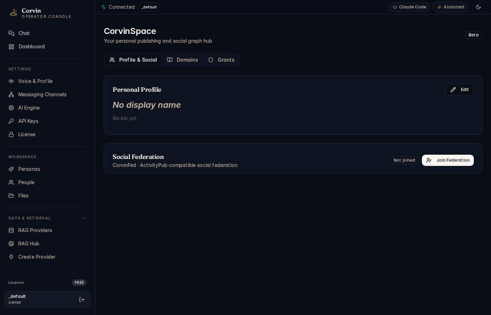

# 20 — CorvinSpace

[← Agent Hub](19-agent-hub.md) | [Handbook Index](README.md) | [Next: Data Sources →](21-data-sources.md)

---

## What is this page?

CorvinSpace is your **public publishing and social presence hub**. It has three parts:

1. **Profile & Social** — your public identity and ActivityPub federation status
2. **Domains** — custom public URLs where you publish AI-generated content
3. **Grants** — which other users or bots can post to your Space

*CorvinSpace is currently in Beta.*

---

## Screenshot

*CorvinSpace showing the Profile & Social tab: a Personal Profile card (no display name set yet) and a Social Federation card showing "Not joined" status with a "Join Federation" button.*

---

## UI Elements

### Tabs

| Tab | Content |
|---|---|
| **Profile & Social** | Public identity and ActivityPub/CorvinFed federation |
| **Domains** | Custom public domain management |
| **Grants** | Permissions for other actors to publish to your Space |

### Profile & Social tab

**Personal Profile card**

| Element | Meaning |
|---|---|
| **Display name** | Your public name (shown on published content and your profile page) |
| **Bio** | Short description shown on your public profile |
| **Edit button** | Open the profile editor |

**Social Federation card**

| Element | Meaning |
|---|---|
| **CorvinFed · ActivityPub-compatible** | CorvinFed implements the ActivityPub protocol — your content can be followed by Mastodon, Pixelfed, and other Fediverse accounts |
| **Status** | Not joined / Joined |
| **Join Federation button** | Create your CorvinFed identity and make your profile discoverable on the Fediverse |

### Domains tab

Lists your public domain(s) where AI content is published:

| Element | Meaning |
|---|---|
| **Domain card** | One card per registered domain |
| **Status badge** | Active / Pending DNS / Error |
| **URL** | The public URL |
| **+ New Domain** button | Register an additional domain |

**Free tier**: 1 domain maximum. **Member+ tier**: unlimited domains.

If you are on the Free tier and already have 1 domain, the **New Domain** button is hidden and an amber upgrade banner is shown.

### Grants tab

Controls which other Corvin instances or ActivityPub actors can post to your Space.

---

## Typical actions

### Set up your public profile

1. Click the **Edit** button on the Personal Profile card.
2. Enter a display name and short bio.
3. Click **Save**.

### Join the Fediverse (ActivityPub federation)

1. Click **Join Federation**.
2. Your CorvinFed account is created (e.g. `@yourname@your-corvin.example.com`).
3. Other Fediverse users can now follow you. When the AI publishes content to your Space, it appears in their feeds.

### Register a custom domain

1. Click **Domains** tab → **+ New Domain**.
2. Enter your domain name (e.g. `ai.example.com`).
3. Add the DNS records shown (CNAME or A record pointing to CorvinLabs).
4. Once DNS propagates, the domain status turns **Active**.
5. AI-generated content published to your Space is accessible at `https://ai.example.com/`.

### Check your domain limit

The domain counter shows `N / 1 domain used` on the Free tier, or `N domains` (unlimited) on Member+. If you need more domains, visit [corvinlabs.io/pricing](https://corvinlabs.io/pricing).

---

[← Agent Hub](19-agent-hub.md) | [Handbook Index](README.md) | [Next: Data Sources →](21-data-sources.md)
