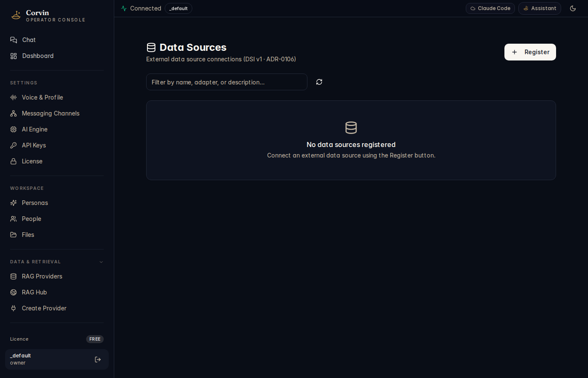

# 21 — Data Sources

[← CorvinSpace](20-space.md) | [Handbook Index](README.md)

---

## What is this page?

Data Sources manages **external database connections** using the DSI v1 (DataSource Interface) protocol. Once registered, a data source is available to the AI as a named connection — the AI can run compute analyses against it without the raw data ever entering the language model context.

Data Sources are different from RAG Providers: RAG is for vector similarity search over documents; Data Sources are for structured data query and compute (SQL databases, APIs, CSV stores).

---

## Screenshot

*The Data Sources page showing the Register button and an empty state ("No data sources registered") on a fresh install.*

---

## UI Elements

### Header

| Element | Meaning |
|---|---|
| **Data Sources** heading | Page title |
| **DSI v1** subtitle | Protocol version — all connections use the v1 adapter interface |
| **+ Register** button | Open the registration flow for a new data source |

### Search / filter bar

Filter registered data sources by name, adapter type, or description.

### Refresh button

Reload the data source list from the server (useful after external changes to the configuration files).

### Data source card (when registered)

| Element | Meaning |
|---|---|
| **Connection name** | Display name you assigned |
| **Adapter type** | What kind of data source (PostgreSQL, MySQL, BigQuery, REST API, etc.) |
| **Status badge** | Connected / Disconnected / Error |
| **Last tested** | When the last ping/health check ran |
| **Ping button** | Run a connectivity test right now |
| **Describe button** | Show the adapter's schema/capabilities |
| **Unregister button** | Remove the connection (does not delete data) |

---

## How Data Sources work

When you register a data source:

1. You provide **connection metadata** (host, port, database name) and **secret names** (env-var names pointing to credentials in the vault — the values are never stored in the manifest).
2. CorvinOS writes a `DSIv1ConnectionManifest` to `~/.corvin/tenants/_default/datasource_connections/<name>.json`.
3. The AI can reference the connection by name: "Run a compute job on the `sales_db` data source."
4. At compute job spawn time, vault credentials are injected as environment variables into the isolated worker — the AI never sees the password.

This architecture satisfies L34 Data Classification: the raw data is never in LLM context; only PII-redacted summaries and analysis results are returned.

---

## Typical actions

### Register a PostgreSQL database

1. Click **+ Register**.
2. Select adapter type: **PostgreSQL**.
3. Fill in:
   - **Name**: `sales_db`
   - **Host**: `db.example.com`
   - **Port**: `5432`
   - **Database**: `sales`
   - **Secret name**: `SALES_DB_PASSWORD` (store the actual password in [API Keys](07-api-keys.md) under this name)
4. Click **Register**.
5. Click **Ping** to verify connectivity.

### Ask the AI to analyse a registered data source

In chat:

> "Use the `sales_db` data source to find the top 10 customers by revenue this quarter."

The AI schedules a compute job that queries the database, runs the analysis in an isolated worker, and returns a PII-redacted summary and charts.

### Remove a data source

Click the data source card → **Unregister**. This deletes the manifest file and removes the connection from the AI's toolset. Your actual database is not affected.

---

[← CorvinSpace](20-space.md) | [Handbook Index](README.md)
