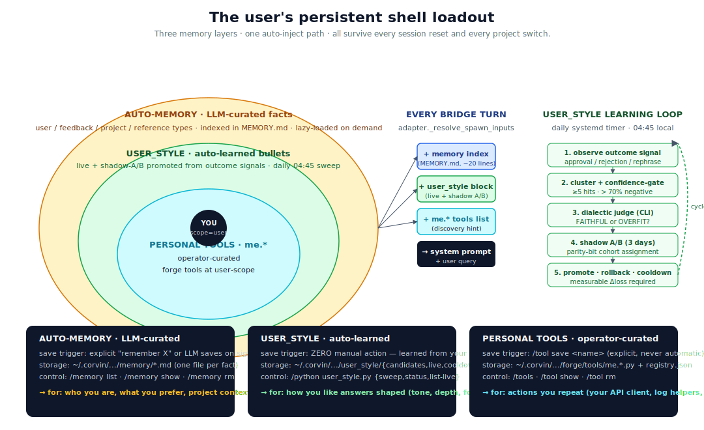

# Memory model

> The user's persistent shell loadout — three layers of permanent
> state that follow you across every chat, every project, every
> session reset.



## The mental model

When you log into a Linux box, you don't get a blank shell. You get
*your* shell: your aliases (in `.bashrc`), your environment
(`.profile`), your history (`.bash_history`), your installed tools
(`~/.local/bin/`). Together they form your **loadout** — a
persistent layer of "this is how this user works" that the OS hands
you on every login.

Corvin gives the LLM the same structure. Every chat turn, the
adapter assembles a loadout from three layers of permanent state:

1. **Auto-memory** — facts the LLM saved about you, your role, your
   preferences, your projects.
2. **User-style** — bullets the system *learned* from how you reacted
   to past replies. No manual training set; your reactions are the
   gradient.
3. **Personal tools** — `me.*` forge tools you explicitly saved with
   `/tool save`. The agent's "installed binaries" for *you*.

All three live at user scope: surviving every session reset, every
project switch, every adapter restart. All three are auto-injected
into the system prompt of every turn. Together they let the LLM walk
into a fresh chat already knowing you.

## The problem this solves

A stateless LLM session is like a brand-new shell every login: you
re-type the same `export PATH=…` every time, you re-explain who you
are, you re-paste the same context about your project. It works for
one-off questions; it's exhausting for an actual working
relationship.

The naïve fix is "a giant `system_prompt` with everything in it." That
breaks fast: the prompt fills up, the LLM scans the wrong line, every
project change requires a manual prompt edit, and there's no signal
about which parts of the prompt actually mattered.

Corvin factors the loadout into three layers based on **who curates
it** and **what evidence drives the curation**:

| Layer | Curator | Evidence |
|---|---|---|
| Auto-memory | LLM | Explicit user statement ("remember that…") |
| User-style | The system | Outcome signals (approval / rejection / rephrase) over time |
| Personal tools | The user | Explicit `/tool save` |

Three orthogonal curation paths, three different signal sources, all
landing in the same loadout.

## Layer 1 — Auto-memory (LLM-curated facts)

The LLM has a memory directory at
`<corvin_home>/.../memory/` with two tiers:

**Tier 1 — `MEMORY.md`** is the always-loaded index. ~20 lines of
one-line entries: "user is a senior backend engineer", "prefers
terse answers", "main project is the trading-agents repo". This is
the prompt-injected baseline.

**Tier 2 — topic files** are lazy-loaded. When a user message
touches a topic the LLM has notes on (e.g. they mention travel and
there's a `travel.md` topic file), the LLM reads that file via
`Read` to get the full context.

Four memory **types** organize the entries semantically:

| Type | What | Example |
|---|---|---|
| `user` | Identity, role, knowledge, preferences | "is a data scientist focused on observability" |
| `feedback` | Approach corrections, validated patterns | "tests must hit a real DB, not mocks; mock divergence broke prod once" |
| `project` | Initiatives, deadlines, who-is-doing-what | "merge freeze starts 2026-03-05 for mobile release cut" |
| `reference` | External-system pointers | "pipeline bugs tracked in Linear project INGEST" |

Save / forget happens via:
- explicit user statement ("remember I prefer Tabs to spaces") →
  the LLM saves a `feedback_indentation.md`
- explicit slash command (`/memory show <name>`, `/memory rm <name>`)

Important: the LLM **does not auto-save speculation**. Saving requires
either user confirmation or a clear stable preference signal.

## Layer 2 — User-style (auto-learned bullets)

This is the loop where the system **learns from itself**. No manual
training set. No review UI. Just the existing outcome-signal stream
(Layer 15 — approval / rejection / rephrase) plus a daily sweep that
turns the stream into refinement bullets.

### The pipeline (daily 04:45 systemd timer)

1. **Aggregate.** Walk the audit chain for the last 14 days,
   counting `skill.outcome_graded` events per skill. A skill with
   ≥5 outcome signals where ≥70% are negative (rejection +
   rephrase) becomes a *cluster candidate*.
2. **Confidence gate.** Reject candidates that don't pass both
   thresholds.
3. **Dialectic judge.** Spawn a `claude -p` subprocess (separate
   LLM instance, no context from the original turn) and ask:
   "Is this rule justified by the data, or does it overfit to
   noise?" FAITHFUL → proceed; OVERFIT → silently drop with
   30-day cooldown.
4. **Shadow A/B (3 days).** The bullet is *generated* but only
   injected on turns whose `msg_id` parity bit is 1 (sha256
   first byte). Turns with parity 0 are the control cohort.
5. **Promote → live.** If the with-bullet cohort shows
   `negative_ratio < without - 0.05` (5pp improvement),
   the bullet flips to live state. Otherwise reject + cooldown.
6. **Live evaluation.** Live bullets keep being graded via the
   same outcome signals. If a bullet's skill shows >55%
   negative rate over 7 days → auto-rollback + 30-day cooldown.
7. **Hard cap.** Max 10 live bullets simultaneously; the lowest-
   scoring is dropped when a new one promotes in.

### Why all the safeguards

A naïve "learn from feedback" loop is a self-reinforcing failure
mode: the model trains on its own misinterpretations. The safeguards
break the loop at every stage:

- **Confidence gate** — random noise can't trip the gate
- **Dialectic judge** — a *separate* LLM has no investment in
  validating the rule
- **Shadow A/B** — measures a real effect, not just correlation
- **Cooldown** — prevents pingpong (rejected → re-proposed → rejected)
- **Hard cap** — forces ranking instead of bloat
- **Auto-rollback** — a bullet that helps initially but hurts later
  doesn't sit there forever

The whole pipeline emits four audit-event types into the unified hash
chain, so the operator can see every promotion and every rollback in
`voice-audit verify`.

### What this *doesn't* do

User-style learns the *shape* of how you want answers (tone, depth,
format, what to double-check). It does **not** learn:
- factual content (that's auto-memory)
- workflow steps (that's skill-forge)
- which tools to call (that's the persona's job)

The bullets it generates are flag-shaped, not directive-shaped:
"When applying skill X, double-check the user's intent before
committing — recent feedback shows 80% corrections after this skill
fires (n=8)."

The bullet is a *flag for the LLM to slow down*, not a hard rule.

## Layer 3 — Personal tools (operator-curated)

The user's permanent forge library, namespaced under `me.*`.

### How they get in

The forge persona, after generating a non-trivial tool, asks at the
end of its reply:

> "Soll ich das als `me.<name>` für dich speichern?
> (`/tool save <name>`)"

The user types `/tool save <name>` — the tool gets re-shelved to
user-scope under `<corvin_home>/global/forge/tools/me.<name>.py`.
The grade-gate (which the regular promote ladder uses) is **bypassed**:
the user's explicit "save this for me, full stop" is the operator
signal.

The linter, sandbox, path-gate, and audit chain stay active for normal
tool execution — only the *promotion* gate is bypassed, never the
*safety* layers.

### How they get out

`/tool rm <name>` deletes the tool. `/tools` lists the library.
`/tool show <name>` shows details. There is no auto-deletion: a
tool the user explicitly saved survives until the user removes it,
even if it goes 90 days unused (the listing flags it as "unused 90d"
but never deletes).

### How the LLM sees them

Every bridge turn, `personal_tools.format_inject_block()` renders:

```markdown
## Your personal tools (always available)
- `me.poke_api` — call your private API
- `me.daily_log` — append to your journal
…
```

— prepended to the system prompt. The LLM scans this once at the
start of each turn; calling them is just `mcp__forge__me.<name>`
like any other forge tool.

### What this *doesn't* do

Personal tools are explicitly user-curated. They are **not**:
- auto-saved (the LLM proposes; the user decides)
- auto-promoted from session scope (the `/tool save` is the
  bypass; the regular `forge_promote` ladder still exists for
  graded automatic promotion)
- shared across users / tenants (strictly per-(tenant, user))

## How the three layers stack into one prompt

`adapter._resolve_spawn_inputs` is the assembly point. Order matters
— more-stable layers come first so the LLM scans through them before
reaching more-volatile layers:

```
1. base prompt (channel-specific)
2. profile_block          ← Tier 1 user profile (one-liners)
3. memory_block           ← Tier 1 auto-memory index (~20 lines)
4. vault_block            ← available secret-vault keys (names only)
5. persona append_system  ← from persona JSON
6. audience block         ← Layer 12 listener-profile (TTS audience)
7. skill_inject block     ← active skills (graded > 0)
8. user_style block       ← live + shadow-A/B bullets
9. personal_tools block   ← me.* discovery hint
```

When the LLM produces a turn, three feedback paths fire:

- **Auto-grade** — scans LLM reply for skill mentions/paraphrases
  → grade `0.3` per match
- **Outcome-grade** — *next* user turn → approval / rejection /
  rephrase signal applied to skills active in the previous turn
- **Audit emission** — every state change lands in the unified
  hash chain

The next sweep of the user-style learner reads those audit events,
clusters new candidates, and the cycle repeats.

## Privacy + tenant isolation

All three layers are tenant-scoped under
`<corvin_home>/tenants/<tid>/global/`. Cross-tenant fusion is
structurally impossible. A tenant's user-style bullets
never reach another tenant; a tenant's `me.*` tools never reach
another tenant; a tenant's auto-memory never reaches another tenant.

The audit chain treats memory + user-style + personal-tools events as
**metadata only**. Skill names, bullet IDs, tool names land in the
chain; bullet bodies, memory contents, tool source code do **not**.
The L26/L27 regression gates explicitly assert this.

## How they interact with `/reset`, session timeout, and tenant switch

| Event | Auto-memory | User-style | Personal tools |
|---|---|---|---|
| `/reset` | preserved | preserved | preserved |
| 7-day session timeout | preserved | preserved | preserved |
| Project switch | preserved | preserved | preserved |
| Tenant switch | tenant-scoped (each has own) | tenant-scoped | tenant-scoped |
| Phase-7 cleanup | preserved | preserved | preserved |

All three are *only* removed when the user explicitly removes them
(or, for user-style live bullets, when the auto-rollback triggers).

## Concrete commands

| Action | Command |
|---|---|
| List auto-memory | `/memory list` |
| Show one memory | `/memory show <name>` |
| Remove one memory | `/memory rm <name>` |
| User-style status | `python -m user_style status` |
| List live user-style bullets | `python -m user_style list-live` |
| List personal tools | `/tools` |
| Save the most recent forge tool | `/tool save <name>` |
| Save with alias | `/tool save <source> as <alias>` |
| Show one personal tool | `/tool show me.<name>` |
| Remove one personal tool | `/tool rm me.<name>` |
| Verify audit chain | `voice-audit verify` |

## Where to look in the code

| Layer | Module | Tests |
|---|---|---|
| Auto-memory | `bridges/shared/memory.py` | `bridges/shared/test_memory.py` |
| User-style | `bridges/shared/user_style.py` | `test_user_style.py`, `test_adapter_user_style.py`, `test_user_style_cli.py` |
| Personal tools | `bridges/shared/personal_tools.py` | `test_personal_tools.py`, `test_adapter_personal_tools.py`, `test_personal_tools_cli.py`, `js/test_personal_tools_dispatcher.js` |
| Adapter assembly | `bridges/shared/adapter.py::_resolve_spawn_inputs` | `test_adapter_skill_inject.py` |

## Adjacent docs

- [Architecture](architecture.md) — the five-axis design + scope
  ladder
- [Runtime generation](runtime-generation.md) — how the *generator*
  side (forge + skill-forge) feeds into the personal-tools and
  user-style layers
- [Audit and compliance](audit-and-compliance.md) — the substrate
  that ties all three layers' state changes together
- [docs/agent-behavior.md](agent-behavior.md) — the broader picture
  of what the agent does when, at runtime
