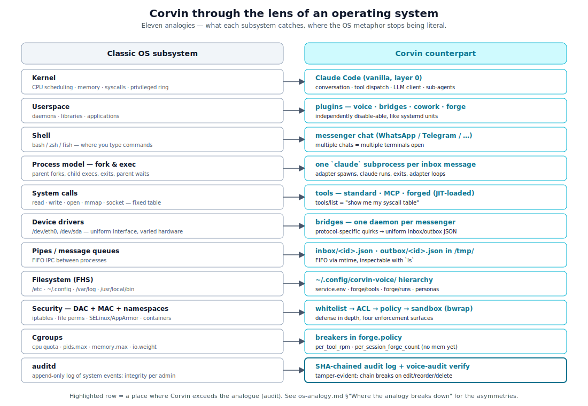
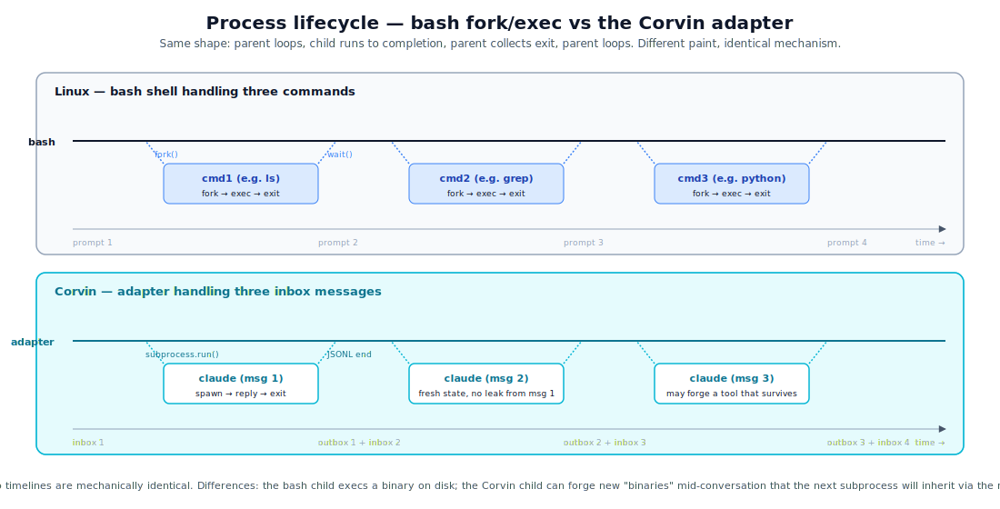

# os-analogy.md — Corvin as an operating system for agents

> **Mental model.** Every operating system gives a process an environment, a way to talk to the world, isolation from other processes, and an audit trail. Corvin gives a Claude Code agent the same five things, in roughly the same shape — with one big difference: there is one program at a time per chat, and "programs" can be **forged at runtime** instead of installed in advance.

This doc maps every Corvin layer onto its closest counterpart in a traditional OS, and then names the places where the analogy breaks down. Thinking of Corvin as "a wrapper around Claude Code" is too small; thinking of it as "literally an OS" is too big. The truth is in between, and this view of the parts is the fastest way to decide where logic belongs when you extend the system.

  

## The mapping at a glance

| Classic OS concept | Corvin counterpart | Section |
|---|---|---|
| Kernel | Claude Code (vanilla, layer 0) | [§1](#1-kernel--claude-code) |
| Userspace | plugins — voice, bridges, cowork, forge | [§2](#2-userspace--plugins) |
| Shell | messenger chat (WhatsApp, Telegram, …) | [§3](#3-shell--the-messenger-chat) |
| Process model (fork/exec) | one `claude` subprocess per inbox message | [§4](#4-process-model--fork-and-exec-per-message) |
| System calls | tools — standard, MCP, forged | [§5](#5-system-calls--tools) |
| Device drivers | bridges (one daemon per channel) | [§6](#6-device-drivers--bridges) |
| Pipes / message queues | inbox / outbox JSON files in `/tmp/` | [§7](#7-ipc--inboxoutbox-files-as-pipes) |
| Filesystem (FHS) | `~/.config/corvin-voice/` hierarchy | [§8](#8-filesystem--dotfiles--registries) |
| Ring model + MAC | whitelist → ACL → policy → sandbox | [§9](#9-security--ring-model-meets-mac) |
| Cgroups | breakers in `forge.policy` | [§10](#10-resource-management--breakers-as-cgroups) |
| auditd | SHA-chained audit log + `voice-audit verify` | [§11](#11-audit--auditd-with-hash-chain-integrity) |

The eleven sections that follow each take one row at a time, say where the analogy fits, and call out where it doesn't.

---

## 1. Kernel — Claude Code

The kernel is the lowest layer that everything else trusts. Linux's kernel manages CPU scheduling, memory, device drivers, syscalls. **Claude Code plays exactly that role for the agent**: it owns the conversation, dispatches tools, talks to the LLM, manages sub-agents.

**Why the analogy fits.** Userspace (plugins, MCP servers, hooks) interacts with the kernel through fixed APIs — the plugin manifest, the MCP protocol, hook signatures. The kernel decides what userspace gets to do (`--allowedTools`, `--permission-mode`). A buggy plugin can crash itself but cannot crash Claude Code, just like a userspace program cannot crash Linux.

**Why it doesn't fit.** A real kernel runs in privileged CPU mode; Claude Code runs in plain userspace — the "privileged" part is an LLM that we trust, not a hardware ring. And Claude Code does not schedule processes — it has one conversation per invocation. The "scheduler" of Corvin is the bridge adapter, which spawns `claude` subprocesses per inbox message.

Practically: when a layer asks "where does this responsibility belong?", the answer is **layer 0 (kernel) if it is about token I/O, tool dispatch, or LLM reasoning; layers 1-5 (userspace) for everything else**.

## 2. Userspace — plugins

In Linux, userspace is everything that runs outside ring 0: shell, daemons, applications. They can do work, but they need the kernel for hardware access.

Corvin userspace is the four plugins:

| Plugin | Linux analogue |
|---|---|
| `voice` | TTY / audio subsystem daemon |
| `bridges/<channel>` | network daemons (sshd, dhcpd) — one per protocol |
| `cowork` | user-account framework (PAM-like) — defines which "uid" a chat runs as |
| `forge` | `ld-linux.so` + `auditd` combined — JIT-loads new tools, audits everything |

Each is independently disable-able, just like userspace daemons in Linux — `systemctl stop sshd` doesn't take the kernel with it. Removing `operator/forge/` doesn't take voice or bridges with it; `bridges/shared/audit.py` no-ops gracefully.

## 3. Shell — the messenger chat

A Linux shell is the program where you type commands; the kernel does not know or care that you are using bash vs zsh. The shell is part of userspace.

In Corvin, **the messenger chat is the shell**. WhatsApp, Telegram, Discord, Slack, email — they are shells. You type a "command" (your message), the shell sends it via the daemon to the adapter (which spawns claude), and the result comes back through the same shell. Different chats can use different "shells" simultaneously, just like having multiple terminals open.

Voice mode is **the equivalent of speech-to-text + text-to-speech being the shell** — a different I/O channel for the same shell session, comparable to running a screen reader on top of bash.

## 4. Process model — fork-and-exec, per message

This is where the analogy is sharpest, and where Corvin makes a deliberate choice that separates it from "just a long-running agent service".

> **Each inbox message spawns a fresh `claude` subprocess. The subprocess runs to completion and exits. Adapter loops back to the next message.**

Compare to a Unix shell handling commands:

| Step | bash | Corvin adapter |
|---|---|---|
| Receive | command line typed | inbox/`<id>`.json appears |
| Spawn child | `fork()` | `subprocess.run(["claude", …])` |
| Child runs | exec'd binary | the LLM session: tool calls, replies |
| Child exits | exit code | JSONL stream ends |
| Parent collects | `wait()` returns | adapter writes outbox/`<id>`.json |
| Loop | next prompt | next inbox file |

  

**What this analogy buys you.**

- **Per-chat isolation by construction.** A fresh subprocess means no state leaks between chats. Same property that makes Unix shells safe — your `PATH` is scoped to your terminal.
- **Stateless per-call mental model.** When you reason about what the agent sees in turn N, you only need: the conversation transcript so far + the current persona resolution + the current registry of forged tools. There is no hidden mid-message state.
- **Restart on damage is cheap.** If a single message goes badly, the next message is a fresh process. No "stuck agent" to recover.

**The price.** A few hundred milliseconds of `claude` startup per turn. We pay it.

## 5. System calls — tools

A Unix syscall is how a process talks to the kernel: `read`, `write`, `open`, `mmap`, `socket`. The syscall table is fixed at kernel build time; the process can call any of them.

In Corvin, **tool calls are syscalls and MCP is the syscall table**:

| Tool kind | Linux analogue |
|---|---|
| Standard Claude Code tools (Bash, Read, Edit, Grep) | kernel built-ins (`read`, `write`, `open`) |
| MCP servers loaded via persona (Playwright, Gmail) | kernel modules — extending the syscall surface for the duration of the session |
| Forged tools (`mcp__forge__<name>`) | dynamically loaded code via `dlopen()` returning a fresh function pointer |

The `tools/list` query is exactly the equivalent of "show me the syscall table I currently have access to" — only it actually exists in Corvin, where in Linux it's compiled into the kernel.

**Where forge is unusual.** In a normal OS, you cannot add a new syscall at runtime. Corvin lets the agent forge a new tool, register it, and call it within the same session. This is closer to a **JIT loader** than to syscalls — the agent compiles a new "tool function" at runtime, the registry stores it, and the kernel exposes it on the next `tools/list`. See [forge.md](forge.md) for the full lifecycle.

## 6. Device drivers — bridges

A device driver in Linux abstracts a piece of hardware as a uniform interface (`/dev/sda`, `/dev/eth0`). Different hardware, same interface.

Corvin bridges play the same role: each messenger has its own protocol, but the adapter sees a uniform inbox-envelope structure. WhatsApp's Baileys, Telegram's Bot API, Discord's gateway, Slack's bolt, email's IMAP/SMTP — all collapsed to `inbox/<id>.json`.

| Concept | Linux | Corvin |
|---|---|---|
| The driver | `/sys/class/net/eth0/driver` (a kernel module) | `bridges/<channel>/daemon.js` |
| The device node | `/dev/eth0` | `inbox/`, `outbox/` directories |
| Adding a new device | write a driver, install module | drop a daemon under `bridges/`, add to `bridges/shared/adapter.py` watch list |
| Removing a device | unload module — kernel keeps running | stop the daemon — adapter keeps running other channels |

This is also why removing a bridge does not break anything — just like unplugging a USB device does not crash the kernel.

## 7. IPC — inbox/outbox files as pipes

Unix IPC has pipes, sockets, message queues, shared memory. The simplest one — pipes — is one-direction: writer → reader, with the kernel buffering bytes.

Corvin uses **JSON files in `/tmp/` as message queues** between daemon and adapter:

- `inbox/<id>.json` — daemon writes, adapter reads.
- `outbox/<id>.json` — adapter writes, daemon reads.

Compared to Linux pipes:

| Property | Pipe | inbox/outbox |
|---|---|---|
| Direction | one-way | one-way |
| Ordering | FIFO via kernel buffer | FIFO via filesystem mtime |
| Restart safety | dies with the process | survives a daemon restart |
| Inspectability | requires `strace` | `ls /tmp/corvin-voice-bridge/whatsapp/inbox/` |
| Throughput | high | enough for one human typing |

A pragmatic choice that mirrors the IPC role without requiring a real message queue (RabbitMQ, Redis, etc.). The trade is throughput for inspectability — you can `cat` an inbox file and see exactly what the agent is about to receive.

## 8. Filesystem — dotfiles + registries

Linux has the FHS (Filesystem Hierarchy Standard): `/etc/` for system config, `~/.config/` for user config, `/var/log/` for logs, `/usr/local/bin/` for user-installed binaries.

Corvin follows the same pattern, just inside `~/.config/corvin-voice/`:

| Path | Linux analogue | Holds |
|---|---|---|
| `~/.config/corvin-voice/service.env` | `/etc/environment` | env vars, API keys |
| `~/.config/corvin-voice/forge/tools/` | `/usr/local/bin/` | promoted forged tools (durable across sessions) |
| `~/.config/corvin-voice/forge/runs/` | `/var/log/audit/` | per-call manifests |
| `~/.config/claude-cowork/personas/` | `~/.bashrc.d/` | user persona overrides |
| `operator/bridges/<channel>/settings.json` | `/etc/<service>/` | per-bridge service config |

**Hot-reload is an FHS trick too.** The mtime cache in the daemons + adapter is the same pattern as `inotify` watches on `/etc/` — config edits take effect without restarting the service. See `CLAUDE.md` §"Hot-reload convention" for the rule.

## 9. Security — ring model meets MAC

Linux security has two layers in mainstream use:

- **DAC (discretionary access control)** — file permissions, user IDs.
- **MAC (mandatory access control)** — SELinux / AppArmor, applied on top of DAC, enforced regardless of who owns the file.

Corvin has four layers of defense in depth (see [security.md](security.md) for the full treatment):

| Corvin surface | Linux analogue | What it catches |
|---|---|---|
| Whitelist (bridge daemon) | iptables INPUT chain | unknown senders — drops them before any logic runs |
| Persona ACL (cowork + forge) | DAC — different user per shell | the wrong persona being asked to do something it is not for |
| Policy (forge.policy) | MAC — AppArmor profiles | project-wide forbidden names, breaker thresholds |
| Sandbox (bwrap) | container namespaces (`CLONE_NEW*`) | a forged tool reading paths it never declared |

`bwrap` is **literally** the same primitive used by Linux container runtimes — it's a wrapper around the kernel's namespace clone syscalls. Forge's sandbox isn't a metaphor for Linux isolation; it *is* Linux isolation, applied per forged-tool invocation.

The defense-in-depth pattern is identical to a hardened Linux box: ring filter outside, then DAC, then MAC, then namespace isolation. Each surface catches a different failure class.

## 10. Resource management — breakers as cgroups

Linux has cgroups: per-process CPU shares, memory limits, IO bandwidth caps.

Corvin has **breakers** in `forge.policy`:

| Breaker | Cgroups analogue |
|---|---|
| `per_tool_rpm` (per-tool requests-per-minute) | `cpu.cfs_quota_us` (CPU bandwidth limit) |
| `per_session_forge_count` | `pids.max` (process count cap) |

When a breaker trips, the call is denied — just like cgroups deny a fork over the limit. The agent sees a structured error and can adapt (back off, ask the user, switch to Bash).

**What is missing vs. Linux.** No memory limit on forged tools (no `memory.max` equivalent), no CPU time limit (no `SIGXCPU`). Future additions; v1 relies on the sandbox + breakers + the agent's own judgment.

## 11. Audit — auditd with hash-chain integrity

Linux has `auditd`: append-only log of system events (logins, syscalls, file access). Linux logs are append-only by convention; integrity is at the system-administrator level — root can `rm` the log file or rewrite it.

Corvin has the SHA-chained audit log (`forge.security_events` + `bridges/shared/audit.py`):

- Same append-only shape.
- Same per-event payload (who, what, when).
- **One thing Linux audit does not have by default**: every entry's hash chains the previous entry's hash. A tampered, deleted, or reordered entry breaks the chain at the first changed line. `voice-audit verify` walks the chain end-to-end and points at the first break.

This is a step beyond standard `auditd` — into the territory of write-once-read-many storage with cryptographic integrity (Sigstore, certificate transparency logs). Not unique to Corvin, but worth naming because it changes the trust model: **you can detect after-the-fact tampering even on a fully-compromised box, as long as you have one prior known-good hash to compare against**.

---

## Where the analogy breaks down

The OS framing is a teaching tool, not a strict claim. Three places it does not hold:

### There is one program, not many

A real OS runs hundreds of processes simultaneously. Corvin runs **one agent at a time per chat** — cross-chat parallelism is multi-tenancy, not multitasking. Concepts like priority, nice values, CPU affinity, run-queues have no Corvin counterpart. The "process tree" is flat; bridge daemons are siblings, not parents and children. There is no concept of a long-running daemon agent waiting for input — the agent is spawned per message and exits.

### "Programs" are not pre-installed

In Linux, `ls`, `grep`, `python` are binaries on disk before you call them. In Corvin, **forged tools are written by the agent at runtime**. There is no `/usr/bin/forged_tool` waiting to be exec'd; the tool's `impl` string is stored in the registry and JIT-executed when called. This is closer to *shell functions defined in `~/.bashrc`* than to compiled binaries — except the agent writes them on the fly during the conversation and the policy + sandbox apply on every call.

### The kernel is an LLM

A real kernel is deterministic code that respects strict contracts. Claude Code's "kernel" is an LLM that interprets the conversation, decides which tool to call, and reasons about correctness. The contract surfaces (plugin manifest, MCP protocol, hook signatures) are deterministic — but the *decisions* the kernel makes are not. Practically:

- A bug in a deterministic OS is a bug in code. A bug in Corvin can be a bug in the LLM's reasoning, with no commit to fix it. The audit log + `voice-audit verify` is the closest analog to "kernel core dump" you can get.
- "Reproducibility" in Corvin is a property of the *forged tool*, not of the agent's reasoning. That is why `meta.deterministic: true` is on tools, not on agents.

---

## Why this framing matters

If you are building or extending Corvin, the OS analogy is the fastest way to decide where logic belongs. Walk through the eleven analogies above and ask "which Linux subsystem would own this?":

| The change is about… | Lives in |
|---|---|
| How the agent reaches the user (voice, new messenger) | driver / IO subsystem → layer 1 or 2 |
| What tools the agent has | forge / userspace → layer 5, or a new persona |
| What the agent can do per chat | cowork persona → layer 3 |
| What gets blocked | policy + ACL → layer 5 or persona |
| What gets recorded | audit → layer 5 (`security_events` / `audit.py`) |
| The agent loop itself | kernel land — Anthropic's job, not ours |

The match is usually clean. When it is not, you are probably looking at a place where the analogy breaks down — see the section above.

---

## Next

- [overview.md](overview.md) — the user-facing version, no OS jargon.
- [layer-model.md](layer-model.md) — the same five layers without the OS metaphor.
- [security.md](security.md) — the four enforcement surfaces in defense-in-depth detail.
- [agent-behavior.md](agent-behavior.md) — what the kernel/userspace boundary feels like *from inside the agent*.
