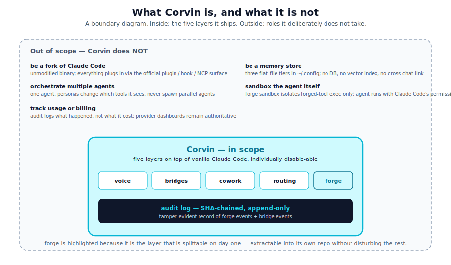

# CorvinOS — Overview

## What it is

CorvinOS is an **OS-level runtime for trustworthy AI deployment**. It wraps AI
engines the way an operating system wraps processes: with isolation, audit,
lifecycle management, and policy enforcement. The result is a platform where AI
assistants can be deployed across production environments and regulated industries
without sacrificing control, traceability, or data sovereignty.

At its core, CorvinOS actively enforces — structurally, not as a policy
document — the requirements of the EU AI Act 2026, GDPR, and enterprise data
governance. This is not passive compliance posture; every mechanism (bot
disclosure, consent gates, audit chaining, data classification flow guards,
house-rules gate) is wired code that fails closed if bypassed. The system is
built on 39+ layers of interlocking guarantees, each independently auditable
and independently removable.

## What it lets you do

**Deploy AI assistants across messaging channels simultaneously.**
The same configured AI runtime can serve WhatsApp, Telegram, Discord, Slack,
Signal, SMS, and email in parallel — each channel independently whitelisted,
rate-limited, and audited. Per-chat personas mean each conversation gets
a specialist (browser agent, inbox assistant, research analyst, code reviewer)
rather than a generic chatbot.

**Let AI create its own tools at runtime.**
The Forge plugin lets the AI register a new sandboxed tool when it encounters a
recurring task. Every generated tool runs in a `bwrap` sandbox with declared
network policy and injected secrets — the AI never sees secret values directly.
Every tool call is written to the tamper-evident audit chain before execution.

**Let AI accumulate and improve its own skills.**
The SkillForge plugin captures reusable reasoning patterns as Markdown skills.
Skills are linted before admission, auto-graded after each use, and promoted
through scope levels (session → project → user) only when they consistently
produce good outcomes. The system evolves without operator intervention; the
operator controls the promotion thresholds and can roll back at any scope.

**Control exactly which data reaches which AI engine.**
A four-tier data classification system (PUBLIC / INTERNAL / CONFIDENTIAL /
SECRET) is enforced at every engine-spawn callsite. Each engine has a declared
locality and network-egress profile; the runtime blocks a spawn if the data
classification would require sending data outside the permitted boundary.
A CONFIDENTIAL task never reaches a cloud engine — the gate is fail-closed.

**Prove compliance to regulators with one command.**
The audit log is a SHA-256 hash-chained append-only file. Every event —
tool call, session lifecycle, consent decision, data flow block, agent-to-agent
exchange — lands in the chain before the action it describes completes.
Running `voice-audit verify` confirms the chain is intact from genesis to the
current tail. This is the single command that answers an auditor's question
about tamper evidence.

**Build teams of AI agents that communicate securely across instances.**
The A2A (agent-to-agent) protocol lets multiple CorvinOS instances exchange
signed task envelopes over authenticated channels. Each envelope carries
bidirectional instance attestation; the receiver verifies the sender's identity
before spawning any work. Binary attachments (PDFs, datasets, images) travel
in the same envelope with sha256 integrity checks. Network membership
attestation (Protocol v6/v7) adds a cryptographic credential so a forked or
swapped receiver cannot impersonate a legitimate node. A2A turns isolated
deployments into a verifiable network of cooperating agents.

**Extend the system without touching core infrastructure.**
Personas are JSON files. Tools are Python scripts that conform to a schema.
Skills are Markdown files. New channels are implemented as Node.js daemons that
speak the adapter protocol. The extension API enforces namespace isolation so
third-party extensions cannot collide with or impersonate core layers. Every
piece of the system can be added, removed, or replaced independently.

## Mental model

An operating system does not trust processes. It gives them controlled access to
resources, audits their system calls, enforces isolation between them, and kills
them when they misbehave. The same discipline applies here.

CorvinOS does not trust AI engines. It gives them access to declared tools (not
arbitrary filesystem or network), audits every action to a tamper-evident chain,
enforces data classification at every spawn boundary, and runs sandboxed tool
code in `bwrap` so a misbehaving tool cannot reach adjacent state.

The AI engine — whether Claude Code, a local Ollama model, GitHub Copilot CLI,
or an external provider — is a process. CorvinOS is the kernel layer it runs
under. Five WorkerEngine implementations ship today: `ClaudeCodeEngine`
(default, full hooks + skills), `CodexCliEngine`, `OpenCodeEngine`,
`HermesEngine` (local Ollama, zero egress, CONFIDENTIAL-capable), and
`CopilotCliEngine` (GitHub Copilot CLI, worker-only). Every engine receives
the same L10 path-gate, L16 audit, and L33 artifact-registration guarantees
via the Tool Execution Broker — engine choice does not weaken the runtime
contract.

## What it is not

  

Being precise about CorvinOS requires saying what it is not.

- **Not a fork of any AI engine.** Claude Code, Ollama, OpenCode, and Copilot
  CLI run unmodified. CorvinOS plugs into them via their official extension
  mechanisms — MCP servers, plugin hooks, subprocess protocols.
- **Not a multi-agent orchestrator in the traditional sense.** Each conversation
  is handled by a single engine turn. Delegation (sending a task to a worker
  engine) is explicit and audited, not implicit parallel spawning.
- **Not a vector database or semantic memory system.** Conversation recall uses
  FTS5 full-text search over PII-redacted turn summaries. The design
  prioritizes auditability and deletion (GDPR Art. 17) over retrieval
  sophistication.
- **Not a sandbox for the AI engine itself.** The Forge sandbox isolates
  generated tools at execution time. The engine runs under the operator's
  configured permissions; CorvinOS enforces *what the engine can call*, not
  *what the engine process can do at the OS level*.
- **Not a billing or cost tracker.** API costs are visible only via provider
  dashboards. The audit log records *what happened* and *to which data
  classification level*, not what it cost.

## Design principles

These principles are what the codebase already enforces. They are documented
here so they can be referenced explicitly rather than inferred from code review.

### 1. Compliance is structural, not advisory

Every compliance mechanism — bot disclosure, consent gates, audit chaining,
data classification flow guards, network egress lockdown — is implemented as
code that fails closed if bypassed, not as a policy document that code is
expected to follow. Disabling a compliance mechanism requires removing code,
not flipping a flag. There is no "compliance-off mode."

### 2. Layers are removable, not stacked

Every layer is independently disable-able and the layer below it keeps working.
Removing the Forge plugin eliminates runtime tool generation; bridges, personas,
and audit continue functioning. Removing the cowork plugin removes persona
routing; the system falls back to a single default persona. Disabling a bridge
channel removes only that channel; all others continue.

This rule has a specific corollary: audit instrumentation in each layer
degrades gracefully to a no-op when the audit subsystem is absent. No layer
errors or falls back to a half-broken state because another layer is missing.

### 3. Hot-reload by default

Configuration changes — channel settings, persona definitions, tool policy —
take effect on the next event without a restart. The mechanism is mtime-checking
caches in both the channel daemons and the Python adapter. Only structural
changes (daemon code, tokens, HTTP ports) require a restart.

This is load-bearing for security: a new restriction added to tool policy blocks
the next call immediately, including calls from tools that predate the
restriction. There is no window where a stale snapshot allows a call through.

### 4. Auditable beats elegant

When a design choice trades simplicity for auditability, auditability wins:

- The audit log is a single append-only file with a SHA chain, not a database.
  It can be inspected with standard tools, verified with one command, and
  transported offline. A database would be more queryable; this is more
  inspectable and simpler to seal and sign for long-term retention.
- Tool policy is a human-editable JSON file with hot-reload. A compiled DSL
  would be more expressive; a JSON file is grep-able and diff-able.
- Every tool execution writes a run manifest with redacted secrets before the
  tool runs. The on-disk record before execution is the point — not an
  after-the-fact log.

### 5. Interfaces beat internal coupling

The major subsystems — channel bridges, persona engine, Forge, SkillForge,
audit, A2A — have no imports in the direction that would prevent independent
extraction. The audit instrumentation in each layer goes one-way (toward the
audit chain); nothing in the audit module imports from Forge or bridges.

This means any subsystem can be extracted into its own package without surgery
on the rest. The coupling that exists is explicit and documented in the layer
model.

## Where to go next

- [layer-model.md](layer-model.md) — the contract of each layer and what it
  does not own.
- [data-flow.md](data-flow.md) — a concrete walk-through of a single message
  from channel to reply.
- [audit-and-compliance.md](audit-and-compliance.md) — the full compliance
  mechanism inventory with the regulation each mechanism satisfies.
