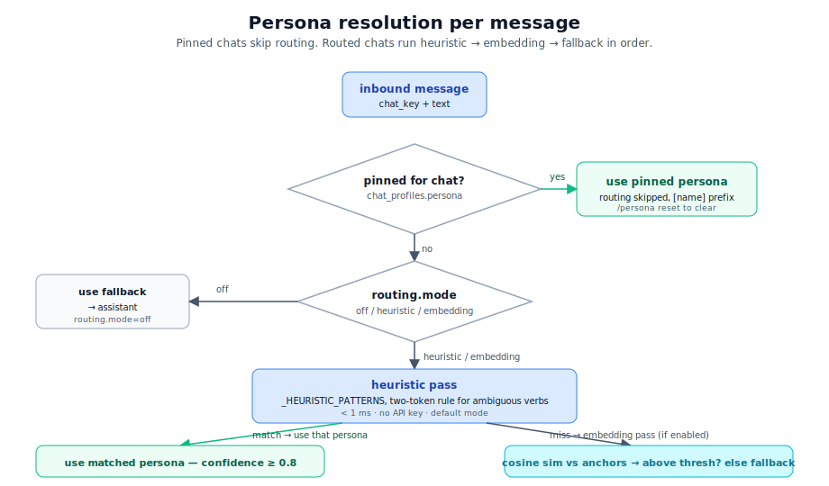

# personas-and-routing.md — cowork + auto-routing

## Mental model

A **persona** is a saved configuration that turns the same Claude Code agent into a specialist for one job — `research` for the web + notes, `inbox` for email and calendar, `coder` for engineering. **Auto-routing** decides which persona handles a given message when no persona is pinned for the chat. The two layers are separate: cowork *defines* personas, the router *picks* them.

<p align="center">
  
</p>

## Personas

### What a persona is, on disk

A persona is one JSON file. Bundled personas live in `operator/cowork/personas/<name>.json`; user-specific overrides live in `~/.corvin/cowork/personas/<name>.json` (outside a repo) or `<repo>/.corvin/cowork/personas/<name>.json` (inside a repo). The user version wins on collisions.

```jsonc
{
  "name": "research",
  "description": "Research + web automation agent: WebSearch + WebFetch for plain reading, Playwright MCP for interactive sites.",
  "permission_mode": "bypassPermissions",
  "allowed_tools": [],
  "mcp_servers": {
    "playwright": { "command": "npx", "args": ["-y", "@playwright/mcp@latest"] }
  },
  "add_dirs": ["~/cowork/research"],
  "append_system": "You are a research agent. Use WebSearch + WebFetch for standard web reading and Playwright MCP for interactive or JavaScript-heavy sites. Save notes under ~/cowork/research/<topic>.md. Structure replies as: TL;DR (3 bullets), details, sources.",
  "routing_anchors": [
    "summarize the article",
    "research what the literature says about X",
    "find me the cheapest train Berlin to Munich",
    "scrape this page and extract the prices"
  ],
  "routing_exclude": false,
  "setup_hint": "On first call, npx installs Playwright browser binaries (~150 MB). One-time wait.",
  "forge_enabled": true,
  "skill_forge_enabled": true,
  "tool_namespace": "research",
  "ldd_preset": "quick",
  "ldd_layers": { "reproducibility_first": true }
}
```

The fields fall into five groups:

| Group | Fields | What they do |
|---|---|---|
| **Identity** | `name`, `description` | Slash-command label, log line, listing in `/personas` |
| **Tool surface** | `tools`, `disallowed_tools`, `mcp_servers`, `permission_mode`, `add_dirs` | Materialised into `claude` flags by the adapter (`_build_claude_args`) |
| **System prompt** | `append_system` | Concatenated onto Claude Code's own system prompt — this is how the persona "knows its role" |
| **Routing** | `routing_anchors`, `routing_exclude` | Used only by layer 4 (auto-router), see below |
| **LDD discipline** (Layer 14) | `ldd_preset`, `ldd_layers`, `ldd_enabled` | Which LDD disciplines the persona runs by default — preset (default/strict/quick/off) + delta + master flag. Resolved by `cowork.resolver._resolve_ldd_section`; `chat_profile` overrides win |

### Bundled personas

| Name | One-line role | Notable tools / MCP | Generation capability | LDD profile (Layer 14) |
|---|---|---|---|---|
| `assistant` | Generalist, fallback for the router | All standard tools; `routing_exclude: true` | Forge tools + skills (zero_config) | `quick` (4 / 12) |
| `coder` | Default coder for engineering chats | `--dangerously-skip-permissions`, full tools | Forge tools + skills (`code.*` namespace) | `default` (12 / 12) |
| `research` | Web research + browser automation via Playwright MCP | WebSearch, WebFetch, Playwright MCP, file write into `~/cowork/research/` | Forge tools (with shared network) + skills | `quick` + `+reproducibility_first` (5 / 12) |
| `inbox` | Gmail + Google Calendar | `gmail-helper` shell tool, `mcp__claude_ai_Gmail*`, calendar MCP | Forge tools + skills | `off` + `+dialectical_reasoning` (1 / 12) |
| `homeassistant` | Smart-home control | HASS MCP, opt-in only (`routing_exclude: true`) | None by default — operator opts in by setting `forge_enabled` / `skill_forge_enabled` | `off` (0 / 12) |
| `orchestrator` | Delegation hub — routes sub-tasks to worker engines | Five delegate MCP tools (`delegate_claude_code`, `delegate_codex`, `delegate_opencode`, `delegate_hermes`, `delegate_copilot`) | Forge tools + skills | `off` (0 / 12) |
| `forge` | Unified runtime-generation specialist (tools AND skills) | `mcp__forge__*`, `mcp__skill_forge__*`, no Bash/Edit/Write | Native — the persona itself is the generator. Historic name `skill-forge` resolves here via alias | `quick` + `+reproducibility_first` (5 / 12) |
| `os` | Corvin sysadmin (pin-only, `routing_exclude: true`) | Read-heavy, no Edit/Write/Bash | None | `off` + `+dialectical_reasoning, +drift_detection, +docs_as_dod, +method_evolution, +reproducibility_first, +root_cause_by_layer` (6 / 12) |

Capability is opt-in per persona via `forge_enabled: true` and / or `skill_forge_enabled: true` in the persona JSON. The resolver injects the corresponding MCP tools, the MCP server wiring, and a runtime-built capability brief into the persona's `append_system` (see [forge.md](forge.md) for the brief contents). The brief is read fresh from `policy.json` per resolve, so it never lies about what the runtime actually permits.

### Adding your own

Drop a JSON file into `~/.corvin/cowork/personas/<name>.json` (or `<repo>/.corvin/cowork/personas/<name>.json` inside a repo). The resolver reloads on the next message that picks it up — no daemon restart. Test with:

```bash
operator/cowork/bin/cowork show <name>     # JSON pretty-print
operator/cowork/bin/cowork run <name>      # standalone, no bridge
```

### Pinning vs. routing

Two ways a persona ends up handling a message:

1. **Pinned** — the chat has `chat_profiles[<chat>].persona = "<name>"` in `bridges/<channel>/settings.json`, or the user sent `/persona <name>` in chat (which writes the same field). Pinned chats skip the router.
2. **Routed** — no pin, the router decides per message. Pure auto-routing means each message can be handled by a different persona, with the `[name]` reply prefix telling the user which one.

`/persona reset` clears the pin and re-enables routing for that chat.

---

## Auto-routing

Auto-routing is a single Python module: `operator/bridges/shared/router.py`. It is layer 4 on the [layer model](layer-model.md), invoked from the adapter's `_apply_auto_routing()` *after* persona resolution and *before* `_build_claude_args`.

### Three modes

| Mode | When it runs | Cost | Where to set |
|---|---|---|---|
| `off` | Never. Every chat without a pin lands at the fallback persona. | 0 ms, 0 $ | `routing.mode = "off"` in `bridges/shared/settings.json` |
| `heuristic` | Default. Regex matcher only. | <1 ms, 0 $ | `routing.mode = "heuristic"` |
| `embedding` (a.k.a. `auto`) | Heuristic first, then OpenAI embeddings if the heuristic missed. | ~150 ms, ~$0.0000006 / message | `routing.mode = "auto"` + `OPENAI_API_KEY` |

The default is `heuristic` because it works on Max-subscription setups *without* an Anthropic key, *without* an OpenAI key. Adding `OPENAI_API_KEY` (already present for Whisper / TTS) automatically makes embedding routing available; flip the mode to `auto` to enable.

There is also `claude -p` LLM routing (Haiku via the local CLI). It is **opt-in only via `ROUTER_ALLOW_CLI=1`** — by default we skip it silently because it costs ~12 s per message on Max-subscription setups (the CLI's own startup overhead).

### Heuristic patterns

`_HEURISTIC_PATTERNS` in `router.py` is the canonical pattern table — keep it tight, keep it conservative.

```python
_HEURISTIC_PATTERNS = {
    "research": [
        r"\bopen\s+(?:the\s+)?(?:url|link|page|site)\b",
        r"\bscrape\b",
        r"\bcheapest\s+train\b",
        # ...
    ],
    "inbox": [
        r"\bcheck\s+(?:my\s+)?(?:email|mail|inbox)\b",
        r"\bschedule\s+a\s+meeting\b",
        # ...
    ],
}
```

Two-token rule for ambiguous verbs: `"open"` alone is too generic — only `"open <noun>"` where `<noun>` is one of `url`, `link`, `page`, `site` routes to a web persona. False positives at this layer are worse than misses, because a miss falls through to the embedding pass (or the `assistant` fallback, which has full tools anyway).

### Embedding pass

When the heuristic returns nothing or low confidence, `route()` falls back to `text-embedding-3-small`:

1. Embed the user message once (~150 ms, ~$0.0000006).
2. Compute cosine similarity against each persona's `routing_anchors`. Anchors are pre-embedded once and cached on disk per anchor hash, so subsequent runs are pure local math.
3. The persona with the highest similarity above threshold wins.
4. Below threshold → fallback persona.

**Why embeddings beat keywords here:** *"such mir den günstigsten Zug nach München"* and *"find me the cheapest train to Munich"* are semantically equivalent but share zero keywords. The embedding picks up meaning, not tokens.

### Confidence and the fallback

The router never returns `None`. The signature is:

```python
def route(text: str, anchors: dict) -> dict:
    return {
        "persona": str,        # always a valid persona name
        "confidence": float,   # 0.0 - 1.0
        "why": str,            # "heuristic:travel" / "embedding:0.84" / "fallback"
    }
```

If everything misses, `persona` is the configured fallback (`assistant` by default), `confidence` is `0.0`, `why` is `"fallback"`. The fallback persona's job is to be a competent generalist — it has full tool access and picks the right tool itself.

### Routing-excluded personas

Two bundled personas are marked `routing_exclude: true`:

- **`assistant`** — because it *is* the fallback, the router would otherwise self-reference. It is reachable via `/persona assistant` or by being the fallback; never via routing.
- **`homeassistant`** — opt-in only. Routing accidentally to a smart-home persona could trigger physical effects, so it is disabled by default. Pin it explicitly with `/persona homeassistant`.

To make a custom persona routable, set `routing_exclude: false` and provide tight `routing_anchors`. No other registration step.

### Test hooks

Two environment variables short-circuit the router for tests:

- `ROUTER_FAKE=1` + `ROUTER_FAKE_RESULT='{"persona":"research","confidence":0.9,"why":"test"}'` — bypass everything, return the literal value.
- `ROUTER_EMBED_FAKE=1` — replace the OpenAI embedding call with a deterministic hash-based vector. Used by `test_router.py` and `test_router_embedding.py` so they pass offline.

`ADAPTER_ROUTING_MODE=off` overrides `routing.mode` in `shared/settings.json` for tests that need to verify legacy max-open behaviour without the router interfering.

---

## Persona × forge interaction

Two orthogonal mechanisms combine here:

### Capability gate (does this persona get the forge MCP at all?)

Set `forge_enabled: true` and / or `skill_forge_enabled: true` in the persona JSON. The resolver (`_inject_forge_capability` / `_inject_skill_forge_capability`) injects the corresponding MCP server config + the matching tools into `allowed_tools`, and appends a runtime-built capability brief to `append_system`. Default is no capability — opt-in per persona.

### ACL allowlist (which forged tools may this persona *call*?)

A persona can also restrict which **already-forged** tools it may invoke, separate from the capability flag:

```jsonc
{
  "name": "research",
  "allowed_forged_tools": ["summarise", "extract_citations"],
  "append_system": "Forged tools you have: {{ALLOWED_FORGED_TOOLS}}.\n..."
}
```

Two things happen at dispatch:

1. The adapter populates `FORGE_ALLOWED_TOOLS=summarise,extract_citations` in the `forge` MCP server's env (via the `mcp_servers` config the resolver materialises).
2. The cowork resolver expands `{{ALLOWED_FORGED_TOOLS}}` in `append_system` so the agent's system prompt names exactly the tools it may call.

Forge enforces the allowlist on every call. Denied calls do not run; they emit `acl.persona_denied` to the audit log and Claude sees a structured error. See [forge.md](forge.md) §Per-persona allowlist.

### Namespace gate (which names may this persona *register*?)

The forge `policy.persona_namespaces` mapping owns this: `coder` may register `code.*`, `inbox` may register `inbox.*`, etc. Cross-persona name collisions emit `tool.namespace_denied`. The capability brief tells the agent which prefix it owns so it doesn't waste a round-trip on the gate.

The split: **cowork declares capability, forge enforces ACL + namespace**. The path-gate hook (Surface 5 in [security.md](security.md)) keeps the workspace files writable only via the MCP server, so the gates above are not bypassable through `Bash` / `Write`.

---

## Slash-command surface

Inside any bridged chat:

| Command | What it does |
|---|---|
| `/personas` | List all available personas with one-line description |
| `/persona <name>` | Pin this chat to a persona; auto-routing disabled for the chat |
| `/persona reset` | Clear the pin; auto-routing re-enabled |
| `/whoami` | Print the resolved profile for this chat — pin status, current persona, ACL |
| `/skills` | Per-persona skill listing (cowork-aware) |

Standalone (no bridge, no Claude Code):

```bash
operator/cowork/bin/cowork list                    # list bundled + user personas
operator/cowork/bin/cowork show <name>             # JSON
operator/cowork/bin/cowork run <name>              # one-shot run with that persona
operator/cowork/bin/cowork bind <chat_key> <name>  # write the pin to settings.json
operator/cowork/bin/cowork unbind <chat_key>       # clear the pin
operator/cowork/bin/cowork add <name>              # copy a bundled persona to user dir for editing
operator/cowork/bin/cowork rm <name>               # remove a user persona (bundle is untouched)
```

---

## Next

- [forge.md](forge.md) — the runtime tool factory that the persona allowlist gates.
- [security.md](security.md) — the four enforcement surfaces, including the persona ACL.
