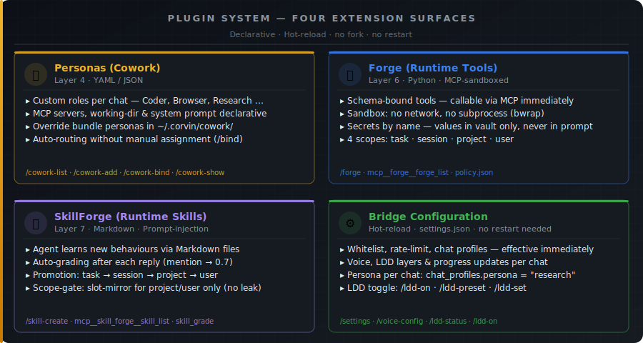
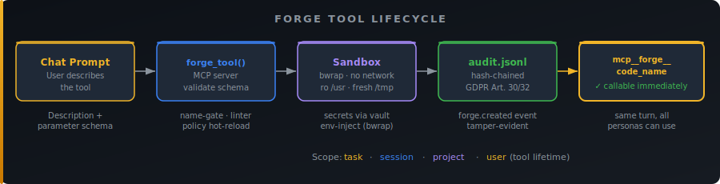
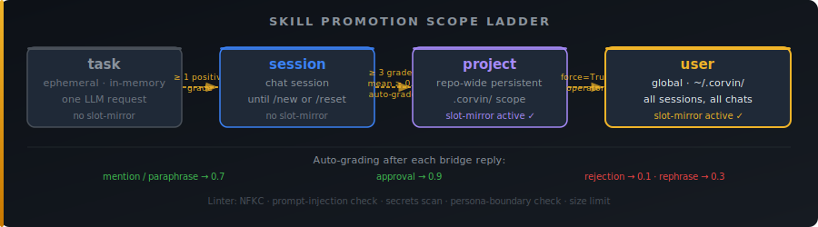

# Plugin System



Corvin extends **without forking** and **without restarting** any process.
All four plugin surfaces are declarative, hot-reloadable, and operate within the existing
security and compliance guarantees.

---

## 1. Personas — who responds (Layer 4)

Personas are JSON files that define which role an agent takes in a particular chat:
which tools are allowed, which MCP server is loaded, which system prompt is appended,
and which working directory is used.

| Property | Value |
|---|---|
| **Bundle personas** | `operator/cowork/personas/<name>.json` |
| **User override** | `~/.corvin/cowork/personas/<name>.json` |
| **Hot-reload** | immediate, re-read per message |
| **Bind per chat** | `/cowork-bind <name>` or `chat_profiles.persona` in `settings.json` |
| **Auto-routing** | heuristic (no API call) or embedding-based |

**Example persona:**

```json
{
  "name": "research",
  "description": "Deep-search researcher with web access",
  "permission_mode": "bypassPermissions",
  "mcp_servers": {
    "brave": { "command": "npx", "args": ["@modelcontextprotocol/server-brave-search"] }
  },
  "append_system": "Answer with cited sources and URLs only.",
  "working_dir": "/home/user/research"
}
```

Creating a custom persona:

```
/cowork-add research      # copy bundle persona into user dir
# edit the file — active immediately, no restart
/cowork-bind research     # bind current chat to this persona
/cowork-list              # list all known personas
```

→ Details: [Personas & Routing](personas-and-routing.md) · [Layer Plugins Ref](claude-ref/layer-plugins.md)

---

## 2. Forge — runtime tools (Layer 6)

Forge generates **schema-bound, sandboxed Python tools** via chat command.
A tool is callable via MCP immediately after creation — no deployment pipeline, no restart.



**How it works:**

1. Describe the tool in natural language in the chat.
2. `forge_tool()` is called via the MCP server; name and schema are validated.
3. The code runs in a `bwrap` sandbox: no network, no subprocess, fresh `/tmp`, read-only `/usr`.
4. Creation is hash-chain logged to `audit.jsonl` (GDPR Art. 30/32).
5. The tool is immediately available as `mcp__forge__code_<name>` — same turn.

**Scopes** (tool lifetime):

| Scope | Lifetime |
|---|---|
| `task` | One LLM request |
| `session` | Until `/new` or `/reset` |
| `project` | Repo-wide persistent (`.corvin/`) |
| `user` | Globally persistent (`~/.corvin/`) |

**Operator control** via `~/.corvin/global/forge/policy.json` (hot-reloaded, path-gate protected):

```json
{
  "max_tools_per_session": 20,
  "network": "deny",
  "allow_scopes": ["session", "project"]
}
```

**Secrets** — tools declare env-var names in `meta.secrets`; values are injected at runtime
from the vault (`~/.config/corvin-voice/secrets.json`) via `bwrap` env-inject — never in the
prompt, never in the audit log.

→ Details: [Forge](forge.md) · [Layer Plugins Ref](claude-ref/layer-plugins.md)

---

## 3. SkillForge — runtime skills (Layer 7)

SkillForge generates **Markdown skills** that are prompt-injected into future subprocess turns.
The agent learns new behaviours purely through Markdown — no code required.



**Promotion chain:**

| From | To | Condition |
|---|---|---|
| `task` | `session` | ≥ 1 positive grade |
| `session` | `project` | ≥ 3 grades, mean ≥ 0.5 |
| `project` | `user` | `force=True` (operator decision) |

**Auto-grading** — after each bridge turn the adapter automatically grades active skills:

| Signal | Score |
|---|---|
| Mention / paraphrase in reply | 0.7 |
| Explicit user approval | 0.9 |
| User rejection / correction | 0.1 |
| Rephrase on next turn | 0.3 |

**Example — create a new skill:**

```
/skill-create csv_workflow session
```

Then enter the Markdown body:

```markdown
# CSV Workflow
Load both files via pandas.read_csv with the same dtype map.
Sort by primary key. Emit a row-wise Markdown diff.
```

The skill is active in the current session immediately and can work its way up to `project` scope
via grading, where it applies to all chats in the repo.

**Linter** (fail-closed): NFKC normalisation, prompt-injection check, secrets scan,
persona-boundary check, size limit.

**Slot-mirror** — for `project`- and `user`-scoped skills a
`operator/skill-forge/skills/dyn/<name>/SKILL.md` is written (gitignored),
injected directly into the engine. Task/session skills have no slot-mirror
(prevents cross-chat leak).

→ Details: [Runtime Generation](runtime-generation.md) · [Layer Plugins Ref](claude-ref/layer-plugins.md)

---

## 4. Bridge Configuration — hot-reload

`operator/bridges/<channel>/settings.json` is re-read **per incoming message**.
Changes take effect immediately — no process restart required.

**What hot-reloads:**

| Field | Effect |
|---|---|
| `whitelist` | Allowed users |
| `chat_profiles` | Persona, voice mode, rate limit, LDD preset per chat |
| `enabled_chats` / `debug_chats` | Enable chats or put them in debug mode |
| `voice_summary_mode` | `auto` · `full` · `summary` |
| `progress_updates` | Progress display during stream |
| `rate_limit_per_hour` | Message budget per hour |

**What requires restart:** bridge tokens (`discord_token`, `telegram_token` etc.),
HTTP ports, structural daemon code changes.

**Activate a persona per chat** (without `/cowork-bind`):

```json
{
  "chat_profiles": {
    "1234567890": {
      "persona": "research",
      "voice_summary_mode": "summary"
    }
  }
}
```

**Control LDD layers per chat:**

```
/ldd-on                          # enable LDD for this chat
/ldd-set layer=per_subtask_e2e on
/ldd-preset full                 # enable all layers
/ldd-status                      # show current status
```

→ Details: [Architecture](architecture.md) · [Layer Voice/LDD Ref](claude-ref/layer-voice-ldd.md)

---

## Scope Model

Forge tools and skills share the same five-scope model:

| Scope | Lifetime | Storage | Slot-mirror |
|---|---|---|---|
| `task` | One LLM request | in-memory | no |
| `session` | Until `/new` or `/reset` | `<corvin_home>/sessions/<bridge>:<chat>/` | no |
| `project` | Repo-wide persistent | `.corvin/` in project | yes |
| `user` | Globally persistent | `~/.corvin/` | yes |
| `tenant` | Tenant-wide | `~/.corvin/tenants/<id>/` | yes |

Session cleanup: `/new` / `/clear` / `/reset` atomically deletes all session-scoped skills and
Forge tools — a `session.reset` event is written to `audit.jsonl` **before** any files are removed.

---

## Security & Compliance

All four plugin surfaces run behind the same security stack:

| Mechanism | Protects |
|---|---|
| **Path-Gate Hook** (Layer 10) | Prevents direct writes to forge/skill/audit/policy paths |
| **bwrap sandbox** | Tool code runs without network, without subprocess, fresh filesystem |
| **Linter** (fail-closed) | Prompt-injection, secrets, persona-boundary in skills |
| **Policy hot-reload** | Operator can restrict tool creation at any time |
| **Hash-chained audit** | Every plugin event inseparably recorded in `audit.jsonl` |
| **Consent gate** | No automatic activation without user consent |

### MCP servers are trusted in-process code

Unlike Forge tools — which run inside the bwrap sandbox as subprocesses and
**cannot** reach the adapter's Python memory — MCP servers load **in-process**.
A compromised or malicious MCP server binary has unrestricted access to the
adapter's Python namespace. No `MappingProxyType` or env-var
snapshot protects against this; it is an accepted, documented limitation
of the in-process trust boundary.

**Operator vetting of MCP server binaries is mandatory before deployment.**
Only add an MCP server you trust at the same level as the adapter itself. Treat
`mcp_servers` entries in a persona as a trust grant, not a sandbox.

→ [Audit & Compliance](audit-and-compliance.md) · [Layer Security Ref](claude-ref/layer-security.md) · [Licensing baseline](claude-ref/licensing.md)

---

## Further Reading

| Topic | Document |
|---|---|
| System architecture & message flow | [Architecture](architecture.md) |
| Personas & auto-routing | [Personas & Routing](personas-and-routing.md) |
| Forge in depth | [Forge](forge.md) |
| SkillForge & runtime generation | [Runtime Generation](runtime-generation.md) |
| Engine layer (Claude / Codex / OpenCode / Hermes) | [Engine Layer](engine-layer.md) |
| Memory & conversation recall | [Memory Model](memory-model.md) |
| Data & Compute | [Data & Compute](data-and-compute.md) |
| EU AI Act + GDPR compliance | [Audit & Compliance](audit-and-compliance.md) |
| Multi-tenant | [Multi-tenant architecture](claude-ref/adr-0007.md) |
| Layer plugins technical reference | [Layer Plugins](claude-ref/layer-plugins.md) |
| Security hardening | [Layer Security](claude-ref/layer-security.md) |
