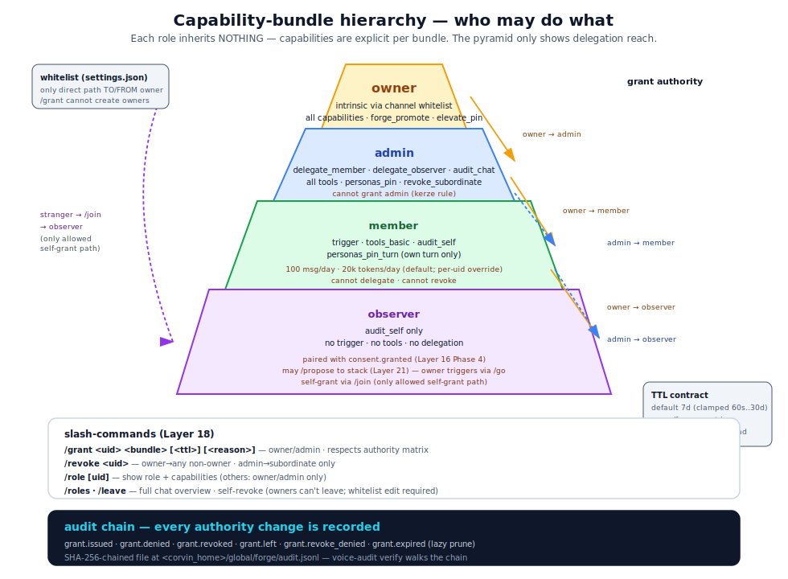
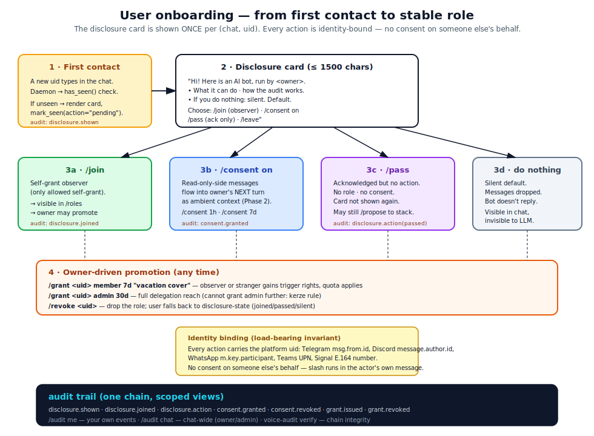
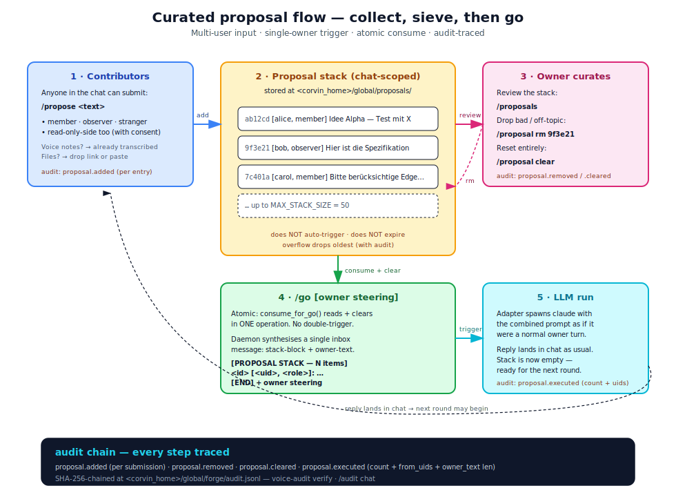
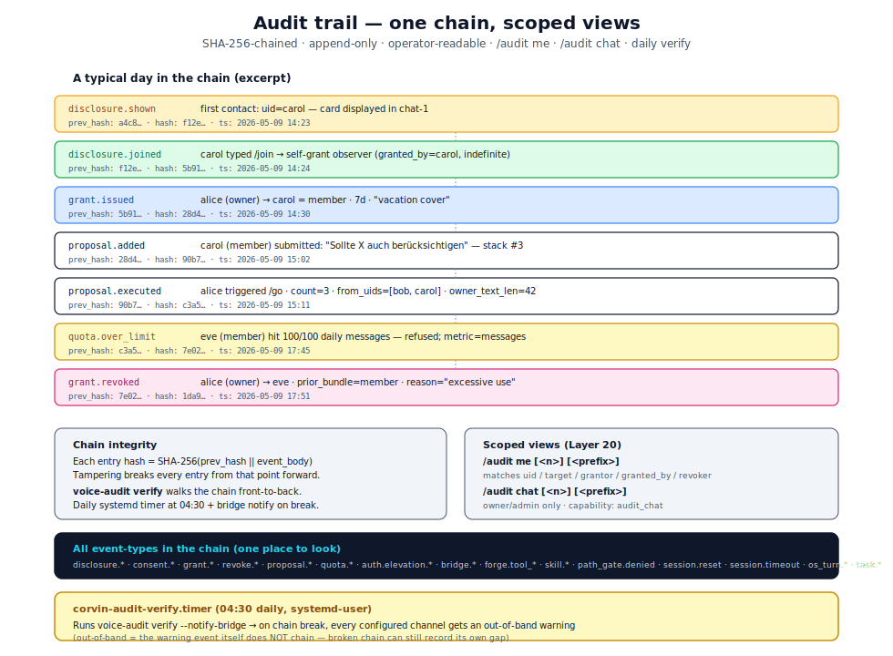

# Rights & Teamwork — multi-user collaboration in Corvin

**Audience:** operators who run Corvin in shared chats (family, team,
workshop), developers extending the role / consent / proposal layers,
security reviewers verifying the trust model.

**TL;DR.** A bridge chat in Corvin supports up to four overlapping
roles per (chat, uid): **owner** (intrinsic via the channel whitelist),
**admin** (delegated by the owner; may delegate `member` and
`observer`), **member** (may trigger the bot, has a quota), and
**observer** (read-only with consent gate; may submit `/propose`-d
ideas). A separate **proposal stack** lets multiple people brainstorm
without auto-triggering the AI — the owner (or admin) reviews and
fires `/go` when ready. Every authority change, consent grant,
quota decision, and proposal action lands in a SHA-256-chained audit
log that two scoped views (`/audit me`, `/audit chat`) make
human-readable.

---

## 1 · Mental model — three independent axes

Corvin separates **three orthogonal capabilities** that classical
chatbot whitelists collapse into one binary on/off:

1. **Presence** — *may this person be in the chat at all?*
   Enforced by the platform itself (Discord roles, WhatsApp group
   membership, …) — Corvin doesn't manage this.

2. **Visibility** — *do the AI and the audit log see this person's
   text?* Default deny. The user opts in via `/consent on` (or the
   owner enables `observer_visibility = "transcript"` on the chat
   profile, which still requires per-user `/consent on` to admit).

3. **Trigger authority** — *may this person make the AI run?*
   Default deny. Only `owner`, `admin`, or `member` roles can
   trigger; `observer` cannot. The owner delegates trigger rights
   via `/grant`.

These three axes are **set independently and audited separately**.
That separation is what makes "let people contribute, but only I
trigger the AI" expressible — it's the proposal stack (Layer 21):
contributors have visibility but no trigger authority; they push to
a stack; the owner pulls the trigger.



The diagram shows the **delegation reach** of each role. Each role
holds an explicit set of capabilities — there is **no inheritance**.
An admin doesn't "include" a member; an admin holds a different,
explicit set of strings. This makes the audit story crystal clear:
every action is checked against the literal capability set, not a
walk up an inheritance chain.

### The four bundles

| Bundle | Trigger | Tools | Pin Persona | May delegate | Audit chat | Quota |
|---|---|---|---|---|---|---|
| `owner` | ✓ | all | ✓ | admin / member / observer | ✓ | unlimited |
| `admin` | ✓ | all | ✓ | member / observer (NOT admin) | ✓ | 500 msg / 100k tok per day |
| `member` | ✓ | basic | own turn | — | self only | 100 msg / 20k tok per day |
| `observer` | — | — | — | — | self only | n/a (no trigger) |

**Hard rules** (enforced structurally — see `bridges/shared/roles.py`):

- `owner` is intrinsic: it comes from `bridges/<channel>/settings.json`'s
  `whitelist` field and **cannot be granted via `/grant`**. Demoting
  an owner means editing `settings.json`.
- `admin` cannot grant `admin` (the *kerze rule* — "no candle hotter
  than its flame"). An admin can only grant roles strictly below
  their own. This is what keeps the delegation tree finite.
- `member` and `observer` cannot grant anything.
- Self-grant is rejected — except `/join`, which only allows
  self-promotion to `observer` (the lowest bundle, no trigger
  rights). Every promotion to a *trigger-bearing* role goes through
  the owner / admin via `/grant`.
- TTL default is 7 days. Indefinite grants are explicit
  (`/grant uid bundle never reason`).

---

## 2 · Onboarding lifecycle — how a new participant gets a role

When a fresh uid first speaks in a chat where Corvin is active, the
daemon checks the **disclosure store** (`<corvin_home>/global/disclosure/`).
If the uid has never been seen here, the **bot-disclosure card** is
displayed once — explaining who runs the bot, what it can do, and
what the available actions are.

After the card the user picks one of four paths:



1. **`/join`** → self-grant `observer`. Visible in `/roles`, may
   `/propose`, no trigger authority. The owner can later
   `/grant <uid> member` to upgrade.
2. **`/consent on [duration]`** → if the chat has
   `observer_visibility = "transcript"` enabled, the user's messages
   start flowing into the *next* owner turn as ambient context. No
   role granted; just visibility.
3. **`/pass`** → acknowledged but no action. Card not shown again.
   The user remains silently present.
4. **(do nothing)** → silent default. Messages dropped, bot doesn't
   reply, audit logs the contact but nothing about content.

**Identity binding is the load-bearing invariant.** Every action
carries the platform uid (Telegram `msg.from.id`, Discord
`message.author.id`, WhatsApp `m.key.participant`). The owner cannot
issue `/consent on` or `/join` *on someone else's behalf* because the
slash-command runs in the actor's own message — there is no
"on-behalf" parameter and the JS dispatcher rejects every attempt to
fake one.

The disclosure card is **shown exactly once per (chat, uid)**. The
audit chain records the first contact (`disclosure.shown`), every
transition (`disclosure.action`), and the join (`disclosure.joined`).
This is the legal record of "we informed this person on this date."

---

## 3 · Curated proposal mode — collect, sieve, then go (Layer 21)

The architecture supports a workflow that classical bots cannot:
**multiple people contribute ideas, but only the owner triggers the
AI.**

### When to use it

- **Family planning:** kids `/propose` weekend ideas, parent reviews
  and `/go`-s the AI to generate a plan.
- **Team brainstorming:** members paste links / notes / specs into
  the stack; the owner curates and triggers a synthesised reply.
- **Workshop facilitation:** participants `/propose` questions
  during a session; the facilitator picks which to answer with `/go`.
- **Voice-note collection:** voice messages are auto-transcribed and
  go through the same `/propose` path as text.

### Flow



The stack lives at `<corvin_home>/global/proposals/<channel>__<chat>.json`.
Caps: 50 entries (oldest dropped on overflow), 2000 chars per entry
(truncated). Proposals **don't expire by themselves** — only
`/proposal clear` or implicit `/go` removes them.

### Slash-commands

| Command | Who | Effect |
|---|---|---|
| `/propose <text>` | anyone (incl. read-only-side) | append to stack |
| `/proposals` | owner / admin | list current stack |
| `/proposal rm <id>` | owner / admin | drop one entry |
| `/proposal clear` | owner / admin | empty stack without triggering |
| `/go [steering]` | owner / admin | atomic consume + trigger AI |

`/go` is **atomic**: the consume reads and clears the stack in one
operation, before the inbox write that triggers the LLM. A parallel
`/go` cannot double-trigger the same entries.

---

## 4 · Slash-command reference

Most commands are present in two flavours: **owner-side** (called from
a whitelisted user, or via the read-only-side dispatcher when the user
is granted-but-not-whitelisted), and **read-only-side** (called when
the user is on the `read_only` list — no trigger authority).

### Roles & delegation (Layer 18)

```
/role                   show your own role + capabilities
/role <uid>             owner/admin: another user's role
/roles                  owner/admin: full chat overview
/grant <uid> <bundle> [<ttl>] [<reason>]
                        owner/admin: delegate (subject to authority matrix)
/revoke <uid>           owner/admin: drop a granted role
/leave                  give up your own granted role (owner cannot — whitelist edit required)
```

### Disclosure & onboarding (Layer 19)

```
/join                   register as observer (read-only-side)
/pass                   acknowledge the disclosure card without action
/leave                  drop any granted role
```

### Visibility & consent (Layer 16 Phase 4)

```
/consent on             durable consent (until /consent off)
/consent <duration>     time-bounded (30s / 5m / 1h / 7d; max 30d)
/consent off            revoke
/consent status         own status
/consent list           owner: list active consents
/consent revoke <uid>   owner: force-revoke
/share <text>           one-shot per-message admit (chat must have
                        observer_visibility = "transcript")
```

### Quotas & audit (Layer 20)

```
/quota                  caller's own usage
/quota <uid>            owner/admin: another user
/quota all              owner/admin: list all users in chat
/quota set <uid> <m> <t>  owner/admin (use `keep` or `clear` for individual fields)
/quota reset <uid>      owner/admin

/audit                  same as /audit me 20
/audit me [<n>] [<prefix>]    your own events
/audit chat [<n>] [<prefix>]  owner/admin: chat-wide events
```

### Curated proposals (Layer 21)

```
/propose <text>         add to stack (anyone)
/proposals              owner/admin: list stack
/proposal rm <id>       owner/admin: drop one
/proposal clear         owner/admin: empty
/go [steering]          owner/admin: consume + trigger AI
```

### Operator elevation (Layer 16)

```
/auth-up <pin>          owner: short-lived elevation for forge_promote / skill_promote
/auth-down              owner: revoke elevation early
/auth-status            owner: TTL remaining
```

---

## 5 · Audit trail — one chain, scoped views (Layer 20)

Every authority change, consent grant, disclosure event, quota
decision, and proposal action lands in the unified hash-chained log
at `<corvin_home>/global/forge/audit.jsonl`. The same chain that
forge / skill-forge / path-gate / auth-elevation already use — one
`voice-audit verify` covers all of it.



**Scoped views** (capability-gated):

- `audit_self` — every bundle has it. `/audit me` admits events whose
  `details` match the caller's uid in any of: `uid`, `target`,
  `grantor`, `granted_by`, `revoker`, `revoked_by`, `user`. The
  four-way match lets a user see grants AT them and grants BY them in
  one query.
- `audit_chat` — owner / admin only. `/audit chat` shows everything
  scoped to this (channel, chat).

**Chain integrity** is verified daily by the
`corvin-audit-verify.timer` systemd-user timer at 04:30. On chain
break, the configured bridge channels receive an **out-of-band**
notification (out-of-band = the warning event itself doesn't chain,
because a broken chain cannot record its own gap into itself).

---

## 6 · Storage layout

Every layer uses the same store-per-(channel, chat) pattern. JSON
file with a `.lock` sidecar for POSIX flock; atomic-replace via
`tmp` + `os.replace` on every write; lazy-prune on every read for
TTL'd entries.

```
<corvin_home>/global/
├── forge/
│   ├── audit.jsonl              # the unified hash chain
│   └── policy.json              # operator-only (path-gate protected)
├── consent/<channel>__<chat>.json    # Layer 16 Phase 4
├── disclosure/<channel>__<chat>.json # Layer 19
├── roles/<channel>__<chat>.json      # Layer 18
├── quota/<channel>__<chat>.json      # Layer 20
├── proposals/<channel>__<chat>.json  # Layer 21
└── auth/elevation.json               # Layer 16 (PIN-elevation)
```

The store directories are **NOT** protected by the path-gate hook
(unlike `forge/` and `skill-forge/` which are). The contract is
"operator-only via slash-commands or the per-module CLI" — the bridge
process is the only writer. If you hand-edit these files, you bypass
the audit chain.

---

## 7 · Scenarios

### 7.1 · Family chat (you + partner + kids + grandparents)

**Setup:**
- You = owner (whitelist). Partner = `admin 30d`. Kids = `member`
  with reduced quota (`/quota set <kid-uid> 50 10000`). Grandparents
  = `observer` (or read-only with `/consent on`).

**Flow:**
- Kids can `/propose "let's go to the lake on saturday"` — text
  goes onto the stack, no trigger.
- You see `/proposals`, drop the off-topic ones, then
  `/go plan a saturday trip including transport`.
- Grandparents see the bot's reply but cannot trigger anything.
- The audit chain shows who proposed what and when you triggered.

### 7.2 · Workshop (you facilitate; 30 attendees as members)

**Setup:**
- You = owner. Co-host = `admin` for the day (`/grant cohost admin 1d`).
- Attendees = `member` with low quota (e.g. 10 messages / 5k tokens).

**Flow:**
- Attendees ask questions directly (their `member` quota allows
  triggering) — but the bot replies in their context, not yours.
- Or, if you want to curate Q&A: switch the chat to "proposal
  mode" by encouraging `/propose` and triggering `/go` between
  topics.

### 7.3 · Sick leave / vacation cover

**Setup:**
- You're out for two weeks. You delegate via `/grant covercolleague admin 14d "vacation cover"`.

**Flow:**
- Cover colleague has full delegation reach (member + observer)
  but cannot grant another admin (kerze rule).
- TTL ensures the grant expires automatically — no need to
  remember to revoke.
- `/audit chat` lets you check on return what the colleague did.

### 7.4 · Onboarding a new team member

**Setup:**
- New colleague joins the Discord server. First message → disclosure
  card automatically shown.

**Flow:**
- Colleague reads card, types `/join` → registered as observer.
- You verify identity out-of-band, then `/grant <uid> member 30d`.
- Colleague now has trigger rights, subject to default quota.
- After 30 days the role expires; they `/join` again or you re-grant.

### 7.5 · Mid-session decision: who drives?

**Mode 1: ad-hoc collaboration**
- Two members share a chat; both have trigger rights. Whoever speaks,
  the bot replies to. Risk: thread fragmentation.

**Mode 2: curated proposal**
- Only one of them has `member`; the other has `observer`. The
  observer `/propose`-s; the member `/go`-s. One coherent thread,
  two heads brainstorming.

**Mode 3: explicit hand-off**
- The member `/leave`-s. The owner `/grant`-s the role to the other.
  Audit shows the hand-off explicitly.

---

## 8 · Security properties

The rights model is one part of the broader security envelope (see
[`security.md`](security.md) and [diagram 04](diagrams/04-security-envelope.svg)).
This is what the role layer specifically guarantees:

1. **No untracked authority change.** Every grant / revoke / leave /
   denial / expiry produces an audit event. Even *failed* grants
   (`grant.denied`) are recorded.
2. **No phantom owners.** The roles store cannot mint owners; only
   the channel whitelist does. An attacker who owns the bridge
   process *can* edit `settings.json`, but that change is detectable
   via filesystem watching and isn't covered by the chain anyway —
   that's the channel boundary, not the role boundary.
3. **Delegation finiteness.** Admins cannot grant admins; the tree
   has depth ≤ 2 from any root. Without this, a single rogue admin
   could spawn an army of admins; with it, the blast radius of an
   admin compromise is bounded.
4. **No on-behalf consent.** Identity binding via platform uid +
   single-actor slash command → the owner cannot consent for someone
   else. Closes the standard "owner enabled transcript mode and
   suddenly everyone's words flow in" gap.
5. **Quota refusals are visible.** Every `quota.over_limit` is
   audited. Operators see *patterns* (a user systematically hitting
   limits) without inspecting the code.
6. **Failed runs don't burn budget.** `quota.check` and
   `quota.record` are split — record happens *post-flight*. An
   internal exception during the LLM run does not consume the
   user's daily messages.
7. **Atomic stack consume.** `/go` reads + clears the proposal
   stack in one operation. A parallel `/go` cannot trigger the same
   stack entries twice.

---

## 9 · Operational notes

### Daemon contract

The Discord daemon is the reference implementation; Telegram /
Slack / WhatsApp daemons need the same patches before they can host
the new layers (Phase-4 work):

1. Pass `ctx.uid` (the platform uid) to `inChatCmds.dispatch()`. Every
   identity-bound command (`/grant`, `/revoke`, `/leave`, `/role`,
   `/quota`, `/audit`, `/propose`, `/proposals`, `/proposal`, `/go`,
   `/consent`, `/share`, `/join`, `/pass`) needs it.
2. Match `/go` BEFORE `dispatch()`. `/go` cannot work inside
   dispatch (which only returns reply text); it has to call
   `proposalsBuildGoPayload(ctx, ownerText)` and write the resulting
   `prompt` as a synthesised inbox message.
3. Call `dispatchReadOnlyConsent`, `dispatchReadOnlyDisclosure`,
   `dispatchReadOnlyProposal` in the read-only branch BEFORE
   `maybeForwardAsObserver`. These admit non-whitelist senders to
   submit consent / join / propose actions.

### Bridge restart required when…

Any structural daemon change (new slash-command in
`slash_commands.js`, new dispatch routing in `daemon.js`, new layer
module loaded at boot) requires `bash operator/bridges/bridge.sh
restart`. Pure data-only changes (settings.json, store JSON files)
are picked up via mtime hot-reload.

### Discord global slash-command propagation

Discord caches global slash-command registrations and propagates
updates over up to ~1 hour. Two workarounds:

- **Type the command instead of using the picker.** The
  `messageCreate` path doesn't depend on Discord's slash-command
  cache; if you type `/role` and press Enter, it works immediately.
- **Set `DISCORD_GUILD_IDS=<your_guild_id>`** in the bridge's env.
  Per-guild registration is instant.

### Disabling layers

All layers are opt-in:

- `audience: "owner"` (default) — only whitelist talks.
- `audience: "all"` — everyone in chat may talk (skips read-only).
- `observer_visibility: "off"` (default) — read-only senders dropped.
- `observer_visibility: "transcript"` — read-only text buffered + per-user consent.
- No `chat_profile.proposal_*` settings are needed — `/propose`
  just works in any chat (the stack is implicit).

---

## 10 · Per-subtask test coverage

| Layer | Module | Cases | Assertions |
|---|---|---|---|
| 18 | `roles.py` + `js/test_roles_dispatcher.js` | 14 + 22 | 141 + 53 |
| 19 | `disclosure.py` + `js/test_disclosure_dispatcher.js` | 11 + 11 | 55 + 27 |
| 20 | `quota.py` + `audit_view.py` + `js/test_quota_dispatcher.js` | 15 + 15 | 72 + 34 |
| 21 | `proposal.py` + `js/test_proposal_dispatcher.js` | 11 + 16 | 60 + 38 |

All wired into `bash operator/bridges/run-all-tests.sh` (76
test suites total). Every test sandboxes `CORVIN_HOME` to a
tempdir; channel `settings.json` is snapshotted and restored on
exit. The suite runs in ~30 seconds and is CI-suitable.

---

## 11 · See also

- [`security.md`](security.md) — full security envelope (six surfaces + audit)
- [`personas-and-routing.md`](personas-and-routing.md) — per-chat agent roles + auto-routing
- [`forge.md`](forge.md) — runtime tool generation (path-gate, sandbox)
- [`skills.md`](skills.md) — runtime knowledge artefacts (linter, slot-mirror)
- [`layer-model.md`](layer-model.md) — layer index
- `CLAUDE.md` (repo root) — Claude-Code-facing repo conventions
