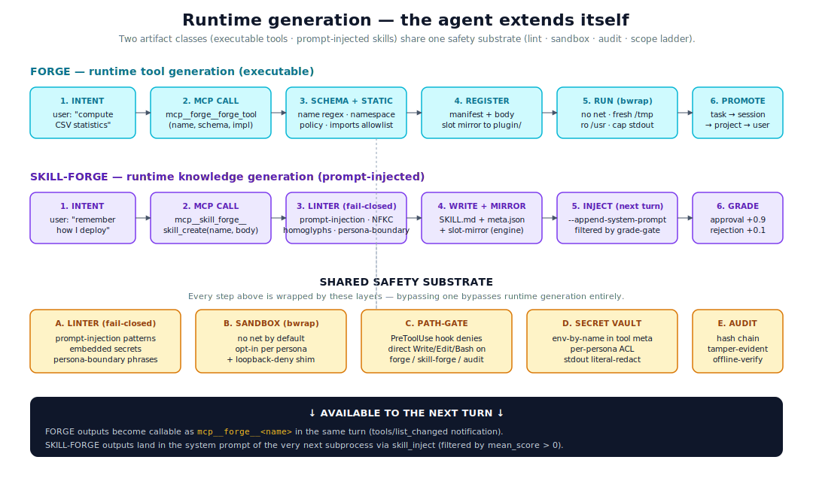

# Runtime generation

> The agent extends itself with new capabilities mid-conversation —
> safely, audibly, and persistently.



## The mental model

Most agent frameworks have a fixed capability surface: the tools you
ship are the tools the agent gets. Corvin treats capability as
**runtime-extensible state**. The agent — talking to you in a chat —
can:

- **forge a new tool**: ship a fresh sandboxed Python (or bash) executable
  that's callable by `mcp__forge__<name>` in the *same* turn it was
  created.
- **create a new skill**: ship a fresh markdown body that gets
  prompt-injected as instructions into the *next* subprocess turn.

Both feel like the agent saying "wait, I'd be more useful if I had X"
and then *having* X. The difference between the two is the artifact
class:

| | Tool (Forge) | Skill (Skill-Forge) |
|---|---|---|
| What it is | Executable code | Markdown knowledge |
| Where it runs | bwrap subprocess | LLM context |
| Safety primitive | Sandbox + policy | Linter |
| Call shape | `mcp__forge__<name>(args)` | Auto-injected text |
| Visible in turn | Same turn | Next turn |
| Best for | Deterministic computation | Workflow / convention / pattern |

The whole subsystem is **opt-in per persona** (via `forge_enabled` /
`skill_forge_enabled` JSON flags), but every persona that gets it
goes through the *same* safety substrate. There is no fast-path or
trusted bypass — neither for personas, nor for the operator, nor for
the agent itself.

## The problem this solves

Without runtime generation, every reusable capability has to be
forecasted at build time and shipped as code. That works for a small
set of stable tools. It doesn't work when:

- Each user has their own micro-workflows (different APIs, different
  data shapes, different conventions)
- The agent discovers a useful pattern mid-session that should
  survive the session
- A reproducible computation needs deterministic re-execution with
  different parameters (and the LLM should *not* be the executor)
- A piece of know-how should compound: each session adds to a
  growing library rather than re-discovering from scratch

The traditional answer is "give the user a plugin SDK." Corvin's
answer is: the agent itself authors the artifact, the substrate
keeps it safe, and the scope ladder gives it a measured lifetime.

## The forge pipeline (executable tools)

When an LLM in a forge-enabled persona decides a deterministic
computation is needed (e.g. "compute statistics over a CSV the user
keeps re-asking about"), it calls:

```jsonc
{
  "tool": "mcp__forge__forge_tool",
  "input": {
    "name": "csv.stats",                       // namespace.name
    "description": "Compute mean/median/stddev for one CSV column",
    "input_schema": {
      "type": "object",
      "properties": {
        "path":   {"type": "string", "x-bind": "ro"},
        "column": {"type": "string"}
      },
      "required": ["path", "column"]
    },
    "impl": "import csv, statistics, json, sys\n…"
  }
}
```

What happens then:

1. **Schema + static check** — name regex (`alnum + . + _`),
   namespace policy (the persona's `tool_namespace` must allow
   `csv.*`), import allowlist (no `subprocess`, no `socket`, no
   `os.system`).
2. **Manifest write** — entry into `<scope>/forge/registry.json`
   with `sha256`, `created_at`, `scope`, `meta`.
3. **Body write** — `<scope>/forge/tools/<name>.py`.
4. **Slot mirror** — for namespace-discovery on next subprocess
   boot.
5. **`tools/list_changed`** notification → the LLM can call the new
   tool *in the same turn*.

When the tool actually runs (some subsequent `mcp__forge__csv.stats`
call):

- spawned under `bwrap` with `--share-net` only when the persona
  policy allows
- `/tmp` is fresh (mount-namespace), `/usr` is read-only,
  `/home/<user>` is unmounted
- `x-bind: ro` paths from `input_schema` are bound read-only into the
  sandbox; `x-bind: rw` paths read-write
- stdout is JSON-shaped (`{ok, status, data, error, meta}`), capped
  at 4 MiB; overflow is preserved as an artifact
- secrets declared via `meta.secrets` are pulled from the per-tenant
  vault, validated against the persona's ACL, and injected as env
  vars *only inside the bwrap*; literal values are stripped from
  the result envelope before it's returned
- every step lands in the audit chain (`tool.created`,
  `tool.invoked`, `tool.network_share`, `tool.secrets_injected`)

## The skill-forge pipeline (prompt-injected knowledge)

When the LLM decides a workflow / pattern / convention should
survive into future sessions:

```jsonc
{
  "tool": "mcp__skill_forge__skill_create",
  "input": {
    "name": "deploy-flow",
    "body": "# Deploy flow\n\n1. Run pre-deploy tests…\n…",
    "description": "How we deploy: tests → tag → docker push → blue/green",
    "type":        "workflow"
  }
}
```

What happens then:

1. **Linter** (fail-closed) — NFKC + cyrillic-confusable normalisation
   (so a homoglyph like `аdmin` cannot bypass detection); rejects
   prompt-injection patterns ("ignore previous instructions",
   embedded `` codes), embedded secrets (high-entropy strings,
   bearer tokens), persona-boundary phrases ("you are now…").
2. **Canonical write** — `<scope>/skill-forge/skills/<name>/SKILL.md`
   plus `meta.json` carrying provenance and grade history.
3. **Slot mirror** — projection into
   `<repo>/operator/skill-forge/skills/dyn/<sanitized>/SKILL.md` so
   the engine's plugin-skill loader picks it up at next subprocess
   boot.
4. **Adapter inject** — on the *very next* bridge turn,
   `skill_inject.collect_active_skills()` reads the skill from the
   workspace and appends it to `--append-system-prompt`. No engine
   restart needed.

The next time the user types in that chat, the LLM sees the new
skill body in its system prompt and can apply it.

## Two-loop grading (skills only)

Skills go through a two-loop grading system that turns user reactions
into a survival signal:

**Inner loop — auto-grade.** After each turn, the adapter scans the
LLM's reply for mentions / paraphrases of the skills that were
active. Each match writes a grade with score `0.7 × 0.3 = 0.3` into
the skill's `meta.json` (the 0.3 cap reflects "we know it was used,
not whether it helped").

**Outer loop — outcome-grade.** The next user turn is scanned for
approval ("danke", "perfekt"), rejection ("falsch", "nochmal"), or
rephrase signals (difflib similarity ≥ 0.6 against the previous
user text). Each signal maps to an absolute score:

| Signal | Score | Mean with auto-grade (0.3) | Promotion gate (>0.5) |
|---|---|---|---|
| approval | 0.9 | 0.6 | eligible |
| rejection | 0.1 | 0.2 | blocked |
| rephrase | 0.3 | 0.3 | blocked, soft hint |

Skills that survive the two-loop grading get promoted up the scope
ladder; skills that don't get TTL-purged after 7 days. **Survival is
relevance.**

## Tools don't auto-grade — they auto-save

Forged tools have a different lifecycle: they're either explicitly
saved by the user (Layer 27 — `me.*` namespace, surviving every
session reset) or they live and die in their session scope. Tools
that earn their keep through the operator's `forge_promote` move up
the scope ladder; the rest get auto-purged with their session.

The Layer-27 `/tool save <name>` flow is the **explicit** path:
operator says "I want this for me, full stop", the tool gets
re-shelved under `<corvin_home>/global/forge/tools/me.<name>.py`
with the grade-gate bypassed. See [memory model](memory-model.md)
for the full personal-tools story.

## The five safety layers

Every step above is wrapped by these. There is **no** trusted bypass
path — neither for the operator, nor for the agent, nor for promoted
artifacts.

### A. Linter (fail-closed)

Skill bodies + tool source are NFKC-normalized, then folded against a
curated cyrillic-confusable map (so `admin` and `аdmin` collide before
detection runs). The linter then walks for:

- prompt-injection markers (`ignore previous`, escape sequences)
- embedded secrets (high-entropy substrings ≥ 32 chars, bearer-token
  shapes)
- persona-boundary phrases that try to redefine the agent
- (warning, non-blocking) code density ≥ 40 %

Rejection raises `LinterError`; the artifact never lands. The linter
is the *only* safety layer that runs before disk writes — it's what
keeps a hostile agent from planting a payload.

### B. Sandbox (bwrap + loopback-deny)

Every tool execution runs in a bwrap mount-namespace + PID-namespace +
network-namespace. Default: no network at all, fresh `/tmp`, ro `/usr`,
no home. Personas with `network: allow` (browser, research) get
`--share-net` *plus* a `sitecustomize.py` shim that patches
`socket.socket.connect` to refuse 127.0.0.0/8, ::1, and the cloud
metadata IP (169.254.169.254). Loopback-allow is a separate opt-in.

### C. Path-gate (PreToolUse hook)

A Claude PreToolUse hook intercepts every `Write` / `Edit` / `Bash` /
`WebFetch` and denies them when the target path matches forge /
skill-forge / audit / policy locations. Bash detection covers
redirects, `tee`, `sed -i`, heredocs, `eval`, command substitution,
and unbalanced quotes (fail-closed when unparseable + hint string).
This is what keeps "the LLM writing files directly" from being a
bypass of the MCP server.

### D. Secret vault (Layer 16 v3)

Operator-owned vault at `~/.config/corvin-voice/secrets.json` (mode
`0600`). Tools declare needed env-vars by *name* in `meta.secrets`.
At runtime: per-persona ACL check → vault lookup → env injection
inside the bwrap *only*. The result envelope walks recursively for
literal values and replaces leaks with `<redacted>`. The audit
records *which* secrets were injected, never *what*.

### E. Audit chain

Every state-changing call (`tool.created`, `skill.created`,
`tool.invoked`, `skill.outcome_graded`, …) emits a hash-chained
record. Tampering is detected by `voice-audit verify`. See
[audit and compliance](audit-and-compliance.md) for the chain
mechanics.

## How it integrates with the rest of Corvin

| Adjacent layer | What it gets from runtime generation |
|---|---|
| **Memory model** | Personal tools (`me.*`) reuse the forge user-scope. User-style learner reads outcome-grade events emitted by skill-forge. |
| **Adapter** | `skill_inject.collect_active_skills()` and `personal_tools.format_inject_block()` are auto-prepended to the system prompt every turn. |
| **Audit** | All forge / skill-forge events feed the unified hash chain — same `voice-audit verify` covers them. |
| **Compliance** | Vault + path-gate are the structural answer to GDPR Art. 32 (security of processing). |
| **Engine layer** | Skills land via `--append-system-prompt`; OpenCode and HermesEngine fall back to a `<SYSTEM>` block prefix in the user prompt (neither has a system-prompt flag). Hermes M3 roadmap: skills via prompt-inject block. |

## Concrete commands

| Action | Where |
|---|---|
| Forge a tool | LLM calls `mcp__forge__forge_tool` (forge persona) |
| List tools | `mcp__forge__forge_list` |
| Promote a tool | `mcp__forge__forge_promote(name)` |
| Save tool to user library | `/tool save <name>` (Layer 27) |
| Create a skill | `mcp__skill_forge__skill_create` (forge persona) |
| Grade a skill | automatic (auto-grade + outcome-grade) |
| Promote a skill | `mcp__skill_forge__skill_promote(name)` |
| Verify audit chain | `voice-audit verify` |

## Where to look in the code

- `operator/forge/` — Forge plugin (registry, runner, MCP server)
- `operator/skill-forge/` — Skill-Forge plugin
- `operator/bridges/shared/skill_inject.py` — adapter-side
  prompt-injection + auto-grade + outcome-grade
- `operator/bridges/shared/personal_tools.py` — Layer 27
  personal-tools registry
- `operator/voice/hooks/path_gate.py` — PreToolUse hook
- `operator/forge/forge/security_events.py` — `EVENT_SEVERITY`
  catalog for all forge / skill-forge / personal-tool events

## Adjacent docs

- [Architecture](architecture.md) — the five orthogonal axes
- [Memory model](memory-model.md) — how personal tools and
  user-style fit on top of forge + skill-forge
- [Audit and compliance](audit-and-compliance.md) — the unified
  hash chain that ties all five safety layers together
- [docs/forge.md](forge.md) — full forge reference (the older,
  per-feature documentation)
- [docs/skills.md](skills.md) — full skill-forge reference
- [docs/security.md](security.md) — six enforcement surfaces in
  detail
